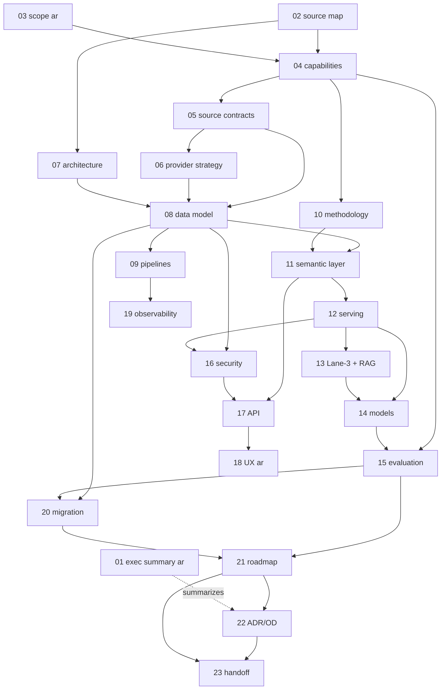

# 00 — Package Index and Implementation Start Gate
**Platform:** Nwafeth Intelligence — منصة نوافث لذكاء الجلسات الاستشارية (Monsha'at Advisory Session Intelligence Platform)
**Status:** Draft for owner review · **Date:** 2026-08-02 · **Author:** Planning package (Fable 5)
**Depends on:** 01–23 (this is the map of all of them) · **Feeds:** the owner's approval decision and the Opus 5 implementation start
**Sources used:** GREENFIELD §1.1, §23-00, §25; doc 22 §5 (approval register); doc 21 §0–§1 (phases, gates); doc 23 (start conditions); CORE-BRIEF in full

This is the front door of the 24-document planning package for the greenfield **Nwafeth Intelligence Platform (NIP)** — the independent, Arabic-first advisory-session intelligence platform that replaces the legacy application and Read.ai's analytics role for Monsha'at. Read §1 to find your path through the package, §4 for what is settled versus recommended, §5 for the decisions leadership must sign, and §6 for the exact conditions under which implementation (Opus 5, per doc 23) may begin.

---

## 1. Recommended reading order — four audiences

| Audience | Read, in order | Skip / skim |
|---|---|---|
| **Owner / leadership** | 01 (الملخص التنفيذي) → 03 (النطاق والشخصيات) → 04 §3 (capability matrix only) → 22 §5 (approval table) → this document §5–§6 → 18 (تجربة الاستخدام، للاستئناس) | All engineering documents; 01 §8 repeats every decision required of leadership in Arabic |
| **Architect / reviewer of the design** | 02 (evidence + contradictions) → 07 (architecture) → 08 (data model) → 12 (serving lanes) → 13 (Lane-3 factory) → 11 (semantic layer) → 09 (pipelines) → 06 (provider strategy) → 14 (models) → 16 (security) → 19 (ops) → 20 (migration) → 22 (ADRs) | 05 as reference; 10 §3 per-capability methods on demand |
| **Implementer (Opus 5)** | **23 first and in full** → 07 §8 (module layout) → 08 (DDL) → 04 (registry contract) → 11 → 12 → 09 → 13 → 15 (eval discipline) → 17 (API) → 14 (models) → 16 (controls) → 21 (phase DoD) | 01/03/18 for product context when building UI-facing epics; 02 when a source fact needs verifying |
| **Reviewer / steward (Monsha'at-side reviewers, data steward, compliance)** | 15 §3 (answer-key protocol) → 18 (شاشات المراجعة) → 10 §1–§2 (method charter) → 04 §7–§9 (violations vocabulary, lifecycle) → 16 §2–§4 (RBAC, PII, outbound matrix) → 22 §3 (open decisions naming them as owners) | Deep engineering documents; doc 21 §2 shows where their time is on the critical path (◐OWNER items) |

The dependency spine for a cover-to-cover read is simply numeric order: 01→23 was authored so that no document depends on a later one except by explicit ID reference.

**What each audience should be able to answer after their pass:**

- *Owner/leadership:* why the rebuild is necessary and what it replaces; what the platform will and will not promise each user group; which twenty decisions carry their signature (§5) and which five assumptions carry the most risk; what "success" looks like at cutover (doc 01 §9).
- *Architect:* why every legacy defect in CORE-BRIEF §12 is structurally unreachable in this design; how the four lanes, the semantic layer, and the Lane-3 factory divide the answer space; where every invariant I1–I18 is enforced (doc 07 §5.10, doc 23 §2); which decisions are reversible (revisit triggers) and which are doctrine.
- *Implementer:* the exact first twenty epics, migration order, and per-PR evidence bar (doc 23 §5/§6/§12); where prompts, registries, schemas, and tests live in the tree; what must never be built (doc 23 §13).
- *Reviewer/steward:* how a candidate becomes ground truth (propose→review→approve, doc 15 §3); what their weekly time commitment is (~45 h/month labelling pool + owner signing sessions, doc 21 §2); which queues they own and what append-only means for their decisions.

### 1.1 Inter-document dependency sketch



## 2. Document map

Sizes are the current draft line counts (guide to reading effort, not importance). Language: docs whose filename ends `-ar` are formal Arabic; all others are English with Arabic product labels preserved.

| # | Document | Size | What it contains — and why it exists |
|---|---|---|---|
| 00 | This index | ~210 | Map, reading order, precedence rules, package status, owner-approval list, implementation start gate. |
| 01 | `01-executive-summary-ar.md` | 247 | Arabic executive summary for leadership: why a new platform, what it replaces (and does not), expected value per user group, the architecture in executive language, phases and critical risks, and the decisions required from leadership (§8 mirrors doc 22 §5). |
| 02 | `02-source-map-and-contradictions.md` | 455 | The evidence foundation: source map over MASTER_PROMPT + all eight legacy arch docs + the GREENFIELD prompt, the contradiction log with resolutions under the §3 precedence ladders, the obsolete-mechanisms register, settled decisions carried forward, and the measured 2026-08-02 planning baselines every other document cites. |
| 03 | `03-product-scope-and-personas-ar.md` | 382 | Arabic product definition: hard boundaries (in/out of scope), the five personas with full needs and anti-promises, target outcomes, the twelve binding user journeys (ر1–ر12), and the committed-capability table in product language. |
| 04 | `04-capability-catalogue.md` | 1,097 | **The product contract.** All 26 committed capabilities CAP-A1…CAP-D10 as registry entries: exact registry JSON Schema + DDL sketch, τ/δ routing calibration semantics, full per-capability entries, the violation detection-vocabulary ↔ VIOL-001…008 reporting-taxonomy reconciliation with named gaps (تهكم، تسويق شخصي), the «قطاع» three-way disambiguation, the capability lifecycle state machine, and the Lane-3 promotion path (CAP-E series). |
| 05 | `05-data-source-contracts.md` | 645 | One contract per source: SRC-READAI, SRC-TSP (future provider), SRC-INT, SRC-DIR, SRC-REF, SRC-EVAL, SRC-OUT, SRC-SNAP — each with ownership, freshness SLA, keys, cursoring, idempotency, update/delete semantics, PII classification per field group, starter data dictionaries, DLQ state machine, and the reconciliation/join-rate KPI model behind EXP-01 and CAP-D9. |
| 06 | `06-transcript-provider-strategy.md` | 570 | The `TranscriptSource` boundary and normalized record contract, transcript storage shape, the ten-step `rebase_transcript` state machine with the quote re-verification gate, the EXP-02 provider benchmark (stratified sample, 12 dimensions, hard gates G1–G8, go/no-go sheet), deterministic quality tiers A–D, the deletable read-time glossary, and the assess-only Groq Whisper STT contingency. |
| 07 | `07-target-architecture.md` | 800 | C4 context/container/component views, layer-by-layer specification (GREENFIELD §8.1–8.8), the invariant-enforcement map, the online/offline separation contract, all 16 technology decisions TD-01…TD-16 with alternatives and revisit triggers, the monorepo module layout + import-linter dependency contracts (feeds doc 23), and the failure-domain/degradation matrix («no cell answers differently, silently»). |
| 08 | `08-data-model-and-erd.md` | 1,442 | **The canonical data model**: one PostgreSQL database, eleven schemas, 74+ tables with keys, constraints-as-pins, ERDs per domain, the identity strategy (surrogate + ULID `session_uid`), the `'PENDING'`-unrepresentable resolution model, versioning/lineage rules L1–L10, the PII boundary map with masking views, partitioning/index doctrine, volume plan, and the deliberately-not-modelled list that makes honest refusals possible. |
| 09 | `09-ingestion-reconciliation-and-pipelines.md` | 627 | The orchestrated ingestion DAG with coded edges, per-session pipeline state machine (rows, not flags; content digests for automatic invalidation), per-adapter workflow specs, the M1–M3 identity match ladder with steward queues, data-quality gates, bounded model-call semaphores and the typed-failure contract (no silent empties), scheduling/priorities, and reprocessing playbooks PB-01…PB-05 including rebase integration. |
| 10 | `10-analytical-methodology.md` | 802 | The method charter MR-01…MR-16 (rates per 100, DISTINCT sessions, n≥30 + Wilson, confound checks, no circular labels, BH correction, left-censoring, stated-vs-inferred cause…), per-capability method sheets for all 26, the Arabic claim-form rules the renderer enforces, the R-P2 semantic clustering methodology with quality metrics, and the coverage-block definition with its closed exclusion vocabulary. |
| 11 | `11-semantic-layer-and-curated-capabilities.md` | 571 | The metric/dimension/filter registries (code-as-data, hash-versioned), the deterministic spec→SQL compiler contract and its stage log, repository-only SQL discipline, period/coverage enforcement (I4/I8), suppression mechanics, the typed result envelope every lane emits, the starter metric registry, and the curated-capability contract with the SPEC/CURATED structural boundary check. |
| 12 | `12-agentic-serving-architecture.md` | 789 | The serving turn lifecycle: deterministic pre-processing (normalization, three-valued period resolution, entity resolution, closed anaphora table), the lane decision tree, Lane-0 matcher, the 11-tool toolbelt with the argued orchestrator-controlled split, tool JSON Schemas, the executor-enforced planner state machine, budgets/circuit breakers, planner + composer prompts, the deterministic verifier suite (R6/R7), prompt-injection isolation, reason-code Arabic strings, and the R13 reasoning log. |
| 13 | `13-on-demand-analysis-and-custom-rag.md` | 879 | The Lane-3 factory: the eight-path trigger decision tree, model-proposed/system-validated analysis schemas (meta-schema), frozen corpus manifests with content-derived digests, MAP (one session per call) → VERIFY (deterministic, immediate) → REDUCE (all numbers born in code), the job state machine with kill/resume/cancel, INCOMPLETE semantics, caching and promotion thresholds, the nine-step custom-RAG lifecycle (filter-first always), and sequence diagrams. |
| 14 | `14-groq-model-and-inference-strategy.md` | 622 | The verified 2026-08-02 Groq catalogue (incl. llama-3.3-70b deprecation and the strict-schema support matrix), the eight task-role model matrix (gpt-oss-120b core, 20b triage, safeguard shadow-mode), the EXP-03 benchmark plan with per-family gates, structured-output and tool-use policy, sync vs Batch decision table, rate-limit engineering, the model/prompt registries and single inference entry point, and deprecation operations (I17). |
| 15 | `15-evaluation-answer-oracle-and-golden-suite.md` | 748 | The evaluation foundation: twelve labelled datasets DS-01…DS-12 with κ bars and held-out discipline, the answer-key oracle protocol (machine proposes, human signs; mechanical scoped staleness), the T-01…T-17 test matrix, eight hard gates HG-1…HG-8 and quantitative targets QT-01…QT-12, CI tiers with honesty counters, the no-weakening ratchet, pinning discipline, the committed synthetic fixture corpus, and labelling economics (~710 h launch). |
| 16 | `16-security-privacy-and-compliance.md` | 657 | Threat model (15 threats → controls → residual risk → tests), OIDC + 7-role RBAC matrix with Postgres-level mirroring, data classes P0–P3 and retention schedule, the Groq outbound data-flow matrix + pseudonymization + fail-closed payload gate (OD-04), prompt-injection architecture and the EXP-10 adversarial catalogue, secrets, encryption, the full audit-event catalogue, PDPL/NCA alignment, deployment checklist, and incident/retraction playbooks. |
| 17 | `17-api-contracts.md` | 722 | The versioned JSON API: 27-endpoint inventory with permissions and idempotency rules, RFC 7807 error model (no 200-on-failure, ever), chat/turn envelope carrier, clarification and deep-job-offer round-trips, the job API, evidence retrieval (access-audited), packs/publications, review and taxonomy APIs, exports, admin, pagination/rate-limit/versioning policy, and cross-cutting contract tests. |
| 18 | `18-ux-admin-and-review-workflows-ar.md` | 637 | Arabic screen-by-screen UX specification: shared foundations (RTL, الأرقام والتقويم، قاموس التحوط، النصوص الثابتة لكل حالة), the twelve journeys as screens SCR-01…SCR-12 — chat, structured answer shell, evidence viewer, closed clarification, deep-job offer/progress, artifact archive, promotion queue, violation review, governance queue, publication centre, data-quality board, export dialog — with role × screen matrix and UI-generated audit events. |
| 19 | `19-observability-operations-and-dr.md` | 620 | Telemetry that cannot lie: stack, end-to-end request-id/trace propagation across async hops, the full metric catalogue per plane (every GREENFIELD §17 bullet cross-checked), model-call and R13 log records, PII-free request reconstruction procedure, dashboards, alert severities and rules, typed degraded states, runbooks RB-1…RB-9, capacity model, pgBackRest backup/restore drills, and DR targets. |
| 20 | `20-migration-parallel-run-and-cutover.md` | 575 | The one-time checksummed snapshot: exact contents, transfer PII handling, restore + schema-to-schema mapping with idempotent reruns, reconciliation balance sheet, `taxonomy_version=0` crosswalk, quote verification, the ~500-session CI fixture slice, re-derivation plan, independent ongoing ingestion (OD-13 credential, watermark handover), the external replay parity harness with six-way difference classification, pilot/cutover gates G0…G5, and rollback triggers. |
| 21 | `21-delivery-roadmap-and-work-breakdown.md` | 761 | Dependency-based delivery: phases P0–P7 each with objective, prerequisites, deliverables, epics, tests, security controls, measurable exit criteria, rollback and risks; the ten experiment gates EXP-01…EXP-10 with thresholds and fallbacks; the critical-path narrative (owner-paced items flagged ◐OWNER); team model, RACI, and the roadmap risk register. |
| 22 | `22-architecture-decisions-and-open-decisions.md` | 600 | The single registry: ADR-0001…ADR-0020 in full (context, decision, alternatives, consequences, revisit triggers), the OD-01…OD-25 open-decision register with owners/safe assumptions/impact/needed-by phase, the explicit assumption log A-01…A-29, the ID-collision resolutions from parallel authoring, the owner-approval table, and register maintenance rules. |
| 23 | `23-opus-5-implementation-handoff.md` | 740 | **The implementation handoff** — mission, I1–I18 with enforcement mechanisms, repository structure, the first 20 epics in strict dependency order, migration/API/test/prompt build orders, coding conventions, per-phase definition of done, per-PR evidence requirements, the MUST-NOT list, and the topic cross-index. Opus 5 starts here. |

## 3. Source precedence (GREENFIELD §1.1, restated — binding on every document)

Two ladders, never mixed [FACT GREENFIELD §1.1]:

**Descriptive** (what the legacy system does/did):
1. running code and live database measurements (2026-08-02 committed scripts);
2. MASTER_PROMPT measured facts dated 2026-08-02;
3. the arch/01–08 documents (2026-07-16);
4. docstrings, comments, older memories, assumptions.

**Prescriptive** (what to build):
1. owner requirements in the GREENFIELD prompt;
2. the non-negotiable principles I1–I18 (GREENFIELD §7);
3. settled MASTER_PROMPT decisions explicitly carried forward;
4. this package's recommendations, with rationale and alternatives;
5. current legacy behaviour only where it remains justified.

Corollaries the package applies throughout: current behaviour is never an argument for keeping it; live counts are planning baselines that must be re-measured by committed script before use in capacity or stakeholder material (GREENFIELD §1.3); contradictions are resolved in doc 02 and only there.

## 4. Current package status — what is settled vs recommended

**Settled owner decisions** (tagged `[DECISION]`; not up for re-argument, only for confirmation): greenfield rebuild with total legacy runtime independence (I10) · Groq as primary generative-AI infrastructure · correctness over token cost, Lane-3 jobs have **no cost ceiling** · no ASR correction, ever · transcripts immutable and provider-versioned; Read.ai is interim · the machine proposes, the human disposes (sign-off defines correctness for subjective capabilities) · the 16 committed questions + 10 D-family additions are the product contract · four serving lanes with deterministic paths for committed questions · frozen publication + live view duality.

**Recommendations awaiting acceptance** (tagged `[REC]`; each with alternatives + revisit triggers): all twenty ADRs in doc 22 §2 — every one carries status *recommended-for-acceptance*; "accepted" is reserved for the owner's signature [DECISION GREENFIELD §24 claim discipline]. The tech stack (doc 07 TD-01…TD-16), model role matrix (doc 14), thresholds (doc 15 QT block), and every τ/δ starting value are recommendations pending their named experiment gates.

**Assumptions in force** (tagged `[ASSUME OD-xx]`): 25 open decisions, each with a safe working assumption that lets planning and early implementation proceed without blocking — doc 22 §3.2 is the register, §4 the consolidated log. The five highest-risk: OD-04 (outbound approval), OD-13 (OAuth client), OD-24 (annotation capacity), OD-16 (compliance sign-off), OD-07 (internal access) [INFER doc 22 §4].

**Editorial consistency — resolved.** Parallel authoring initially left seven mechanical inconsistencies; all seven were **normalized in the 2026-08-03 consistency pass** and doc 23 §0.2 records the binding canon (with the historical variants) for future edits. Summary of what was normalized:
1. OD-ID remaps executed: docs 07/16/17 "OD-14/BI" → **OD-22**; doc 13 "OD-14" (artifact visibility) → **OD-23**; doc 15 "OD-19" (annotation staffing) → **OD-24** [FACT doc 22 §3.1]. (Doc 16's own OD-14 — consultant national-ID handling + evidence-role widening — and OD-19 — Groq DPA terms — keep their IDs as doc 22 §3.1 mandates.)
2. Lane-0 routing precision unified: **0.99 = calibration target on held-out paraphrases (QT-01, canonical); 0.95 = EXP-05 minimum gate floor**; doc 04 §2 now cites both.
3. DB role names unified to canon `nip_migrator` and `nip_readonly_bi` across docs 07/08/22.
4. Doc 08's census now counts **78 tables**, absorbing `serve.capability_registry`/`serve.capability_paraphrase` (DDL doc 04 §1.3, migration 0009) and `evidence.custom_collection`(+`_unit`) (DDL doc 13 §9.0, migration 0010).
5. Doc 21's P2 prerequisite now cites "P0 deliverable 12 (EPIC-06, doc 23 §5)" — the phantom epic id "P0-E12" is gone.
6. Fixture tiers pinned in both docs: Tier P (per-PR) uses only the committed 120-session synthetic corpus (doc 15 §8); the ~500-session restricted slice serves Tier N/R runs where the restricted store is reachable (doc 20 §1.9).
7. `fetch_transcript_window` first argument: canon is `session_uid` (doc 08 §0.2 identity strategy); `meeting_id` survives only inside verbatim quotations of the GREENFIELD §13 baseline text.
Additionally from the review pass: doc 07 §6.2's grant sketch was subordinated to doc 08 §1 / doc 16 §2.4 (INSERT-only on append-only planes; no direct web SELECT on `transcript.turn`); strict-schema `required` arrays were completed in doc 11 §5.1 and doc 12 §5.3; doc 18 gained SCR-13 «اللوحات» (dashboards); the single bare "TBD" token was removed from doc 05.

## 5. Decisions requiring owner approval

The register of record is doc 22 §5; doc 01 §8 renders it in Arabic for leadership. Reproduced here in full so this index is self-sufficient at the approval meeting. Classes: **G1** blocks implementation start · **G2** blocks a named phase gate · **G3** policy confirmation that can trail on the recorded safe assumption.

| # | Decision | Artifact to sign | Class | Blocks | Owner role |
|---|---|---|---|---|---|
| 1 | Accept ADR-0001…ADR-0020 (en bloc or itemized with exceptions) | doc 22 §2 | **G1** | P0 start | Platform owner |
| 2 | Confirm the 8 VIOL categories' Arabic wording + the two coverage-gap additions (تهكم، تسويق شخصي) | doc 04 §7 | G2 | P2 taxonomy seed | Product owner |
| 3 | Answer-key protocol + signing duty (~46 items at launch, weekly cadence) | doc 15 §3 | G2 | P3 exit | Product owner |
| 4 | Outbound-data approval (pseudonymized text to Groq) — OD-04 | doc 16 §4 matrix | G2 | P2 backfill | Compliance office |
| 5 | Groq DPA / contractual data terms — OD-19 | OD-19 file | G2 | P2 backfill | Platform owner + legal |
| 6 | Second Read.ai OAuth client request — OD-13 | OD-13 request | G2 | P1 live pulls | Platform owner |
| 7 | Internal-data access mechanism + freshness SLA — OD-07 | doc 05 contracts | G2 | P1 adapters | Internal-systems owner |
| 8 | Provider candidate shortlist + trial procurement — OD-25 | OD-25 memo | G2 | P1 EXP-02 launch | Procurement |
| 9 | Provider go/no-go after EXP-02 — OD-06 | doc 06 §5.5 sheet | G2 | P6 rebase slot | Product owner |
| 10 | Annotation staffing commitment (~45 h/month) — OD-24 | OD-24 plan | G2 | P1 labelling | Product owner |
| 11 | Publication authority for packs/retractions — OD-10 | OD-10 delegation | G2 | P6 first pack | Leadership |
| 12 | PII policy set: OD-09 / OD-14 / OD-15 confirmations | doc 16 §2–3 | G3 | P7 at latest | Data steward + compliance |
| 13 | Retention windows — OD-08 | OD-08 schedule | G3 | P7 retention jobs | Data steward + compliance |
| 14 | Review-role powers confirmation — OD-11 | OD-11 matrix | G3 | P2 (assumption suffices) | Product owner |
| 15 | PDPL/NCA formal verification file — OD-16 | OD-16 dossier | G2 | P6 pilots / P7 prod | Compliance office |
| 16 | CAP-C2 route confirmation after EXP-08 — OD-05 | OD-05 memo | G3 | post-P5 | Product owner |
| 17 | Executive output format (digits/calendar) — OD-21 | OD-21 sample pack | G3 | P6 first pack | Product owner |
| 18 | BI exposure policy — OD-22 | OD-22 memo | G3 | post-pilot | Platform owner |
| 19 | Legacy retirement date | doc 21 P7-E7 plan | G3 | post-cutover | Platform owner |
| 20 | Deployment environment + IdP/secrets specifics — OD-01/OD-02 | OD-01/OD-02 memo | **G1** | P0 provisioning | IT + security directorate |

Reading the table: only rows 1 and 20 gate the *start*; rows 4–8 and 10 gate *phases* and must be **filed** at start (answers may follow); every G3 row already has a safe assumption recorded in doc 22 §3.2 under which the build proceeds. Any decision not on this table is an engineering recommendation the owner may inspect via doc 22 §2 but is not asked to sign individually.

## 6. Implementation start gate — what must be true before Opus 5 begins

Implementation (doc 23 EPIC-01) may start when ALL of the following hold [REC — restating doc 22 §5's gate with doc 21's scheduling consequences]:

1. **Signed:** approval item 1 (ADRs, en bloc or with itemized exceptions recorded in doc 22) and item 20 (OD-01 environment + OD-02 IdP/secrets named). Without these there is nowhere to deploy and no login to build against.
2. **Filed with named owners and tracking IDs (answers may trail on safe assumptions):** the OD-04 outbound-approval file (with the doc 16 §4 matrix attached), the OD-19 Groq DPA request, the **OD-13 second Read.ai OAuth client request** (long lead; sharing the legacy token breaks both systems — token rotates on refresh), the **OD-07 internal-data access request** with proposed freshness SLA, and the OD-25 provider-candidate shortlist + trial-account procurement. These are P0 deliverable 9 in doc 21; filing them is engineering-independent and must not wait for code.
3. **Early-closure watchlist:** OD-13 and OD-07 must close before P1 live ingestion (else P1 exits in snapshot-only mode, flagged as a P6 risk); **OD-04 must close before the P2 full-corpus backfill** (else extraction runs only on the compliance-permitted staging subset). Doc 21 tracks each with an escalation rule (doc 22 §6.5).
4. **Experiment scheduling committed:** **EXP-01** is scheduled inside P0 against the restored snapshot (it needs no external party); **EXP-02** has its calendar dependencies secured at P0 — OD-25 candidates procurable, OD-12 audio-legality question answered (Design A vs B), OD-24 annotator commitment (~45 h/month) confirmed so DS-01 labelling starts at P1. A red or slipped EXP-02 does **not** block the build (Read.ai interim is tolerated by design); an unscheduled one silently would.
5. **The consistency pass of §4's editorial-debt list is executed** (three OD remaps + the five reconciliations), so Opus 5 never has to adjudicate an ID collision mid-build.
6. **Snapshot logistics agreed:** the legacy-side snapshot (SRC-SNAP) extraction window and checksum handover are booked (doc 20 §1.2) — P0-E8 is on the critical path.

What does **not** block the start: any G3 item; the OD-06 provider decision; EXP-02 results; Groq account-tier confirmation (OD-03 — nothing depends on it); BI tooling (OD-22). The recorded safe assumptions carry all of them [FACT doc 22 §3.2].

### 6.1 The gate as a one-screen checklist

```text
IMPLEMENTATION START GATE — Nwafeth Intelligence
[ ] ADR-0001…0020 accepted (en bloc / itemized) ............ Platform owner   (doc 22 §2)
[ ] OD-01 environment + OD-02 IdP/secrets named ............ IT + security    (doc 22 §3.2)
[ ] OD-04 outbound-approval file FILED (matrix attached) ... Compliance       (doc 16 §4)
[ ] OD-19 Groq DPA request FILED ........................... Owner + legal
[ ] OD-13 second Read.ai OAuth client REQUESTED ............ Platform owner   (long lead!)
[ ] OD-07 internal-data access REQUESTED + SLA proposed .... Internal systems
[ ] OD-25 provider shortlist + trial accounts REQUESTED .... Procurement
[ ] OD-12 audio-legality question ASKED (EXP-02 design) .... Legal
[ ] OD-24 annotator commitment (~45 h/month) CONFIRMED ..... Product owner
[ ] EXP-01 booked inside P0 (snapshot); EXP-02 deps secured for P1
[ ] Consistency pass done (7 editorial debts of §4) ........ Package steward
[ ] Legacy snapshot extraction window BOOKED ............... Owner + DE       (doc 20 §1.2)
→ ALL CHECKED ⇒ Opus 5 begins at doc 23 EPIC-01.
```

## 7. Package at a glance (orientation numbers)

24 documents (2 Arabic-first, 22 English with Arabic labels) · **26 committed capabilities** (16 committed questions A1–C8 + 10 D-family additions) · **18 invariants** I1–I18, each with a named structural enforcement (doc 23 §2) · **20 ADRs** recommended-for-acceptance · **25 open decisions** with safe assumptions (next free: OD-26) · **12 labelled datasets** DS-01…12 (~710 h launch labelling) · **17 test families** T-01…17 · **8 hard gates** + **12 quantitative targets** · **10 experiment gates** EXP-01…10 · **8 delivery phases** P0–P7 (~175–260 engineer-weeks across phases [INFER doc 21 sums]) · **11 database schemas**, ~78 tables at launch · **1** legacy artifact ever crossing the boundary (the checksummed snapshot) · **0** model-authored numbers, ever.

**Ready-to-hand-off statement:** with §6.1–§6.2 satisfied, the package is sufficient for Opus 5 to implement from doc 23 without rediscovery — every schema, contract, threshold, prompt skeleton, and gate is specified in the documents mapped above; every unresolved item has a registered owner and a safe assumption [INFER — the GREENFIELD §25(8) closing statement, maintained by the doc 22 register].

## 8. Package-wide conventions (for any new reader)

- **IDs:** capabilities `CAP-A1…CAP-D10` (+ future promoted `CAP-E…`); invariants `I1…I18`; experiments `EXP-01…10`; architecture decisions `ADR-0001…0020`; open decisions `OD-01…OD-25` (next free: OD-26); method rules `MR-01…16`; datasets `DS-01…12`; tests `T-01…17`; hard gates `HG-1…8`; targets `QT-01…12`; violation seeds `VIOL-001…008`; screens `SCR-01…12`; phases `P0…P7`; sources `SRC-*`.
- **Claim tags:** `[FACT src]` source-derived · `[DECISION]` owner decision · `[REC]` recommendation with alternatives + revisit trigger · `[INFER]` inference · `[ASSUME OD-xx]` assumption bound to a registered open decision. Bare "TBD" does not appear in this package.
- **Schemas:** `ingest, core, transcript, findings, tax, serve, jobs, packs, evidence, ops, legacy_snapshot` (CORE-BRIEF §6). Reason codes: the closed 16-value enum of CORE-BRIEF §4. Lanes: 0 deterministic · 1 bounded agent · 2 clarification/honest boundary · 3 deep analysis.
- **Language:** «قطاع» is always disambiguated into `service_category` / `government_entity` / `business_sector`; periods are end-exclusive; rates per 100 sessions; n≥30 with Wilson intervals; quotes always carry the full 8-field provenance tuple.

---

*End of document 00. Leadership: continue to doc 01. Engineers: continue to doc 23.*
