# 04 — Capability Catalogue (The Product Contract)
**Platform:** Nwafeth Intelligence — منصة نوافث لذكاء الجلسات الاستشارية (Monsha'at Advisory Session Intelligence Platform)
**Status:** Draft for owner review · **Date:** 2026-08-02 · **Author:** Planning package (Fable 5)
**Depends on:** 02, 03 · **Feeds:** 05, 08, 10, 11, 12, 13, 15, 17, 18, 21, 22, 24, 25
**Sources used:** GREENFIELD §5 (all of A1..C8, D1..D10 + preamble field list), §6, §8.5–8.7, §12, §13, §14.6, §18, §23; MASTER_PROMPT §4 (incl. 8-type violation table, R-P1/2/3), §4.2–4.4, Appendix A, Appendix B, Appendix C, Appendix E; arch/ evidence via CORE-BRIEF §11–12; OWNER AMENDMENT 2026-08-03 §2, §4–§9, §11–§13
**Amended:** 2026-08-03 — Owner Amendment integrated: operational/product capabilities CAP-OPS-01…CAP-OPS-12 registered (§11); CAP-B4/CAP-B5 suspected-vs-approved split made explicit; SD-18…SD-22 cited; SD-21 build-order rule applied (§9.1, §11.5) [DECISION owner 2026-08-03]

---

## 0. Purpose and reading guide

This document **is the product contract**. Every committed analytical question from GREENFIELD §5 exists here as a registered capability with a stable ID; every other planning document cites these IDs and never re-defines them (I12). A capability that is not in this catalogue does not exist; a handler on disk that is not in the registry fails the build [DECISION MASTER_PROMPT §4.2].

- §1 defines the **registry schema** — the exact field list every entry carries, as a JSON Schema sketch plus a DDL sketch and one worked YAML example.
- §2 defines the **Lane-0 calibration fields** (τ/δ) shared by every entry.
- §3 is the **summary matrix** of all 26 capabilities.
- §4–§6 are the **full entries**: CAP-A1..CAP-A3, CAP-B1..CAP-B5, CAP-C1..CAP-C8, CAP-D1..CAP-D10.
- §7 reconciles the **violation detection vocabulary with the reporting taxonomy** VIOL-001..008, with named coverage gaps.
- §8 applies the **«قطاع» disambiguation** (three dimensions) to every capability that mentions sector.
- §9 defines the **capability lifecycle** and the promotion path from Lane-3 question fingerprints.
- §11 registers the **operational/product capabilities (CAP-OPS series)** added by the 2026-08-03 Owner Amendment — the platform is an operational product first, not only an analytical Q&A surface [DECISION owner 2026-08-03 / Amendment §2, §12 doc 04 item].

Deep analytical method design lives in doc 10; each entry here carries a 3–6-line method summary and cites doc 10. Serving mechanics (routing, τ/δ enforcement, toolbelt) live in doc 12. Golden-suite mechanics live in doc 15. Table names follow the doc-08 canonical proposals inside the CORE-BRIEF §6 schemas; if doc 08 renames a table, the registry entry updates in the same change set — the capability IDs never change.

**Standing obligation carried into every entry** [FACT MASTER_PROMPT §4: «الاستعداد للإجابة على أي من الأسئلة السابقة أيضا»]: every periodic capability is also answerable **ad-hoc for an arbitrary window**. `ad_hoc_available` is therefore a constant `true` across the catalogue and is still stored per entry, so the build can structurally verify no entry ever turns it off (I12, I4).

---

## 1. Registry schema definition

### 1.1 Where the registry lives

[REC] The registry is **code-owned, database-served**: one YAML file per capability under `registry/capabilities/CAP-*.yaml` in the `nwafeth-intelligence` repo, validated in CI against the JSON Schema below (unknown field ⇒ build fails, missing required field ⇒ build fails — the F5/F8 lesson of eight unsynchronized intent registries made structurally unreachable), then loaded at deploy into `serve.capability_registry` + `serve.capability_paraphrase`, which the serving plane reads read-only (I1, I12). Alternatives considered: DB-only registry (rejected: no code review, no diffable history for a contract document) and code-only (rejected: Lane-2 clarification options and `list_capabilities` need a queryable table). Revisit-trigger: if a non-engineering steward must edit entries directly, add a proposal UI that emits a registry PR — never direct DB writes.

### 1.2 The exact field list (JSON Schema sketch)

Every capability entry carries **all** of the following fields. None are optional; "not applicable" is an explicit enum value, never an omitted key (fail-closed, R14).

```json
{
  "$id": "nwafeth://schemas/capability-registry-entry/v1",
  "type": "object", "additionalProperties": false,
  "required": ["capability_id", "slug", "display_name_ar", "description_ar", "personas",
    "lane", "owner_type", "status", "source_tables", "method_summary", "method_doc_ref",
    "taxonomies", "period", "refresh_cadence", "comparison_window", "dimensions",
    "unit", "denominator", "evidence", "support", "error_cost_policy",
    "coverage_exclusions", "data_gaps", "golden_test", "owner_signoff",
    "recompute_required", "lane0_calibration", "reason_codes_expected", "pii_class"],
  "properties": {
    "capability_id":   {"type": "string", "pattern": "^CAP-[ABCD][0-9]{1,2}$"},
    "slug":            {"type": "string", "pattern": "^[a-z0-9_]{3,64}$"},
    "display_name_ar": {"type": "string"},
    "description_ar":  {"type": "string"},
    "personas":        {"type": "array", "items": {"enum": ["executive_viewer","service_owner","reviewer","analyst","steward","admin"]}, "minItems": 1},
    "lane":            {"enum": [0]},
    "owner_type":      {"enum": ["curated","spec","spec+curated","curated+discovery","curated+review"]},
    "status":          {"enum": ["proposed","approved_for_build","built_unsigned","key_signed","published","suspended","retired"]},
    "source_tables":   {"type": "array", "items": {"type": "string", "pattern": "^(ingest|core|transcript|findings|tax|serve|jobs|packs|evidence|ops)\\.[a-z0-9_]+$"}, "minItems": 1},
    "method_summary":  {"type": "string", "maxLength": 800},
    "method_doc_ref":  {"type": "string", "pattern": "^doc10#CAP-[ABCD][0-9]{1,2}$"},
    "taxonomies": {"type": "array", "items": {"type": "object", "additionalProperties": false,
      "required": ["taxonomy_id","role","version_behaviour"],
      "properties": {
        "taxonomy_id": {"enum": ["VIOL","CHAL","SAT","DEC","IMP","ENT","QST","NONE"]},
        "role": {"enum": ["classifies_findings","groups_output","attributes_topic","not_used"]},
        "version_behaviour": {"enum": ["stamp_and_freeze","stamp_live_recount","not_applicable"]}
      }}},
    "period": {"type": "object", "additionalProperties": false,
      "required": ["default_period","supported_grains","ad_hoc_available","period_scope"],
      "properties": {
        "default_period":   {"enum": ["last_closed_month","last_closed_quarter","rolling_3_closed_months","rolling_6_closed_months","last_closed_period_of_cadence"]},
        "supported_grains": {"type": "array", "items": {"enum": ["month","quarter","half","year","last_n_months","arbitrary_range"]}, "minItems": 6},
        "ad_hoc_available": {"const": true},
        "period_scope":     {"type": "string", "description": "the end-exclusive date column the compiler filters on, e.g. core.advisory_session.session_started_at"}
      }},
    "refresh_cadence":   {"type": "array", "items": {"enum": ["monthly","quarterly","on_demand_only"]}, "minItems": 1},
    "comparison_window": {"enum": ["previous_month","previous_quarter","month_over_month_within_refresh","preceding_equal_window","none_case_list"]},
    "dimensions": {"type": "array", "items": {"enum": ["consultant_id","programme","channel","service_category","government_entity","business_sector","challenge_category","violation_category","satisfaction_class","impact_class","step_clarity","session_status","month","quarter"]}},
    "unit":        {"enum": ["session","consultant","finding","question_cluster","decision_cluster","rating_row","evaluation_pair","mention","programme_period_cell","pack"]},
    "denominator": {"type": "string", "description": "human-readable denominator contract, e.g. 'sessions in window with non-null step_clarity'"},
    "evidence": {"type": "object", "additionalProperties": false,
      "required": ["quotes_required","quote_fields","min_quotes_per_claim"],
      "properties": {
        "quotes_required": {"enum": ["mandatory_per_case","per_top_item","optional_drilldown","none_metric_only"]},
        "quote_fields": {"const": ["advisory_session_id","provider_meeting_id","turn_index","speaker_role","transcript_source","source_version","extraction_run_id","quote_text"]},
        "min_quotes_per_claim": {"type": "integer", "minimum": 0}
      }},
    "support": {"type": "object", "additionalProperties": false,
      "required": ["min_cell_n","suppression_render","interval","min_consultant_spread","extra_rules"],
      "properties": {
        "min_cell_n":           {"type": "integer", "minimum": 30},
        "suppression_render":   {"const": "show_count_suppress_rate_mark_cell"},
        "interval":             {"enum": ["wilson_95","none_counts_only"]},
        "min_consultant_spread":{"type": "integer", "minimum": 0},
        "extra_rules":          {"type": "array", "items": {"type": "string"}}
      }},
    "error_cost_policy": {"enum": ["precision_over_recall","recall_over_precision_review_gated","balanced"]},
    "coverage_exclusions": {"type": "array", "items": {"type": "string"}, "description": "named exclusions always rendered in the coverage block (I8)"},
    "data_gaps":           {"type": "array", "items": {"type": "string"}},
    "golden_test": {"type": "object", "additionalProperties": false,
      "required": ["structural_suite","answer_key_state","paraphrase_set_size","near_miss_count"],
      "properties": {
        "structural_suite":   {"type": "boolean"},
        "answer_key_state":   {"enum": ["UNSIGNED","SIGNED","STALE"]},
        "paraphrase_set_size":{"type": "integer", "minimum": 20},
        "near_miss_count":    {"type": "integer", "minimum": 3}
      }},
    "owner_signoff": {"type": "object", "additionalProperties": false,
      "required": ["required","signed_by","signed_at"],
      "properties": {
        "required":  {"const": true},
        "signed_by": {"type": ["string","null"]},
        "signed_at": {"type": ["string","null"], "format": "date-time"}
      }},
    "recompute_required": {"type": "boolean", "description": "true ⇒ any taxonomy edge touching inputs invalidates the WHOLE pack; recompute from features/embeddings before showing anything (MASTER_PROMPT §4.3 mechanic-4 exception)"},
    "lane0_calibration": {"type": "object", "additionalProperties": false,
      "required": ["tau","delta","calibrated_at","paraphrase_set_version","confusable_with"],
      "properties": {
        "tau":   {"type": "number", "minimum": 0, "maximum": 1},
        "delta": {"type": "number", "minimum": 0, "maximum": 1},
        "calibrated_at": {"type": ["string","null"], "format": "date-time"},
        "paraphrase_set_version": {"type": ["integer","null"]},
        "confusable_with": {"type": "array", "items": {"type": "string", "pattern": "^CAP-[ABCD][0-9]{1,2}$"}}
      }},
    "reason_codes_expected": {"type": "array", "items": {"type": "string"}, "description": "closed reason codes this capability legitimately returns (subset of Appendix-C enum)"},
    "pii_class": {"enum": ["aggregate_only","names_consultants","names_consultants_and_quotes","quotes_pseudonymized"]}
  }
}
```

Field semantics that are easy to get wrong:

- **`lane` is always `0` in this catalogue** [DECISION GREENFIELD §5 preamble: committed questions "must not depend on a free-form planner selecting the right route every time"]. Lane 1/2/3 are serving outcomes for *other* questions; a committed capability is reached deterministically. Lane-3 machinery may *build* inputs for a capability (e.g. CAP-C2's pilot under OD-05), but the served capability itself is Lane 0.
- **`owner_type`** distinguishes `spec` (expressible as a governed metric spec compiled by the semantic layer — doc 11) from `curated` (encodes product judgement in a registered deterministic method — GREENFIELD §8.5). The split is verified structurally: a curated handler not in the registry fails the build; a spec entry with a handler on disk also fails (one owner per capability) [FACT MASTER_PROMPT §5.5].
- **`period.supported_grains`** must include all six grains for every entry — the legacy composites ignoring quarters/halves/years (BUG-0042 class) is made unreachable by schema (`minItems: 6`).
- **`recompute_required`** is diffed in CI against the allowlist in §3; an entry missing classification fails the build [FACT MASTER_PROMPT §4.3 mechanic-4 exception].
- **`coverage_exclusions`** are *rendered*, not logged (I8): the renderer receives them in the typed envelope and must show them on the face of the answer.

### 1.3 DDL sketch (serving-plane projection)

```sql
-- Loaded at deploy from registry/capabilities/*.yaml; serving plane reads only. Doc 08 owns final DDL.
CREATE TABLE serve.capability_registry (
  capability_id      text PRIMARY KEY CHECK (capability_id ~ '^CAP-[ABCD][0-9]{1,2}$'),
  slug               text NOT NULL UNIQUE,
  display_name_ar    text NOT NULL,
  entry              jsonb NOT NULL,          -- full validated entry (schema §1.2)
  entry_sha256       text NOT NULL,           -- provenance: which YAML produced this row
  registry_version   integer NOT NULL,        -- monotonic, bumped per deploy that changes any entry
  status             text NOT NULL CHECK (status IN ('proposed','approved_for_build','built_unsigned','key_signed','published','suspended','retired')),
  loaded_at          timestamptz NOT NULL DEFAULT now()
);

CREATE TABLE serve.capability_paraphrase (
  paraphrase_id      bigint GENERATED ALWAYS AS IDENTITY PRIMARY KEY,
  capability_id      text NOT NULL REFERENCES serve.capability_registry(capability_id),
  paraphrase_ar      text NOT NULL,
  kind               text NOT NULL CHECK (kind IN ('canonical','paraphrase','near_miss')),
  routes_to          text NULL REFERENCES serve.capability_registry(capability_id),  -- near_miss: where it MUST go instead (NULL = Lane 1/2)
  approved_by        text NOT NULL,
  approved_at        timestamptz NOT NULL,
  set_version        integer NOT NULL
);
-- near-miss rows with routes_to = capability_id are forbidden:
ALTER TABLE serve.capability_paraphrase ADD CONSTRAINT near_miss_routes_elsewhere
  CHECK (kind <> 'near_miss' OR routes_to IS DISTINCT FROM capability_id);
```

### 1.4 Worked example — the CAP-B1 registry YAML (abridged)

```yaml
capability_id: CAP-B1
slug: clear_steps_rate
display_name_ar: "نسبة الجلسات المنتهية بخطوات واضحة"
personas: [executive_viewer, service_owner, analyst]
lane: 0
owner_type: spec+curated
status: proposed
source_tables: [core.advisory_session, findings.finding, core.programme, core.service]
method_summary: >-
  Numerator: sessions whose step_clarity finding = clear; denominator: sessions in window
  with non-null step_clarity. Wilson 95% CI; n>=30 suppression; splits labelled with which
  meaning of «قطاع» they use. Label validated on >=100 owner-adjudicated samples per class
  before first publication.
method_doc_ref: doc10#CAP-B1
taxonomies: [{taxonomy_id: NONE, role: not_used, version_behaviour: not_applicable}]
period:
  default_period: last_closed_month
  supported_grains: [month, quarter, half, year, last_n_months, arbitrary_range]
  ad_hoc_available: true
  period_scope: core.advisory_session.session_started_at
refresh_cadence: [monthly]
comparison_window: previous_month
dimensions: [service_category, programme, channel, challenge_category, government_entity, consultant_id, month, quarter]
unit: session
denominator: "sessions in window with non-null step_clarity (NULL share rendered as named exclusion)"
evidence: {quotes_required: optional_drilldown, quote_fields: [...], min_quotes_per_claim: 0}
support: {min_cell_n: 30, suppression_render: show_count_suppress_rate_mark_cell,
          interval: wilson_95, min_consultant_spread: 0, extra_rules: []}
error_cost_policy: balanced
coverage_exclusions:
  - "sessions with NULL step_clarity (legacy baseline 1,327/16,911 ≈ 7.8% — re-measure on re-extraction)"
  - "sessions without an active transcript version"
data_gaps:
  - "label accuracy unmeasured until the ≥100-per-class owner adjudication completes (E.0 rule 10)"
golden_test: {structural_suite: true, answer_key_state: UNSIGNED, paraphrase_set_size: 20, near_miss_count: 3}
owner_signoff: {required: true, signed_by: null, signed_at: null}
recompute_required: false
lane0_calibration: {tau: 0.82, delta: 0.10, calibrated_at: null, paraphrase_set_version: null,
                    confusable_with: [CAP-A1, CAP-D7]}
reason_codes_expected: [PERIOD_EMPTY, DATA_NOT_ENRICHED, DIMENSION_NOT_AVAILABLE]
pii_class: aggregate_only
```

---

## 2. Lane-0 calibration fields — τ and δ semantics

[REC — doc 12 owns the router design; EXP-05 owns calibration] The Lane-0 matcher scores an incoming normalized Arabic question against every capability's approved paraphrase set with a hybrid similarity `s` (lexical + embedding, exact formula in doc 12). Routing rule per capability:

- Route to capability `c` iff `s(c) ≥ τ_c` **and** `s(c) − s(second_best) ≥ δ_c`. Otherwise **abstain** — the question falls through to Lane 1 (if answerable from governed tools) or Lane 2 clarification. Abstention is a success mode, not a failure (I5).
- Starting values before EXP-05 calibration: `τ₀ = 0.82`, `δ₀ = 0.06` globally; entries with a named confusable sibling (B3↔C6, B4↔B5, A1↔B1, A3↔D1, D3↔D4, C1↔C2, B2 vs duration metrics) start at `δ = 0.10`, and when the margin test fails between two *committed* siblings the router emits a Lane-2 clarification whose ≤4 closed options are the siblings' display names — never a guess [REC; alternative: always route to higher score — rejected because a near-miss answered is a different question answered (I5); revisit-trigger: EXP-05 shows clarification rate >15% of committed traffic].
- Calibration acceptance [REC]: route precision **target ≥ 0.99** on the held-out signed paraphrase set (canonical QT-01, doc 15) with an **EXP-05 minimum gate floor of ≥ 0.95** (doc 21) and coverage ≥ 0.85 (≥20 paraphrases + ≥3 near-misses per capability, MASTER_PROMPT §4.4 artifact 2); near-miss leakage (a near-miss routed to the home capability instead of its `routes_to` target) is a suite failure, not a tuning note.
- `calibrated_at`/`paraphrase_set_version` are stamped by the calibration run; a paraphrase-set change reverts `answer_key_state` handling per doc 15 staleness rules.

---

## 3. Summary matrix — all 26 committed capabilities

| ID | slug | Lane | Owner | Cadence | default_period | Comparison | RECOMPUTE_REQUIRED | Initial status |
|---|---|---|---|---|---|---|---|---|
| CAP-A1 | `impact_pattern_analysis` | 0 | curated+discovery | monthly | last_closed_month | previous_month | **yes** | proposed |
| CAP-A2 | `confusion_end_topics` | 0 | curated | monthly | last_closed_month | previous_month | no | proposed |
| CAP-A3 | `satisfaction_signals` | 0 | curated | monthly | last_closed_month | previous_month | no | proposed |
| CAP-B1 | `clear_steps_rate` | 0 | spec+curated | monthly | last_closed_month | previous_month | no | proposed |
| CAP-B2 | `session_time_loss` | 0 | curated | monthly | last_closed_month | previous_month | no | proposed |
| CAP-B3 | `repeated_questions_top` | 0 | curated (shared engine w/ C6) | monthly | last_closed_month | previous_month | **yes** | proposed |
| CAP-B4 | `violations_with_quotes` | 0 | curated+review | monthly | last_closed_month | none_case_list | no | proposed |
| CAP-B5 | `violation_types_ranked` | 0 | spec | monthly | last_closed_month | previous_month | no | proposed |
| CAP-C1 | `challenges_top` | 0 | spec+curated | monthly + quarterly | last_closed_quarter | previous_quarter | no | proposed |
| CAP-C2 | `challenge_symptoms_causes_asks` | 0 | curated | quarterly | last_closed_quarter | previous_quarter | no | proposed (blocked → OD-05) |
| CAP-C3 | `trends_vs_previous_month` | 0 | spec | quarterly | last_closed_quarter | month_over_month_within_refresh | no | proposed |
| CAP-C4 | `top_inquiries_and_categories_3m` | 0 | spec | quarterly | rolling_3_closed_months | preceding_equal_window | no | proposed |
| CAP-C5 | `government_friction_mentions` | 0 | curated | quarterly | last_closed_quarter | previous_quarter | no | proposed |
| CAP-C6 | `inconsistent_answers` | 0 | curated (shared engine w/ B3) | quarterly | last_closed_quarter | previous_quarter | **yes** | proposed |
| CAP-C7 | `pressure_language_patterns` | 0 | curated | quarterly | last_closed_quarter | previous_quarter | **yes** | proposed |
| CAP-C8 | `decision_hesitation` | 0 | curated | quarterly | last_closed_quarter | previous_quarter | **yes** | proposed (blocked on R-P2 artifact) |
| CAP-D1 | `rating_vs_transcript_alignment` | 0 | spec+curated | monthly | last_closed_month | previous_month | no | proposed |
| CAP-D2 | `consultant_vs_beneficiary_eval` | 0 | spec | monthly | last_closed_month | previous_month | no | proposed |
| CAP-D3 | `status_attendance_quality_link` | 0 | spec | monthly | last_closed_month | previous_month | no | proposed |
| CAP-D4 | `cancellation_noshow_analysis` | 0 | spec | monthly | last_closed_month | previous_month | no | proposed |
| CAP-D5 | `consultant_360` | 0 | curated | monthly refresh | rolling_6_closed_months | preceding_equal_window | no | proposed |
| CAP-D6 | `program_service_comparison` | 0 | spec | monthly | last_closed_month | previous_month | no | proposed |
| CAP-D7 | `followup_completion` | 0 | spec+curated | monthly | last_closed_month | previous_month | no | proposed (gated on outcome data → OD-07) |
| CAP-D8 | `kb_automation_candidates` | 0 | curated | quarterly | rolling_6_closed_months | preceding_equal_window | **yes** | proposed |
| CAP-D9 | `data_quality_disagreement` | 0 | spec | monthly | last_closed_month | previous_month | no | proposed |
| CAP-D10 | `executive_packs` | 0 | curated | monthly + quarterly | last_closed_period_of_cadence | preceding_equal_window | no (constituents govern) | proposed |

The `RECOMPUTE_REQUIRED = yes` set {CAP-A1, CAP-B3, CAP-C6, CAP-C7, CAP-C8, CAP-D8} is the CI allowlist (§1.2): these carry non-additive statistics (BH-corrected contrastive lift, answer dispersion, hesitation index) whose values cannot be re-derived from stored findings after a taxonomy edge; the whole pack recomputes from features/embeddings before any cell is shown [FACT MASTER_PROMPT §4.3 mechanic-4 exception].

---

## 4. Full entries — Group A (consultant behavioural/linguistic) and Group B (monthly operational)

Entry format: registry fields as a table (values are the YAML values, abbreviated), then method summary, data gaps, and the routing note. Quote fields are the fixed 8-tuple of §1.2 everywhere and are not repeated per entry.

### 4.1 CAP-A1 · `impact_pattern_analysis` — أنماط الجلسات عالية/منخفضة الأثر

| Registry field | Value |
|---|---|
| Personas | executive_viewer, reviewer, analyst |
| Lane · owner_type | 0 · curated+discovery |
| Source tables | `transcript.turn` (consultant turns), `core.advisory_session`, `findings.finding` (kind=`step_clarity`, kind=`impact_pattern`), `findings.cluster_member` (discovery arm), `core.beneficiary_rating` (validation arm), `findings.extraction_run` |
| Taxonomies | `IMP` — classifies_findings, stamp_and_freeze; `NONE` for the metric arm |
| Period | default `last_closed_month`; all 6 grains; ad-hoc mandatory; scope `core.advisory_session.session_started_at` |
| Cadence · comparison | monthly · previous_month (pattern-stability check, not headline delta) |
| Dimensions | programme, service_category, consultant_id (stratification only, never published per-consultant without D5 rules), month, quarter |
| Unit · denominator | session · sessions in window with non-null step_clarity; `partial` class excluded from the contrast and rendered as a named exclusion |
| Evidence | per_top_item; ≥2 verified quotes per published pattern family |
| Support / suppression | min_cell_n 30 per class per feature; Wilson 95 on every proportion; **min_consultant_spread 5** (a family in ≤4 consultants renders «لوحظ لدى عدد محدود من المستشارين» and never as programme-level); BH correction across the feature set |
| Error-cost policy | balanced (discovery arm: recall_over_precision_review_gated) |
| RECOMPUTE_REQUIRED | **true** (contrastive lift + BH are non-additive) |
| τ/δ | 0.82 / 0.10 · confusable_with: CAP-B1 (rate vs patterns), CAP-A3 |
| Reason codes expected | PERIOD_EMPTY, DATA_NOT_ENRICHED |
| PII class | quotes_pseudonymized |
| Golden / signoff | structural suite from build; answer key UNSIGNED until owner signs pattern-family fixtures; label-validation sample (≥100/class) is a publication gate |

**Method (→ doc10#CAP-A1, 6 lines).** Label = `step_clarity ∈ {clear}` vs `{none}` — the owner's own definition of impact («تنتهي بخطوات واضحة») and an independent extraction pipeline; **never** a quality-score built from the same linguistic features (the E.1 circularity trap; disclosed holdout methodology mandatory) [FACT MASTER_PROMPT E.1]. Three feature families from consultant turns only (lexical seed families: ابدأ/سوّي/ارفع طلب، أول شيء/ثاني شيء، مشكلتك … وليس …; structural: talk-share, question-rate, closing-window features on the last 15% of turns; sequential: ordered-step presence, actor-anchored action items). Score by contrastive lift with Fisher exact + BH correction, min support 30 sessions in the smaller class; validation arm re-checks top patterns against `core.beneficiary_rating` on the bridged subset; discovery arm clusters closing windows of `clear` sessions and queues unseen families for naming (R-P1). Stated low-impact consequences are reported as *stated*, never as measured outcomes.

**Data gaps.** (1) Rating validation arm limited by bridge coverage (~8% of report rows, <50% of meetings [FACT CORE-BRIEF §11]) — declared in coverage, improves via doc 09 reconciliation. (2) step_clarity label accuracy unmeasured until adjudication (E.0 rule 10). (3) Legacy `impact_level` exists only as circular cross-check — never primary [FACT MASTER_PROMPT E.1].

**Routing note.** يوجَّه إلى هذه القدرة: «وش اللي يميز الجلسات المؤثرة عن الضعيفة؟» · «حلل أنماط الجلسات عالية الأثر مقابل منخفضة الأثر» · «ليش بعض الجلسات ما تتحول لخطة تنفيذ؟». **Near-miss:** «كم نسبة الجلسات المنتهية بخطوات واضحة هذا الشهر؟» → **CAP-B1** (يطلب رقماً لا أنماطاً؛ يجب ألا تجيب A1 عنه أبداً — I5).

### 4.2 CAP-A2 · `confusion_end_topics` — جلسات تنتهي بارتباك وموضوعاتها

| Registry field | Value |
|---|---|
| Personas | service_owner, reviewer, analyst |
| Lane · owner_type | 0 · curated |
| Source tables | `transcript.turn` (beneficiary turns, position-scoped), `findings.finding` (kind=`confusion_marker`, kind=`pressure_signal` cross-check, kind=`challenge` for topic attribution), `core.advisory_session`, `tax.taxonomy_category` (CHAL), `tax.entity` |
| Taxonomies | `CHAL` — attributes_topic, stamp_live_recount; `ENT` — attributes_topic |
| Period | default `last_closed_month`; all 6 grains; ad-hoc mandatory; scope `core.advisory_session.session_started_at` |
| Cadence · comparison | monthly · previous_month |
| Dimensions | challenge_category, service_category, government_entity, programme, month |
| Unit · denominator | session · sessions on the topic in window (confusion **rate** per topic, never raw confused-count ranking) |
| Evidence | per_top_item; ≥2 quotes per topic from ending windows |
| Support / suppression | min_cell_n 30 per topic; Wilson 95; raw counts always shown beside rates so small-but-severe topics stay visible |
| Error-cost policy | balanced |
| RECOMPUTE_REQUIRED | false (rates re-aggregate from findings) |
| τ/δ | 0.82 / 0.06 · confusable_with: CAP-C7 |
| Reason codes expected | PERIOD_EMPTY, DATA_NOT_ENRICHED |
| PII class | quotes_pseudonymized |
| Golden / signoff | structural; the **negation-pair fixture** («صار واضح» / «الحين فهمت» must invert) is a mandatory golden fixture before signing |

**Method (→ doc10#CAP-A2, 5 lines).** Position-scoped detection: markers («ما فهمت», «طيب وبعدين؟», «مو واضح», «يعني كيف», «ما استوعبت») matched **only in beneficiary turns within the last 20% of turns or last 5 turns, whichever is longer** — a marker at minute 3 is normal consultation, not failure [FACT MASTER_PROMPT E.2]. Explicit positive/negative lexicon pairs handle inversion. Independent cross-check against extractor confusion findings (legacy baseline 6,987 rows); published agreement rate is a readiness gate. Topic attribution to dominant CHAL category / service_category / entity; rank by confusion rate with CI. The seven owner exemplar topics are always reported explicitly, even when ranked low — absence is a finding.

**Data gaps.** 5.7% of legacy turns lack `speaker_role` [FACT CORE-BRIEF §11] — excluded and declared; provider contract (doc 05/06) must require speaker attribution going forward.

**Routing note.** يوجَّه: «أي الجلسات انتهت والمستفيد ما فهم؟» · «وش المواضيع اللي تنتهي جلساتها بارتباك؟» · «متى يقول المستفيد "طيب وبعدين؟" آخر الجلسة؟». **Near-miss:** «وش الأنماط اللغوية في جلسات الضغط والضيق؟» → **CAP-C7** (ضغط أثناء الجلسة، لا ارتباك في نهايتها).

### 4.3 CAP-A3 · `satisfaction_signals` — مؤشرات الرضا (إيجابي/سلبي/محايد)

| Registry field | Value |
|---|---|
| Personas | executive_viewer, service_owner, analyst |
| Lane · owner_type | 0 · curated |
| Source tables | `findings.finding` (kind=`satisfaction_signal`, all three classes), `findings.cluster`/`cluster_member` (category discovery), `transcript.turn`, `core.beneficiary_rating` (behavioural cross-source), `core.advisory_session` |
| Taxonomies | `SAT` — classifies_findings, stamp_live_recount |
| Period | default `last_closed_month`; all 6 grains; ad-hoc mandatory |
| Cadence · comparison | monthly · previous_month |
| Dimensions | satisfaction_class (positive/negative/**neutral** — all three mandatory), programme, service_category, month |
| Unit · denominator | session (rank by DISTINCT sessions — one effusive beneficiary can emit 8 signals) · sessions in window with any transcript |
| Evidence | per_top_item; ≥2 quotes per top indicator per polarity |
| Support / suppression | min_cell_n 30; Wilson 95; top-5 per polarity carries its base («من أصل N جلسة، M فيها إشارة») |
| Error-cost policy | balanced |
| RECOMPUTE_REQUIRED | false |
| τ/δ | 0.82 / 0.10 · confusable_with: CAP-D1 |
| Reason codes expected | PERIOD_EMPTY, DATA_NOT_ENRICHED |
| PII class | quotes_pseudonymized |
| Golden / signoff | structural; SAT cluster names require owner naming via the review queue before first publication (§9) |

**Method (→ doc10#CAP-A3, 5 lines).** Categories come from clustering signal quotes within polarity (R-P1/R-P2), owner-named; the owner's five-per-side exemplars are seed + sanity check. Explicit signals are lexical («شكراً», «استفدت», «وضحت الصورة»); the strongest implicit signal is the **state transition** «من تردد/تشويش إلى وضوح/قرار» — measured as hesitation-marker density in the first third vs decision-language density in the last third of beneficiary turns, flagged on significant swing [FACT MASTER_PROMPT E.3]. Commitment-to-next-step prefers behavioural evidence (`core.beneficiary_rating` / follow-up facts) over text and states which source each figure used. Transcript signal and internal rating are **never interchangeable measurements** [FACT GREENFIELD §5-A3]; their agreement analysis is CAP-D1's contract, cross-referenced not duplicated.

**Data gaps.** Neutral class had **no handler in the legacy system** despite the data existing — the new build ships all three classes from day one [FACT MASTER_PROMPT Appendix B]. Implicit state-transition detection needs its own labelled validation sample (doc 15 set 5).

**Routing note.** يوجَّه: «وش أبرز مؤشرات الرضا الإيجابية والسلبية؟» · «أعطني أهم 5 إشارات رضا وأهم 5 استياء» · «كيف يظهر رضا المستفيد في النص؟». **Near-miss:** «هل تقييمات المستفيدين متوافقة مع كلامهم في الجلسات؟» → **CAP-D1** (سؤال اتساق مصدرين، لا استخراج مؤشرات).

### 4.4 CAP-B1 · `clear_steps_rate` — نسبة الجلسات المنتهية بخطوات واضحة

Registry entry given in full as the worked YAML example in §1.4. Additional contract notes:

- **Headline metric of the whole product** [FACT MASTER_PROMPT E.4] — the strongest label-validation requirement in the catalogue: ≥100 owner-adjudicated samples per class, agreement rate published beside every rendered number («دقة التصنيف المقاسة: 91% على عينة 100») as a stated limitation.
- Splits: by `service_category`, by canonical challenge category (valid problem type), by `programme`, by `channel`. Every split is labelled with which meaning of «قطاع» it uses (§8) — the legacy `clear_steps_by_sector` said "sector" while grouping by government entity; that mismatch class is structurally prevented by dimension registration (I12).
- NULL step_clarity rows are a rendered exclusion, never silently dropped (legacy baseline 1,327/16,911 ≈ 7.8% [FACT CORE-BRIEF §11]; re-measured after re-extraction).

**Method (→ doc10#CAP-B1, 3 lines).** Pure governed-metric computation over `findings.finding` step_clarity joined to `core.advisory_session`; Wilson 95% CI; n≥30 suppression per cell; two-proportion test on the month-over-month delta. The `curated` half is the label-validation and publication-gate logic, not the arithmetic.

**Routing note.** يوجَّه: «كم نسبة الجلسات المنتهية بخطوات واضحة حسب فئة الخدمة؟» · «وش معدل وضوح الخطوات هذا الشهر؟» · «قارن نسبة الخطوات الواضحة بين البرامج». **Near-miss:** «وش يفرق الجلسات الواضحة عن غيرها لغوياً؟» → **CAP-A1** (أنماط لا نسبة).

### 4.5 CAP-B2 · `session_time_loss` — مواضع فقدان وقت الجلسة

| Registry field | Value |
|---|---|
| Personas | service_owner, analyst, reviewer |
| Lane · owner_type | 0 · curated |
| Source tables | `transcript.turn` (timings — 100% present in corpus [FACT CORE-BRIEF §11]), `findings.finding` (kind=`time_loss_span`, kind=`decision_point`, kind=`action_item`), `core.advisory_session` |
| Taxonomies | `NONE` (loss modes are a fixed method enum, not a discovered taxonomy) |
| Period | default `last_closed_month`; all 6 grains; ad-hoc mandatory |
| Cadence · comparison | monthly · previous_month |
| Dimensions | programme, service_category, consultant_id (stratification), month |
| Unit · denominator | session · sessions in window with turn timings; report minutes **and** share of session duration |
| Evidence | per_top_item; per-mode examples carry session id + turn span + timestamps |
| Support / suppression | min_cell_n 30; sensitivity analysis across ±threshold band is mandatory in every pack (no single arbitrary threshold [FACT GREENFIELD §5-B2]) |
| Error-cost policy | balanced |
| RECOMPUTE_REQUIRED | false |
| τ/δ | 0.82 / 0.06 · confusable_with: none committed (duration metrics live in Lane 1) |
| Reason codes expected | PERIOD_EMPTY, DATA_NOT_ENRICHED |
| PII class | quotes_pseudonymized |
| Golden / signoff | structural; interval-merge fixture (overlapping speakers) is a mandatory golden fixture |

**Method (→ doc10#CAP-B2, 6 lines).** Four loss modes measured separately in seconds: **repetition** (near-duplicate consultant turns within a session — embedding cosine or normalized token overlap; later occurrences' duration summed), **churn/argument** (sustained runs of rapid short alternating turns), **drift/side-questions** (turn-window topic distance from session dominant topic, sustained), **dead air** (inter-turn gaps beyond a floor — pure timing arithmetic). Speaking time is computed by **interval-merge** — the legacy `silence_pct` summed per-speaker seconds without merging overlaps, inflating speech and clamping negatives to 0; that value and its calibrated 40% threshold are wrong and every threshold is re-derived on merged intervals [FACT CORE-BRIEF §12; MASTER_PROMPT E.5]. "Long without a decision" = the longest contiguous span with no decision point and no action item, reported with position (a decision-free span at start = orientation; at end = failure).

**Data gaps.** No independent ground truth for "wasted" time — mitigated by sensitivity analysis + owner adjudication of a 50-session sample per mode before first publication [REC].

**Routing note.** يوجَّه: «وين يضيع وقت الجلسة؟» · «أي أجزاء الجلسات تستهلك وقتاً بدون قرار؟» · «كم الوقت المفقود بسبب الشرح المتكرر؟». **Near-miss:** «كم متوسط مدة الجلسة؟» → Lane 1 `metric_query(session_duration_avg)` (مقياس مسجل، ليس قدرة منسقة).

### 4.6 CAP-B3 · `repeated_questions_top` — الأسئلة المتكررة ذات الإجابات شبه الثابتة

| Registry field | Value |
|---|---|
| Personas | service_owner, analyst, executive_viewer |
| Lane · owner_type | 0 · curated — **shared question-cluster engine with CAP-C6; built once** [FACT MASTER_PROMPT E.6] |
| Source tables | `findings.finding` (kind=`beneficiary_question`), `findings.cluster` + `cluster_member` (QST clusters), `transcript.turn` (answering consultant turns), `evidence.embedding`, `core.advisory_session` |
| Taxonomies | `QST` — groups_output, stamp_live_recount |
| Period | default `last_closed_month`; all 6 grains; ad-hoc mandatory |
| Cadence · comparison | monthly · previous_month |
| Dimensions | service_category, programme, month |
| Unit · denominator | question_cluster (ranked by DISTINCT sessions containing the cluster) · sessions in window with any extracted beneficiary question |
| Evidence | per_top_item; modal answer + variance shown; ≥2 quotes per cluster |
| Support / suppression | cluster reportable at ≥10 distinct sessions in window [REC — revisit after EXP-04]; min_cell_n 30 for any rate; dispersion threshold read at the LOW end (stable answers) |
| Error-cost policy | balanced |
| RECOMPUTE_REQUIRED | **true** (answer dispersion is non-additive under cluster merges) |
| τ/δ | 0.82 / 0.10 · confusable_with: CAP-C6 (same engine, opposite threshold end), CAP-D8 |
| Reason codes expected | PERIOD_EMPTY, DATA_NOT_ENRICHED |
| PII class | quotes_pseudonymized |
| Golden / signoff | structural; the owner's expected modal answers (سجل تجاري / قوائم مالية / إثبات إيرادات …) are the under-detection validation set — if the pipeline misses them it is under-detecting [FACT MASTER_PROMPT E.6] |

**Method (→ doc10#CAP-B3, 5 lines).** Extract beneficiary interrogatives; cluster semantically (R-P2 — «كيف أحصل على تمويل؟» and «وش الطريقة عشان أمول مشروعي؟» are ONE cluster; string matching fails the question entirely); owner-approved canonical labels. For each cluster ≥k occurrences, collect answering consultant turns within a window; **answer dispersion** = mean pairwise cosine distance + spread over structured advice. Low dispersion + high frequency ⇒ B3 output (automation/FAQ candidates → feeds CAP-D8). Dispersion is normalized for answer length and checked against consultant identity (two internally-consistent consultants who differ ≠ knowledge gap — see C6 guard).

**Data gaps.** Legacy repeated-questions rows (14,523) are seed evidence only — re-derived, never migrated [DECISION CORE-BRIEF §0/ADR-0016]. Cluster quality gated on EXP-04 embedding benchmark.

**Routing note.** يوجَّه: «وش أكثر الأسئلة تكراراً بإجابات شبه ثابتة؟» · «أعطني أعلى 10 أسئلة متكررة» · «أي الأسئلة تصلح لمقالات معرفية جاهزة؟». **Near-miss:** «أي المواضيع إجاباتها متضاربة بين المستشارين؟» → **CAP-C6** (الطرف الآخر من نفس المحرك — التشتت العالي).

### 4.7 CAP-B4 · `violations_with_quotes` — مؤشرات المخالفات مع اقتباسات

| Registry field | Value |
|---|---|
| Personas | reviewer (primary), admin; executive_viewer sees published aggregates only |
| Lane · owner_type | 0 · curated+review — **highest-stakes capability: it names individuals** [FACT MASTER_PROMPT E.7] |
| Source tables | `findings.finding` (kind=`violation`), `findings.quote_ref`, `findings.validation_result`, `transcript.turn`, `tax.taxonomy_category` (VIOL), `core.consultant`, `core.advisory_session` |
| Taxonomies | `VIOL` — classifies_findings, stamp_and_freeze (v1 = the owner's 8 seeds, §7) |
| Period | default `last_closed_month`; all 6 grains; ad-hoc mandatory |
| Cadence · comparison | monthly · none_case_list (ranking deltas belong to CAP-B5) |
| Dimensions | violation_category, consultant_id (review UI only), programme, month |
| Unit · denominator | finding (case) · reviewed cases in window; unreviewed candidates counted separately and never published as violations |
| Evidence | **mandatory_per_case** — every case carries the full 8-tuple + surrounding context window; a case that cannot produce a verifiable quote is not reported — it goes to review as a candidate (R7 quote gate, I7, I18) |
| Support / suppression | n/a per case; consultant identity suppressed outside reviewer/admin roles until review-approved (OD-09, OD-11) |
| Error-cost policy | **precision_over_recall** — a false accusation is an incident; a stated miss is a data-quality note (E.0 rule 8) |
| RECOMPUTE_REQUIRED | false (case list re-aggregates) |
| τ/δ | 0.85 / 0.10 · confusable_with: CAP-B5 [REC: higher τ — accusation-bearing capability abstains more readily] |
| Reason codes expected | PERIOD_EMPTY, DATA_NOT_ENRICHED |
| PII class | names_consultants_and_quotes (server-side RBAC, I14; aggregate-vs-transcript access split per ADR-0017) |
| Golden / signoff | structural + **mandatory human review queue live before ANY publication** (precondition, non-negotiable [FACT MASTER_PROMPT E.7]); answer key = owner-adjudicated violation set (doc 15 set 4) |

**Method (→ doc10#CAP-B4, 6 lines).** Detection is a **union of three detectors, each with its own confidence and provenance**: (1) deterministic pattern seed families per VIOL category (rebuilt clean — legacy regex covered only 7 of 8 types); (2) per-session LLM extraction (strict JSON-Schema on `openai/gpt-oss-120b` [REC CORE-BRIEF §7]); (3) Lane-3 discovery for what neither covers (R-P1 targets: تهكم، تسويق شخصي — §7). Speaker attribution mandatory — a violation is consultant behaviour; beneficiary turns never enter; the 5.7% attribution-less turns are excluded and declared. **Quote first, label second**: verbatim quote verified as exact substring of the active transcript turn before the finding exists (I7). **VIOL-004 «توجيه لمسار واحد بدون مقارنة» requires a genuinely different negative-pattern detector** — a directive recommendation with no alternative-bearing markers (أو / بدل / خيار ثاني / مقارنة) in the surrounding window; expected low precision, routed 100% through review before ever being counted [FACT MASTER_PROMPT E.7 item 4].

**Suspected vs approved — explicit split** [DECISION owner 2026-08-03 / Amendment §5, §13; SD-20]. The review data model separates `violation_finding` (one indicator + its quotes) from `review_case` (groups related findings) from `review_event` (append-only decisions) — one session can hold two findings with opposite verdicts. A finding whose case has **not** reached the approved state is **suspected** («اشتباه مخالفة»): it surfaces only in the review queue (CAP-OPS-05, the upgraded SCR-08) and, numerically, only through the queue-volume metrics `suspected_cases_open` and `review_backlog_age` (doc 11 §8.4) — a workload figure, never a violation count. **Approved-only findings enter every published, leadership, pack, or infographic count** (CAP-B5, CAP-D5 violation axis, CAP-OPS-08). Review decisions are the closed six of Amendment §5.4 — مخالفة صحيحة / ليست مخالفة / إعادة تصنيف / تحتاج مراجعة ثانية / أدلة غير كافية / إحالة لمالك السياسة — each with a closed reason code, reviewer identity, and text/detector/taxonomy stamps; no overwrite or delete, ever. **Renderer rule** (pinned by doc 15 T-19): a non-approved case never renders with confirmed wording or styling — always «اشتباه مخالفة» plus the fixed disclaimer «الحالات في هذه الصفحة مؤشرات آلية تحتاج مراجعة بشرية، ولا تعد مخالفة مثبتة قبل اعتمادها.» Doc 10 MR-17 is the method rule; transcript or extraction change invalidates or re-opens decisions via fingerprint, never silently (Amendment §5.7).

**Data gaps.** (1) VIOL-004 detector does not exist anywhere yet — build item, review-gated. (2) تهكم and تسويق شخصي detected by nothing — named coverage exclusions until R-P1 discovery lands (§7). (3) Legacy violations table corrupted (no PK, 3,103 dup rows, ~1.84× inflation [FACT CORE-BRIEF §11]) — legacy counts are never a baseline; findings re-derived under F1-proof constraints (natural key `(advisory_session_id, turn_index, category_id, extraction_run_id)` unique).

**Routing note.** يوجَّه: «أعطني مؤشرات المخالفات مع الاقتباسات» · «أي الجلسات فيها أسلوب غير مهني موثق بالنص؟» · «اعرض حالات عدم الالتزام مع النص الحرفي». **Near-miss:** «وش أكثر أنواع المخالفات تكراراً؟» → **CAP-B5** (ترتيب إحصائي، لا قائمة حالات).

### 4.8 CAP-B5 · `violation_types_ranked` — أكثر أنواع المخالفات تكراراً

| Registry field | Value |
|---|---|
| Personas | executive_viewer, reviewer, service_owner |
| Lane · owner_type | 0 · spec (compiled metric over reviewed findings; no free-form logic) |
| Source tables | `findings.finding` (kind=`violation`, validation_status per class), `findings.validation_result`, `tax.taxonomy_category` (VIOL), `core.advisory_session`, `core.consultant` |
| Taxonomies | `VIOL` — groups_output, stamp_and_freeze in packs / stamp_live_recount in live view |
| Period | default `last_closed_month`; all 6 grains; ad-hoc mandatory |
| Cadence · comparison | monthly · previous_month (rates per 100 sessions only — 2.7× monthly volume swing makes counts meaningless [FACT CORE-BRIEF §11]) |
| Dimensions | violation_category, programme, month, quarter |
| Unit · denominator | finding AND session AND consultant — **all four measures mandatory per row**: finding count, `COUNT(DISTINCT advisory_session_id)`, `COUNT(DISTINCT consultant_id)`, rate per 100 sessions [FACT GREENFIELD §5-B5] |
| Evidence | per_top_item; ≥1 reviewed verified quote per ranked type |
| Support / suppression | min_cell_n 30 for rates; **concentration guard**: if one session contributes >20% of a type's findings, the row renders a visible concentration flag («جلسة واحدة تمثل 40% من هذا النوع») [REC — implements "a single session must not distort invisibly"] |
| Error-cost policy | precision_over_recall (inherits B4 review gate: unreviewed findings are a separate, clearly-labelled series) |
| RECOMPUTE_REQUIRED | false |
| τ/δ | 0.82 / 0.10 · confusable_with: CAP-B4 |
| Reason codes expected | PERIOD_EMPTY, DATA_NOT_ENRICHED |
| PII class | aggregate_only (drill-down to cases = CAP-B4 under its RBAC) |
| Golden / signoff | structural; frozen-pack numeric key signed per period |

**Method (→ doc10#CAP-B5, 3 lines).** Governed metric query grouped by VIOL category over post-review findings, reviewed-vs-unreviewed status always split; **all 8 owner types reported explicitly including zeros** — a named type with zero detections renders as a detection-gap disclosure («لم يُرصد — فجوة تغطية معلنة»), never omitted [FACT MASTER_PROMPT E.7 item 6]. Taxonomy version and coverage exclusions on the face of the answer (I8, §4.3 doctrine).

**Suspected vs approved — explicit split** [DECISION owner 2026-08-03 / Amendment §7.4, §13; MR-17]. The ranked series that reaches any published, leadership, or infographic surface is computed from **approved findings only** (`review_state_scope: approved_only`, doc 11 §8.4); suspected volume renders only as its own separate queue-size figure («حجم قائمة الاشتباه: N» from `suspected_cases_open`), never summed or trended together with approved counts. Reviewer/analyst working views may show the suspected series clearly labelled «قيد المراجعة» beside the approved one, but no single cell, series, or delta ever mixes the two states, and CAP-OPS-08 (the monthly infographic) consumes the approved-only series exclusively (SD-19). Doc 15 T-19 pins the rendering rule.

**Data gaps.** Same as CAP-B4 (shared detection substrate); additionally the reviewed/unreviewed split is empty until the review queue operates — pre-launch renders 100% unreviewed and is not publishable.

**Routing note.** يوجَّه: «وش أكثر أنواع المخالفات تكراراً؟» · «رتب أنواع المخالفات حسب الشيوع» · «كم جلسة ومستشاراً تأثرا بكل نوع؟». **Near-miss:** «أعطني حالات مخالفات مع اقتباساتها» → **CAP-B4** (قائمة حالات بأدلة، لا ترتيب).

---

## 5. Full entries — Group C (quarterly strategic)

### 5.1 CAP-C1 · `challenges_top` — أبرز التحديات المتكررة

| Registry field | Value |
|---|---|
| Personas | executive_viewer, service_owner, analyst |
| Lane · owner_type | 0 · spec+curated merge (metric arm compiled; synonym-merge arm curated) |
| Source tables | `findings.finding` (kind=`challenge`), `findings.cluster`/`cluster_member`, `tax.taxonomy_category` (CHAL), `core.advisory_session` |
| Taxonomies | `CHAL` — classifies_findings, stamp_and_freeze (packs) / stamp_live_recount (live) |
| Period | default `last_closed_quarter`; **dual cadence** — the owner asks «خلال آخر شهر/ربع», so monthly AND quarterly packs both exist; all 6 grains; ad-hoc mandatory |
| Cadence · comparison | monthly + quarterly · previous_quarter (quarterly pack), previous_month (monthly pack) |
| Dimensions | challenge_category, service_category, programme, government_entity, month, quarter |
| Unit · denominator | session (`COUNT(DISTINCT advisory_session_id)`; raw finding rows a separate stated measure) · sessions in window with any challenge extracted — **top-10 always carries its base** (E.0 rule 3) |
| Evidence | per_top_item; ≥2 quotes per top challenge |
| Support / suppression | min_cell_n 30; Wilson 95; rate per 100 sessions; **mapping coverage published** («87% من صفوف التحديات مُسندة لمجموعة معيارية») — an unstated long tail turns top-10 into top-10-of-40% [FACT MASTER_PROMPT E.8] |
| Error-cost policy | balanced |
| RECOMPUTE_REQUIRED | false |
| τ/δ | 0.82 / 0.10 · confusable_with: CAP-C2, CAP-C4 |
| Reason codes expected | PERIOD_EMPTY, DATA_NOT_ENRICHED |
| PII class | quotes_pseudonymized |
| Golden / signoff | structural; CHAL canonical labels owner-approved via review queue before publication |

**Method (→ doc10#CAP-C1, 4 lines).** Map challenge findings to canonical CHAL groups via the curated synonym seed first (legacy `v2_synonyms` 91 rows is *seed evidence*, re-reviewed, not migrated as truth), then embedding-cluster the unmapped remainder (R-P2) and route new groups to owner naming (R-P1 review queue). Count distinct sessions, rate per 100, Wilson CI, n≥30 suppression. Fresh-per-period discovery (R-P3): each period's clusters are mined from that period's sessions; prior taxonomy assists classification but may not suppress a newly dominant category.

**Data gaps.** Synonym seed coverage unknown on the re-derived corpus until first full extraction run — mapping-coverage metric is the readiness gauge.

**Routing note.** يوجَّه: «أبرز التحديات المتكررة آخر ربع؟» · «وش أهم 10 تحديات واجهت المستفيدين؟» · «التحديات الأكثر شيوعاً مع دمج المترادفات». **Near-miss:** «وش أعراض تحدي التمويل وأسبابه المعلنة؟» → **CAP-C2** (تعمّق في تحدٍ واحد، لا ترتيب).

### 5.2 CAP-C2 · `challenge_symptoms_causes_asks` — الأعراض والأسباب المعلنة وطلب المستفيد الفعلي

| Registry field | Value |
|---|---|
| Personas | executive_viewer, service_owner, analyst |
| Lane · owner_type | 0 · curated — **BLOCKED at proposal stage on OD-05** |
| Source tables | (target state) `findings.finding` (kind=`challenge` with `symptoms`, `stated_cause`, `actual_ask` typed payload fields), `findings.quote_ref`, `tax.taxonomy_category` (CHAL), `core.advisory_session`; (pilot state) `jobs.analysis_job` artifacts |
| Taxonomies | `CHAL` — classifies_findings, stamp_and_freeze |
| Period | default `last_closed_quarter`; all 6 grains; ad-hoc mandatory once unblocked |
| Cadence · comparison | quarterly · previous_quarter |
| Dimensions | challenge_category, programme, service_category, quarter |
| Unit · denominator | session per challenge · sessions carrying the parent challenge in window |
| Evidence | per_top_item; representative sessions + ≥3 quotes per major challenge (symptom, stated cause, actual ask each need quote backing) |
| Support / suppression | min_cell_n 30 per challenge for any rate; below n=30 renders counts + quotes only |
| Error-cost policy | balanced with a **framing hard rule**: stated causes only |
| RECOMPUTE_REQUIRED | false |
| τ/δ | 0.82 / 0.10 · confusable_with: CAP-C1 |
| Reason codes expected | DATA_NOT_ENRICHED (until unblocked), PERIOD_EMPTY |
| PII class | quotes_pseudonymized |
| Golden / signoff | structural once built; framing fixture (heading must read «الأسباب كما ذكرها المستفيد») is a golden assertion |

**Method (→ doc10#CAP-C2, 5 lines).** For each major CHAL category: cluster recurring **symptoms**, cluster **causes as stated by the beneficiary** (verbatim-anchored), and extract **what the beneficiary actually asked for** — three separate extractions, each quote-backed. Model-inferred causality is forbidden in this capability; the section header is always «الأسباب كما ذكرها المستفيد», never «الأسباب الجذرية» unqualified [FACT GREENFIELD §12.5; MASTER_PROMPT E.9]. Distinguishing stated-cause vs actual-ask is the analytical payoff: «السبب: ما عندي سجل تجاري» vs «الطلب: أبغى استثناء من الاشتراط» drive different interventions.

**Data gaps — the blocking one.** The legacy columns intended for this analysis (`symptoms_text`, `beneficiary_intent`) are populated for **0 of 67,082 rows** [FACT CORE-BRIEF §10 OD-05; MASTER_PROMPT E.9] — the question cannot be answered from the existing corpus by any query. **[ASSUME OD-05]** Working route per the OD-05 recommendation: **Lane-3 pilot first** (one deep-analysis job per major challenge on 1–2 closed quarters, to learn what the extraction schema should ask), **then corpus-wide extraction** adding the three typed fields to the standard per-session extraction schema — C2 is a recurring quarterly obligation, so route (a) corpus extraction is the steady state; route (b) Lane-3-only remains the fallback if the pilot shows the fields are too context-dependent for one-pass extraction. Until then the capability exists in the registry with `status: proposed` and Lane 0 answers `declare_unanswerable(DATA_NOT_ENRICHED)` with the OD-05 explanation and the Lane-3 offer (`DEEP_JOB_OFFERED`).

**Routing note.** يوجَّه: «وش أعراض تحدي التمويل وأسبابه كما ذكرها المستفيدون؟» · «وش يطلبه المستفيد فعلياً في تحديات التراخيص؟» · «حلل الأعراض والأسباب والطلب الفعلي لكل تحدٍ رئيسي». **Near-miss:** «وش أبرز التحديات المتكررة؟» → **CAP-C1** (ترتيب التحديات، لا التعمق فيها).

### 5.3 CAP-C3 · `trends_vs_previous_month` — الاتجاهات صعوداً وهبوطاً مقارنة بالشهر السابق

| Registry field | Value |
|---|---|
| Personas | executive_viewer, service_owner, analyst |
| Lane · owner_type | 0 · spec |
| Source tables | `findings.finding` (all counted kinds), `tax.taxonomy_category`, `core.advisory_session`, `packs.pack_finding` (frozen constituents), `core.programme` |
| Taxonomies | `CHAL`, `VIOL`, `SAT`, `QST` — groups_output, stamp_live_recount (trend series live on the live view; taxonomy_events annotated on every series [FACT MASTER_PROMPT §4.3 mechanic 7]) |
| Period | default `last_closed_quarter` **rendered as three month-over-month deltas** — cadence and comparison unit are independent axes [FACT MASTER_PROMPT Appendix B]; all 6 grains; ad-hoc mandatory |
| Cadence · comparison | quarterly refresh · month_over_month_within_refresh |
| Dimensions | challenge_category, violation_category, satisfaction_class, service_category, programme, month |
| Unit · denominator | programme_period_cell · sessions per month (rates per 100 sessions ONLY — E.0 rule 1) |
| Evidence | none_metric_only (drill-through links to the underlying capability's evidence) |
| Support / suppression | min_cell_n 30 — **a dramatic percentage swing on 4 sessions is the single most likely thing to end up on a slide; suppress and mark it** [FACT MASTER_PROMPT E.10]; two-proportion z or Poisson rate test + CI on the difference; no delta/significance across a left-censoring boundary («غير مقيس», never 0) |
| Error-cost policy | balanced |
| RECOMPUTE_REQUIRED | false |
| τ/δ | 0.82 / 0.06 · confusable_with: CAP-C4 |
| Reason codes expected | PERIOD_EMPTY, DATA_NOT_ENRICHED |
| PII class | aggregate_only |
| Golden / signoff | structural; frozen quarterly pack key signed per period; censoring golden test (pre-introduction cell renders censored, never zero) |

**Method (→ doc10#CAP-C3, 4 lines).** For each canonical category: rate per 100 sessions this month vs previous, absolute + relative change, significance test, CI on the difference. **Composition confound check is mandatory and stated**: if a new programme, consultant cohort, or ingestion backlog landed mid-window, category mix shifts without behaviour changing — stratify by programme and report whether the trend survives [FACT MASTER_PROMPT E.10]. Taxonomy step-changes are drawn on the chart and named in the text (a retirement dropping April 42→30 must say so or it reads as improvement).

**Data gaps.** None beyond constituents'; inherits every upstream capability's coverage statements.

**Routing note.** يوجَّه: «وش المؤشرات اللي ارتفعت أو انخفضت مقارنة بالشهر السابق؟» · «أي التحديات صاعدة وأيها هابطة؟» · «اتجاهات هذا الربع شهرياً». **Near-miss:** «أبرز الاستفسارات والفئات خلال 3 أشهر؟» → **CAP-C4** (نافذة متدحرجة وترتيب، لا اتجاهات).

### 5.4 CAP-C4 · `top_inquiries_and_categories_3m` — أبرز الاستفسارات والفئات خلال 3 أشهر

| Registry field | Value |
|---|---|
| Personas | executive_viewer, service_owner |
| Lane · owner_type | 0 · spec (over the shared B3/C6 cluster artifacts — no duplicate pipeline) |
| Source tables | `findings.cluster`/`cluster_member` (QST), `findings.finding` (kind=`beneficiary_question`), `core.service`, `core.advisory_session`, `tax.entity` |
| Taxonomies | `QST` — groups_output, stamp_live_recount; `ENT` — attributes_topic |
| Period | default `rolling_3_closed_months` (end-exclusive); all 6 grains; ad-hoc mandatory |
| Cadence · comparison | quarterly · preceding_equal_window (previous 3-month window) |
| Dimensions | service_category, government_entity, programme, month — **business_sector explicitly registered UNAVAILABLE (§8)** |
| Unit · denominator | question_cluster · sessions in window with any extracted question; top-10 inquiries + top-5 service categories, each with base |
| Evidence | per_top_item; ≥1 quote per top inquiry |
| Support / suppression | min_cell_n 30; service_category coverage declared (77.3% populated, 48 values at baseline [FACT CORE-BRIEF §11]) with the unresolved remainder a named exclusion |
| Error-cost policy | balanced |
| RECOMPUTE_REQUIRED | false (rank/count re-aggregates; dispersion not read here) |
| τ/δ | 0.82 / 0.10 · confusable_with: CAP-B3, CAP-C3 |
| Reason codes expected | PERIOD_EMPTY, DIMENSION_NOT_AVAILABLE (business_sector), DATA_NOT_ENRICHED |
| PII class | aggregate_only |
| Golden / signoff | structural; frozen quarterly key per period |

**Method (→ doc10#CAP-C4, 3 lines).** Same QST clustering artifacts as CAP-B3 (shared engine; building a second pipeline is forbidden by I12's one-registry rule and MASTER_PROMPT E.11), read over a rolling 3-closed-month window. The three «قطاع» meanings are kept as three separate result sections and never merged (§8); asking for «أهم القطاعات» without qualification triggers Lane-2 clarification.

**Data gaps.** `business_sector` genuinely unavailable until an external firm-identity source exists → permanent `DIMENSION_NOT_AVAILABLE` until then [FACT MASTER_PROMPT Appendix A].

**Routing note.** يوجَّه: «أبرز الاستفسارات وأهم الفئات خلال آخر 3 أشهر؟» · «وش أكثر المواضيع سؤالاً هذا الربع؟» · «أعلى 5 فئات خدمة آخر ثلاثة أشهر». **Near-miss:** «وش أهم القطاعات؟» → **Lane 2 clarification** (لفظ «قطاع» غامض بين ثلاثة أبعاد — §8؛ لا يُخمَّن).

### 5.5 CAP-C5 · `government_friction_mentions` — الجهات الحكومية المذكورة كنقاط احتكاك (استخراج نصي فقط)

| Registry field | Value |
|---|---|
| Personas | executive_viewer, service_owner, analyst |
| Lane · owner_type | 0 · curated — **entity-resolution problem before analytics problem** [FACT MASTER_PROMPT E.12] |
| Source tables | `findings.finding` (kind=`government_mention` + attached problem type), `tax.entity`, `tax.entity_alias`, `findings.quote_ref`, `core.advisory_session`, `tax.taxonomy_category` (CHAL for problem types) |
| Taxonomies | `ENT` — classifies_findings, stamp_live_recount; `CHAL` — attributes_topic |
| Period | default `last_closed_quarter`; all 6 grains; ad-hoc mandatory |
| Cadence · comparison | quarterly · previous_quarter |
| Dimensions | government_entity (canonical), challenge_category, programme, quarter |
| Unit · denominator | mention AND session (both reported; ranked by DISTINCT sessions) · sessions in window; rate per 100 sessions with CI |
| Evidence | per_top_item; ≥2 quotes per top entity; every mention resolvable to its turn |
| Support / suppression | min_cell_n 30 for rates; **alias-mapping coverage published on the face** («91% من الإشارات أُسندت لجهة معيارية معتمدة») — the unmapped tail is a stated limitation, never silent |
| Error-cost policy | precision_over_recall for entity assignment (misattributing friction to the wrong government body is an incident class) |
| RECOMPUTE_REQUIRED | false |
| τ/δ | 0.85 / 0.10 · confusable_with: none committed; adversarial near-miss below [REC: higher τ — names government bodies] |
| Reason codes expected | PERIOD_EMPTY, DATA_NOT_ENRICHED, ENTITY_AMBIGUOUS, ENTITY_NOT_FOUND |
| PII class | quotes_pseudonymized |
| Golden / signoff | structural; entity-alias set is a signed artifact (doc 15 set 7); **renderer framing test is a golden assertion** |

**Method (→ doc10#CAP-C5, 5 lines).** Literal extraction of entity mentions from session text — the owner constrains the method: «مجرد استخراج من النص», no inference, no evaluation [FACT GREENFIELD §5-C5]. Canonical entity registry (`tax.entity` + `tax.entity_alias`) resolves spelling variants, abbreviations, ASR mishearings, English forms; seeded by frequency-sorting the baseline 4,372 distinct strings over 21,561 mentions (~5 mentions per distinct string — that is one agency spelled many ways, not 4,372 agencies [FACT CORE-BRIEF §11]); tail routed to steward review. Problem type attached from surrounding turns into the reviewed CHAL vocabulary. **Framing enforced in the renderer, not in review notes**: output is «إشارات وردت في الجلسات», never an assessment of entity performance; evaluative adjectives and ranking language like «الأسوأ» are lint-forbidden strings in this capability's templates; a standing caveat renders on every view.

**Data gaps.** Alias registry starts empty and converges by frequency-head review; mapping coverage is the readiness gauge (publish from ≥80% mapped [REC; revisit-trigger: owner accepts lower with the tail named]).

**Routing note.** يوجَّه: «وش الجهات الحكومية المذكورة كنقاط احتكاك؟» · «أي جهة تتكرر في صعوبات الإجراءات؟» · «الجهات الأكثر ذكراً مع نوع المشكلة المصاحب». **Near-miss:** «قيّم أداء الجهات الحكومية» أو «من هي أسوأ جهة؟» → **Lane 2 · OUT_OF_SCOPE** (المنصة تستخرج الإشارات النصية فقط ولا تقيّم أداء الجهات — قيد من المالك).

### 5.6 CAP-C6 · `inconsistent_answers` — موضوعات بإجابات غير متسقة تتطلب تخصصاً بشرياً

| Registry field | Value |
|---|---|
| Personas | reviewer, service_owner, analyst |
| Lane · owner_type | 0 · curated — same engine as CAP-B3, opposite threshold end (one computation, two reads [FACT MASTER_PROMPT E.6]) |
| Source tables | `findings.cluster`/`cluster_member` (QST), `transcript.turn` (answer turns), `evidence.embedding`, `findings.finding`, `core.advisory_session`, `core.consultant` |
| Taxonomies | `QST` — groups_output, stamp_live_recount |
| Period | default `last_closed_quarter`; all 6 grains; ad-hoc mandatory |
| Cadence · comparison | quarterly · previous_quarter |
| Dimensions | service_category, programme, quarter |
| Unit · denominator | question_cluster · clusters ≥k occurrences with collected answer turns |
| Evidence | per_top_item; **2–3 contrasting verified quotes side-by-side per cluster — the contrast IS the finding** |
| Support / suppression | cluster reportable at ≥10 distinct sessions AND ≥3 distinct consultants answering; dispersion normalized for answer length |
| Error-cost policy | recall_over_precision_review_gated — candidates surface cheaply, but **human specialists review before anything becomes a compliance/quality claim** [FACT GREENFIELD §12.6] |
| RECOMPUTE_REQUIRED | **true** (dispersion threshold read is non-additive under cluster edges) |
| τ/δ | 0.82 / 0.10 · confusable_with: CAP-B3 |
| Reason codes expected | PERIOD_EMPTY, DATA_NOT_ENRICHED |
| PII class | names_consultants_and_quotes (reviewer role); published view anonymizes consultants pending OD-09/OD-11 |
| Golden / signoff | structural; the consultant-pair-vs-knowledge-gap distinction has its own golden fixture |

**Method (→ doc10#CAP-C6, 4 lines).** High dispersion + high frequency end of the shared B3 engine: same clusters, same answer-collection, same dispersion measure. **Mandatory guard**: distinguish legitimate contextual variation and the two-consistent-consultants case from true inconsistency — a "high dispersion" cluster that is two consultants each internally consistent but different from each other is a *training/alignment* problem, not a knowledge-gap problem, and the recommendation changes completely; the capability reports which of the two it found [FACT MASTER_PROMPT E.6 guard]. Output: cluster, frequency, dispersion, contrasting quotes, and the routing recommendation (توحيد معرفي / تدريب / تخصص بشري).

**Data gaps.** Shares B3's; additionally context-variation adjudication needs the specialist review loop live (OD-11 roles).

**Routing note.** يوجَّه: «أي المواضيع تُجاب بإجابات غير متسقة؟» · «وين نحتاج مختصاً بشرياً بسبب تضارب الإجابات؟» · «وش الأسئلة اللي تختلف إجاباتها بين المستشارين؟». **Near-miss:** «وش الأسئلة المتكررة بإجابات شبه ثابتة؟» → **CAP-B3** (الطرف المنخفض التشتت من نفس المحرك).

### 5.7 CAP-C7 · `pressure_language_patterns` — الأنماط اللغوية في جلسات الضغط والضيق

| Registry field | Value |
|---|---|
| Personas | reviewer, analyst, executive_viewer |
| Lane · owner_type | 0 · curated |
| Source tables | `findings.finding` (kind=`pressure_signal`: urgency/confusion/frustration/distress/other), `transcript.turn` (beneficiary turns), `core.advisory_session`, `findings.cluster_member` (discovery) |
| Taxonomies | seeded pressure classes within `SAT`-adjacent vocabulary [REC: register as its own axis `pressure_class` inside findings payload, not a sixth taxonomy — revisit if the owner wants governed pressure categories]; `CHAL` — attributes_topic for themes |
| Period | default `last_closed_quarter`; all 6 grains; ad-hoc mandatory |
| Cadence · comparison | quarterly · previous_quarter |
| Dimensions | pressure class, challenge_category, programme, quarter |
| Unit · denominator | session · flagged vs matched-unflagged contrast sets |
| Evidence | per_top_item; ≥2 quotes per surfaced phrase family; themes cross-tabulated against the owner's named themes (سيولة، شريك، إيرادات) so their coverage is visible |
| Support / suppression | pattern support ≥30 sessions in the smaller class; min_consultant_spread 5; **class-imbalance rule**: `distress` (baseline 544) and `other` (279) are far below stable pattern-mining support — either merged into a declared coarse «حاد» class or reported as counts-with-quotes ONLY, never lift claims on 279 rows [FACT MASTER_PROMPT E.13; CORE-BRIEF §11] |
| Error-cost policy | balanced |
| RECOMPUTE_REQUIRED | **true** (contrastive lift + BH) |
| τ/δ | 0.82 / 0.06 · confusable_with: CAP-A2 |
| Reason codes expected | PERIOD_EMPTY, DATA_NOT_ENRICHED |
| PII class | quotes_pseudonymized |
| Golden / signoff | structural; imbalance-handling fixture (no lift output below support) is a golden assertion |

**Method (→ doc10#CAP-C7, 4 lines).** Same contrastive-lift machinery as CAP-A1, different label and speaker: label = sessions with pressure findings per class; features = phrase families in **beneficiary** turns; contrast against unflagged sessions matched on session length and topic; lift + CI + raw counts both sides, BH-corrected, confound-stratified (E.0 rule 6). Discovery arm surfaces unseeded phrase families to the naming queue (R-P1).

**Data gaps.** Class imbalance as above; pressure-class label validation sample required (doc 15 set 5).

**Routing note.** يوجَّه: «وش الأنماط اللغوية في جلسات الضغط والضيق؟» · «كيف يتكلم المستفيد الواقع تحت ضغط مالي؟» · «عبارات التوتر المتكررة وموضوعاتها». **Near-miss:** «أي الجلسات انتهت بارتباك وعدم فهم؟» → **CAP-A2** (ارتباك نهاية الجلسة، لا لغة الضغط).

### 5.8 CAP-C8 · `decision_hesitation` — نقاط القرار الأكثر تردداً

| Registry field | Value |
|---|---|
| Personas | executive_viewer, service_owner, analyst |
| Lane · owner_type | 0 · curated — **cannot ship before the R-P2 clustering artifact exists and is owner-approved** [FACT MASTER_PROMPT E.14 item 5] |
| Source tables | `findings.finding` (kind=`decision_point`, kind=`beneficiary_question`, kind=`action_item`), `findings.cluster`/`cluster_member` (DEC clusters), `transcript.turn`, `core.advisory_session` |
| Taxonomies | `DEC` — classifies_findings, stamp_and_freeze (packs) / stamp_live_recount (live) |
| Period | default `last_closed_quarter`; all 6 grains; ad-hoc mandatory |
| Cadence · comparison | quarterly · previous_quarter |
| Dimensions | decision cluster (DEC), service_category, programme, quarter |
| Unit · denominator | decision_cluster · sessions where the decision appears |
| Evidence | per_top_item; ≥2 quotes per top decision showing the repeated questioning |
| Support / suppression | decision cluster reportable at ≥30 sessions; hesitation index shown with its distribution, not bare mean |
| Error-cost policy | balanced |
| RECOMPUTE_REQUIRED | **true** (hesitation index is non-local under cluster edges) |
| τ/δ | 0.82 / 0.06 · confusable_with: none committed (metric near-miss below) |
| Reason codes expected | PERIOD_EMPTY, DATA_NOT_ENRICHED |
| PII class | quotes_pseudonymized |
| Golden / signoff | structural; DEC canonical labels owner-approved before first publication |

**Method (→ doc10#CAP-C8, 5 lines).** The owner supplies the operational definition verbatim: hesitation «يظهر من كثرة الأسئلة حول نفس القرار» — a **counting rule over a semantic grouping**, not a lexicon [FACT GREENFIELD §5-C8; MASTER_PROMPT E.14]. Cluster decision points into canonical decisions (R-P2: «شركة أم مؤسسة», «أدخل شريك أم لا», «أغلق الفرع أم أستمر»…); attribute beneficiary questions to the decision cluster within-session; **hesitation index = questions attributable to the same decision per session, averaged over sessions where the decision appears; rank by the index, not frequency** — 2,000 sessions × 1.1 questions is settled, 200 sessions × 4.8 questions is where beneficiaries are stuck. Report resolution rate alongside (decision followed by an anchored action item) — that converts the finding into something actionable.

**Data gaps.** Blocked on the DEC clustering artifact + owner approval (build-order item 2, on the critical path for five capabilities [FACT MASTER_PROMPT E.15]). Legacy decision-point rows (40,858) are seed evidence for cluster bootstrapping only.

**Routing note.** يوجَّه: «وش نقاط القرار الأكثر تردداً؟» · «أي قرار يعلق عنده المستفيدون ويكررون الأسئلة حوله؟» · «قرارات المستفيدين الأكثر حيرة». **Near-miss:** «كم عدد نقاط القرار المستخرجة هذا الشهر؟» → Lane 1 `metric_query(decision_points_count)` (عدّ خام، لا مؤشر تردد).

---

## 6. Full entries — Group D (transcript × internal-data combinations)

These are required additions even where the legacy application never supported them [FACT GREENFIELD §5-D]. Group-wide rule: **never invent an outcome or dimension the source systems do not contain** — when a dimension is unavailable the capability says so via a closed reason code rather than inferring it from transcript language [FACT GREENFIELD §5-D closing rule].

### 6.1 CAP-D1 · `rating_vs_transcript_alignment` — اتساق تقييم المستفيد مع مؤشرات الرضا النصية

| Registry field | Value |
|---|---|
| Personas | reviewer, analyst, executive_viewer |
| Lane · owner_type | 0 · spec+curated |
| Source tables | `core.beneficiary_rating`, `findings.finding` (kind=`satisfaction_signal`), `core.advisory_session`, `ingest.reconciliation_result` (bridge coverage), `ops.data_quality_observation` |
| Taxonomies | `SAT` — groups_output, stamp_live_recount |
| Period | default `last_closed_month`; all 6 grains; ad-hoc mandatory |
| Cadence · comparison | monthly · previous_month |
| Dimensions | satisfaction_class, rating band (1–2 / 3 / 4–5), programme, service_category, month |
| Unit · denominator | session · **bridged sessions only** (sessions with BOTH a resolved rating and an analysed transcript) — the bridged share is the first line of the coverage block |
| Evidence | per_top_item; disagreement cells (low rating + positive text, high rating + negative text) each carry ≥2 quotes and the rating row reference |
| Support / suppression | min_cell_n 30 per agreement cell; Wilson 95; weighted agreement (linear-weighted kappa) reported with CI [REC; alternative: simple percent agreement — rejected, inflated by class imbalance] |
| Error-cost policy | balanced |
| RECOMPUTE_REQUIRED | false |
| τ/δ | 0.82 / 0.10 · confusable_with: CAP-A3, CAP-D2 |
| Reason codes expected | PERIOD_EMPTY, DATA_NOT_ENRICHED, NO_MATCHING_DATA |
| PII class | quotes_pseudonymized |
| Golden / signoff | structural; agreement-matrix key signed per period |

**Method (→ doc10#CAP-D1, 4 lines).** Cross-tabulate internal rating bands against transcript satisfaction classes on the bridged subset; the two are **different instruments, never interchangeable** [FACT GREENFIELD §5-A3] — the deliverable is the agreement/disagreement structure itself: where they agree (mutual validation), where ratings are high but text is negative (courtesy-rating hypothesis, flagged for review), where ratings are low but text is positive (instrument or timing problem). Disagreement cases route to the review queue as candidate data-quality or consultant-coaching signals, never auto-published as either.

**Data gaps.** Bridge coverage is the binding constraint: legacy baseline ~8% of report rows bridge, under half of meetings resolve [FACT CORE-BRIEF §11]; doc 09's reconciliation is the improvement path and this capability's coverage block is its public gauge.

**Routing note.** يوجَّه: «هل تقييم المستفيد متسق مع مؤشرات الرضا في النص؟» · «وين يتعارض التقييم الرقمي مع كلام المستفيد؟» · «حلل الاتفاق بين التقييمات والإشارات النصية». **Near-miss:** «وش أبرز مؤشرات الرضا؟» → **CAP-A3** (استخراج مؤشرات، لا مقارنة مصدرين).

### 6.2 CAP-D2 · `consultant_vs_beneficiary_eval` — اتساق تقييم المستشار مع تقييم المستفيد

| Registry field | Value |
|---|---|
| Personas | reviewer, service_owner, admin |
| Lane · owner_type | 0 · spec |
| Source tables | `core.consultant_evaluation`, `core.beneficiary_rating`, `core.advisory_session`, `core.consultant` |
| Taxonomies | `NONE` |
| Period | default `last_closed_month`; all 6 grains; ad-hoc mandatory |
| Cadence · comparison | monthly · previous_month |
| Dimensions | programme, service_category, consultant_id (reviewer view), month |
| Unit · denominator | evaluation_pair · sessions with BOTH evaluations present (paired subset; pairing rate is the coverage headline) |
| Evidence | optional_drilldown (no transcript quotes required; drill-through to session record) |
| Support / suppression | min_cell_n 30; per-consultant disagreement shown only at ≥30 paired sessions for that consultant |
| Error-cost policy | balanced |
| RECOMPUTE_REQUIRED | false |
| τ/δ | 0.82 / 0.10 · confusable_with: CAP-D1, CAP-D5 |
| Reason codes expected | PERIOD_EMPTY, NO_MATCHING_DATA, DATA_NOT_ENRICHED |
| PII class | names_consultants (reviewer/admin); aggregate elsewhere |
| Golden / signoff | structural; numeric key signed per period |

**Method (→ doc10#CAP-D2, 3 lines).** Paired comparison of the consultant's own session evaluation against the beneficiary's rating: distribution of signed gaps, systematic-bias detection per consultant cohort (consultants who consistently rate their sessions higher than beneficiaries do), and trend of the gap. Association framing only; a gap is a *signal for review*, not a verdict.

**Data gaps.** Ingestion of internal consultant evaluations is a doc-05 contract item; field availability and freshness ride on the internal-data access mechanism **[ASSUME OD-07]** — until confirmed, the capability computes on whatever evaluation fields the contract lands and declares the rest `DATA_NOT_ENRICHED`. Omitting internal ratings/evaluations from the platform is a §14 rejection criterion — this capability is the guarantee they are first-class.

**Routing note.** يوجَّه: «هل تقييم المستشار يوافق تقييم المستفيد لنفس الجلسة؟» · «وين يختلف تقييم المستشار عن المستفيد؟» · «مصفوفة الاتفاق بين التقييمين». **Near-miss:** «أعطني الملف الشامل للمستشار فلان» → **CAP-D5** (ملف 360 متعدد الأبعاد، لا مقارنة تقييمين).

### 6.3 CAP-D3 · `status_attendance_quality_link` — الحالة التشغيلية والحضور مقابل جودة الجلسة

| Registry field | Value |
|---|---|
| Personas | service_owner, analyst |
| Lane · owner_type | 0 · spec |
| Source tables | `core.attendance_fact`, `core.session_status_fact`, `findings.finding` (kind=`step_clarity`, kind=`satisfaction_signal`), `core.advisory_session`, `core.programme`, `core.channel` |
| Taxonomies | `NONE` (uses registered status/attendance enums from doc 05 contracts) |
| Period | default `last_closed_month`; all 6 grains; ad-hoc mandatory |
| Cadence · comparison | monthly · previous_month |
| Dimensions | session_status, channel, programme, step_clarity, satisfaction_class, month |
| Unit · denominator | session · sessions with resolved status AND analysed transcript (each leg's coverage declared separately) |
| Evidence | none_metric_only |
| Support / suppression | min_cell_n 30 per status×quality cell; Wilson 95 |
| Error-cost policy | balanced |
| RECOMPUTE_REQUIRED | false |
| τ/δ | 0.82 / 0.10 · confusable_with: CAP-D4 |
| Reason codes expected | PERIOD_EMPTY, DIMENSION_NOT_AVAILABLE, NO_MATCHING_DATA |
| PII class | aggregate_only |
| Golden / signoff | structural; numeric key per period |

**Method (→ doc10#CAP-D3, 3 lines).** Cross-tabulate operational status and attendance patterns (on-time / late / rescheduled-then-attended / partial attendance) against quality labels (clear-steps rate, satisfaction balance) with programme and channel stratification. **Association, never causation** — rendered wording is «ترتبط» not «تسبب»; composition confounds stated per E.0 rule 6.

**Data gaps.** Status/attendance vocabularies depend on the internal source contract **[ASSUME OD-07]**; unmapped legacy status strings are a doc-05 reconciliation item, surfaced through CAP-D9 rather than silently bucketed.

**Routing note.** يوجَّه: «هل حالة الجلسة والحضور مرتبطان بجودتها؟» · «أثر التأخر في الحضور على وضوح الخطوات؟» · «علاقة الحالة التشغيلية بمؤشرات الجودة». **Near-miss:** «كم نسبة الإلغاء وعدم الحضور حسب البرنامج؟» → **CAP-D4** (تحليل الإلغاء نفسه، لا ربطه بالجودة).

### 6.4 CAP-D4 · `cancellation_noshow_analysis` — تحليل الإلغاء وعدم الحضور

| Registry field | Value |
|---|---|
| Personas | service_owner, executive_viewer |
| Lane · owner_type | 0 · spec |
| Source tables | `core.session_status_fact`, `core.advisory_session` (booked population incl. sessions with NO transcript), `core.programme`, `core.channel`, `core.consultant` |
| Taxonomies | `NONE` |
| Period | default `last_closed_month`; all 6 grains; ad-hoc mandatory |
| Cadence · comparison | monthly · previous_month + 12-month seasonal series |
| Dimensions | programme, channel, consultant_id, month, quarter |
| Unit · denominator | session · **booked sessions** (not analysed sessions — this is the one capability whose denominator includes transcript-less sessions by design) |
| Evidence | none_metric_only |
| Support / suppression | min_cell_n 30; per-consultant no-show rates only at ≥30 booked sessions; Wilson 95 |
| Error-cost policy | balanced |
| RECOMPUTE_REQUIRED | false |
| τ/δ | 0.82 / 0.10 · confusable_with: CAP-D3 |
| Reason codes expected | PERIOD_EMPTY, NO_MATCHING_DATA |
| PII class | aggregate_only (per-consultant view under reviewer RBAC) |
| Golden / signoff | structural; numeric key per period |

**Method (→ doc10#CAP-D4, 3 lines).** Pure structured-facts computation (no transcripts exist for cancelled/no-show sessions — inferring anything textual about them is impossible and forbidden): cancellation and no-show rates per 100 booked sessions by programme, channel, consultant, period; lead-time-to-cancellation distribution where the source provides booking timestamps **[ASSUME OD-07]**; repeat-no-show beneficiary cohorts as counts.

**Data gaps.** Whether "cancelled by beneficiary" vs "cancelled by consultant/system" is distinguishable depends on the internal status vocabulary (doc 05 / OD-07); until then a single `cancelled` class with the limitation stated.

**Routing note.** يوجَّه: «حلل الإلغاء وعدم الحضور حسب البرنامج والقناة» · «كم معدل عدم الحضور لكل 100 جلسة محجوزة؟» · «اتجاه الإلغاءات آخر 12 شهراً». **Near-miss:** «هل عدم الحضور مرتبط بجودة الجلسات؟» → **CAP-D3** (الربط بالجودة، لا معدلات الإلغاء).

### 6.5 CAP-D5 · `consultant_360` — الملف الشامل للمستشار 360

| Registry field | Value |
|---|---|
| Personas | reviewer (primary), admin, service_owner (aggregate cohort view only) |
| Lane · owner_type | 0 · curated composite |
| Source tables | `core.consultant`, `core.advisory_session`, `core.beneficiary_rating`, `core.consultant_evaluation`, `findings.finding` (step_clarity, satisfaction, **reviewed** violations only), `findings.validation_result`, `packs.pack_finding` (constituent capability outputs) |
| Taxonomies | `VIOL`, `SAT`, `IMP` — groups_output, stamp_live_recount; every axis stamps its taxonomy version |
| Period | default `rolling_6_closed_months`, refreshed monthly; all 6 grains; ad-hoc mandatory |
| Cadence · comparison | monthly refresh · preceding_equal_window (prior 6-month window) |
| Dimensions | consultant_id (the subject), programme, month |
| Unit · denominator | consultant · the consultant's sessions in window; **profile renders only at ≥30 sessions in window** — below that, counts with «عينة غير كافية للمقارنة المعيارية» |
| Evidence | per_top_item on the violations axis only (reviewed cases, linked); other axes metric-only with drill-through |
| Support / suppression | min_cell_n 30 per axis; cohort percentiles computed only against consultants with ≥30 sessions; **violations axis shows reviewed-and-approved findings ONLY — candidates and unreviewed detections never appear on a named profile** (fairness rule, E.0 rule 8) |
| Error-cost policy | precision_over_recall (named-individual surface) |
| RECOMPUTE_REQUIRED | false (axes re-aggregate; constituent RECOMPUTE capabilities gate their own cells) |
| τ/δ | 0.85 / 0.10 · confusable_with: CAP-D2, CAP-D6 [REC: higher τ — named-individual surface] |
| Reason codes expected | ENTITY_NOT_FOUND, ENTITY_AMBIGUOUS, PERIOD_EMPTY, NO_MATCHING_DATA |
| PII class | names_consultants_and_quotes — server-side RBAC (I14), access audited (doc 16), OD-09 governs beneficiary identifiers inside quoted evidence |
| Golden / signoff | structural; axis-completeness golden (a 360 missing an axis renders the axis as unavailable, never silently absent); owner signs the axis definitions |

**Method (→ doc10#CAP-D5, 5 lines).** Composite over registered constituents — volume, beneficiary rating (with bridge coverage), impact/clear-steps rate vs cohort percentile (Wilson CI), reviewed violation cases, follow-up completion where outcome data exists (CAP-D7 feed), and reviewed evidence highlights. Every axis declares its own coverage and period; the profile never averages axes into a single score [REC — a single composite score invites ranking abuse and hides coverage asymmetries; alternative: owner-weighted composite index — rejected for launch; revisit-trigger: owner explicitly requests a governed scoring rubric with published weights]. Cohort comparisons are normalized rates per 100 sessions against same-programme cohorts.

**Data gaps.** Inherits D1/D2/D7 coverage constraints per axis; consultant identity resolution (nullable FK + `resolution_status`, never `'PENDING'` strings [FACT CORE-BRIEF §6]) — unresolved-consultant sessions are a named exclusion (legacy baseline 57 meetings, 0.3%).

**Routing note.** يوجَّه: «أعطني الملف الشامل للمستشار …» · «تقرير 360 درجة عن أداء المستشار …» · «ملخص أداء المستشار: الحجم والتقييم والمخالفات والمتابعة». **Near-miss:** «قارن أداء البرامج وفئات الخدمة» → **CAP-D6** (مقارنة كيانات تشغيلية، لا ملف فرد).

### 6.6 CAP-D6 · `program_service_comparison` — مقارنة البرامج وفئات الخدمة بمعدلات معيارية

| Registry field | Value |
|---|---|
| Personas | executive_viewer, service_owner |
| Lane · owner_type | 0 · spec |
| Source tables | `core.programme`, `core.service`, `core.channel`, `core.advisory_session`, `findings.finding` (counted kinds), `core.beneficiary_rating` |
| Taxonomies | `CHAL`, `VIOL`, `SAT` — groups_output, stamp_live_recount |
| Period | default `last_closed_month`; all 6 grains; ad-hoc mandatory |
| Cadence · comparison | monthly · previous_month, with quarter roll-up |
| Dimensions | programme, service_category, channel, month, quarter |
| Unit · denominator | programme_period_cell · sessions per cell; **all comparisons per 100 sessions with declared coverage per cell** [FACT GREENFIELD §5-D6] |
| Evidence | none_metric_only |
| Support / suppression | min_cell_n 30 per cell (cells below render count + suppressed rate); Wilson 95; composition caveat rendered whenever cohort mix shifted >10 p.p. between compared windows [REC] |
| Error-cost policy | balanced |
| RECOMPUTE_REQUIRED | false |
| τ/δ | 0.82 / 0.10 · confusable_with: CAP-D5, CAP-C3 |
| Reason codes expected | PERIOD_EMPTY, DIMENSION_NOT_AVAILABLE |
| PII class | aggregate_only |
| Golden / signoff | structural; numeric key per period |

**Method (→ doc10#CAP-D6, 3 lines).** Normalized-rate comparison across programmes (إرشاد/استشارات/شراكات) and service categories on the shared KPI set (clear-steps rate, satisfaction balance, violation rate, rating average with bridge coverage, cancellation rate); every cell carries its n, CI, and coverage; ranking language suppressed when CIs overlap («لا فرق ذا دلالة») — a league table without intervals is the failure mode.

**Data gaps.** `service_category` 77.3% populated at baseline (48 values) — remainder a named exclusion [FACT CORE-BRIEF §11].

**Routing note.** يوجَّه: «قارن البرامج وفئات الخدمة بمعدلات معيارية» · «أي برنامج أعلى في وضوح الخطوات لكل 100 جلسة؟» · «مقارنة مسارات إرشاد واستشارات وشراكات». **Near-miss:** «وش المؤشرات الصاعدة والهابطة مقارنة بالشهر السابق؟» → **CAP-C3** (اتجاهات زمنية، لا مقارنة كيانات).

### 6.7 CAP-D7 · `followup_completion` — متطلبات المتابعة وإتمام الإجراءات

| Registry field | Value |
|---|---|
| Personas | service_owner, reviewer |
| Lane · owner_type | 0 · spec+curated |
| Source tables | `findings.finding` (kind=`action_item`, kind=`followup_requirement`), `core.session_status_fact` (follow-up bookings), `core.beneficiary_rating` (follow-up rows), `core.advisory_session` |
| Taxonomies | `NONE` |
| Period | default `last_closed_month`; all 6 grains; ad-hoc mandatory |
| Cadence · comparison | monthly · previous_month |
| Dimensions | programme, service_category, consultant_id (reviewer view), month |
| Unit · denominator | session · sessions with ≥1 extracted follow-up requirement AND outcome-data coverage — the outcome-covered share is the first coverage line |
| Evidence | per_top_item; follow-up requirement quotes verified like any finding |
| Support / suppression | min_cell_n 30; Wilson 95 |
| Error-cost policy | balanced |
| RECOMPUTE_REQUIRED | false |
| τ/δ | 0.82 / 0.10 · confusable_with: CAP-B1 |
| Reason codes expected | **DATA_NOT_ENRICHED / DIMENSION_NOT_AVAILABLE are expected steady-state answers for scopes without outcome data** — «حيث تتوفر بيانات النتائج» is a hard qualifier from the owner [FACT GREENFIELD §5-D7]; also PERIOD_EMPTY |
| PII class | quotes_pseudonymized |
| Golden / signoff | structural; the "no outcome data ⇒ honest boundary, never text-inferred completion" behaviour is a golden assertion |

**Method (→ doc10#CAP-D7, 4 lines).** Two legs: (1) **requirement side** from transcripts — sessions whose closing contains follow-up requirements/action items (extraction findings, quote-backed); (2) **completion side** from structured outcome data ONLY — subsequent bookings, status transitions, follow-up rating rows. Completion is NEVER inferred from transcript language of a later session claiming completion; where outcome data does not exist for a scope the capability answers with the boundary code and the Lane-3 offer is *not* made (Lane 3 cannot manufacture outcome data either — I3/I5 discipline applied to data existence).

**Data gaps — the defining one.** Outcome-data availability is unresolved: which completion signals the internal systems actually record rides on **[ASSUME OD-07]**, and the working assumption is *partial* coverage (follow-up bookings visible; external action completion invisible). The capability publishes with the covered subset named; expanding coverage is a doc-05 contract negotiation, not an extraction improvement.

**Routing note.** يوجَّه: «كم نسبة إتمام إجراءات المتابعة؟» · «هل تُنفَّذ متطلبات المتابعة بعد الجلسات؟» · «معدل إكمال بنود العمل حيث تتوفر بيانات النتائج». **Near-miss:** «كم جلسة انتهت بخطوات واضحة؟» → **CAP-B1** (وضوح الخطوات داخل الجلسة، لا إتمامها بعدها).

### 6.8 CAP-D8 · `kb_automation_candidates` — مرشحات التوحيد المعرفي والأتمتة والتصعيد

| Registry field | Value |
|---|---|
| Personas | service_owner, analyst, steward |
| Lane · owner_type | 0 · curated (consumer of the B3/C6 shared engine — no third pipeline) |
| Source tables | `findings.cluster`/`cluster_member` (QST), `findings.finding`, `jobs.promotion_candidate`, `core.advisory_session` |
| Taxonomies | `QST` — groups_output, stamp_live_recount |
| Period | default `rolling_6_closed_months`; all 6 grains; ad-hoc mandatory |
| Cadence · comparison | quarterly · preceding_equal_window |
| Dimensions | service_category, programme, recommendation class |
| Unit · denominator | question_cluster · clusters meeting reportability floor |
| Evidence | per_top_item; modal answer + stability evidence per candidate |
| Support / suppression | candidate floor: ≥25 distinct sessions across ≥2 months AND ≥5 distinct consultants answering [REC — revisit after first quarterly run]; dispersion bands: automation ≤ P25 dispersion; escalation ≥ P75 |
| Error-cost policy | balanced (output is a *candidate list into the review queue*, never auto-action) |
| RECOMPUTE_REQUIRED | **true** (dispersion-band classification inherits B3/C6 non-additivity) |
| τ/δ | 0.82 / 0.10 · confusable_with: CAP-B3 |
| Reason codes expected | PERIOD_EMPTY, DATA_NOT_ENRICHED |
| PII class | aggregate_only |
| Golden / signoff | structural; rubric weights owner-signed |

**Method (→ doc10#CAP-D8, 5 lines).** Scoring rubric over B3/C6 cluster statistics routing each qualifying cluster to one of four recommendations [FACT GREENFIELD §5-D8]: **توحيد معرفي** (high frequency + low dispersion + stable over ≥3 months ⇒ knowledge-article candidate), **أتمتة** (same + answer expressible as deterministic checklist/eligibility rule), **تصعيد** (high dispersion + regulatory/financial theme ⇒ escalation), **توجيه لمختص** (high dispersion + consultant-split signature from the C6 guard). Each candidate ships with cluster evidence, modal answer, dispersion trend, and lands in the steward review queue; approval publishes it to the candidates report — the platform never auto-creates KB articles.

**Data gaps.** Inherits B3/C6; stability scoring needs ≥3 closed months of re-derived findings before first meaningful run.

**Routing note.** يوجَّه: «وش الأسئلة المرشحة للتوحيد المعرفي أو الأتمتة؟» · «أي الاستفسارات تصلح للإجابة الآلية؟» · «مرشحات التصعيد والتوجيه للمختصين». **Near-miss:** «وش أكثر الأسئلة تكراراً؟» → **CAP-B3** (الترتيب الخام، لا التوصيات).

### 6.9 CAP-D9 · `data_quality_disagreement` — جودة البيانات وتعارض المصادر (قدرة للمستخدم)

| Registry field | Value |
|---|---|
| Personas | analyst, steward, admin, service_owner — **first-class user-visible capability, not an ops dashboard** [FACT GREENFIELD §5-D9] |
| Lane · owner_type | 0 · spec |
| Source tables | `ingest.reconciliation_result`, `ops.data_quality_observation`, `core.advisory_session` (identity resolution states), `transcript.source`/`transcript.version`, `findings.validation_result`, `core.beneficiary_rating` |
| Taxonomies | `NONE` (observation kinds are a registered closed enum from doc 09) |
| Period | default `last_closed_month`; all 6 grains; ad-hoc mandatory |
| Cadence · comparison | monthly · previous_month |
| Dimensions | source system, observation kind, programme, month |
| Unit · denominator | varies per observation kind, declared per row (session / rating_row / mention); denominators always the relevant full population |
| Evidence | optional_drilldown to the disagreeing records (IDs both sides) |
| Support / suppression | none — data-quality counts are reported exactly, including small ones |
| Error-cost policy | balanced |
| RECOMPUTE_REQUIRED | false |
| τ/δ | 0.82 / 0.06 · confusable_with: none committed |
| Reason codes expected | PERIOD_EMPTY |
| PII class | aggregate_only (record drill-down under steward RBAC) |
| Golden / signoff | structural; observation-kind enum owner-reviewed |

**Method (→ doc10#CAP-D9, 4 lines).** Serves the reconciliation and quality facts the pipelines already compute (doc 09): unmatched provider↔internal sessions both directions, unresolved consultant identities by `resolution_status`, duration disagreements beyond tolerance between provider metadata and internal records, rating rows that bridge to no session, transcript-less sessions, speaker-role-missing turn share, extraction-validation rejection rates, taxonomy rows pending reclassification. Every number is a governed metric with drill-down; this capability is why source disagreement is *visible product surface* rather than a silent join loss — the answer to «ليش التغطية 48%؟» is a report, not a shrug.

**Data gaps.** None of its own — it *is* the data-gap reporter. Its own coverage statement declares which source contracts are live (OD-07 phasing).

**Routing note.** يوجَّه: «وين تتعارض المصادر في بياناتنا؟» · «تقرير جودة البيانات والتغطية لهذا الشهر» · «كم جلسة بدون نص مطابق أو مستشار محدد؟». **Near-miss:** «صحح بيانات الجلسة رقم …» → **Lane 2 · OUT_OF_SCOPE** (المنصة تقرأ المصادر ولا تعدلها — I10/doc 05 ownership).

### 6.10 CAP-D10 · `executive_packs` — الحزم التنفيذية الشهرية والربعية

| Registry field | Value |
|---|---|
| Personas | executive_viewer (consumer), steward/admin (publication), all others read published packs |
| Lane · owner_type | 0 · curated composite (pack factory) |
| Source tables | `packs.pack`, `packs.pack_finding`, `packs.publication`, `jobs.corpus_snapshot`, + every constituent capability's tables read-only |
| Taxonomies | ALL used taxonomies — **stamp_and_freeze**; the pack stamps every taxonomy it drew on, each with its own version («التصنيفات: المخالفات ن6 · التحديات ن3») [FACT MASTER_PROMPT §4.3 mechanic 1b] |
| Period | default `last_closed_period_of_cadence`; all 6 grains ad-hoc (an ad-hoc «حزمة» for an arbitrary window is a *report*, not a *publication* — publication rows exist only for governed cadences) |
| Cadence · comparison | monthly + quarterly · preceding_equal_window |
| Dimensions | n/a (pack = composition of constituent capabilities' outputs) |
| Unit · denominator | pack · constituent capabilities enumerate their own denominators; the pack's coverage section aggregates them |
| Evidence | inherits constituents; every quoted finding in a pack carries the full 8-tuple |
| Support / suppression | inherits constituents; a suppressed cell stays suppressed in the pack (no editorial un-suppression) |
| Error-cost policy | precision_over_recall (published government document) |
| RECOMPUTE_REQUIRED | delegated — pack cells from RECOMPUTE capabilities render `RECOUNT_PENDING` with the job id during reclassification [FACT MASTER_PROMPT §4.3 mechanic 4] |
| τ/δ | 0.85 / 0.10 · confusable_with: CAP-C3 |
| Reason codes expected | PERIOD_EMPTY (a pack for an empty period is an explicit empty pack, not an error) |
| PII class | aggregate_only in the published body; quoted evidence pseudonymized per I15/OD-09 |
| Golden / signoff | frozen-pack keys signed once, never re-signed; **publication requires the publication-authority signature [ASSUME OD-10: product owner]**; reissue-never-edit with cause codes TAXONOMY/CORPUS/CODE/BEHAVIOUR |
| Quarterly⇄monthly reconciliation | a quarterly pack whose window contains published monthly packs lists them with their taxonomy versions and states the reconciliation on its face [FACT MASTER_PROMPT §4.3 freeze-at-close] |

**Method (→ doc10#CAP-D10 + doc 11 pack factory, 5 lines).** Scheduled composition: at period close + extraction-completion gate, run every constituent capability against the period's `corpus_snapshot`, persist findings-not-counts (`packs.pack_finding`), render the frozen pack (Arabic executive narrative by the composer, deterministically renderable without it — I11), and hold for publication approval. **Reproducible after publication** [FACT GREENFIELD §5-D10]: identity = `(capability_id, period, taxonomy_stamp, corpus_snapshot, code_version)`; digest recomputed on demand — equal ⇒ re-run reproduces numbers; unequal ⇒ pack faces `NOT_REPRODUCIBLE (corpus moved)` and offers the live recount. Regeneration mints a new pack row; the publication pointer is append-only; supersession and retraction records per MASTER_PROMPT §4.3.

**Data gaps.** R-P1b obligation: a pack may report a discovered signal no committed question asked for — the pack template reserves a governed «إشارات مكتشفة» section fed from the discovery review queue, same provenance rules.

**Routing note.** يوجَّه: «أعطني الحزمة التنفيذية لشهر مايو» · «تقرير الربع الأخير الجاهز للنشر» · «الملخص التنفيذي الشهري المعتمد». **Near-miss:** «وش المؤشرات الصاعدة والهابطة؟» → **CAP-C3** (سلسلة اتجاهات حية، لا حزمة منشورة مجمدة).

---

## 7. Violation vocabulary reconciliation — detection indicators ↔ reporting taxonomy

The owner states **two vocabularies** and demands one «تصنيف موحد» [FACT MASTER_PROMPT §4-B]: the *detection indicators* (what to look for) and the *reporting taxonomy* (how to report it). Reconciling them is itself a deliverable; coverage gaps are named, never silently omitted [FACT GREENFIELD §5-B4].

### 7.1 The reporting taxonomy — VIOL v1 seed (owner's exact Arabic wording, GREENFIELD §5-B4 order)

| ID | نوع المخالفة (verbatim) | Owner's source example | v1 detector status |
|---|---|---|---|
| VIOL-001 | أسلوب تحذيري يقلل من شعور الدعم لدى المستفيد | «إذا ما تحددي الهدف… راح تورط فيها» | pattern seed + LLM extractor |
| VIOL-002 | استخدام عبارات مطلقة | «لا أحد يعطيك في الحالة هذه» | pattern seed + LLM extractor |
| VIOL-003 | غياب التبرير الكافي | «لا لا ما يصدق اصلاً…» | LLM extractor (justification-absence needs context, weak pattern seed) |
| VIOL-004 | توجيه لمسار واحد بدون مقارنة | *(no example in source — must be mined, R-P1)* | **NONE — needs a negative-pattern detector** (§4.7); 100% review-gated |
| VIOL-005 | طرح رأي شخصي كحقيقة | «هذا أسهل شغل موجود بالسوق» | pattern seed + LLM extractor |
| VIOL-006 | توجيه حاد عالي التأثير | «ما زبطت؟ قفل المحل» | pattern seed + LLM extractor |
| VIOL-007 | إنهاء غير احتوائي للحوار | «سوي الشي اللي انت تقتنع فيه» | LLM extractor (closing-window scoped) |
| VIOL-008 | تواصل خارج الإطار الرسمي | «بعطيك رقمي… أرسل لي على الواتساب» | pattern seed (high precision) + LLM extractor |

The legacy implementation covered only 7 of 8 (type 4 unimplemented) [FACT MASTER_PROMPT §4-B]; the new platform registers all 8 from taxonomy version 1, with VIOL-004's detector status honestly declared until built.

### 7.2 Reconciliation table — detection indicator → reporting categories

| Detection indicator (GREENFIELD §5-B4 list) | Maps to | Mapping quality | Gap / action |
|---|---|---|---|
| أسلوب غير مهني (unprofessional tone) | VIOL-001, VIOL-006, VIOL-007 | many-to-many; the indicator is broader than any one category | Cases matching the indicator but none of the three land in the discovery queue as **unmapped-indicator candidates**, not dropped |
| تضليل (misleading claims) | VIOL-005 (primary), VIOL-002 (absolutist form) | partial — "misleading" also covers factually wrong referrals neither category names | Candidate new category `VIOL-009 معلومات مضللة قابلة للتحقق` proposed to the review queue; until approved, such cases report under VIOL-005 with an `indicator=تضليل` attribute preserved on the finding |
| معلومات غير مؤكدة بصيغة جازمة (unverified stated as fact) | VIOL-005, VIOL-002 | good — the assertive-certainty form is the shared core | Finding keeps the raw indicator for later re-classification |
| **تهكم (sarcasm)** | — | **NO reporting category. Detected by nothing today** [FACT MASTER_PROMPT §4-B] | R-P1 discovery target; **named coverage exclusion in every B4/B5 answer until a category exists** («استثناء تغطية: التهكم غير مرصود حالياً»); candidate `VIOL-010 تهكم أو استخفاف بالمستفيد` enters the proposal queue seeded by Lane-3 discovery mining |
| **تسويق شخصي (self-promotion)** | VIOL-008 only when it includes off-platform contact solicitation | **partial→none**: self-promotion *without* contact exchange (promoting one's private firm, paid services) has no home. Detected by nothing today [FACT MASTER_PROMPT §4-B] | Same treatment: named coverage exclusion + candidate `VIOL-011 تسويق شخصي أو ترويج مصلحة خاصة` via discovery; overlap rule with VIOL-008 decided at owner review (contact-solicitation ⇒ VIOL-008; promotion-without-contact ⇒ VIOL-011) |

Reverse-direction gaps: **VIOL-003** and **VIOL-004** have no counterpart in the detection-indicator list at all — they exist only in the reporting taxonomy; their detectors are specified by category (§7.1), and the reconciliation note in every published B5 answer states that indicator-vocabulary coverage and category-vocabulary coverage are different surfaces of the same seed, both open under R-P1.

**Mechanics of the reconciliation** [REC]: every violation finding stores both `category_id` (VIOL-xxx, versioned) and `detection_indicator` (closed enum of the five indicator strings + `discovered`), so either vocabulary can be reported without re-extraction, and the coverage exclusions are computable rather than remembered. The proposed VIOL-009/010/011 are **candidates entering the propose→review→approve loop — they do not exist as reportable categories until the owner approves them** (taxonomy version bump with lineage `INTRODUCE`, backfill per §4.3 mechanics; pre-introduction periods render «غير مقيس», never 0).

---

## 8. «قطاع» disambiguation — three dimensions, applied per capability

«قطاع» names three different things; the registry records which one each capability means, and Lane 2 must be able to ask [FACT MASTER_PROMPT Appendix A; CORE-BRIEF §13.3]. The three registered dimensions:

1. **`service_category`** — فئة الخدمة/المجال الاستشاري (e.g. الابتكار، القانونية، دراسة الجدوى، الإقراض والتمويل). Populated 77.3% at baseline, 48 distinct values [FACT CORE-BRIEF §11]; the remainder is a named coverage exclusion. **Available.**
2. **`government_entity`** — الجهة الحكومية المذكورة في النص (canonical `tax.entity`). **Available via extraction + alias resolution** (CAP-C5 machinery).
3. **`business_sector`** — القطاع الصناعي الحقيقي لمنشأة المستفيد. **UNAVAILABLE** until an external firm-identity source exists → always `declare_unanswerable(DIMENSION_NOT_AVAILABLE)`, never inferred from transcript language [FACT MASTER_PROMPT Appendix A; GREENFIELD §5-C4].

Per-capability application:

| Capability | Uses service_category | Uses government_entity | business_sector behaviour |
|---|---|---|---|
| CAP-A2 (topic attribution) | yes — topic axis | yes — topic axis | not offered |
| CAP-B1 (splits) | yes — labelled «حسب فئة الخدمة» | yes — separate split, labelled «حسب الجهة الحكومية المذكورة» (the legacy mislabel made unreachable) | refused with DIMENSION_NOT_AVAILABLE |
| CAP-B2, CAP-B3 | yes | no | not offered |
| CAP-C1 | yes | yes (challenge×entity cross-tab) | refused |
| CAP-C4 («أعلى 5 قطاعات») | **default reading = service_category, stated on the answer face** | offered as a distinct section | refused with explanation that firm-sector data does not exist |
| CAP-C5 | attaches problem type | **is the entity capability** | n/a |
| CAP-D6 | yes — comparison axis | no | refused |
| CAP-D8 | yes | no | not offered |

**Lane-2 clarification template** (closed options from the registry, ≤4): a bare «حسب القطاع» triggers —

```json
{"tool": "request_clarification", "options": [
  {"id": "service_category",  "label_ar": "فئة الخدمة الاستشارية (مثل التمويل، القانونية)"},
  {"id": "government_entity", "label_ar": "الجهة الحكومية المذكورة في الجلسات"},
  {"id": "business_sector",   "label_ar": "قطاع نشاط منشأة المستفيد (غير متوفر حالياً — تُعرض التقسيمات المتاحة بدلاً منه)"}]}
```

Choosing the third option returns the honest boundary with the two available alternatives — the option is listed so the user learns the distinction rather than having it silently collapsed [REC; alternative: hide unavailable option — rejected, it reproduces the ambiguity forever; revisit-trigger: OD external-identity source lands, business_sector becomes real].

---

## 9. Capability lifecycle and the Lane-3 promotion path

### 9.1 Lifecycle state machine

```mermaid
stateDiagram-v2
    [*] --> proposed : registry PR (any persona via steward)
    proposed --> approved_for_build : owner approves scope + method sketch
    approved_for_build --> built_unsigned : handler/spec merged; structural suite green
    built_unsigned --> key_signed : owner signs answer key + paraphrase set (>=20 + >=3 near-miss)
    key_signed --> published : tau/delta calibrated (EXP-05 gate); signoff row written
    published --> suspended : verifier regression / data-contract break / owner order
    suspended --> published : cause fixed + suite green + re-signoff
    published --> retired : superseded or withdrawn (registry row kept, status only)
    key_signed --> built_unsigned : stamp component moved => key STALE (mechanical, scoped)
```



Gate criteria per transition (enforced in CI + the review workflow of ADR-0012, not in memos):

| Transition | Deterministic gate |
|---|---|
| proposed → approved_for_build | entry validates against §1.2 schema; every field concrete (schema forbids omission); OD blockers named in `data_gaps` |
| approved_for_build → built_unsigned | structural suite: route, tool sequence, period-correctness incl. all 6 grains, provenance gates, non-emptiness, suppression behaviour; suite output marks capability `UNSIGNED` so structural green is never mistaken for correct [FACT MASTER_PROMPT §4.4] |
| built_unsigned → key_signed | answer key items signed against a stamp `(taxonomy_versions, corpus_snapshot, code_version)`; label-validation samples done where the entry requires them (A1, B1, B4, A3, C7) |
| key_signed → published | τ/δ calibration meets §2 acceptance; near-miss leakage zero; for review-gated capabilities (B4, C6) the review queue is operational; signed/unsigned count reported on every suite run |
| any → suspended | automatic on: verifier rejection rate spike, source-contract breach (doc 05), or RECOMPUTE pack invalidated with no recompute job running — capability answers `DATA_NOT_ENRICHED` while suspended, **never a stale number** (I16, R14) |

**Sign-off is incremental and blocking per capability, not per phase** [FACT MASTER_PROMPT §4.4]: an unsigned capability simply is not in the published set yet; it never blocks siblings. The registry ships with all 26 entries at `proposed` and grows the published subset; the build order follows MASTER_PROMPT E.15 (clustering artifact first — it unlocks B3, C6, C8, D8, C1, C4, A3, C5-adjacent — then contrastive-lift utility, entity registry, label validation, OD-05 execution, violation review queue). **Build order is additionally governed by SD-21** [DECISION owner 2026-08-03 / Amendment §8.1, §9]: only capabilities bound to an owner-approved vertical slice (VS-00…VS-12 — doc 25 owns the stop/accept protocol) enter implementation; every other catalogue entry — like every other backlog item — awaits explicit owner consultation and approval before entering any slice, with E.15's dependency order applying *within* approved slices. The first usable product does not require all 26 capabilities (SD-18; the VS-07 MVP set is doc 11 §8.3).

### 9.2 Promotion path — Lane-3 fingerprint → registered capability

Lane 3 identifies repeated question fingerprints for promotion [FACT GREENFIELD §8.6/§14.6]. **Recurrence alone never auto-publishes** [FACT GREENFIELD §14.6]; promotion is a governed pipeline:

1. **Detection.** `jobs.promotion_candidate` rows accrue when a normalized question fingerprint recurs: threshold **≥3 distinct users OR ≥5 accepted runs within 90 days** [REC; alternatives: pure run-count (gameable by one analyst), manual-only (misses the signal); revisit-trigger: queue starves or floods after one quarter].
2. **Steward triage.** Steward reviews the job artifacts: was the analysis schema stable across runs? did verification pass rates hold? is the value analyst-confirmed? Rejection recorded with reason (rejections are as informative as approvals).
3. **Method hardening.** Doc-10-style method note written: unit, denominator, supports, confounds, taxonomy behaviour, RECOMPUTE classification. The Lane-3 `analysis_schema` becomes the extraction contract; the reduce code becomes the curated handler or a metric spec (owner_type decided here).
4. **Registry entry PR.** New `CAP-Exx` id [REC: promoted capabilities take a distinct `CAP-E` series so the committed contract A–D remains visibly the owner's original scope; doc 22 records the convention]. Entry enters the §9.1 lifecycle at `proposed` — the same schema, the same gates, no shortcut.
5. **Fast-serve interim.** While in the pipeline, the cached Lane-3 artifact serves repeat askers instantly (cache keyed by fingerprint + corpus_snapshot), clearly labelled as a deep-analysis artifact with its production date — promotion changes governance, not answers.
6. **Evidence-index promotion.** If the family is retrieval-heavy, the question-specific evidence set is promoted to a permanent scoped collection per the doc-13 custom-RAG lifecycle (retention, access control, rebase invalidation).

**Promotion scorecard** (all four required, none sufficient alone [FACT GREENFIELD §14.6]): recurrence (per threshold above) · analyst value (explicit steward/analyst attestation) · runtime economics (job wall-clock × frequency justifies a fast path) · review outcome (verification pass rate ≥ target across runs, no unresolved incomplete partitions).

### 9.3 Registry-wide golden obligations (summary for doc 15)

- Every capability: structural suite from `built_unsigned` onward; all six period grains tested; zero-row behaviour (`PERIOD_EMPTY` never silent empty tables); suppression rendering; coverage-block presence.
- Quote-bearing capabilities (A1, A2, A3, B3, B4, C1, C2, C5, C6, C7, C8, D1, D7, D10): R7 quote-gate fixtures + rebase-survival test (quotes re-verified against the new active source after `rebase_transcript`).
- RECOMPUTE set: taxonomy-edge invalidation test — an edge on an input taxonomy must flip the pack to `RECOUNT_PENDING`, never serve half-recomputed cells.
- Left-censoring: a category introduced at v_n renders «غير مقيس» for prior periods, never 0 [FACT MASTER_PROMPT §4.3 golden test].
- Router: paraphrase sets ≥20 + ≥3 near-misses per capability; near-miss leakage is a suite failure (§2).

---

## 10. Deferred and rejected items (honesty ledger)

- **`business_sector`** stays a registered-but-UNAVAILABLE dimension until an external identity source exists — deliberately registered so refusals are governed, not improvised.
- **VIOL-009/010/011** are *candidates*, not categories; they appear nowhere in served answers until owner approval bumps the VIOL taxonomy with lineage.
- **CAP-C2** serves only the honest boundary + Lane-3 offer until OD-05 resolves; its registry entry exists from day one so the boundary is a governed answer, not a 404.
- **CAP-C8 and every clustering-dependent capability** do not enter `key_signed` before the R-P2 artifact is owner-approved — sequencing is a lifecycle gate, not a hope.
- **A single consultant score in CAP-D5** was considered and rejected (see entry) — revisit only on explicit owner request with published weights.
- No production code exists or is implied by this catalogue; every schema here is a planning sketch for doc 08/17 to finalize.


