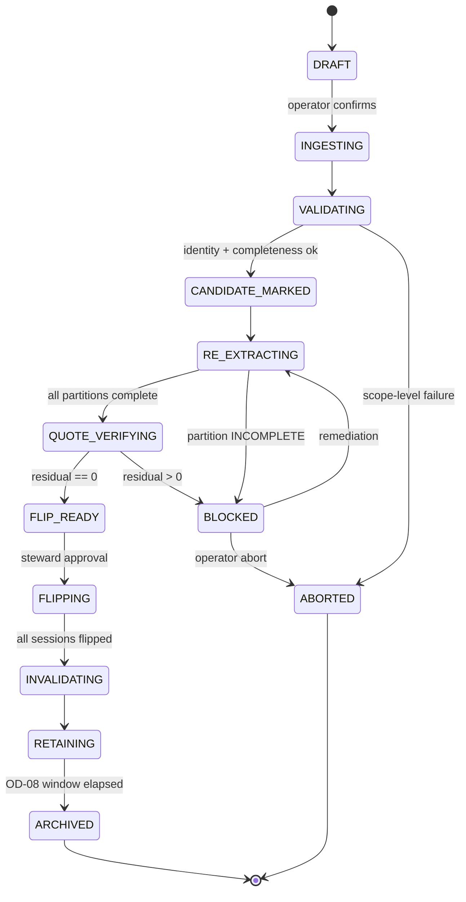
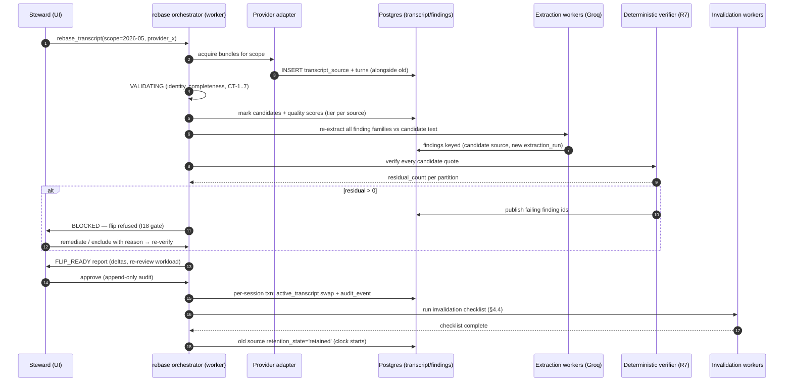

# 06 — Transcript Provider Strategy
**Platform:** Nwafeth Intelligence — منصة نوافث لذكاء الجلسات الاستشارية (Monsha'at Advisory Session Intelligence Platform)
**Status:** Draft for owner review · **Date:** 2026-08-02 · **Author:** Planning package (Fable 5)
**Depends on:** 02, 04, 05 · **Feeds:** 07, 08, 09, 10, 14, 15, 16, 19, 20, 21, 22, 23
**Sources used:** GREENFIELD §2.1, §2.6, §9.1–9.4, §11.3, §15.2–15.4, §21 (EXP-02); MASTER_PROMPT §2.4, §2.5, §2.6; arch/01 §4, arch/02 §7, arch/05 §3, arch/04 §Ingestion; CORE-BRIEF §6, §7, §10, §11

---

## 0. Doctrine — three settled facts this document builds on

1. **ASR correction is cancelled, permanently.** [DECISION MASTER_PROMPT §2.4, owner 2026-08-02] The multi-model correction ensemble is deleted with all its data; the new platform never rewrites transcript text with an LLM, never stores a "corrected" variant, and never reintroduces correction under another name. Transcript quality is an **upstream provider-selection and quality-gating problem** [FACT GREENFIELD §2.6]. The only sanctioned mitigation is the read-time deterministic glossary of §6 — no write-back, one flag, deleted when the clean provider lands.
2. **Read.ai is interim, not permanent.** [DECISION GREENFIELD §2.1] A cleaner provider is expected; its identity and timeline are unknown [ASSUME OD-06 — working assumption: Read.ai remains the sole source through pilot; the boundary below makes the swap invisible above the transcript line]. Nothing in this package may treat Read.ai as the shape of the world.
3. **Raw transcripts are immutable and provider-versioned (I6); every quote is verifiable against the active transcript (I7).** These two invariants, plus the rebase operation of §4, are recorded together as **ADR-0007**.

The legacy lesson that motivates all of this: 11,304 of 16,911 legacy meetings (67%) were extracted against corrected text that is being deleted, silently converting two-thirds of stored quotes into unverifiable claims about named consultants [FACT MASTER_PROMPT §2.4]. The new design makes that failure mode structurally unreachable: derived knowledge is always keyed to `(source, source_version)`, and text replacement is only possible through the gated `rebase_transcript` operation.

---

## 1. Provider landscape and current state

| Provider | Status | Evidence |
|---|---|---|
| **Read.ai** | Interim baseline. OAuth refresh-token API (`api.read.ai/v1`), cursor pagination hard-capped at `limit=10`, rate limit ~80 req/60 s client-side, 7 expand sections (transcript, summary, chapters, action items, key questions, topics, metrics), full raw payload retained | [FACT arch/05 §3.2–3.5] |
| **"Cleaner" replacement** | Announced by owner, identity/timeline unknown | [DECISION MASTER_PROMPT §2.5] · [ASSUME OD-06] |
| **Groq STT contingency** (`whisper-large-v3`, `whisper-large-v3-turbo`) | Assess-only; requires lawful audio access | [FACT groq-docs 2026-08-02] · [ASSUME OD-12 — assume audio NOT available] · §7 below |

Operational constraints carried into doc 05/09 planning:

- **OD-13 — second OAuth client.** Read.ai token rotates on refresh; sharing one client between legacy and new platform breaks both (each refresh invalidates the other's refresh token) [FACT arch/05 §3.1 refresh semantics + I10 independence]. A dedicated OAuth client for NIP must be requested **now** — it is the single longest-lead dependency of ongoing ingestion. Interim fallback if the client is delayed: bootstrap from the one-time checksummed snapshot (ADR-0016) and replay export files, never a shared credential.
- Tokens live **only** in `ingest` schema state managed by the worker plane; no `.env` write-back ever (legacy F12 lesson) [FACT arch/07 F12].
- Read.ai title-format change of June 2026 broke identity parsing and produced 1,629 `'PENDING'` magic strings [FACT arch/05 §2]. In NIP, provider identity fields are nullable + `resolution_status` enum (CORE-BRIEF §6); the transcript layer never carries identity semantics.

---

## 2. The `TranscriptSource` boundary

### 2.1 Boundary rules

1. **Nothing downstream reads a provider name.** [DECISION MASTER_PROMPT §2.5] Handlers, `search_evidence`, `fetch_transcript_window`, the R7 quote gate, Lane-3 map workers, quality scoring, and the transcript browser all read *the active transcript* through one accessor (`get_active_transcript(advisory_session_id)`). If a provider swap is visible above that accessor, the boundary is in the wrong place.
2. **One active source per session.** A session may retain multiple `(source, source_version)` transcript instances under retention policy (§4.6), but exactly one is active for all current analytics [FACT GREENFIELD §9.1]. Enforced by table shape, not convention: `transcript.active_transcript` has `advisory_session_id` as primary key.
3. **Turn identity is not portable across providers.** `turn_index`, timings, and speaker labels differ per provider. Every pointer into a transcript (finding quote refs, evidence units, review fingerprints, Lane-3 outputs) records the `transcript_source_id` (hence source+version) it was derived from [DECISION MASTER_PROMPT §2.5; I13].
4. **Adapters normalize; they never interpret.** An adapter maps provider payloads to the normalized record below and archives the raw payload to object storage. It performs no text cleanup, no speaker-role inference beyond deterministic label mapping, no identity extraction (doc 05 owns identity contracts).
5. **Immutability (I6).** `transcript.turn.text` is written once. No UPDATE path exists in any worker; the DB role used by workers is granted INSERT but not UPDATE on `transcript.turn` [REC — cheap structural enforcement; alternative: trigger-based rejection; revisit if a provider legitimately re-delivers a *revised* transcript — that arrives as a new `source_version`, never an in-place edit].

### 2.2 Normalized record contract (JSON Schema sketch)

The adapter output — one bundle per (session, provider, acquisition). This is the wire contract between any provider adapter and the transcript loader; JSON Schema is enforced at the loader with `additionalProperties: false` throughout.

```json
{
  "$id": "nwafeth://contracts/transcript-source-bundle/v1",
  "type": "object",
  "additionalProperties": false,
  "required": ["provider", "provider_meeting_ref", "source_version",
               "acquired_at", "language", "raw_payload_ref", "turns",
               "provider_meta"],
  "properties": {
    "provider":            {"enum": ["readai", "provider_x", "groq_whisper"]},
    "provider_meeting_ref": {"type": "string", "minLength": 1,
      "description": "Provider-native meeting id (e.g. Read.ai ULID). Mapped to advisory_session via core.provider_meeting_map — never parsed for identity here."},
    "source_version":      {"type": "string",
      "description": "Provider content version. Read.ai: sha256 of canonicalized transcript payload (provider exposes no version field). Providers with native revisions: their revision id."},
    "acquired_at":         {"type": "string", "format": "date-time"},
    "language":            {"type": "string", "pattern": "^[a-z]{2}(-[A-Za-z]{2,4})?$",
      "description": "Provider-declared dominant language, e.g. ar, ar-SA; 'und' if undeclared."},
    "raw_payload_ref":     {"type": "string",
      "description": "Object-store URI of the verbatim provider payload (MinIO), content-addressed."},
    "provider_meta": {
      "type": "object", "additionalProperties": false,
      "required": ["adapter_version", "extras_present"],
      "properties": {
        "adapter_version":  {"type": "string"},
        "declared_duration_ms": {"type": ["integer", "null"], "minimum": 0},
        "overall_confidence":   {"type": ["number", "null"], "minimum": 0, "maximum": 1},
        "extras_present": {"type": "array", "items":
          {"enum": ["summary", "chapters", "action_items", "key_questions",
                    "topics", "metrics", "diarization_scores"]}}
      }
    },
    "turns": {
      "type": "array", "minItems": 1,
      "items": {
        "type": "object", "additionalProperties": false,
        "required": ["turn_index", "speaker_label", "resolved_role",
                     "start_ms", "end_ms", "text", "quality"],
        "properties": {
          "turn_index":    {"type": "integer", "minimum": 0,
            "description": "0-based, dense, strictly increasing within the bundle. Loader rejects gaps."},
          "speaker_label": {"type": "string",
            "description": "Provider label verbatim (e.g. 'Speaker 2', a display name). Never edited."},
          "resolved_role": {"enum": ["consultant", "beneficiary", "other", "unresolved"],
            "description": "Deterministic mapping outcome (doc 09 rules: participant match, label heuristics). 'unresolved' is a first-class value — never a magic string, never guessed by an LLM."},
          "role_resolution_method": {"enum": ["participant_match", "label_rule",
                                              "position_heuristic", "none"], "default": "none"},
          "start_ms": {"type": "integer", "minimum": 0},
          "end_ms":   {"type": "integer", "minimum": 0},
          "text":     {"type": "string", "minLength": 1,
            "description": "Immutable verbatim provider text. Unicode NFC as delivered; no normalization applied at rest (normalization happens in comparison/matching functions only — I7 verifies against THIS string)."},
          "quality": {
            "type": "object", "additionalProperties": false,
            "required": [],
            "properties": {
              "asr_confidence": {"type": ["number", "null"], "minimum": 0, "maximum": 1},
              "diarization_confidence": {"type": ["number", "null"], "minimum": 0, "maximum": 1},
              "provider_flags": {"type": "array", "items": {"type": "string"}}
            }
          }
        }
      }
    }
  }
}
```

Read.ai adapter notes [FACT arch/05 §3.3]: `transcript.turns` maps 1:1; `summary/chapters/action_items/key_questions/topics/metrics` are ingested as **source features** into `core`/`ingest` per doc 05 (provider metrics are never authoritative quality measures, GREENFIELD §11.4); Read.ai supplies no per-turn confidence → `asr_confidence: null` (this feeds the benchmark dimension "provider-supplied extras", §5.4-J). Legacy corpus baseline for planning: 5.7% of turns lack a resolvable speaker role; timing is 100% present [FACT CORE-BRIEF §11].

### 2.3 Storage shape (`transcript` schema, DDL sketch — doc 08 owns final DDL)

```sql
-- Registry of known providers (seed rows: readai, provider_x placeholder, groq_whisper)
CREATE TABLE transcript.provider_registry (
  provider          text PRIMARY KEY,
  display_name_ar   text NOT NULL,
  adapter_module    text NOT NULL,
  status            text NOT NULL CHECK (status IN ('interim','candidate','active','retired')),
  contract_notes    text
);

-- One row per acquired (session, provider, version) transcript instance
CREATE TABLE transcript.transcript_source (
  transcript_source_id  bigint GENERATED ALWAYS AS IDENTITY PRIMARY KEY,
  advisory_session_id   bigint NOT NULL REFERENCES core.advisory_session,
  provider              text   NOT NULL REFERENCES transcript.provider_registry,
  provider_meeting_ref  text   NOT NULL,
  source_version        text   NOT NULL,
  acquired_at           timestamptz NOT NULL,
  language              text   NOT NULL DEFAULT 'und',
  raw_payload_ref       text   NOT NULL,          -- MinIO URI, content-addressed
  turn_count            integer NOT NULL,
  total_speech_ms       bigint  NOT NULL,          -- interval-merged, NOT summed (legacy silence_pct bug)
  ingest_run_id         bigint  NOT NULL REFERENCES ingest.run,
  retention_state       text NOT NULL DEFAULT 'live'
                        CHECK (retention_state IN ('live','retained','archived','purged')),
  UNIQUE (advisory_session_id, provider, source_version)
);

CREATE TABLE transcript.turn (
  transcript_source_id  bigint  NOT NULL REFERENCES transcript.transcript_source,
  turn_index            integer NOT NULL,
  speaker_label         text    NOT NULL,
  resolved_role         text    NOT NULL CHECK (resolved_role IN
                          ('consultant','beneficiary','other','unresolved')),
  role_resolution_method text   NOT NULL DEFAULT 'none',
  start_ms              bigint  NOT NULL,
  end_ms                bigint  NOT NULL CHECK (end_ms >= start_ms),
  text                  text    NOT NULL,
  asr_confidence        real,
  diarization_confidence real,
  PRIMARY KEY (transcript_source_id, turn_index)
);
-- Workers: GRANT INSERT, SELECT ON transcript.turn — no UPDATE, no DELETE (immutability pin, I6)

-- THE single active pointer: PK on session id makes ">1 active" unrepresentable
CREATE TABLE transcript.active_transcript (
  advisory_session_id  bigint PRIMARY KEY REFERENCES core.advisory_session,
  transcript_source_id bigint NOT NULL REFERENCES transcript.transcript_source,
  activated_at         timestamptz NOT NULL DEFAULT now(),
  activated_by         text NOT NULL,             -- operator or 'ingest:initial'
  rebase_op_id         bigint REFERENCES transcript.rebase_operation
);

CREATE TABLE transcript.source_quality (        -- §5.6 quality gating; recomputed per source
  transcript_source_id bigint PRIMARY KEY REFERENCES transcript.transcript_source,
  score                numeric(5,2) NOT NULL,     -- 0..100 deterministic composite
  tier                 text NOT NULL CHECK (tier IN ('A','B','C','D')),
  components           jsonb NOT NULL,            -- per-component values, §6.1
  scorer_version       text NOT NULL,
  scored_at            timestamptz NOT NULL
);
```

Initial ingestion of a session's first-ever transcript activates it directly (`activated_by='ingest:initial'`); every subsequent change of active source goes through `rebase_transcript` only.

### 2.4 Adapter conformance suite

Every provider adapter must pass one shared contract-test suite before its rows may be activated [REC — generalization of the legacy `check_period_coverage` structural-check pattern, MASTER_PROMPT §2.6.3]:

| Check | Rule |
|---|---|
| CT-1 schema | Bundle validates against `transcript-source-bundle/v1`, `additionalProperties:false` |
| CT-2 density | `turn_index` dense from 0, strictly increasing |
| CT-3 monotonic time | `start_ms` non-decreasing; `end_ms ≥ start_ms`; overlaps allowed but flagged |
| CT-4 idempotency | Re-delivering the identical payload produces the same `source_version` and zero new rows |
| CT-5 raw archive | `raw_payload_ref` resolves and its sha256 matches the content address |
| CT-6 no rewriting | Byte-identity spot check: normalized `text` equals provider payload text (adapter performed no cleanup) |
| CT-7 role honesty | `resolved_role='unresolved'` whenever no deterministic rule fired; never defaulted to a real role |

---

## 3. Why rebase exists (the one operation, used twice)

Replacing the text a session's derived knowledge was extracted from — whether by provider swap or by any future version re-delivery — always invalidates quotes, findings, embeddings, and reviews for that session. The legacy programme learned this at a cost of 11,304 meetings [FACT MASTER_PROMPT §2.4]. `rebase_transcript` is therefore a first-class, repeatable, audited operation (ADR-0007), and the **only** code path that changes `transcript.active_transcript`.

**What we deliberately do NOT build** [DECISION MASTER_PROMPT §2.5 "what NOT to do"]:

- no reconciliation, diffing, or merging between providers;
- no mapping of old turn indices onto new turn indices — **re-extract from the new source, always** [FACT GREENFIELD §9.2];
- no dual-live "comparison" feature keeping two sources active for the same session (benchmark comparison happens offline in EXP-02, §5);
- no partial rebase of individual turns.

---

## 4. `rebase_transcript` — workflow specification

### 4.1 Operation contract

```
rebase_transcript(scope, target_provider, target_version_selector) -> rebase_op_id
  scope: explicit advisory_session_id list OR period selector (end-exclusive) OR 'full-corpus'
  Preconditions: candidate transcript_source rows exist for every session in scope
                 and passed adapter conformance (CT-1..7)
  Batched: scope is partitioned by calendar month (aligns with Lane-3 partitioning);
           each month-partition advances through the state machine independently,
           but the FLIP step is per-session-atomic and the operation reports per-partition status.
  Idempotent + resumable: every step records progress in transcript.rebase_operation /
           rebase_item; a crashed run resumes, never restarts extraction already done.
```

### 4.2 State machine (all 10 GREENFIELD §9.2 steps mapped)

| State | GREENFIELD step | Work | Exit criteria |
|---|---|---|---|
| `DRAFT` | — | Scope resolved, cost/volume estimate shown to operator | Operator confirms |
| `INGESTING` | 1 | New turns written **alongside** old (new `transcript_source` rows; nothing in place) | All sessions in scope have candidate rows |
| `VALIDATING` | 2 | Completeness + identity: candidate maps to the *same* `advisory_session` via `core.provider_meeting_map`; `turn_count ≥ 1`; speech-time coverage within ±20% of the better of (old source speech time, internal session duration) [REC threshold; revisit after EXP-02 measures real provider variance]; language check | 0 validation failures, else per-session `rebase_item` marked `EXCLUDED_VALIDATION` and reported — never silently dropped (I16) |
| `CANDIDATE_MARKED` | 3 | Candidate `transcript_source_id` pinned per session in `rebase_item`; quality score (§6) computed for each candidate | Quality tier recorded; tier-D candidates flag the session `EXCLUDED_QUALITY` (rebasing onto worse text is refused) |
| `RE_EXTRACTING` | 4 | Full re-run of all corpus-wide extractions + rule-based scoring against candidate text, writing findings keyed to the candidate `(source, source_version)` with fresh `extraction_run_id`. Old findings untouched and still serving | All partitions complete or explicitly `INCOMPLETE` (bounded worker pool; failed partition never swallowed — legacy F19 lesson) |
| `QUOTE_VERIFYING` | 5 | **The R7 gate** (§4.3): every quote of every candidate-derived finding must be a verbatim substring of a candidate turn | `residual_count == 0` per partition |
| `BLOCKED` | 6 | Entered when residual > 0 or `RE_EXTRACTING` is `INCOMPLETE` for the partition. Publishes residual count + failing finding ids to ops dashboard. **No flip while blocked.** | Operator remediates (rerun extraction, exclude sessions with recorded reason) → back to `RE_EXTRACTING`, or `ABORTED` |
| `FLIP_READY` | — | Deterministic pre-flip report rendered (per-partition: sessions, findings delta, quality tier movement, capabilities affected) | Steward approval recorded (append-only, OD-11 semantics) |
| `FLIPPING` | 7 | Per session, single transaction: update `transcript.active_transcript` row + write `ops.audit_event('transcript_source_activated', …)` (GREENFIELD §15.4). Serving reads join through the active pointer, so the switch of findings + turns is atomic per session | All sessions flipped |
| `INVALIDATING` | 8 | Invalidation set executed (§4.4) | Invalidation checklist complete |
| `RETAINING` | 9 | Old source `retention_state='retained'`; retention clock starts (§4.6) | Window elapses |
| `ARCHIVED` | 10 | Old turns exported to object storage (checksummed), rows purged per policy; `retention_state='archived'` then `'purged'` | Policy executed, audit event written |
| `ABORTED` | — | Candidate rows kept as inactive evidence or purged per operator choice; nothing was flipped, serving never changed | Audit event |



### 4.3 The quote re-verification gate (R7 applied pre-flip)

Deterministic code, never a model (I18). For every finding row derived from the candidate source:

```
verify(finding):
  turn = transcript.turn[candidate_source_id, finding.turn_index]
  PASS iff finding.quote is a contiguous verbatim substring of turn.text
       (byte-level on NFC text; no normalization, no fuzzy match — I7)
residual_count = COUNT(findings WHERE NOT PASS)   -- published per partition
GATE: residual_count == 0  → FLIP_READY permitted
      residual_count  > 0  → BLOCKED; the flip CANNOT proceed
```

- The gate also re-verifies any **carried governance artifacts** that reference candidate turns (e.g. reviewer-pinned exemplar quotes attached to taxonomy proposals): each either re-verifies or is queued for human re-pin — never auto-repaired.
- The residual is **published, not summarized**: finding ids, session ids, capability ids (CAP-xx) affected, so remediation is targeted.
- This is the same verifier code path used at answer time (doc 15 EXP-09 proves it rejects fabricated quotes); rebase reuses it rather than reimplementing [REC — single verifier implementation; alternative: separate batch verifier, rejected: two implementations drift].

### 4.4 Invalidation set (step 8) — exhaustive, checklisted

Executed per flipped session; each row is a checklist item the operation records as done (I16 — partial invalidation is a reportable incident, not a silent state):

| Asset | Schema | Action |
|---|---|---|
| Evidence embeddings + evidence units | `evidence` | Delete/mark-stale rows whose `transcript_source_id` ≠ new active; enqueue re-embed of new-source evidence units (local embedder, doc 14). Index version bumped so retrieval never mixes sources |
| Lane-3 job caches & promotable artifacts | `jobs` | Any cached job result whose corpus manifest includes an affected session → `stale=true`; re-serve requires re-run. Promoted artifacts referencing stale jobs are flagged to their owner |
| Published **live** views | `packs` (live), `serve` | Live analytical views recomputed on next read (cache dropped). **Frozen packs are never retroactively edited** — if a frozen pack's findings become materially wrong, the reissue/supersession path of ADR-0011 applies, with an ops task auto-created listing affected packs |
| Review fingerprints | `findings` | Reviews are bound to `(finding_id, transcript_source_id)`; old-source reviews become historical (retained, append-only). New-source findings enter the review queue fresh — **human sign-off does not transfer across sources** (GREENFIELD §6.5). The pre-flip report quantifies the re-review workload |
| Serving-plane caches / resolved facts | `serve` | Conversation-scoped resolved facts referencing affected sessions invalidated; in-flight Lane-1 conversations get `VALIDATION_FAILED` on stale references rather than stale answers |
| Source quality score | `transcript` | Recomputed for the new active source (already done at `CANDIDATE_MARKED`; pointer swap only) |
| Metric-layer aggregates | `serve`/`packs` materializations | Recompute any materialized aggregate whose lineage includes transcript-derived findings for affected periods (lineage from I12 registry) |

### 4.5 Sequence diagram (one month-partition, happy path + block)



### 4.6 Retention of superseded sources (steps 9–10)

[ASSUME OD-08 — safe working assumption pending owner sign-off in doc 22:]

- **90 days** post-flip in-database retention (`retention_state='retained'`, queryable read-only by stewards for dispute resolution — e.g. a consultant contests a violation finding raised pre-rebase);
- then export to object storage as checksummed archive (raw payload was already there; the archive adds normalized turns + the final quality score), `retention_state='archived'`;
- purge from Postgres; archive itself follows the **≥18-month audit retention** floor;
- every transition writes an `ops.audit_event` (GREENFIELD §15.4 lists source activation and retention among mandatory audit events).

Revisit-trigger: Monsha'at records-management policy (doc 16) may lengthen these windows; it may not shorten the audit floor.

### 4.7 Explicit rule — no cross-provider turn mapping

**Never map old turn indices onto new provider turn indices.** [FACT GREENFIELD §9.2; MASTER_PROMPT §2.5] Providers segment differently; any alignment heuristic silently corrupts quote provenance. Consequences accepted by design: (a) links/citations minted against the old source stop resolving after the retention window — answer artifacts store their `(source, source_version)` so an old export remains internally honest but marked superseded; (b) longitudinal per-turn analytics never span a rebase — they are re-derived wholly from the new source (fresh-per-period analysis R-P3 makes this natural).

---

## 5. EXP-02 — provider benchmark design

Per GREENFIELD §21, every experiment declares hypothesis, sample, method, metrics, threshold, owner, artifact, and unlocked decision.

- **Hypothesis:** the candidate provider materially improves Arabic/Saudi-dialect fidelity and entity fidelity over Read.ai while meeting residency and API requirements, such that quote-bearing capabilities (CAP-B4, CAP-A1, CAP-C5…) rest on more trustworthy text.
- **Owner:** platform analytics lead + one Saudi-Arabic linguistic reviewer team (2 transcribers + 1 adjudicator).
- **Artifact:** benchmark report + filled scoring sheet (§5.5) + labelled gold set archived under `ops` for reuse in later provider evaluations (I17: continuous re-verification).
- **Decision unlocked:** OD-06 provider adoption go/no-go; triggers the first production `rebase_transcript` (doc 20 sequences it).

### 5.1 Two designs depending on audio availability

Ground-truth WER requires audio. Whether lawful audio access exists is exactly OD-12, so the benchmark plans both branches [REC]:

- **Design A (audio available):** gold reference transcripts produced from audio by human transcribers → full WER/CER suite.
- **Design B (no audio — the working assumption [ASSUME OD-12]):** no absolute WER. Instead: (1) side-by-side **comparative human judgment** on provider outputs for the same meetings (candidate provider must be able to process historical or parallel-scheduled meetings — if it cannot process the *same* meetings as Read.ai, run a 4-week parallel capture window on live sessions with both providers attached); (2) **entity-fidelity scoring against known registries** (needs no audio: a human judges whether the transcribed entity/programme surface form is correct-or-recoverable); (3) intelligibility/verbatimness ratings on a 4-point rubric. Design B is weaker on absolute fidelity and says so in the report; residency, API, ops, and cost dimensions are unaffected.

### 5.2 Stratified sample

Population: 16,911 sessions, 2025-05…2026-06, monthly volume 556–1,512 [FACT CORE-BRIEF §11]. Sample **n = 180 sessions** [REC — sizing: proportions near 0.9 measured on ≥150 units carry a Wilson 95% CI of roughly ±5 pts, adequate for gate decisions; alternatives: n=60 (CI too wide for entity fidelity), n=400 (doubles labelling cost for <2 pt CI gain); revisit-trigger: if strata cells fall below 10, widen n]. Within each session, label one contiguous **5-minute window** (random offset, avoiding first 60 s) for fidelity metrics, plus **full-session** labelling on a 40-session subset for diarization/segmentation metrics. ≈15 h gold audio (Design A) or ≈15 h comparative review (Design B).

Strata (proportional allocation with minimum cell size 6):

| Stratum axis | Levels | Rationale |
|---|---|---|
| **Month** | 3 buckets: 2025-05–2025-10, 2025-11–2026-02, 2026-03–2026-06 | provider behaviour drifts; recency matters for the go decision |
| **Programme** | top 4 programmes by session count + «أخرى» | programme vocabulary differs (doc 05 dimension) |
| **Session length** | terciles of total speech time | short sessions stress diarization; long ones stress stability |
| **Dialect density** | terciles of a deterministic Saudi-dialect marker rate: occurrences per 1,000 tokens of a reviewed marker lexicon (وش، ليش، أبغى/أبي، الحين، كذا، مافيه/مافي، وشلون، زين، مره، توّه…) computed on the Read.ai text | the decisive axis: MSA-heavy sessions flatter every provider; the gate must hold on the high-dialect tercile |

Oversample: +10 sessions forced from the *unresolved speaker-role* population (the 5.7%) to stress diarization, and +10 with heavy government-entity mentions (from the 21,561-mention pool) for the entity test. These 20 are analysed as a challenge set, excluded from stratum-weighted totals.

### 5.3 Labelling protocol

1. **Guidelines (written first, versioned):** verbatim transcription; dialect preserved as spoken (no MSA "cleanup"); fillers retained; standard Arabic orthography with a documented normalization annex (below); numbers as spoken; `[غير مسموع]` for unintelligible spans with duration; speaker turns marked with role (مستشار/مستفيد/آخر).
2. **Double labelling:** two transcribers independently per window. Inter-annotator agreement computed as pairwise normalized CER between their references; windows with CER > 8% go to the adjudicator; others adjudicated lightly (spot check 20%).
3. **Adjudicated gold** is the reference. Store transcriber ids, versions, and disagreement stats (they calibrate how much residual WER is measurement noise).
4. **Entity gold:** adjudicator additionally tags every mention of a government entity, programme, or service category against the `tax` entity registry seed list (top 150 entity surface forms from the 4,372 distinct legacy strings + all 48 `service_category` values + programme names), marking the intended canonical entity.
5. **Privacy:** names/national IDs inside gold windows are labelled as PII slots; the gold set is stored under steward-only access (doc 16); provider evaluation of names/numbers happens only where legally permitted [FACT GREENFIELD §9.3].

**Arabic normalization annex** (applied by the *metric*, never to stored text): remove tashkeel and tatweel; unify alef variants (أ/إ/آ → ا); ى → ي; ة → ه; unify Arabic/Latin digits; collapse whitespace; strip punctuation. Metrics are reported **both raw and normalized** — the normalized variant is the gated one (orthographic variance is not an intelligibility failure), the raw one is diagnostic.

### 5.4 Measurement dimensions (all of GREENFIELD §9.3)

| # | Dimension | Metric(s) | Gold basis |
|---|---|---|---|
| A | Arabic/Saudi-dialect fidelity | **WER-norm**, **CER-norm** (normalization annex), reported overall and per dialect-density tercile; Design B substitute: pairwise preference rate + 4-point intelligibility rubric | §5.3 gold / comparative |
| B | Government entity + programme-name fidelity | **Entity exact-match rate** after normalization; **entity-recoverable rate** (recognizably the right entity, e.g. «منشآت» vs «منشات» = recoverable); per-registry-category breakdown | entity gold (works in both designs) |
| C | Business/regulatory terminology fidelity | Term error rate on a reviewed 300-term list (سجل تجاري، اشتراطات، ترخيص بلدي، تمويل جماعي…) | gold / comparative |
| D | Names & numbers (where legally permitted) | Digit-sequence WER; name exact-match on consented/permitted subset only | gold, restricted |
| E | Diarization + role attribution | **Turn-attribution accuracy** (% turns with correct role), missing/unresolved-role rate (Read.ai baseline: 5.7%), speaker-confusion rate on full-session subset; DER where audio permits | full-session subset |
| F | Segmentation + timestamps | Turn-boundary F1 at ±2 s tolerance; timestamp MAE; % turns with timing (Read.ai baseline: 100%) | full-session subset |
| G | **Exact quote preservation / verbatimness** | % of gold utterance spans reproduced verbatim (no paraphrase, fillers retained, no "smart cleanup"). A provider that *rewrites* speech is structurally incompatible with I7 regardless of its WER | gold / comparative |
| H | Provider-supplied extras (summaries, chapters, action items, questions) | Present/absent inventory; usefulness scored but **never gated** — extras are source features, not requirements | provider payloads |
| I | API completeness | Checklist: pull API, pagination limits, historical replay depth (≥90 days required), webhooks, rate limits, idempotent re-fetch, per-turn confidence exposure, raw export | contract + probe |
| J | Data residency + contractual controls | Checklist: KSA residency or approved hosting (OD-01 dependent), encryption at rest/in transit, retention & deletion API, audit/export of processing, no-training-on-customer-data clause, subprocessor list | contract review (doc 16) |
| K | Availability + failure recovery | Observed uptime over a 30-day probe window; recovery of missed meetings (replay); documented SLA | probe + contract |
| L | Latency + operational cost | p50/p95 transcript availability after meeting end; cost per session-hour; rate-limit headroom at 1,512 sessions/month peak [FACT CORE-BRIEF §11] | probe + pricing |

### 5.5 Scoring sheet and go/no-go gate

**Hard gates — pass/fail, any failure = no-go** [REC; alternatives and revisit-triggers below]:

| Gate | Threshold |
|---|---|
| G1 residency/contract (dim J) | Full checklist pass; deletion API + no-training clause mandatory |
| G2 fidelity (dim A) | Design A: WER-norm ≤ **28%** overall AND ≤ **35%** on the high-dialect tercile AND ≥ **15% relative** improvement over Read.ai on the same windows. Design B: preferred in ≥ **70%** of pairwise comparisons AND ≥ 60% on high-dialect tercile |
| G3 entity fidelity (dim B) | Exact ≥ **85%** and recoverable ≥ **95%** on the entity gold |
| G4 diarization (dim E) | Role-attribution accuracy ≥ **92%**; unresolved-role rate ≤ **3%** (must beat the 5.7% baseline) |
| G5 segmentation (dim F) | Timing present on 100% of turns; boundary F1 ≥ **0.80** @ ±2 s |
| G6 verbatimness (dim G) | ≥ **95%** of gold spans verbatim; any documented "cleanup/paraphrase" mode must be fully disableable — otherwise **disqualified** (I7) |
| G7 API (dim I) | Pull + pagination + ≥90-day replay + idempotent re-fetch mandatory; webhooks optional |
| G8 availability/latency (dims K, L) | ≥ **99.5%** probe-window availability; transcript ready p95 ≤ **4 h** after meeting end |

**Weighted ranking score** (only among candidates passing all hard gates; used when >1 candidate or to quantify the margin over Read.ai):

```
score = 0.30·fidelity(A, scaled) + 0.15·entity(B) + 0.10·terminology(C)
      + 0.15·diarization(E) + 0.05·segmentation(F) + 0.10·verbatimness(G)
      + 0.05·api(I) + 0.05·availability(K) + 0.05·latency(L₁)
Cost (L₂) reported alongside, never inside the score — correctness over cost
[DECISION GREENFIELD §2.5]; extras (H) reported, weight 0.
Each component scaled 0..1 against the sheet's anchor definitions; Read.ai is
scored on the identical sheet as the incumbent baseline row.
```

Rationale and revisit-triggers for the thresholds [REC]: 28%/35% WER-norm reflects realistic dialectal-Arabic ASR performance in 2026 — demanding ≤15% would reject every real candidate, and accepting ≥40% keeps quote evidence untrustworthy; the *relative*-improvement clause protects against adopting a lateral move with migration cost. G3's two-level design mirrors how entity mentions are actually consumed (CAP-C5 needs recoverable, exports need exact). Revisit all thresholds when: (a) EXP-02 pilot labelling shows inter-annotator CER > 8% (measurement noise too high for a 15%-relative clause), (b) a provider offers per-turn confidence that enables finer gating, or (c) OD-12 flips and Design A becomes possible — rerun the gate under Design A before any full-corpus rebase. **Do not assume "cleaner" means adequate without this benchmark** [FACT GREENFIELD §9.3].

---

## 6. Transcript quality gating for downstream use

Quality is scored **per transcript source instance**, deterministically (no LLM — I18), by a versioned scorer at ingestion and re-scored on scorer upgrades.

### 6.1 Score components (`transcript.source_quality.components`)

| Component | Weight | Definition (all deterministic) |
|---|---|---|
| `role_coverage` | 0.20 | 1 − share of speech-ms in `unresolved` role turns |
| `timing_integrity` | 0.10 | Timing present, monotonic, overlap-merged speech time consistent with declared duration (±20%) |
| `text_plausibility` | 0.25 | 1 − garbage rate: repetition loops (same 3-gram ≥5× consecutively), non-Arabic/non-Latin character bursts, empty/1-char turn share |
| `density_band` | 0.15 | Tokens-per-speech-minute inside plausibility band 40–260 for Arabic conversation; outside band scores proportionally down |
| `coverage_ratio` | 0.15 | Speech-ms ÷ internal session duration (from `core` facts) capped at 1; missing internal duration → component excluded, weights renormalized |
| `provider_confidence` | 0.15 | Mean per-turn `asr_confidence` when supplied; excluded + renormalized when null (Read.ai supplies none) |

`score = 100 · Σ(weightᵢ·componentᵢ)`; components stored individually so tier reasons are inspectable (I16). Weights are scorer-version data, not code constants [REC; recalibrate against EXP-02 gold — components should correlate with measured WER; revisit-trigger: correlation < 0.4 for any component → reweight or drop].

### 6.2 Tiers and their downstream meaning

| Tier | Score | Downstream effect |
|---|---|---|
| **A** | ≥ 85 | Full use, no qualification |
| **B** | 70–84 | Full use; findings carry `quality_tier='B'`; no user-visible change |
| **C** | 50–69 | **Qualified use.** Session included in aggregates, but: (1) quote-bearing findings marked `low_source_quality` and excluded from *accusation-class* outputs — CAP-B4 `violations_with_quotes` and CAP-B5 ranked counts exclude tier-C-sourced violations from the published list, holding them in the review queue instead (precision-over-recall for accusations, E.0); (2) CAP-A1/C7 linguistic-pattern capabilities down-weight nothing but must list tier-C share in the coverage block; (3) evidence retrieval still indexes the text, ranked normally |
| **D** | < 50 | **Blocked from extraction.** No findings are produced; the session enters every capability's coverage block as `excluded_low_quality` (the `used ≤ matched ≤ total` accounting of I8 with `used + Σexclusions == matched` asserted). It still exists for operational metrics that need no transcript (CAP-D4 cancellations, attendance facts) |

Declaration rules (I8 + I16):

- Every answer's coverage block reports `excluded_low_quality` and tier-C share for its scope. When exclusions exceed **20%** of matched sessions in scope, the answer is stamped `PARTIAL — جودة النصوص غير كافية لجزء من النطاق` and Lane 0/1 must surface it in the narrative, not only the footer [REC threshold; revisit with EXP-02 evidence].
- A scope whose matched sessions are **majority tier-D** returns Lane 2 honest boundary with reason code `DATA_NOT_ENRICHED` and the exclusion accounting as detail — never a quiet answer over the minority remainder (I5).
- Capability-level degradation declarations live in the doc 04 catalogue rows (each CAP-xx names its behaviour at tier C and D); doc 11 wires the coverage arithmetic.

---

## 7. Read-time deterministic glossary (interim, optional, deletable)

Purpose: while Read.ai text is the active source, well-known proper nouns are frequently mis-transcribed (e.g. «منشات» for «منشآت», mangled programme names). The **only** sanctioned mitigation [DECISION MASTER_PROMPT §2.4]: a narrow, deterministic, audited, read-time substitution. It is display/search assistance, not correction.

### 7.1 Hard rules

1. **No write-back, ever.** `transcript.turn.text` is untouched; the glossary is applied inside render/search functions only. It is *incapable* of corrupting stored text because no code path writes.
2. **Whole-word, exact surface forms only.** No regex classes beyond word boundaries, no LLM, no fuzzy matching. Each entry maps explicit erroneous surface forms → one canonical form.
3. **One flag.** `GLOSSARY_ENABLED` (config, default **on** for transcript-browser display, always **off** for exports and answer-quote rendering — see rule 4). Turning it off restores raw-only behaviour instantly.
4. **Quotes are never glossed.** I7 requires displayed evidence quotes to be verbatim substrings of stored turns; a glossed quote would break byte-verification and mislead reviewers about what was said. Quote renderings and all exports show raw text. The transcript-browser *reading view* may gloss, with each substitution visually marked (dotted underline) and the original shown on hover/tap; the R7 verifier always compares against raw stored text.
5. **Search uses query-side expansion, not index rewriting.** The evidence/keyword index is built from raw text only. At query time, a query term matching a glossary canonical form is OR-expanded with its known erroneous surface forms (and vice versa). The vector index is unaffected (embeddings are computed on raw text; EXP-04/07 measure whether that suffices — revisit-trigger: if entity-query recall@k in EXP-07 is >10 pts below keyword recall, consider adding canonical-form synonyms to the *query* embedding text, still never to stored text).
6. **Reviewed list, small on purpose.** Seed scope: programme names, government entities (`tax` registry aliases feed it), standard business vocabulary. Target ≤ 300 entries [REC]; every entry passes the single propose→review→approve workflow (ADR-0012), steward-approved.
7. **Deleted when the clean provider lands.** Removal condition [REC]: after the production rebase, when ≥95% of the serving corpus's active sources come from the new provider AND EXP-02 G3 passed, the flag and code path are removed in the next release; entries + audit log archive to `ops`. An ops task is auto-created at rebase completion so deletion cannot be forgotten.

### 7.2 Entry and audit schemas (DDL sketch)

```sql
CREATE TABLE transcript.glossary_term (
  term_id        bigint GENERATED ALWAYS AS IDENTITY PRIMARY KEY,
  canonical_form text NOT NULL,                 -- «منشآت»
  surface_forms  text[] NOT NULL,               -- {'منشات','منشئات'} whole-word matches
  category       text NOT NULL CHECK (category IN
                   ('programme','government_entity','business_term','service_category')),
  entity_ref     bigint REFERENCES tax.entity_registry,  -- when category is entity-like
  status         text NOT NULL CHECK (status IN ('proposed','approved','retired')),
  proposed_by    text NOT NULL,
  approved_by    text,                          -- steward; NULL until approved
  approved_at    timestamptz,
  evidence_note  text NOT NULL,                 -- why: observed mis-transcriptions, sample refs
  created_at     timestamptz NOT NULL DEFAULT now()
);

-- Per-substitution audit (MASTER_PROMPT §2.4: "logged per substitution").
-- Volume control: deduplicated per (term, turn, view, calendar day).
CREATE TABLE transcript.glossary_application_log (
  log_id               bigint GENERATED ALWAYS AS IDENTITY PRIMARY KEY,
  term_id              bigint NOT NULL REFERENCES transcript.glossary_term,
  transcript_source_id bigint NOT NULL,
  turn_index           integer NOT NULL,
  surface_matched      text NOT NULL,
  view_context         text NOT NULL CHECK (view_context IN
                         ('transcript_browser','search_expansion')),
  actor                text NOT NULL,           -- authenticated user id
  applied_on           date NOT NULL DEFAULT current_date,
  hit_count            integer NOT NULL DEFAULT 1,
  UNIQUE (term_id, transcript_source_id, turn_index, view_context, applied_on)
);
```

The application log doubles as the glossary's own quality metric: entries with zero hits over 90 days are candidates for retirement; entries with very high hit rates quantify the interim provider's entity-error burden — direct evidence for the EXP-02 report.

---

## 8. STT contingency assessment (Groq Whisper) — assess-only

**This path is explicitly NOT the baseline** [DECISION GREENFIELD §9.4]. It is assessed so that, if the replacement provider slips indefinitely (OD-06) *and* lawful audio access materializes (OD-12), the platform has an evaluated fallback rather than a scramble.

### 8.1 What exists [FACT groq-docs 2026-08-02]

- `whisper-large-v3` and `whisper-large-v3-turbo` are production STT models on Groq; both are supported by the Batch API (24 h–7 d window, 50% discount) — batch fits a historical backfill SLA, not live sessions.
- Whisper produces text + segment timestamps but **no speaker diarization** — role attribution would require a separate local diarization step (e.g. pyannote-class tooling in the worker plane) plus deterministic role mapping. This is the largest quality risk and the main reason this path is a contingency, not a candidate equal to a full meeting-intelligence provider.

### 8.2 Preconditions to even pilot (all must hold)

| # | Precondition | Status |
|---|---|---|
| 1 | Lawful, reliable access to session audio; recording scope approved | [ASSUME OD-12 — **not available**; safe assumption is NO] |
| 2 | Outbound data-class approval to send **audio** to Groq — a distinct, stricter row in the doc 16 data-flow matrix than pseudonymized text (audio cannot be pseudonymized; it contains voices = biometric-adjacent PII) | extends OD-04; requires explicit approval |
| 3 | Storage/retention plan for audio artifacts (object store, encryption, deletion) approved | doc 16 |
| 4 | A diarization plan meeting gate G4 (§5.5) with local tooling | unproven — pilot measures it |

### 8.3 Assessment design (runs only if §8.2 passes)

20-session pilot as an **extension of EXP-02 Design A** (audio in hand implies gold labelling is possible): transcribe with both `whisper-large-v3` and `-turbo`; run local diarization; score on the identical §5.4 sheet and §5.5 gates as any provider, with two additions — (a) end-to-end pipeline latency (audio fetch → normalized bundle) and (b) total cost/session-hour including local diarization compute. Activation criteria [REC]: activate STT contingency only if it passes **all hard gates G1–G8** *and* the replacement-provider timeline (OD-06) exceeds 6 months at the time of decision. Even then it enters through the same `TranscriptSource` contract as `provider='groq_whisper'` and reaches production only via `rebase_transcript` — no special path.

### 8.4 Deliberate non-goals

No meeting-bot/recorder build (scope fence, GREENFIELD §2.1); no Whisper-based "second opinion" on Read.ai text (that is ASR correction wearing a costume — §0 doctrine); no partial adoption for a subset of live sessions while another provider covers the rest (two active providers for current ingestion multiplies every benchmark, quality, and ops surface; single active provider per era [REC; revisit only if the owner mandates a channel split]).

---

## 9. Decision summary and revisit triggers

| Decision | ID | Revisit trigger |
|---|---|---|
| Transcripts immutable + provider-versioned; `TranscriptSource` boundary; `rebase_transcript` gated by deterministic quote verification; no ASR correction ever | ADR-0007 (doc 22 records) | none for the correction ban (owner-settled); boundary shape revisits only if a provider exposes fundamentally non-turn-based transcripts |
| One active source per session; no cross-provider turn mapping; no dual-live comparison | ADR-0007 detail | owner mandate for a comparison feature (would be built offline on EXP-02 artifacts, still not dual-live serving) |
| Retention: 90 d in-DB → checksummed archive → purge; ≥18 mo audit floor | [ASSUME OD-08] | owner/records-management sign-off in doc 22 |
| EXP-02 hard gates G1–G8 + weighted sheet; cost reported not scored | §5.5 [REC] | pilot labelling noise > 8% CER; OD-12 flip; per-turn confidence availability |
| Quality tiers A–D with capability-level degradation + coverage declaration | §6 [REC] | component-vs-WER correlation from EXP-02; 20% partial-stamp threshold reviewed after first quarterly pack |
| Glossary: read-time, whole-word, no write-back, quotes never glossed, delete-on-clean-provider | §7 [DECISION MASTER_PROMPT §2.4 + REC details] | EXP-07 entity-recall gap (query-embedding synonyms) |
| STT contingency assess-only; enters via same contract if ever activated | §8 [DECISION GREENFIELD §9.4] | OD-12 + OD-04(audio) approvals AND OD-06 slip > 6 months |
| Second Read.ai OAuth client requested immediately | OD-13 | n/a — procurement action, doc 21 tracks |

Open decisions referenced: **OD-04** (outbound data classes — audio extension), **OD-06** (replacement provider identity/timeline), **OD-08** (retention windows), **OD-11** (review role semantics for flip approval), **OD-12** (audio access legality), **OD-13** (second OAuth client). No new OD or ADR IDs introduced by this document.
