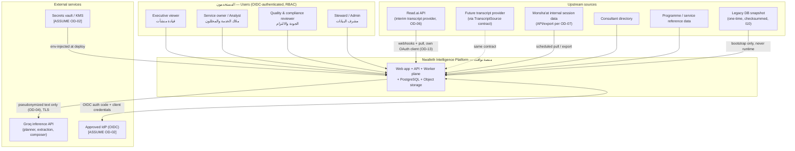
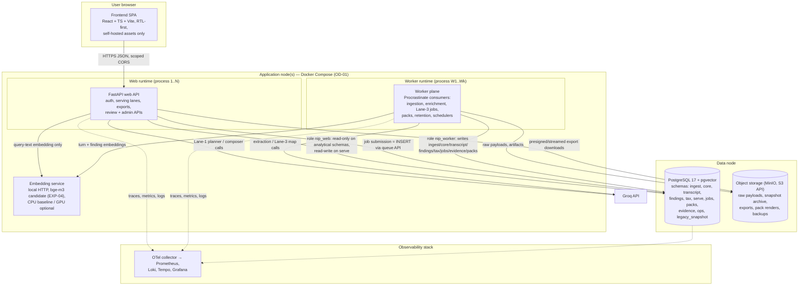
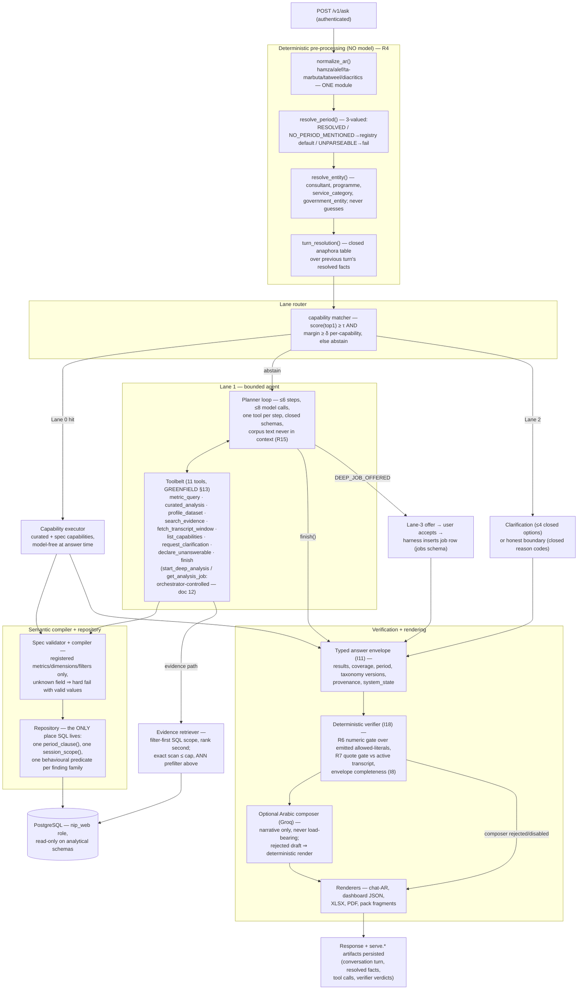
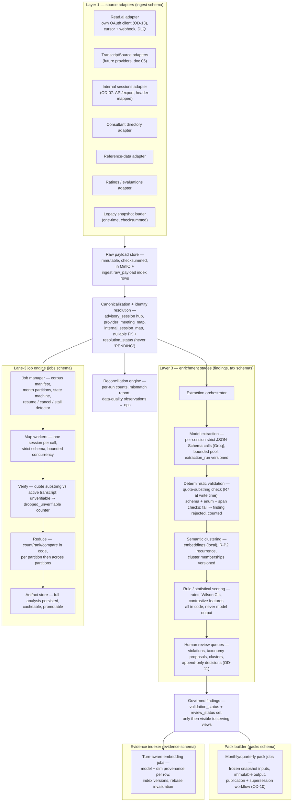

# 07 — Target Architecture
**Platform:** Nwafeth Intelligence — منصة نوافث لذكاء الجلسات الاستشارية (Monsha'at Advisory Session Intelligence Platform)
**Status:** Draft for owner review · **Date:** 2026-08-02 · **Author:** Planning package (Fable 5)
**Depends on:** 02, 04, 05, 06 · **Feeds:** 08, 09, 11, 12, 13, 14, 16, 17, 19, 22, 23
**Sources used:** GREENFIELD §2, §7, §8.1–8.8, §10, §22, §24; MASTER_PROMPT §5.1–5.5, §6 (R1–R16), §7.1; arch/07 §1 (strengths), §2 (F1–F22), §3 (scaling), §5 (strawman); CORE-BRIEF §6, §7, §8, §11, §12

---

## 0. Purpose and reading guide

This document is the single architectural reference for the Nwafeth Intelligence Platform (NIP). It fixes:

1. the **C4 views** (context, containers, components for both planes);
2. the **layer contract** for GREENFIELD §8.1–8.8, mapped onto the canonical schema names of CORE-BRIEF §6, with the failure each layer makes structurally unreachable;
3. the **online/offline separation contract** (I1) down to processes, packages, DB roles, and CI enforcement;
4. all **16 technology decisions** required by GREENFIELD §22 (TD-01…TD-16), each with alternatives and revisit triggers;
5. the **module/package layout** of the modular monolith (consumed by doc 23);
6. the **failure-domain analysis** proving no silent degradation (I16).

Detail deferred deliberately: table-level DDL → doc 08; pipeline state machines → doc 09; metric registry and compiler contract → doc 11; lane decision tree and tool schemas → doc 12; Lane-3 job engine internals → doc 13; model registry and benchmarks → doc 14; endpoint schemas → doc 17; dashboards/runbooks → doc 19.

---

## 1. Architecture doctrine

### 1.1 What we deliberately preserve from the legacy system

The legacy system is evidence, never precedent (I10) — but four of its bets were correct and are promoted into first-class design constraints [FACT arch/07 §1]:

| Legacy strength | Promotion in NIP |
|---|---|
| Two-plane split: offline enrichment writes facts; serving reads only Postgres, no LLM/provider call inside a query handler [FACT arch/07 §1.1] | Hardened into **I1** with process, package, and DB-role isolation (§6) — no longer a convention |
| Deterministic answers instead of free-form text-to-SQL [FACT arch/07 §1.2] | **I2/I3** + the semantic compiler (Layer 4): the model selects a validated spec; a deterministic compiler produces SQL |
| Structural guardrails discovered from disk and diffed against explicit allowlists (`check_period_coverage`) [FACT arch/07 §1.3] | Generalized: registry completeness, curated/spec boundary, auth coverage, renderer numeric-literal checks all **fail the build** (I12, I18) |
| Never-overwrite-raw audit trail [FACT arch/07 §1.4] | **I6**: transcripts immutable and provider-versioned; ASR correction is removed entirely [DECISION GREENFIELD §2.6] |

### 1.2 What must be structurally unreachable

Every component below states which legacy defect it kills (IDs per CORE-BRIEF §12: F1–F22, ISS-xx). The doctrine, in one line each:

- **Duplicated/corrupt facts (F1)** → constraints and natural keys as pins, one write-owner per table.
- **Unauthenticated surface (F2/ISS-04)** → one auth dependency on every route, server-side RBAC (I14).
- **Unrebuildable schema (F3)** → Alembic is the only DDL mechanism (TD-05).
- **God-modules and 8 unsynchronized registries (F5/F8)** → one governed capability + metric registry; unregistered ⇒ build fails (I12).
- **HTML welded to data, DOM-scraping export (F6)** → typed result envelope precedes every renderer (I11).
- **Runbook-contradicting pipelines, opt-in correctness (F10)** → orchestrated DAG with fail-closed defaults (R14).
- **Module-global state (F13)** → all durable state in Postgres (TD-07).
- **Period injection defeated (F16/ISS-01)** → period resolved pre-model, absent from every model schema (I4).
- **Silently answering a different question (ISS-02)** → hard-fail with closed reason codes (I5).
- **Health lies (ISS-05/06)** → health checks exercise dependencies; no 200-on-failure (I16).
- **Unbounded fan-out swallowed to None (F19)** → bounded worker pools; failed partition = `INCOMPLETE`, never silent.

### 1.3 Scale envelope the architecture is sized for

[FACT CORE-BRIEF §11, measured 2026-08-02] 16,911 meetings, 399,501 transcript turns over 14 months (556–1,512 meetings/month), ~95k internal report rows, ~24k ratings. Growth planning basis: ≤2,000 sessions/month ingest, ≤50 concurrent human users, tens of Lane-3 jobs/day, corpus ≤5× current within 3 years [INFER from arch/07 §3]. This is a **small-data, high-assurance** system: the design optimizes for provenance, determinism, and auditability — not horizontal scale. Every technology decision in §7 cites this envelope; every revisit trigger names the growth signal that invalidates it.

---

## 2. C4 Level 1 — system context



Context assertions:

- **No arrow from NIP to the legacy application exists.** The only legacy artifact is a one-time checksummed snapshot restored into `legacy_snapshot` (read-only) [DECISION GREENFIELD §2.3, ADR-0016]. Kills the runtime-coupling class of failures wholesale (I10).
- **Groq is the only generative-AI egress** [DECISION GREENFIELD §2.4], and outbound payloads are pseudonymized per the doc 16 data-flow matrix [ASSUME OD-04]. Embeddings never leave the environment because Groq offers no embedding models and we run them locally [FACT groq-docs 2026-08-02] — a data-residency benefit, not a compromise.
- **Read.ai is interim.** The `TranscriptSource` boundary (doc 06) makes provider replacement invisible above Layer 2 [DECISION GREENFIELD §2.1]. NIP uses its **own** Read.ai OAuth client — token rotation on refresh means sharing the legacy credential would break both systems (OD-13).

---

## 3. C4 Level 2 — containers



Container assertions:

1. **Two runtimes, one codebase** (ADR-0002). The web API and the worker plane are separate OS processes built from the same repository, communicating **only** through Postgres (queue tables + governed schemas) and object storage. No HTTP between web and workers; no shared memory (kills F13).
2. **The queue is the database** (TD-06). Job submission from the request path is a transactional row insert — a Lane-3 job is created atomically with its `serve` conversation turn, so no "accepted but lost" window exists.
3. **The embedding service is inside the trust boundary.** Both planes call it over localhost/internal network; transcript text for retrieval never crosses the environment edge [FACT groq-docs 2026-08-02: no Groq embeddings].
4. **One PostgreSQL instance, eleven schemas** (ADR-0003, CORE-BRIEF §6). Separation is by schema + role, not by instance — at this scale (≤10⁶ analytical rows per table) instance sprawl buys risk, not throughput [REC; revisit trigger in TD-03].

---

## 4. C4 Level 3 — components

### 4.1 Serving plane (inside the web runtime)



**Worked trace** — «كم نسبة الجلسات المنتهية بخطوات واضحة في الربع الثاني لمستشاري برنامج نوافذ؟»:

1. `normalize_ar` canonicalizes the text; `resolve_period` matches «الربع الثاني» → `[2026-04-01, 2026-07-01)` end-exclusive (I4); `resolve_entity` resolves «برنامج نوافذ» against `core` programme dimension; `turn_resolution` finds no anaphora.
2. Lane router scores CAP-B1 `clear_steps_rate` at 0.94 with margin 0.31 ≥ (τ=0.82, δ=0.15 per-capability calibration) → Lane 0.
3. Capability executor runs the registered spec: numerator/denominator from `findings` clear-step features joined to `core.advisory_session`, compiled by the semantic compiler, executed read-only by `nip_web`.
4. Envelope carries: rate per-100-sessions, n, Wilson CI, coverage (sessions with transcript + enrichment / sessions in scope / total), taxonomy version, period `label: الربع الثاني 2026`.
5. Verifier asserts every rendered numeral ∈ emitted allowed-literals (R6); no quotes present, R7 vacuous; composer produces the Arabic narrative; renderer ships. Total model calls: 0 or 1 (composer only). p95 target ≤3s.

### 4.2 Enrichment plane (inside the worker runtime)



Enrichment assertions:

- **Five separated stages** (extraction / validation / clustering / scoring / review) per GREENFIELD §8.3 — one model response can never directly become a published aggregate.
- **Validation runs at write time**, so `findings` never contains an unverified quote even transiently visible to serving: serving views filter on `validation_status = 'verified'` AND review gates where the capability requires them (CAP-B4).
- **The Lane-3 engine is a worker-plane citizen**: it shares the extraction toolchain (strict schemas, bounded pools, quote verification) but runs against a **frozen corpus manifest**, so a job's numbers are reproducible even while ingestion continues (doc 13).

---

## 5. Layer-by-layer specification (GREENFIELD §8.1–8.8)

Each layer states: responsibility → schemas owned → failure prevented (legacy defect IDs) → interfaces → invariants enforced.

### 5.1 Layer 1 — Source adapters (`ingest` + MinIO raw store)

**Responsibility.** One adapter per source (Read.ai, future `TranscriptSource` providers, internal session data, consultant directory, reference data, ratings/evaluations, optional outcomes, one-time legacy snapshot). Each adapter declares the eight contract elements of GREENFIELD §8.1: contract+version, cursor/watermark, idempotency key, update/delete semantics, retry + DLQ, source-quality metrics, PII classification, freshness SLA — and emits a reconciliation report per run (doc 05 owns the contracts, doc 09 the workflows).

**Failure prevented.** Positional Excel parsing + TRUNCATE bridge (F21): all tabular ingestion is header-mapped with fail-loud unknown-column handling, and imports are versioned upserts, never truncate-and-reload. Token write-back to `.env` (F12): provider credentials live in the vault, and OAuth token state lives in an `ingest` table owned by the worker role. Silent 200-on-failure uploads (F18): adapter failures land in `ingest.dead_letter` with reasons, and run status is never `succeeded` with unprocessed items.

**Interfaces.** Downward: HTTP/exports from sources. Upward: writes `ingest.raw_payload` (pointer to immutable MinIO object + checksum), `ingest.ingestion_run`, `ingest.source_cursor`, `ingest.dead_letter`, `ingest.reconciliation_result`. Nothing outside Layer 1 ever talks to a provider.

**Invariants.** I6 (raw payloads immutable before any parse), I10 (legacy snapshot loader is an adapter with a checksum manifest, used once), I16 (run-level observability).

### 5.2 Layer 2 — Raw + canonical foundation (`core`, `transcript`, `legacy_snapshot`)

**Responsibility.** The canonical truth: `core.advisory_session` as the hub entity (never "meeting"), `provider_meeting_map` and `internal_session_map` crosswalks, consultant/programme/service/channel dimensions, participants, attendance/status/cancellation facts, ratings and consultant evaluations; `transcript.source`, `transcript.version`, `transcript.turn`, the **active-transcript pointer**, quality scores. Unresolved identity is a nullable FK + `resolution_status` enum + provenance — the magic string `'PENDING'` is unrepresentable [FACT arch/02 §7 lesson; CORE-BRIEF §6].

**Failure prevented.** F1 (no-PK duplicate rows): every table has a PK plus the natural key that makes the corruption class impossible (doc 08). F4 (FK gaps): all meeting-scoped and consultant-scoped relationships carry real FKs. F16-adjacent identity rot: the 9.6% `'PENDING'` consultants of the legacy system become measurable `resolution_status='unresolved'` rows that coverage blocks can count (I8). F22 (reviewer reads different text): with immutable provider-versioned transcripts and one active pointer, extractor and reviewer provably read identical words — the defect dissolves rather than being patched (ADR-0007).

**Interfaces.** Written only by Layer-1 canonicalization workers and the `rebase_transcript` workflow (doc 06). Read by everything above. `legacy_snapshot` is read-only after bootstrap and referenced only by re-derivation jobs and parity checks (doc 20).

**Invariants.** I6 (immutability + versioning), I4's precondition (end-exclusive period columns everywhere), I13's precondition (provenance columns exist at the foundation).

### 5.3 Layer 3 — Enrichment and analytical findings (`findings`, `tax`)

**Responsibility.** Versioned, evidence-backed findings for all twelve families of GREENFIELD §8.3 (challenges, topics/inquiries, recommendations/action items, satisfaction, pressure/distress, decision points, government mentions, violations, clear-step/impact features, repeated-question clusters, answer-consistency clusters, data-quality findings), produced by the five-stage pipeline of §4.2. Every finding row carries the full provenance tuple `(taxonomy_id, category_id, taxonomy_version, extraction_run_id, model_id, prompt_sha, transcript_source, source_version, quote, turn_index, validation_status)` [CORE-BRIEF §6]. `tax` owns versioned taxonomies, seeds-not-closed-vocabularies proposals (R-P1), and the government-entity registry with aliases (the 4,372-distinct-strings problem, CORE-BRIEF §11).

**Failure prevented.** F20 (205-entry display-map drift): labels are taxonomy category IDs from `tax`, normalized in the pipeline, never display-time translation dicts. Circular labels (E.1): impact features are computed from pre-registered behavioural signals, not from the label being predicted. Unbounded fan-out swallowed to None (F19): extraction pools are semaphore-bounded and a failed call marks the unit failed — "no findings" and "extraction failed" are different states. ISS-15/16: every extraction run is attributable (model, prompt SHA, run ID).

**Interfaces.** Reads `core` + `transcript` (active version only). Writes `findings` + `tax`. Serving reads via governed views that enforce `validation_status`/`review_status` gates. Clustering calls the local embedding service only.

**Invariants.** I13 (provenance mandatory), I18 (validation deterministic — the model's confidence never gates anything), I7 at write time (quote must be an exact substring of the active transcript turn or the finding is rejected and counted).

### 5.4 Layer 4 — Semantic metric layer (registry-in-code + compiler; results over `core`/`findings`)

**Responsibility.** The governed registry of metrics, dimensions, filters, grains, allowed aggregations, period scopes, denominators, support thresholds (n≥30 + Wilson CI), rounding/tolerance rules, caveats, and coverage calculations — plus the deterministic compiler that turns a **validated spec** into parameterized SQL through the repository builders. The registry is code-versioned (reviewable in git, hash-stamped into `ops.model_registry`-adjacent metadata); doc 11 owns its schema.

**Failure prevented.** I2/I3 violations by construction: the model chooses from registered enum members; unknown metric/dimension/filter/enum ⇒ hard fail **listing valid values** (never a guess — ISS-02/I5). F7 (predicate copy-paste divergence): each shared predicate exists once, in the repository, imported by compiler and curated capabilities alike. F16 (period defeat): the compiler cannot emit SQL without a period decision object injected by the harness; the spec schema has **no period field** (I4).

**Interfaces.** Upward: `metric_query(spec)` tool and Lane-0 spec capabilities. Downward: repository → `nip_web` read-only connection. Sideways: emits `allowed_literals` for every number it returns (R6 emit-side design).

**Invariants.** I2, I3, I4, I5, I12 (single metric/dimension registry; build fails on unregistered usage).

### 5.5 Layer 5 — Curated analytical capabilities (code + registry entries)

**Responsibility.** The ~15–20 analyses encoding product judgement — CAP-A1 impact patterns, CAP-B4/B5 violation logic, CAP-B1 clear-steps, CAP-B2 time-loss, CAP-A2 confusion, CAP-C6 inconsistency, CAP-D5 consultant 360, CAP-D10 executive packs, and the rest of the CAP catalogue where doc 04 marks `curated`. Curated ≠ unstructured: every capability returns the same typed envelope and declares data requirements, period behaviour, taxonomy, methodology, coverage, and tests in its registry entry [GREENFIELD §8.5].

**Failure prevented.** F5/F8 (registry fragmentation): capability registration is single-sourced; the build check discovers implementations from disk and fails on any unregistered or unclassified (curated vs spec) capability — the `check_period_coverage` pattern generalized [FACT arch/07 §1.3; MASTER_PROMPT §5.5]. F6: no capability returns HTML, ever.

**Interfaces.** Invoked by Lane 0 executor and by the `curated_analysis` tool. Reads exclusively through the repository. Never calls a model at answer time (the legacy's one correct hard rule, preserved).

**Invariants.** I11 (typed envelope), I8 (coverage declared per capability), I12.

### 5.6 Layer 6 — Agentic serving (`serve`, `jobs` submission)

**Responsibility.** The four lanes (ADR-0008; doc 12 owns the decision tree): Lane 0 deterministic committed capabilities with calibrated τ/δ abstention; Lane 1 bounded agent (≤6 steps, ≤8 total model calls, one tool per step, closed schemas, R10 context caps); Lane 2 clarification (≤4 registry-derived options) or honest boundary (closed reason codes, CORE-BRIEF §4); Lane 3 offer→accept→job submission. Conversation state, resolved facts per turn, tool-call ledger, verifier verdicts, and answer artifacts persist in `serve` (R13 full reasoning log — kills ISS-15/16).

**Failure prevented.** ISS-01/F16 (period injection defeated): period keys are stripped from every model-facing schema; harness values are assigned, never `setdefault`. ISS-02 (silent different answer): terminal states enforced in the executor — `row_count=0` terminates the loop with `PERIOD_EMPTY`/`NO_MATCHING_DATA`; the planner is not consulted again. F13 (module-global clarification state): clarification context is a `serve` row with TTL. R15 (prompt injection): corpus text never enters the planner context; evidence reaches only the composer inside `<<<DATA…>>>` delimiters with placeholder identifiers.

**Interfaces.** Upward: `POST /v1/ask` and conversation APIs (doc 17). Downward: toolbelt only — the toolbelt is *the only way to obtain a fact*. Lane-3: inserts a `jobs.analysis_job` row transactionally; workers pick it up; progress read via `get_analysis_job` (orchestrator-controlled tool split per CORE-BRIEF §4 [REC], argued in doc 12).

**Invariants.** I1 (read-only role), I4, I5, I9, I15 (placeholders by default), I16 (budgets, circuit breaker, no raw exceptions), I18 (verifier gates are code).

### 5.7 Evidence layer — question-specific RAG (`evidence`) [GREENFIELD §8.7]

**Responsibility.** Turn-aware evidence units with embeddings carrying model+dimension provenance, index versions, and retrieval evaluation fixtures. Implements the eight-path decision tree of §8.7 — registered metrics first, curated findings second, canonical raw fields third, prebuilt turn index fourth, question-scoped evidence set fifth, Lane-3 sixth, persisted retrieval artifact seventh, promotion eighth — with **filter-first, rank-second** retrieval (MASTER_PROMPT §7.1): SQL narrows by period/consultant/programme/service_category/speaker_role to a bounded turn set; exact cosine scan when the slice ≤ `RETRIEVAL_EXACT_CAP` (start 20,000 turns — recall 100% by construction); ANN prefilter + exact re-rank above the cap with `truncated:true` declared.

**Failure prevented.** The global-ANN recall collapse on scoped questions (legacy `lists=100` ivfflat over 109k chunks, filter-after-rank) [FACT arch/07 §3.2, MASTER_PROMPT §7.1]. Mixed-model vector corruption: ranking across rows with different `model_id` refuses to run (I13). RAG-as-numbers: quote spans are excised before the numeric gate; `search_evidence` may never contribute a number (I9).

**Interfaces.** Written by the evidence indexer worker (post-enrichment, invalidated by `rebase_transcript`). Read by `search_evidence` and Lane-3 scoped-corpus builds. Embedding calls go to the local service only.

**Invariants.** I9, I7 (retrieved unit carries `turn_index` — quote verification is a substring lookup), I13.

### 5.8 Presentation layer (`packs` + renderers) [GREENFIELD §8.8]

**Responsibility.** The common structured answer model (title/summary, computed metrics and tables, findings, verified evidence, methodology, period + comparison windows, coverage + exclusions, taxonomy and model/data versions, follow-up suggestions, export references, job IDs) rendered to: Arabic chat, dashboard cards/charts, analytical workspace, XLSX, PDF, JSON API, and immutable monthly/quarterly packs (`packs` schema: immutable pack rows, publications, supersessions, retractions — reissue-never-edit, ADR-0011). The composer improves narrative readability but is **never load-bearing**: the deterministic Arabic render ships whenever the composer is disabled, rejected by R6/R7, or the provider is down.

**Failure prevented.** F6 (HTML welded to data; DOM-scraping export): every renderer consumes the envelope; export renders from structure. ISS-05-class dishonesty: partial results render with explicit `incomplete` markers, never silently trimmed (I16). XSS-by-handler (F14): rendering is escape-by-construction in one place; CSP applies (doc 16).

**Interfaces.** Consumes verified envelopes only (the verifier sits between capability output and every renderer). Pack builder consumes frozen snapshot inputs and writes immutable artifacts + MinIO renders.

**Invariants.** I11 (structure precedes presentation), I8 (coverage block is part of the render contract), I16.

### 5.9 Governance overlay (`ops`) — cross-cutting

Audit events (append-only), model registry (ADR-0013; deprecation ⇒ ops task, blocks production past approved date — I17), prompt registry (SHA-pinned), data-quality observations, restore-drill evidence. The single propose→review→approve workflow (ADR-0012) spans `tax`, `findings` review, alias management, and pack publication with append-only history [ASSUME OD-11].

### 5.10 Invariant enforcement map

| Invariant | Primary enforcing layer | Mechanism (deterministic, build- or runtime-enforced) |
|---|---|---|
| I1 online/offline separation | §6 contract | Two processes, two DB roles, import-linter contract, CI dependency-graph check |
| I2 model never writes SQL | Layer 4 | Spec schema has no SQL surface; compiler is the only SQL author above the repository |
| I3 model never computes numbers | Layers 4/6 | All aggregation in SQL/Python reduce; R6 gate rejects orphan numerals in drafts |
| I4 explicit period decision | Pre-processing + Layer 4 | 3-valued `resolve_period`; period absent from model schemas; compiler requires period object |
| I5 never a different question | Layer 6 | Hard-fail with valid-value lists; executor terminal states; no silent tool substitution |
| I6 transcripts immutable + versioned | Layer 2 | No UPDATE path on `transcript.turn`; new source = new version; active pointer flip is atomic |
| I7 quotes verifiable | Layers 3/6 | Substring check at extraction write AND at answer time (R7); full identifiers mandatory |
| I8 scope+coverage declared | Layers 5/8 | Envelope schema requires coverage block; verifier rejects envelopes without it |
| I9 RAG optional, never numeric | Layer 7 (evidence) | Quote spans excised pre-R6; `EVIDENCE_BACKEND=none` passes full golden suite in CI |
| I10 legacy independence | Context | No connector exists; snapshot loader is one-time with checksum manifest |
| I11 structure precedes presentation | Layer 8 | Renderers accept envelope type only; no HTML in capabilities (grep gate in CI) |
| I12 one governed registry | Layers 4/5 | Disk-discovery vs registry diff fails build; unregistered capability/metric cannot ship |
| I13 taxonomy+model provenance | Layers 3/7 | NOT NULL provenance columns; mixed-model ranking refused |
| I14 server-side security | API edge | One auth dependency on every route (structural check); scoped CORS; RBAC in DB |
| I15 PII never widens silently | Layers 6/8 | Placeholders by default; re-expansion post-gate per role; composer payload PII test |
| I16 failure observable | All | Fail-closed defaults; no 200-on-failure; `INCOMPLETE` partitions; health checks exercise deps |
| I17 models replaceable + verified | `ops` | Model registry with roles, fallbacks, deprecation dates; benchmark refresh (doc 14) |
| I18 gates deterministic | Verifier | R6/R7/validation are code; model self-confidence is never a gate input (R12) |

---

## 6. Online/offline separation contract (I1)

### 6.1 What runs in-request vs in workers

| In-request (web runtime) — p95 budget 3s Lane 0 / 8s Lane 1 | In workers (worker runtime) — minutes to hours |
|---|---|
| Deterministic pre-processing (normalize, period, entity, turn resolution) | All ingestion, canonicalization, reconciliation |
| Lane routing; Lane-0 capability execution (SQL only) | All model extraction over transcripts (per-session, Lane-3 map) |
| Lane-1 planner loop: Groq calls for **tool choice** and composer only | Clustering, scoring, statistics over the corpus |
| `metric_query` compile+execute (read-only SQL) | Embedding computation and index builds |
| `search_evidence` retrieval (query-text embedding via local service; SQL + rank) | `rebase_transcript` re-extraction and invalidation cascade |
| Verifier gates (R6/R7), rendering, export **initiation** | Pack builds, export **materialization** of large artifacts |
| Lane-3 job **submission** (transactional insert) and progress reads | Lane-3 job execution (map/verify/reduce), retention/cleanup, restore drills |

The dividing rule is mechanical: **a request handler may read governed schemas, call Groq for planning/composition within R16 budgets, and insert queue rows. It may never write analytical facts, never call a provider adapter, and never process a transcript.** Conversely a worker never serves an HTTP request and never holds a request open.

Boundary cases decided now: (a) query-text embedding is in-request (one `encode()` of ≤ a sentence, via the local service with a 300ms timeout, threadpooled — the legacy blocked its event loop on in-process embedding [FACT arch/07 §3.1]); (b) XLSX export of ≤ K rows renders in-request, larger exports become worker jobs with a download link; (c) the Lane-3 *offer* (estimate of partitions/sessions/spend) is computed in-request from `core` counts — it is a SQL count, not a model call.

### 6.2 Process, package, and DB-role isolation

**Processes.** `apps/web` (uvicorn, N=4 workers baseline) and `apps/worker` (Procrastinate consumers, K=2 processes × bounded concurrency) are separate containers with separate lifecycles, restart policies, and resource limits. A worker OOM cannot take down serving; a web deploy cannot orphan a running job (jobs resume from DB state).

**DB roles and pools** [REC — doc 08 records grants in migrations]:

```sql
-- Sketch ONLY — doc 16 §2.4 owns the full grant DDL and doc 08 §1's write-ownership
-- matrix is authoritative; this sketch is illustrative and subordinate to both.
-- Roles created and granted by Alembic migrations (never by hand)
CREATE ROLE nip_migrator LOGIN;      -- DDL owner; used ONLY by Alembic in CI/CD
CREATE ROLE nip_web LOGIN;           -- serving plane
CREATE ROLE nip_worker LOGIN;        -- enrichment plane
CREATE ROLE nip_readonly_bi NOLOGIN; -- future BI marts only (TD-16), disabled in pilot

-- Serving: read-only on analytical schemas — but NOT on transcript.turn directly:
-- transcript windows go through the SECURITY DEFINER function of doc 16 §2.4/§8.2,
-- which writes the audit row and enforces the window size (I14 aggregate-vs-transcript split)
GRANT USAGE ON SCHEMA core, transcript, findings, tax, evidence, packs, jobs TO nip_web;
GRANT SELECT ON ALL TABLES IN SCHEMA core, findings, tax, evidence, packs TO nip_web;
GRANT SELECT ON transcript.transcript_source, transcript.active_transcript TO nip_web;  -- metadata only, never turns
-- …read-write ONLY on serve, plus queue submission and job-progress reads
GRANT USAGE ON SCHEMA serve TO nip_web;
GRANT SELECT, INSERT, UPDATE ON ALL TABLES IN SCHEMA serve TO nip_web;
GRANT SELECT, INSERT ON jobs.analysis_job, jobs.job_request TO nip_web;  -- submission
-- NO grants on ingest or legacy_snapshot for nip_web — the web plane cannot even read raw payloads

-- Worker: INSERT/SELECT on the append-only planes it owns; UPDATE/DELETE only where
-- doc 08 §1 explicitly allows it (mutable state tables such as jobs progress, ingest cursors).
-- transcript.turn and the C6/C7 append-only tables (findings, validation results, packs)
-- are INSERT-only for workers — immutability (I6) is a DB permission, not a convention.
GRANT SELECT, INSERT ON ALL TABLES IN SCHEMA transcript, findings, packs TO nip_worker;
GRANT SELECT, INSERT, UPDATE ON ALL TABLES IN SCHEMA ingest, core, tax, jobs, evidence TO nip_worker;  -- per doc 08 §1 matrix
GRANT SELECT ON serve.answer_artifact TO nip_worker;  -- pack builder consumes published artifacts only
```

An accidental `INSERT INTO findings.*` from a request handler is a **database permission error in every environment**, not a code-review catch. Pool isolation: web engine `pool_size=10, max_overflow=5, pool_timeout=5s, pool_recycle=1800` per process; worker pools sized separately; Lane-3 workers draw their own sessions so a whole-corpus job can never starve the serving pool [FACT MASTER_PROMPT R16; legacy pool-starvation lesson arch/07 §3.1]. Postgres `max_connections=200` with per-role `CONNECTION LIMIT`s.

### 6.3 Structural enforcement — how I1 stays true

Three independent mechanisms, all failing the build or the boot:

1. **Import-linter contracts** (TD-13 runs them in CI; sketch in §8.2): the `serving` package may not import `ingest`, `enrich`, or worker task modules; `capabilities`, `semantic`, and `rendering` may not import the inference client at all.
2. **CI dependency-graph + grep gates**: (a) build the import graph of `apps/web` and assert `nwafeth.ingest`/`nwafeth.enrich` are absent from its transitive closure; (b) grep gate asserting no `groq`/inference-client import under `nwafeth/capabilities/`, `nwafeth/semantic/`, `nwafeth/repository/`, `nwafeth/rendering/` — the legacy proved this greppable invariant is checkable and worth checking [FACT arch/07 §1.1]; (c) grep gate asserting no HTML string literals in `capabilities/` (I11).
3. **Runtime assertion at boot**: the web app connects as `nip_web` and verifies (via `has_schema_privilege`) that it does *not* hold write on `findings`/`core` — a mis-provisioned environment fails startup loudly (I16) instead of running with silent over-privilege.

---

## 7. Technology decisions — all 16 areas of GREENFIELD §22

Each: **Recommendation → Alternatives → Why it fits this scale/risk → Revisit trigger → Operational consequences.** These are [REC] unless marked; doc 22 records them as ADRs. Where CORE-BRIEF §8 states a recommendation, we concur except where noted (TD-06 queue product nuance, TD-10 trace backend made concrete, TD-12 topology made concrete).

### TD-01 Modular monolith vs services (→ ADR-0002)

- **Recommendation:** One repository, one deployable image, **two runtimes** (web + worker) sharing strictly bounded internal packages; no microservices.
- **Alternatives:** (a) Microservices per layer — rejected: at ≤50 concurrent users and one team, network boundaries add failure modes and destroy transactional job submission; the legacy's real problems were boundary *discipline*, not deployment granularity. (b) Two repositories (serving vs pipeline) — rejected: the shared vocabulary (envelope types, registries, repository) would drift exactly like the legacy's 8 intent lists (F8). (c) Serverless functions — rejected: 3-hour Lane-3 jobs and a resident embedding model are the workload.
- **Fit:** Preserves I1 through cheap, checkable mechanisms (roles, import-linter) while keeping one atomic migration stream and one golden suite over the whole truth path.
- **Revisit trigger:** Sustained need for >3 worker nodes with divergent scaling profiles (e.g., GPU embedding fleet), or a second product team owning a bounded context end-to-end.
- **Operational consequences:** One CI pipeline, one versioned release for both planes (workers and web deploy together; queue schema changes are lockstep); import-linter and the §6.3 gates are non-optional CI stages.

### TD-02 Web framework and API approach

- **Recommendation:** **Python 3.12 + FastAPI**, Pydantic v2 models for every request/response, OpenAPI generated and committed; versioned REST (`/v1`), SSE for job progress streams.
- **Alternatives:** Django+DRF (batteries, but sync-first ORM and weaker typed-schema story); Litestar (attractive, smaller ecosystem/reviewer familiarity); Go or Node (splits the language from the ML tooling the workers need).
- **Fit:** The whole correctness doctrine is JSON-Schema-shaped (strict structured outputs, closed tool schemas, typed envelope) — Pydantic v2 is the same discipline in-process. Async fits an I/O-bound serving plane. Team continuity from the legacy stack without code reuse (I10 forbids reuse, not familiarity).
- **Revisit trigger:** CPU-bound serving hot paths that threadpools can't absorb (none projected at this envelope).
- **Operational consequences:** Uvicorn with 4 workers baseline; **all** sync/CPU work (hashing, XLSX, query-embedding client waits) via threadpool — the legacy's single-process event-loop stall at ~20 users is the cautionary tale [FACT arch/07 §3.1]; lifespan-managed engine + pools; strict middleware order (request-id → auth → RBAC → handler).

### TD-03 Relational database and analytical strategy (→ ADR-0003)

- **Recommendation:** **PostgreSQL 17** (16 acceptable if the approved environment pins it) + **pgvector**, single instance, the 11 schemas of CORE-BRIEF §6; analytics served from indexed facts and pre-computed findings — no separate OLAP engine. Monthly range partitioning reserved for `transcript.turn` and `findings.finding` (the only 10⁶–10⁷-row candidates at 5×; doc 08 decides).
- **Alternatives:** Separate OLAP store (ClickHouse/DuckDB) — rejected for the pilot: the heaviest aggregate is a full-corpus scan over ~10⁵–10⁶ rows with proper indexes, well inside Postgres; a second store duplicates lineage and breaks single-transaction provenance. MySQL — no pgvector-equivalent maturity, weaker window/statistics support. Cloud data warehouse — residency and OD-01 constraints.
- **Fit:** One instance keeps the queue, the facts, the vectors, and the audit trail transactionally consistent — the property F13/F10 lessons demand. 17k sessions is small data; correctness infrastructure dominates.
- **Revisit trigger:** Analytical p95 > 2s on registered metrics after index/partition tuning, or corpus >10× (≈170k sessions / 4M turns), or BI mart workload contending with serving (then: read replica first, OLAP offload second).
- **Operational consequences:** pgBackRest (TD-14) with WAL archiving; autovacuum tuning for the queue tables' churn; `pg_stat_statements` on; connection budget per §6.2; upgrade path 16→17 rehearsed in staging.

### TD-04 Object storage for raw payloads

- **Recommendation:** **MinIO** (S3-compatible) in the approved environment for: immutable raw provider payloads (bucket versioning + object-lock where supported), the legacy snapshot archive, export artifacts, pack renders, and pgBackRest repository. Checksums recorded in `ingest.raw_payload`.
- **Alternatives:** Filesystem volumes (no versioning/lifecycle/API story, DR is rsync archaeology); Postgres `bytea` (bloats the DB and backup set with cold blobs); managed S3 of the approved cloud (preferred **if** OD-01 lands on a cloud region that offers it — MinIO is the on-prem-safe default).
- **Fit:** I6 requires an immutable raw tier; S3 API keeps us portable across the OD-01 outcomes.
- **Revisit trigger:** OD-01 resolves to a cloud with a compliant managed object store (swap MinIO out, API unchanged); raw tier >5TB (revisit lifecycle/tiering).
- **Operational consequences:** Bucket-per-class layout with distinct retention (OD-08); replication or scheduled sync to the DR location; access via per-plane credentials from the vault; MinIO version pinned and patched like any other service.

### TD-05 Migration framework (→ ADR-0004)

- **Recommendation:** **Alembic as the only DDL mechanism from day one** — schemas, tables, indexes, roles, grants, extensions, seed reference data.
- **Alternatives:** Raw SQL + sqitch/flyway (loses autogenerate diffing against SQLAlchemy models); ORM `create_all` (non-versioned — and the legacy's binary-dump-only tables are the disaster case, F3); "dump as schema" — explicitly forbidden.
- **Fit:** F3 made the legacy unrebuildable from source. The CI gate below makes that class unrepresentable.
- **Revisit trigger:** None foreseeable; this is a one-way door worth locking.
- **Operational consequences:** CI job on every PR: empty Postgres service container → `alembic upgrade head` → compare live schema against SQLAlchemy metadata → fail on drift; `downgrade` tested for the last 5 revisions; production migrations run by `nip_migrator` in the deploy pipeline with lock-timeout guards; the restored `legacy_snapshot` is loaded as **data** into an Alembic-created schema, never as schema.

### TD-06 Worker/job orchestration (→ ADR-0005)

- **Recommendation:** **Procrastinate** (PostgreSQL-native task queue, asyncio-first, LISTEN/NOTIFY, retries with backoff, task locks, periodic tasks) for all background work; pipeline DAG logic expressed as **explicit state machines in our own `ingest`/`jobs` tables** (doc 09), with Procrastinate as the execution substrate. Periodic scheduling (monthly packs, retention, drills) via Procrastinate's periodic tasks — no separate scheduler process. This sharpens CORE-BRIEF §8 (which allowed APScheduler/cron): one fewer moving part; cron remains the fallback if a wall-clock-critical trigger ever needs OS-level independence.
- **Alternatives:** Celery+Redis — rejected: adds Redis as infrastructure in a restricted gov environment and splits durable state (I-F13 lesson); its Postgres broker support is second-class. Temporal — genuinely strong for long workflows but an entire server platform to operate; overkill below multi-team scale. Dagster/Airflow/Prefect — orchestrators aimed at data-platform DAG sprawl; our DAG is small, stable, and needs product-grade state (resume mid-partition, per-session idempotency) that lives better in our own tables. RQ/Dramatiq — Redis again.
- **Fit:** Transactional enqueue (job row + conversation turn in one commit) is the property that makes Lane-3 submission honest; Postgres-backed state is the F13/F10 cure; the ~10⁴ tasks/day volume is far below Postgres-queue limits.
- **Revisit trigger:** Queue throughput >50 tasks/sec sustained, multi-node worker fleet with scheduling fairness problems, or cross-system workflow orchestration needs → re-evaluate Temporal.
- **Operational consequences:** Queue tables live in the same DB — monitor bloat/autovacuum; queue depth, task age, and failure rates exported to Prometheus; worker deployment is drain-and-restart (tasks are idempotent + resumable by design, doc 09/13); Procrastinate pinned and its schema migrations folded into Alembic.

### TD-07 State/cache store

- **Recommendation:** **PostgreSQL for all durable state** — conversation context, clarification state (TTL column + cleanup task), budgets, job state, spec cache (R16), rate/circuit state. **No Redis in the pilot.** In-process caches only for immutable-per-deploy data (registries), keyed by registry SHA.
- **Alternatives:** Redis for session/clarification state — deferred, cache-only if ever adopted, never system-of-record; in-process dicts — forbidden (F13: module-global clarification state broke multi-worker correctness).
- **Fit:** At ≤50 concurrent users the hot-path state QPS is trivial; one store means one backup, one DR story, one consistency model.
- **Revisit trigger:** State read p95 >20ms under load, pub/sub needs (live dashboards), or multi-node web fleet with cache-coherence pain.
- **Operational consequences:** TTL cleanup as a periodic worker task with metrics (rows purged — the legacy never purged `app_sessions` [FACT arch/07 F13]); serve-schema tables monitored for bloat separately from analytical tables.

### TD-08 Vector/evidence store (→ ADR-0014)

- **Recommendation:** **pgvector in the same Postgres**, `evidence` schema; **filter-first exact scan** under `RETRIEVAL_EXACT_CAP` (20,000 turns), **HNSW** index (not ivfflat) as the above-cap ANN prefilter with exact re-rank and declared truncation.
- **Alternatives:** Dedicated vector DB (Qdrant/Milvus/Weaviate) — rejected: a second stateful service, second DR story, and it re-imports the filter-after-ANN recall trap our strategy exists to kill; OpenSearch/Elasticsearch hybrid — heavyweight; Postgres FTS + `pg_trgm` already covers the keyword leg of hybrid retrieval.
- **Fit:** ~400k turn vectors × 1024 dims ≈ 1.6GB — comfortably in-instance; scoped questions typically filter to ≤ the exact cap, making recall 100% by construction on precisely the queries that matter (MASTER_PROMPT §7.1). ivfflat is rejected by name: the legacy's `lists=100`-created-before-data index degrading silently is the documented failure [FACT arch/07 §3.2].
- **Revisit trigger:** >10M vectors, exact-scan p95 >1.5s inside the cap, or recall@k regression in the EXP-07 continuous eval.
- **Operational consequences:** HNSW build/maintenance scheduled after bulk loads; per-row `model_id`+`dim` provenance with mixed-model ranking refused; index versions tied to embedding model registry entries; rebase invalidation cascades to index versions (doc 06).

### TD-09 Embedding and reranking deployment

- **Recommendation:** A **local embedding service** in the worker plane — small internal HTTP service loading the model once (candidate **BAAI/bge-m3**, benchmarked in EXP-04 vs `multilingual-e5-large` and the legacy L12 baseline), CPU with ONNX/int8 baseline, GPU optional; optional reranker (`bge-reranker-v2-m3`) behind the same service if EXP-04 justifies it.
- **Alternatives:** Hosted embedding APIs (OpenAI/Cohere/Voyage) — rejected: widens the outbound-data surface beyond the OD-04 approval (transcript text would leave the environment for a *retrieval* concern) and adds a provider dependency for a capability that runs fine locally. Groq — offers no embedding models [FACT groq-docs 2026-08-02]. In-process embedding inside each worker — rejected: N model copies in RAM and the legacy's event-loop-blocking lesson.
- **Fit:** Corpus embedding is an offline batch (≈400k turns; re-runs only on model change or rebase); query-time load is one short text per evidential question. Data residency: retrieval text never leaves the environment — state this benefit explicitly in doc 16.
- **Revisit trigger:** Re-embed wall-clock >24h on CPU after a rebase (add GPU); EXP-04 shows a hosted model materially better AND OD-04 explicitly approves that flow (unlikely to be worth it).
- **Operational consequences:** Model files vendored into the image/artifact store (no runtime HuggingFace pulls on the gov network — the CDN lesson generalized); health endpoint + p95 metrics; version pinned in the model registry (I17 applies to embeddings too); 300ms timeout + fallback behaviour per §9.5.

### TD-10 Observability stack (→ ADR-0019)

- **Recommendation:** **structlog JSON logs → Loki; OpenTelemetry traces → Tempo; Prometheus metrics; Grafana** as the single pane. Request-id propagated end-to-end (web → queue row → worker task → model call). Every model call logged with model_id, prompt_sha, tokens, cost, latency, outcome — to logs *and* to the `ops` ledger for spend reporting (GREENFIELD §2.5: measured and reported, never a sampling excuse).
- **Alternatives:** ELK — heavier to operate, no better fit; Jaeger for traces — fine, Tempo chosen for single-vendor Grafana coherence; SaaS APM (Datadog etc.) — residency/egress, rejected.
- **Fit:** The doctrine demands **reconstructable requests** (R13): given an answer ID, an operator replays the full reasoning chain — resolved facts, lane, tool calls, SQL fingerprints, verifier verdicts. Logs alone don't satisfy that; the `serve`/`ops` tables are the queryable ledger and the observability stack is the operational lens.
- **Revisit trigger:** Org-mandated SIEM (ship a log tee, keep the stack); trace volume cost at >10× traffic (sample traces, never audit rows).
- **Operational consequences:** One compose profile for the stack; alert rules in git (doc 19); dashboards for queue depth, job progress, Groq error/latency/circuit state, verifier rejection rates, coverage drift; the ISS-05/06 rule — **no green dashboard while a dependency is down** — is an alert-coverage test, not a hope.

### TD-11 Secrets and identity integration (→ ADR-0017)

- **Recommendation:** **OIDC against the authority's approved IdP; Keycloak as broker** if direct integration is unavailable [ASSUME OD-02]. RBAC roles (executive_viewer, analyst, service_owner, reviewer, steward, admin, pipeline_service) mapped from IdP claims to server-side role rows; every authorization decision server-side (I14). Secrets **env-injected at deploy from HashiCorp Vault or the platform KMS** [ASSUME OD-02]; the application never writes configuration or credentials to disk (the legacy `.env` write-back is the named anti-pattern, F12).
- **Alternatives:** Local password accounts — rejected outright (F2: `admin/admin123` auto-seeded); SAML direct (broker if forced); long-lived static API keys for services — rejected in favour of client-credentials grants with rotation.
- **Fit:** Gov deployment demands central identity, short-lived tokens, and auditable access; the aggregate-vs-transcript access split (doc 16) hangs off these roles.
- **Revisit trigger:** OD-02 resolution changes the IdP (broker absorbs it); vault product mandated by platform (interface unchanged).
- **Operational consequences:** Access token TTL 60 min, refresh 8h [REC — tunable in doc 16]; JWKS cached with keys refreshed in background (feeds §9.4 outage behaviour); secret rotation runbook + startup fail-fast on missing secrets (never a default password).

### TD-12 Deployment topology in the approved Saudi environment

- **Recommendation:** **Docker Compose on hardened VMs** in the approved environment [ASSUME OD-01]: app node (web ×4, workers ×2, embedding service, observability) + data node (Postgres, MinIO) for the pilot; images built K8s-ready (12-factor, no host coupling) so a later move to the organization's Kubernetes/OpenShift — if OD-01 reveals one — is a manifest exercise, not a rewrite.
- **Alternatives:** Kubernetes from day one — rejected for pilot: operating a cluster in a restricted environment is a project of its own, and nothing in the envelope needs orchestration; bare systemd — loses image parity between dev/staging/prod; managed PaaS — OD-01/residency.
- **Fit:** Two nodes serve ≤50 concurrent users with headroom; single-node-per-tier availability is acceptable for the pilot because DR is restore-based (TD-14) and the platform is not (yet) an operational dependency for running sessions.
- **Revisit trigger:** Uptime SLO tightened beyond restore-based DR (~hours), Monsha'at mandates a platform (OpenShift is common in Saudi gov — treat as likely OD-01 outcome), or worker fleet >3 nodes.
- **Operational consequences:** Compose files + env templates in git; dev→staging→prod parity via identical images and env-only differences; network zoning: only the web container exposed via reverse proxy/WAF; egress allow-list = Groq API + IdP only (doc 16); node patching runbook.

### TD-13 CI/CD and environment promotion

- **Recommendation:** **GitHub Actions** (self-hosted runner inside the approved network if repo policy requires [ASSUME OD-01]) with a fixed pipeline: ruff + mypy → **import-linter contracts (§6.3)** → unit tests → **fixture-DB job** (empty Postgres container → `alembic upgrade head` → schema-drift check → seeded anonymized fixtures → repository/compiler tests) → **golden suite** (routes, tool sequences, numeric payloads; `EVIDENCE_BACKEND=none` variant proving I9) → **structural checks** (registry completeness I12, auth coverage, curated/spec classification, renderer numeric-literal gate R6, no-HTML-in-capabilities, no-inference-import gates) → image build + SBOM + scan → deploy dev → auto-promote staging on green → **manual gate** to prod with smoke tests + migration dry-run.
- **Alternatives:** GitLab CI (if the org hosts GitLab — pipeline is portable YAML-to-YAML); Jenkins — only under mandate.
- **Fit:** The legacy had **no CI at all**; its only gate was a bypassable local hook running against production data (F11). Half the invariants in this package are *build-time* checks — CI is where I12/I18 live or die.
- **Revisit trigger:** Org source-control mandate; monorepo build time >15 min (add caching/test sharding).
- **Operational consequences:** The anonymized fixture snapshot is a maintained artifact (doc 15 owns it); every structural check that exists must be **required** — an optional check is F11 again; deploy evidence (versions, migration output, smoke results) archived to `ops`.

### TD-14 Backup and disaster recovery

- **Recommendation:** **pgBackRest** — nightly full + hourly incremental + continuous WAL archiving to MinIO (and a second, off-node copy of the repo); MinIO bucket replication for the raw tier; **RPO ≤ 15 min, RTO ≤ 4 h** for the pilot [REC]; **monthly scheduled restore drills as a worker task** whose evidence (duration, checksums, row counts vs expected) is written to `ops` — an unverified backup is not a backup, and the legacy's `pg_dump`-to-nowhere with hardcoded credentials is the named failure (F12; "backup" that wrote only row counts).
- **Alternatives:** Scheduled `pg_dump` — rejected (no PITR, and it's the legacy's broken pattern); Barman — equivalent, pgBackRest has better parallelism/delta restore; storage-level snapshots — complement, not substitute (no transactional guarantee alone).
- **Fit:** Restore-based DR matches TD-12's single-node tiers and the pilot's availability needs; PITR covers the operator-error class (bad migration, bad bulk job) that plain dumps cannot.
- **Revisit trigger:** SLO demands failover (add a streaming standby + repmgr/Patroni); data classification outcome of OD-08 changes retention windows.
- **Operational consequences:** Restore runbook in doc 19 with named commands and expected durations; backup monitoring alerts on age > schedule; encryption at rest for the backup repo; drill failure is a P1 ops task, not a log line.

### TD-15 Frontend approach (→ ADR-0018)

- **Recommendation:** **React 18 + TypeScript + Vite**, RTL-first layout, Arabic string catalogue (i18n infrastructure even if ar-only ships), TanStack Query for server state, **self-hosted Apache ECharts** for charts, all assets self-hosted and built into the image — **zero CDN references** (the legacy's CDN-loaded export libraries fail on the gov network [FACT CORE-BRIEF §8 / arch/07 §6 deferred list]). The SPA renders **structured envelopes** — it never receives server-rendered answer HTML (I11); exports are server-side artifacts, never DOM scraping (F6).
- **Alternatives:** Vue/Angular — viable, React chosen for hiring pool and ecosystem; server-rendered Jinja — sufficient for packs/PDF (the deterministic render path does use server-side templates) but not for the analytical workspace/chat UX; keeping a no-build SPA like the legacy — rejected (untestable, unpinnable).
- **Fit:** The workspace (evidence viewer with turn context, job progress, review queues, dashboards) is a rich client; typed envelope + generated API client from OpenAPI keeps it honest.
- **Revisit trigger:** A mobile or embedded-portal requirement (the JSON API already supports it — that is the point of I11).
- **Operational consequences:** CSP with no external origins; frontend test tier (component + a thin E2E smoke against staging); Arabic copy reviewed via the string catalogue (a compliance requirement per the legacy review's open question 5, not a nicety); bundle served by nginx sidecar or the API's static mount.

### TD-16 BI integration

- **Recommendation:** **Phase-gated.** Pilot: BI needs are served by the platform's own dashboards plus governed **XLSX/JSON export contracts** (doc 17) — no external BI tool touches the database. Post-pilot, if mandated: a dedicated **`bi` marts schema** of pre-aggregated, pre-suppressed views (n≥30 suppression and PII placeholders applied **inside** the view definitions), exposed to Power BI/Superset via the `nip_readonly_bi` role only. Direct BI access to `findings`/`core` is permanently refused: an external tool cannot enforce I8 coverage declarations, n≥30 suppression, or I15 PII rules, so raw access would silently republish exactly the unqualified numbers this platform exists to prevent [ASSUME OD-22 — open decision: BI tool mandate and mart exposure policy; safe assumption: no external BI in pilot, exports suffice].
- **Alternatives:** Direct read-only DB access for analysts — rejected (governance bypass, above); self-hosted Metabase/Superset bundled with the platform — acceptable middle path if demand appears before a corporate BI mandate; live ODBC to serving views — rejected (contention + governance).
- **Fit:** Executive consumption is already first-class in-product (CAP-D10 packs, dashboards); the marginal value of external BI in the pilot is low against a real governance cost.
- **Revisit trigger:** Leadership requests Power BI dashboards, or ≥3 recurring export-then-pivot workflows observed in `serve` telemetry — then build the mart layer deliberately.
- **Operational consequences (if activated):** Mart refresh as scheduled worker tasks; marts documented in the metric registry (I12 — a mart column is a registered metric, not a new truth); `nip_readonly_bi` granted on `bi` schema only; BI access audited in `ops`.

---

## 8. Module and package layout (modular monolith — feeds doc 23)

### 8.1 Repository tree [REC — doc 23 may refine names, not boundaries]

```
nwafeth-intelligence/
├── pyproject.toml               # single project; runtime extras: [web], [worker]
├── alembic/                     # THE schema mechanism (TD-05): versions/, env.py
├── apps/
│   ├── web/                     # FastAPI entrypoint, routers, middleware, DI wiring
│   └── worker/                  # Procrastinate app, task registration, schedules
├── nwafeth/
│   ├── common/                  # L0: config, errors, ids, clock, arabic/ (normalize_ar),
│   │                            #     period/ (resolve_period, end-exclusive Period type),
│   │                            #     envelope/ (typed answer envelope, coverage, provenance)
│   ├── registry/                # L1: capability, metric/dimension, reason-code, model,
│   │                            #     prompt registries + structural self-checks (I12)
│   ├── repository/              # L2: the ONLY SQL author. Per-schema modules
│   │                            #     (core, transcript, findings, tax, serve, jobs,
│   │                            #      packs, evidence, ops) + shared builders:
│   │                            #     period_clause(), session_scope(), predicates.py
│   ├── inference/               # L2: Groq client, model registry binding, circuit breaker,
│   │                            #     strict-schema request builder, spend ledger hooks
│   ├── semantic/                # L3: spec validation + deterministic spec→SQL compiler
│   ├── evidence/                # L3: retrieval (filter-first), embedding-service client,
│   │                            #     index versioning
│   ├── capabilities/            # L4: curated capability implementations (CAP-xx),
│   │                            #     spec capability bindings; NO inference, NO HTML
│   ├── serving/                 # L5: preprocessing, lane router, planner loop, toolbelt,
│   │                            #     budgets, clarification, conversation state
│   ├── verification/            # L5: R6 numeric gate, R7 quote gate, envelope checks
│   ├── rendering/               # L5: chat-AR, JSON, XLSX, PDF, pack fragments;
│   │                            #     num()/pct()/count() emit allowed_literals here
│   ├── ingest/                  # W1: adapters/ (readai, internal, directory, reference,
│   │                            #     ratings, snapshot), canonicalize/, reconcile/
│   ├── enrich/                  # W2: extraction/, validation/, clustering/, scoring/,
│   │                            #     review/ (queues + append-only decisions)
│   ├── jobs/                    # W3: lane3/ (manifest, partitions, map/verify/reduce),
│   │                            #     packs/ (builders), retention/, drills/
│   └── observability/           # X: structlog config, OTel setup, metrics helpers
├── frontend/                    # React+TS+Vite SPA (TD-15)
├── tests/                       # unit/, fixtures/ (anonymized seed), golden/, structural/
└── ops/                         # compose files, grafana dashboards, alert rules, runbooks
```

### 8.2 Dependency rules (import-linter contracts, enforced in CI)

Layer ordering (lower may never import higher):

```
common → registry → {repository, inference} → {semantic, evidence} → capabilities
       → {serving, verification, rendering} → apps/web
common → registry → repository → {ingest, enrich, jobs} → apps/worker
```

Contract sketch (`pyproject.toml` — configuration, not production code):

```toml
[tool.importlinter]
root_package = "nwafeth"

[[tool.importlinter.contracts]]
name = "Layered monolith"
type = "layers"
layers = [
  "nwafeth.common",
  "nwafeth.registry",
  "nwafeth.repository | nwafeth.inference",
  "nwafeth.semantic | nwafeth.evidence",
  "nwafeth.capabilities",
  "nwafeth.serving | nwafeth.verification | nwafeth.rendering",
]

[[tool.importlinter.contracts]]
name = "I1: serving plane never imports the enrichment plane"
type = "forbidden"
source_modules = ["nwafeth.serving", "nwafeth.capabilities", "nwafeth.semantic",
                  "nwafeth.verification", "nwafeth.rendering"]
forbidden_modules = ["nwafeth.ingest", "nwafeth.enrich", "nwafeth.jobs"]

[[tool.importlinter.contracts]]
name = "I2/I3: no inference below the planner"
type = "forbidden"
source_modules = ["nwafeth.capabilities", "nwafeth.semantic", "nwafeth.repository",
                  "nwafeth.rendering", "nwafeth.verification"]
forbidden_modules = ["nwafeth.inference"]

[[tool.importlinter.contracts]]
name = "I11: rendering never touches the database"
type = "forbidden"
source_modules = ["nwafeth.rendering"]
forbidden_modules = ["nwafeth.repository"]
```

### 8.3 Forbidden-import table (the ones that encode invariants)

| Source package | May never import | Invariant / defect killed |
|---|---|---|
| `serving`, `capabilities`, `semantic`, `verification`, `rendering` | `ingest`, `enrich`, `jobs` (internals) | I1; F10-class coupling. Lane-3 submission goes through `repository.jobs` (a row insert), never by importing the engine |
| `capabilities`, `semantic`, `repository`, `rendering`, `verification` | `inference` | I2/I3/I18 — no model call can exist at answer-compute or gate time; composer access lives in `serving` only |
| `rendering` | `repository` | I11 — renderers consume envelopes; they cannot "fetch one more number" (F6) |
| `verification` | `inference` | I18 — gates are deterministic code; a "model-checked" gate is unrepresentable (R12) |
| anything | `legacy_*`, legacy DSNs | I10 — no legacy import target exists in the tree at all |
| `enrich`, `ingest`, `jobs` | `serving`, `rendering` | Workers never render or serve; pack renders go through the same `rendering` API **via** envelope artifacts produced by capabilities executed in worker context — exposed as a narrow `rendering.api` module, the single sanctioned exception, declared in the contract |
| `common` | everything above it | Keeps the envelope/period/normalization vocabulary dependency-free and reusable by both planes |

Rule of thumb for doc 23: **a new import that crosses a plane is an architecture change requiring an ADR**, not a code-review nit.

---

## 9. Failure-domain analysis — no silent degradation (I16)

Design rule: every degraded mode must be (a) **detected** by a deterministic signal, (b) **declared** to the user in the answer envelope's `system_state` field and to operators via alert, and (c) **fail-closed** — a degraded system answers fewer questions, never different ones (I5). The reason-code enum stays closed (CORE-BRIEF §4); provider/infrastructure outages are a **separate axis** carried by `system_state` (`normal | degraded_inference | degraded_evidence | read_only | maintenance`) plus HTTP semantics — they describe the *system*, while reason codes describe the *question* [REC; doc 12/17 bind the field into the envelope and API schemas].

### 9.1 Groq unavailable or degraded

**Detection.** The `inference` package owns a circuit breaker per model role: opens on ≥5 consecutive failures or ≥50% error rate over a rolling 60s window with ≥10 samples; half-open probe every 30s; closes after 3 consecutive successes [REC — thresholds tunable in doc 19]. 429-storms count as degradation, and the breaker distinguishes `rate_limited` from `unavailable` in metrics (the legacy erased exactly this distinction, F18/F19).

**Serving behaviour.**
- **Lane 0 continues untouched** — committed capabilities are model-free at answer time; the product's contractual surface (all 16 committed questions) survives a total Groq outage by construction. This is the payoff of ADR-0008.
- **Composer disabled** ⇒ deterministic Arabic render ships (already mandatory per GREENFIELD §8.8). Envelope: `system_state: degraded_inference`; UI shows a banner «الإجابة مقدمة بالعرض الحتمي — خدمة الصياغة غير متاحة مؤقتاً».
- **Lane 1 requests** (planner needs the model): the API returns **HTTP 503 with `Retry-After`** and a structured error body naming the condition — not a Lane-2 answer, because the question is not unanswerable, the service is temporarily degraded; conflating the two would corrupt the honesty semantics of reason codes. The router still attempts a Lane-0 match first, so borderline paraphrases that clear τ/δ still get answers.
- **Lane 2** clarification menus derive from the registry (no model) — unaffected.

**Enrichment behaviour.** Extraction and Lane-3 map tasks pause via the same breaker; in-flight tasks finish or retry with backoff; partitions never record "no findings" for rate-limited calls — a failed call is a failed unit, and a partition with any failed unit is `INCOMPLETE` and re-queued (F19's silent under-detection made unrepresentable). Jobs that stop progressing for `DEEP_JOB_STALL_MINUTES` (default 15) flip to `STALLED` with an operator alert and user-visible job status — never "running" while dead (MASTER_PROMPT §5.3).

**Recovery.** Breaker half-open probes restore service automatically; a deprecation-driven outage (model retired) is prevented upstream by the model registry blocking production use past the approved date with a fallback model configured (I17, ADR-0013).

### 9.2 PostgreSQL degraded (slow, read-only, or down)

- **Down:** the platform is down, and says so. `/health` executes a real query on every dependency it claims (the legacy healthcheck that never touched the DB is the named anti-pattern, ISS-06); the web tier returns 503 immediately rather than queueing indefinitely (`pool_timeout=5s`, statement timeouts per role: web 10s, worker 5min [REC]). **There is no fallback cache serving stale numbers** — a wrong-but-confident answer is the worst failure this platform can produce (I3/I16 doctrine).
- **Slow / connection pressure:** per-role connection limits stop the worker plane from starving serving and vice versa (§6.2); Lane-3 reduce queries run at `nip_worker` priority with statement timeouts; alerts fire on pool wait p95 and statement-timeout counts before users feel it.
- **Read-only (e.g., during PITR/failback):** web boots into `system_state: read_only` — Lane 0/1 answers still work (reads), conversation persistence fails gracefully with a banner (answers still delivered, marked non-persisted), job submission returns 503; workers idle with a clear queue-paused metric.
- **Queue implications:** because the queue *is* Postgres (TD-06), DB-down means no background work is lost or duplicated — tasks simply don't transition. This is a deliberate coupling: one failure domain instead of two half-failed ones.

### 9.3 Worker crash mid-job

- **Task level:** Procrastinate re-delivers unacknowledged tasks after lease expiry; every task is idempotent by design (natural keys + `ON CONFLICT` upserts in ingestion, doc 09; `(question_fingerprint, partition, corpus_snapshot, taxonomy_version, prompt_sha, model)` cache keys in Lane-3, doc 13). Re-running a completed unit is a no-op cache hit, never a duplicate row (F1 class).
- **Lane-3 job level:** state machine rows in `jobs` (per-partition, per-session task states) mean a crashed worker's job **resumes from the last completed session** on any surviving/restarted worker — resume is automatic, not operator-initiated [MASTER_PROMPT §5.3: machine sleep/redeploy have killed multi-hour runs before]. Progress reads (`get_analysis_job`) reflect true DB state, so the user's progress view never freezes at a fictional percentage.
- **Partial completion:** a partition abandoned past retry budget is marked `INCOMPLETE` with counted reasons; the reduce stage runs only over complete partitions and the answer's coverage block names the gap (`DEEP_JOB_INCOMPLETE` when the user-facing result is affected). **Silent partial = forbidden** (I16).
- **Scheduler crash:** periodic tasks are registered declaratively; a restarted worker re-derives the schedule — a missed pack build fires late with an alert, it does not vanish.

### 9.4 IdP outage [ASSUME OD-02]

- **Existing sessions:** access tokens (TTL 60 min) validate against **cached JWKS** — signature verification is local, so logged-in users continue working for up to the token TTL. Refresh fails ⇒ session ends with an honest Arabic message; no silent anonymous fallback, no local password backdoor (F2's `admin/admin123` lesson — **no standing local accounts exist**, and that is a feature, not a gap).
- **New logins:** blocked; the login page states the dependency and the platform emits `idp_unreachable` alerts.
- **Workers:** unaffected — the worker plane authenticates to Postgres/MinIO with vault-injected service credentials, not per-request OIDC; ingestion and jobs continue through a full IdP outage. `pipeline_service` client-credentials tokens (used only where a source API requires them) are cached until expiry.
- **Break-glass:** an emergency operator path exists as **infrastructure, not application code** — an ops-invoked, time-boxed elevation documented in doc 16/19 with mandatory audit events; the application itself has no auth bypass to misconfigure.

### 9.5 Object storage / embedding service outages

- **MinIO down:** ingestion **halts fail-closed** at the raw-persist step (raw payload write precedes any canonical write — no canonical row may exist without its raw ancestor, I6); serving is unaffected except export-artifact downloads (503 with message) and pack render fetches (packs' structured content still readable from Postgres). Backups alert on missed archive targets.
- **Embedding service down:** `search_evidence` with `vector`/`hybrid` backends **fails over to `keyword` over the identical SQL-scoped candidate set** — legitimate because filter-first makes ranking a presentation-order concern, never a scope concern (MASTER_PROMPT §7.1); the envelope declares `evidence_backend_used: keyword (fallback)` and `system_state: degraded_evidence`, and an ops alert fires. Answers change *which quotes illustrate*, never *which sessions are counted* — that is what makes this fallback honest rather than silent (I9 + I16). Enrichment embedding/clustering tasks queue until recovery.

### 9.6 Degradation matrix (summary)

| Failure | Lane 0 | Lane 1 | Lane 2 | Lane 3 | Enrichment | User signal | Operator signal |
|---|---|---|---|---|---|---|---|
| Groq down | ✅ full (model-free) | 503 + Retry-After | ✅ (registry-driven) | paused → resumes; STALLED if dead | paused, units retried | banner + deterministic render | breaker state, rate-limit vs outage split |
| Groq rate-limited | ✅ | slower, budget-guarded | ✅ | throttled by bounded pool | throttled | none needed (within SLO) or banner | 429 rate, backoff metrics |
| Postgres down | ❌ 503 | ❌ 503 | ❌ 503 | frozen, no loss | frozen, no loss | honest 503 page | health check red, pool alerts |
| Postgres read-only | ✅ (non-persisted, flagged) | ✅ (flagged) | ✅ | submission blocked | frozen | `read_only` banner | replication/PITR dashboard |
| Worker crash | unaffected | unaffected | unaffected | auto-resume; INCOMPLETE if exhausted | tasks re-delivered | job progress reflects truth | task-age, lease-expiry alerts |
| IdP down | ✅ until token TTL | ✅ until TTL | ✅ | ✅ | ✅ (service creds) | login blocked message | `idp_unreachable` |
| MinIO down | ✅ | ✅ | ✅ | ✅ (manifest reads from PG) | ingestion halted fail-closed | export downloads 503 | ingest-halt + backup-age alerts |
| Embedding svc down | ✅ | evidence → keyword fallback, declared | ✅ | map unaffected; scoped-RAG builds queue | embed/cluster tasks queue | `degraded_evidence` note | service health, fallback counter |

The matrix's invariant: **no row contains "answers differently, silently."** Every cell is either full function, declared degradation, or an honest refusal.

---

## 10. Rejected shapes and package-level revisit triggers

| Rejected shape | Why | Reconsider when |
|---|---|---|
| Microservices per layer | Failure-mode multiplication with zero scale need; boundary discipline is achievable in-process with §6.3 enforcement | >3 teams or divergent scaling profiles (TD-01) |
| Separate OLAP/warehouse | Small data; provenance must stay transactional | 10× corpus or metric p95 breach (TD-03) |
| Dedicated vector DB | Re-imports filter-after-rank recall trap; second stateful service | >10M vectors (TD-08) |
| Redis as state store | Splits durable state; F13 was a state-locality bug, not a Postgres-speed bug | measured hot-path latency need (TD-07) |
| Heavyweight workflow orchestrator | DAG is small and stable; product-grade resumability lives in our tables | cross-system workflow sprawl (TD-06) |
| LLM-authored SQL over the warehouse | I2/I3; the legacy's own evidence (8 override layers) shows the classifier is not trustworthy enough to hand it the query surface [FACT arch/07 §4] | never — this is invariant, not preference |
| ASR correction ensemble | Removed by owner decision; transcript quality is a provider-selection problem [DECISION GREENFIELD §2.6] | never |

---

## 11. Cross-references

- **Doc 08** — DDL for every schema named here, keys/partitioning, PII column boundaries.
- **Doc 09** — pipeline state machines for §4.2, adapter workflows, rebase orchestration.
- **Doc 11** — metric registry schema and compiler contract for §5.4; result envelope field-by-field.
- **Doc 12** — lane decision tree, tool JSON Schemas, budgets, prompt-injection isolation for §4.1/§5.6.
- **Doc 13** — Lane-3 manifest/partition/map/verify/reduce detail and promotion loop for §4.2.
- **Doc 14** — model roles bound to `inference` (gpt-oss-120b strict-schema default per CORE-BRIEF §7), registry and deprecation ops (I17).
- **Doc 16** — data-flow matrix implementing the OD-04 boundary drawn in §2; RBAC detail for TD-11; egress allow-list for TD-12.
- **Doc 17** — API surfaces for §4.1 including the `system_state` envelope field introduced in §9.
- **Doc 19** — alert rules, dashboards, runbooks, and drill schedules for §9 and TD-10/TD-14.
- **Doc 22** — ADR-0002/0003/0004/0005/0013/0014/0017/0018/0019 record TD decisions; OD-22 (BI mandate) registered there.
- **Doc 23** — consumes §8 verbatim as the repository seed; the forbidden-import table is the module-boundary contract for implementation.
