# 08 — Data Model & ERD
**Platform:** Nwafeth Intelligence — منصة نوافث لذكاء الجلسات الاستشارية (Monsha'at Advisory Session Intelligence Platform)
**Status:** Draft for owner review · **Date:** 2026-08-02, amended 2026-08-03 (Owner Amendment entity mapping + additions, §19) · **Author:** Planning package (Fable 5)
**Depends on:** 04, 05, 06, 07 · **Feeds:** 09, 10, 11, 12, 13, 15, 16, 17, 19, 20, 22, 23
**Sources used:** GREENFIELD §8.2–§8.3, §9.1–§9.2, §10.7, §11.1–11.10, §15.2–15.4, §19.1; MASTER_PROMPT §4.3 (normative taxonomy storage + corpus snapshot + pack identity), §5.2 (result envelope), §5.3 (Lane 3); CORE-BRIEF §6 (binding schema names), §11 (volume baselines), §12 (legacy defect list); arch/02 (legacy data-model evidence); doc 05 §1.3/§1.4/§10.3 (ingest DDL + PII classes); doc 06 §2.3 (transcript DDL); doc 04 (source-table vocabulary per capability); Owner Amendment 2026-08-03 §4.3 (run record), §5.5 (finding/case/event), §6.5 (detector releases), §7 (infographic), §12-08 (entity list), §13 (assumptions)

This document is the **canonical data model** for NIP: one PostgreSQL 16/17 database, eleven schemas, every table named, keyed, constrained, indexed, sized, and PII-classified. Docs 05/06 published *sketches* of their local tables and deferred final DDL here; where their sketches and this document differ, **this document wins** and the differences are listed in §0.3. Nothing here is production code — DDL blocks are implementation-ready sketches for the Alembic migrations that doc 23 sequences [DECISION ADR-0004: Alembic is the only migration mechanism; the legacy DB could not be rebuilt from source — F3, arch/02 §9].

---

## 0. Conventions, identity strategy, and naming reconciliation

### 0.1 Modelling conventions (binding for every table below)

| # | Convention | Rationale / legacy defect pinned |
|---|---|---|
| C1 | One database, eleven schemas: `ingest`, `core`, `transcript`, `findings`, `tax`, `serve`, `jobs`, `packs`, `evidence`, `ops`, `legacy_snapshot` [DECISION CORE-BRIEF §6, ADR-0003] | Module boundaries visible in the DB itself; role grants per schema |
| C2 | Surrogate PKs are `bigint GENERATED ALWAYS AS IDENTITY`; natural keys are separate `UNIQUE` constraints, never the PK | F1: `v2_violations` had *no* PK and 3,103 duplicate rows [FACT arch/02 §8] |
| C3 | Every enum is either a `CHECK` constraint (closed lifecycle states) or an FK to a seeded lookup table (product vocabularies that grow via migration) — never a Python-only convention | Legacy `app_users.role`, `violation_class`, `risk_category` enforced nowhere [FACT arch/02 §7.6] |
| C4 | Unresolved identity = **nullable FK + `resolution_status` + provenance row**. The string `'PENDING'` (and any sibling) is structurally unrepresentable: a `CHECK` ties FK-nullness to the status column | The 1,629-meeting `'PENDING'` magic string [FACT arch/02 §7.2] |
| C5 | Period columns are end-exclusive pairs `period_start` / `period_end` with `CHECK (period_end > period_start)`; no implicit all-time anywhere (I4) | ISS-01/F16 |
| C6 | Append-only tables (`ops.audit_event`, `packs.publication`, `core.identity_resolution_event`, `ops.review_event`, `findings.validation_result`) get `REVOKE UPDATE, DELETE` from every non-superuser role, asserted by a structural test | Legacy review UPSERT destroyed decision history [FACT arch/02 §5] |
| C7 | Immutable text (`transcript.turn.text`, `packs.pack.result_envelope`) is never UPDATEd; workers receive INSERT+SELECT only on those tables (I6) | ASR-correction era rewrote transcripts; permanently removed [DECISION ADR-0007] |
| C8 | Cross-domain FKs default `ON DELETE RESTRICT`. `CASCADE` is allowed only inside a strict composition (child has no meaning without parent AND carries no human decision): `transcript.turn→transcript_source`, `findings.quote_ref→finding`, `serve.tool_call→conversation_turn`. Human decisions and audit rows are never on any cascade path | Legacy: 27 of 28 FKs cascaded, so a re-ingest could silently eat derived data, while the two FK-less tables stranded stale verdicts [FACT arch/02 §7.1] |
| C9 | Every derived row carries lineage NOT NULLs (§14): `extraction_run_id`, `transcript_source_id`, and — when category-classified — `taxonomy_id + category_id + taxonomy_version` (I13) | Legacy rows recorded no model, no prompt, no transcript basis [FACT arch/02 §12] |
| C10 | Timestamps `timestamptz` suffixed `_at`; durations `_ms`/`_sec`/`_min` explicit; money `numeric(12,4)` suffixed `_usd`. Table names singular snake_case | Two unrelated "durations" and two unrelated "ratings" in legacy [FACT doc 05 §0] |
| C11 | ORM metadata must equal Alembic head: CI diffs `alembic upgrade --sql` output against `metadata.create_all` DDL and fails on drift | Legacy ORM was missing whole live tables and 30+ live columns [FACT arch/02 §9] |

### 0.2 Identity strategy — two identifiers per session, each doing one job

[REC] `core.advisory_session` carries **both** a `bigint` surrogate PK (compact joins, FK targets) and a NIP-minted **ULID `session_uid` (char(26), UNIQUE, immutable)** which is the *only* identifier that appears in citations, envelopes (`provenance.meeting_ulids` in MASTER_PROMPT §5.2 maps to `session_uid` here), URLs, exports, packs, and audit rows.

- Why not reuse the Read.ai `meeting_ulid` as the hub id: the provider is interim [DECISION GREENFIELD §2; OD-06]; a provider-owned identifier as canonical identity would weld provider lifetime to platform identity (violates the spirit of I10/ADR-0007). Provider ids live in `core.provider_meeting_map.provider_ref`.
- Why not UUIDv7: equivalent technically; ULID chosen because the whole existing evidence corpus, the owner's review habits, and MASTER_PROMPT examples use 26-char ULIDs — zero retraining, lexicographically time-sortable. Revisit trigger: an approved-environment crypto policy mandating UUID formats (OD-01).
- Bootstrap rule: sessions restored from the legacy snapshot mint **new** `session_uid`s; the legacy `meeting_ulid` is stored in `provider_meeting_map` and in `legacy_snapshot` for traceback (doc 20 owns the reconciliation totals).

The same pattern repeats where humans cite rows: `consultant_uid` (`CONS-####`), `pack_uid` (`PACK-2026-04-CAPB5-a`), `job_uid` (`JOB-####`). Machines join on bigints; people and documents cite stable text uids.

### 0.3 Naming reconciliation (differences vs docs 04/05/06 — this table is final)

| Earlier usage | Canonical name here | Note |
|---|---|---|
| `ingest.run` (doc 06 FK sketch) | `ingest.ingestion_run` | doc 05's name kept |
| `core.beneficiary_rating_fact` / `core.consultant_evaluation_fact` (doc 05 prose) | `core.beneficiary_rating` / `core.consultant_evaluation` | doc 04's names kept (6+ citations); `_fact` suffix retained only where both docs used it (`attendance_fact`, `session_status_fact`, `followup_fact`, `outcome_fact`) |
| `transcript.source` / `transcript.version` (doc 04 §CAP-D9 prose) | `transcript.transcript_source` (+ its `source_version` column) | doc 06 DDL kept |
| `tax.entity_registry` (doc 06 prose) | `tax.entity` + `tax.entity_alias` | "registry" = the pair |
| `corpus_snapshots` (MASTER_PROMPT §4.3 plural) | `jobs.corpus_snapshot` | CORE-BRIEF places it in `jobs`; singular per C10 |

---

## 1. Schema map and write ownership

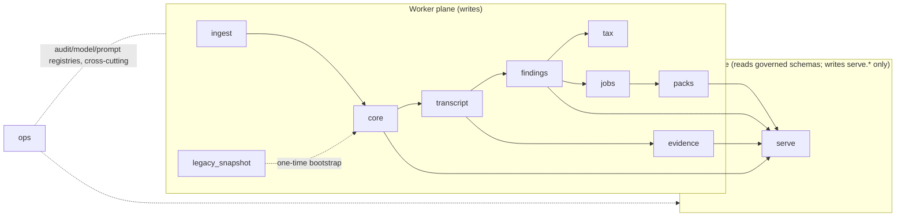

**Write-ownership matrix** (enforced with Postgres roles; doc 16 owns the full grant DDL):

| Role | May write | May read | Never |
|---|---|---|---|
| `nip_worker` (enrichment/jobs/ingest) | `ingest`, `core`, `transcript` (INSERT-only on `turn`), `findings`, `tax`, `jobs`, `packs`, `evidence`, `ops` (append tables) | everything incl. `legacy_snapshot` | UPDATE/DELETE on C6/C7 tables |
| `nip_web` (serving API) | `serve` only (+ one narrow amendment exception: `ops.notification_subscription`, §19.8) | `core`, `transcript`, `findings`, `tax`, `packs`, `evidence`, `jobs` (job status), `ops.model_registry` read-only | any write outside `serve` beyond the §19.8 exception; any read of restricted P3 columns (§15) |
| `nip_migrator` (Alembic) | DDL everywhere | — | run outside deploy pipeline |
| `nip_readonly_bi` | — | masked views only (§15.4) | base tables with P2/P3 |

Table count at launch: **98 tables** across 10 managed schemas (+ `legacy_snapshot` restored verbatim) — **78 before the 2026-08-03 Owner Amendment, 98 after**: the amendment adds 20 tables (migrations 0014/0015), specified in §19. Every table appears in exactly one reference table below. (The pre-amendment count includes four tables owned by sibling documents and absorbed into this census per doc 23 §0.2: `serve.capability_registry` + `serve.capability_paraphrase` — the loaded capability-registry projection and its paraphrase set, DDL in doc 04 §1.3, migration 0009 — and `evidence.custom_collection` + `evidence.custom_collection_unit` — question-scoped retrieval collections, DDL in doc 13 §9.0, migration 0010.)

---

## 2. Domain `ingest` — sources, runs, cursors, raw payloads, DLQ

Doc 05 §1.3 defined this domain's DDL; it is adopted **unchanged** as final (tables: `source_system`, `ingestion_run`, `source_cursor`, `raw_payload`, `dlq_item`, `reconciliation_result`, plus `provider_token_state` from doc 05 §2). Only the ERD and the reference metadata are added here.

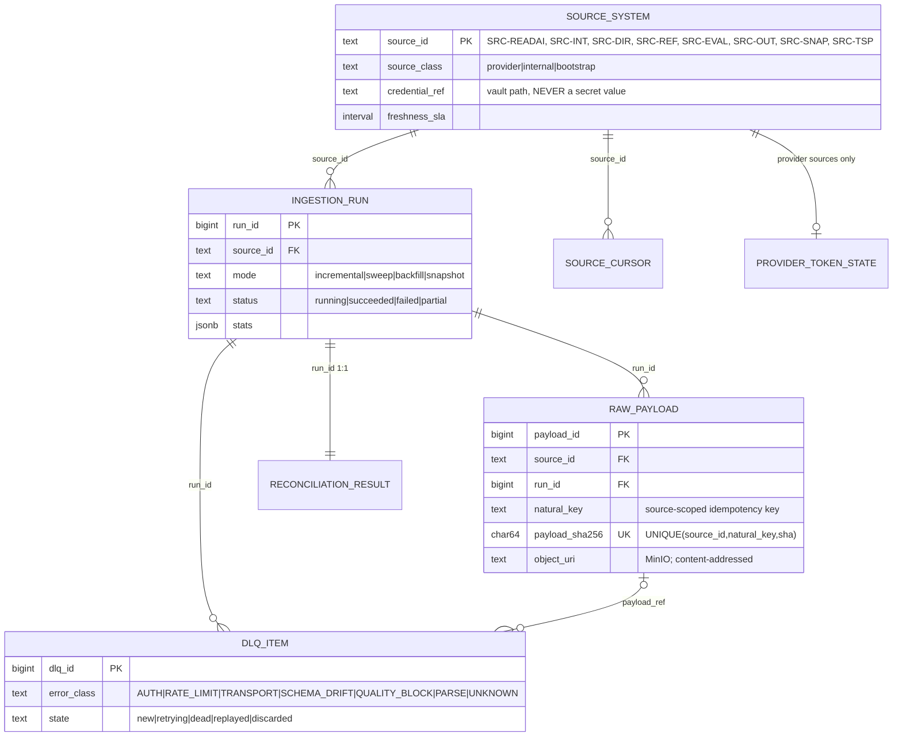

| Table | Purpose | PK | Natural/unique key | FKs (on delete) | Indexes beyond keys | Partition | Rows @bootstrap → +36mo [INFER] |
|---|---|---|---|---|---|---|---|
| `ingest.source_system` | registry of the 8 source contracts | `source_id` | — | — | — | no | 8 → ~12 |
| `ingest.ingestion_run` | one row per adapter execution | `run_id` | — | `source_id` RESTRICT | `(source_id, started_at DESC)` | no | 0 → ~40k (hourly-ish runs) |
| `ingest.source_cursor` | named watermarks per source | `(source_id, cursor_name)` | = PK | `source_id` RESTRICT; `updated_by_run` RESTRICT | — | no | ~16 |
| `ingest.raw_payload` | content-addressed raw archive metadata (bytes in MinIO) | `payload_id` | `(source_id, natural_key, payload_sha256)` | `run_id` RESTRICT | `(source_id, natural_key)`; `(fetched_at)` | no (bytes are external) | 17k → ~120k |
| `ingest.dlq_item` | dead letters + replay state | `dlq_id` | — | `payload_ref` RESTRICT | **partial** `(source_id) WHERE state IN ('new','retrying')` | no | 0 → small |
| `ingest.reconciliation_result` | per-run reconciliation report (JSON-Schema validated) | `run_id` | = PK | `run_id` RESTRICT | — | no | = runs |
| `ingest.provider_token_state` | single-writer OAuth token row (Read.ai) | `provider` | = PK | — | — | no | 1–2 |

PII: `raw_payload` bytes may contain P2/P3 (era-1 titles carry consultant national IDs) — object-storage bucket is the restricted zone; the metadata table itself is P0/P1 [FACT doc 05 §2.9]. Retention of raw payloads: OD-08 (assume 90d for superseded payload versions, latest version retained).

---

## 3. Domain `core` — the `advisory_session` hub, identity, dimensions, facts

The hub is `core.advisory_session` — **not** "meeting". A provider meeting is a *claim* about a session; an internal record is the *authoritative registration* of it; the hub is the reconciled entity both map into [DECISION CORE-BRIEF §6, ADR-0006].

```mermaid
erDiagram
    ADVISORY_SESSION ||--o{ PROVIDER_MEETING_MAP : "0..n provider claims"
    ADVISORY_SESSION ||--o{ INTERNAL_SESSION_MAP : "0..1 internal record"
    CONSULTANT |o--o{ ADVISORY_SESSION : "nullable FK + resolution_status"
    PROGRAMME |o--o{ ADVISORY_SESSION : ""
    SERVICE |o--o{ ADVISORY_SESSION : ""
    CHANNEL |o--o{ ADVISORY_SESSION : ""
    ADVISORY_SESSION ||--o{ PARTICIPANT : ""
    ADVISORY_SESSION ||--o| SESSION_STATUS_FACT : ""
    ADVISORY_SESSION ||--o| ATTENDANCE_FACT : ""
    ADVISORY_SESSION ||--o| FOLLOWUP_FACT : ""
    ADVISORY_SESSION ||--o{ OUTCOME_FACT : ""
    ADVISORY_SESSION ||--o| BENEFICIARY_RATING : "latest-wins view"
    ADVISORY_SESSION ||--o| CONSULTANT_EVALUATION : ""
    ADVISORY_SESSION ||--o| PROVIDER_SESSION_FEATURE : "read_score etc as features"
    ADVISORY_SESSION ||--o| BENEFICIARY_PSEUDONYM : ""
    BENEFICIARY_IDENTITY |o--o{ BENEFICIARY_PSEUDONYM : "restricted linkage OD-15"
    CONSULTANT ||--o{ CONSULTANT_SOURCE_REF : "crosswalk"
    CONSULTANT ||--o{ CONSULTANT_ATTR_HISTORY : "SCD history"
    IDENTITY_RESOLUTION_EVENT }o--|| ADVISORY_SESSION : "provenance (typed refs)"

    ADVISORY_SESSION {
        bigint advisory_session_id PK
        char26 session_uid UK "NIP-minted ULID; citation id"
        date session_date "canonical anchoring date"
        date session_month "generated; partition/period key"
        bigint consultant_id FK "NULLABLE"
        text consultant_resolution "resolved|unresolved|ambiguous|not_expected"
        text window "irshad|istisharat|sharakat"
    }
    PROVIDER_MEETING_MAP {
        bigint provider_meeting_map_id PK
        text provider FK
        text provider_ref UK "Read.ai meeting_ulid; UNIQUE(provider,provider_ref)"
        bigint advisory_session_id FK "NULLABLE until resolved"
        text resolution_status "resolved|unresolved|ambiguous|rejected"
        jsonb title_claims
    }
    INTERNAL_SESSION_MAP {
        bigint internal_session_map_id PK
        text internal_ref UK "Monshaat session id"
        bigint advisory_session_id FK "NULLABLE until resolved"
        text resolution_status
    }
    CONSULTANT {
        bigint consultant_id PK
        text consultant_uid UK "CONS-0001"
        text full_name_ar "P2"
        text status "active|inactive|suspended"
    }
    BENEFICIARY_IDENTITY {
        bigint beneficiary_key PK "RESTRICTED table"
        char64 source_ref_hash UK
        text display_name "P2"
    }
    BENEFICIARY_PSEUDONYM {
        bigint advisory_session_id PK "one per session"
        text pseudonym_label "مستفيد-01"
        bigint beneficiary_key FK "NULLABLE; OD-15"
    }
```

### 3.1 `core.advisory_session` (DDL sketch — load-bearing)

```sql
CREATE TABLE core.advisory_session (
  advisory_session_id   bigint GENERATED ALWAYS AS IDENTITY PRIMARY KEY,
  session_uid           char(26) NOT NULL UNIQUE,           -- ULID; the ONLY externally cited id
  origin                text NOT NULL CHECK (origin IN ('provider_first','internal_first','snapshot')),

  -- canonical period anchor (doc 10 owns the precedence rule: actual_at → provider_start_at → scheduled_at, Asia/Riyadh)
  session_date          date,                               -- NULL only while no source has supplied any date
  session_month         date GENERATED ALWAYS AS
                          (make_date(EXTRACT(YEAR FROM session_date)::int,
                                     EXTRACT(MONTH FROM session_date)::int, 1)) STORED,
  session_date_basis    text CHECK (session_date_basis IN ('actual','provider','scheduled')),

  scheduled_at          timestamptz,                        -- SRC-INT booked time
  actual_at             timestamptz,                        -- SRC-INT held time
  provider_start_at     timestamptz, provider_end_at timestamptz,
  duration_recorded_min integer CHECK (duration_recorded_min >= 0),   -- SRC-INT
  duration_provider_sec integer CHECK (duration_provider_sec >= 0),   -- provider elapsed; NEVER conflated

  window                text CHECK (window IN ('irshad','istisharat','sharakat')),
  programme_id          bigint REFERENCES core.programme ON DELETE RESTRICT,
  service_id            bigint REFERENCES core.service   ON DELETE RESTRICT,
  channel_id            bigint REFERENCES core.channel   ON DELETE RESTRICT,

  -- consultant identity axis: C4 pattern, kills 'PENDING' structurally
  consultant_id         bigint REFERENCES core.consultant ON DELETE RESTRICT,
  consultant_resolution text NOT NULL DEFAULT 'unresolved'
                          CHECK (consultant_resolution IN ('resolved','unresolved','ambiguous','not_expected')),
  CONSTRAINT ck_consultant_axis CHECK ((consultant_id IS NOT NULL) = (consultant_resolution = 'resolved')),

  created_at            timestamptz NOT NULL DEFAULT now(),
  created_by_run        bigint NOT NULL REFERENCES ingest.ingestion_run ON DELETE RESTRICT
);
CREATE INDEX ix_session_month      ON core.advisory_session (session_month);
CREATE INDEX ix_session_consultant ON core.advisory_session (consultant_id, session_month);
CREATE INDEX ix_session_dims       ON core.advisory_session (programme_id, service_id, channel_id);
-- unresolved queue (partial): the working set for the resolver + steward UI
CREATE INDEX ix_session_unresolved_consultant ON core.advisory_session (session_month)
  WHERE consultant_resolution IN ('unresolved','ambiguous');
```

`GROUP BY consultant_id` can no longer mint a fake consultant: unresolved rows have `NULL` and every per-consultant metric's compiler emits the mandatory coverage exclusion `consultant_unresolved` (I8; the legacy `refresh_consultant_registry` minted a consultant literally named PENDING [FACT arch/02 §7.2]).

### 3.2 Crosswalks (DDL sketch — load-bearing)

```sql
CREATE TABLE core.provider_meeting_map (
  provider_meeting_map_id bigint GENERATED ALWAYS AS IDENTITY PRIMARY KEY,
  provider              text NOT NULL REFERENCES transcript.provider_registry ON DELETE RESTRICT,
  provider_ref          text NOT NULL,                      -- Read.ai meeting_ulid / future provider id
  advisory_session_id   bigint REFERENCES core.advisory_session ON DELETE RESTRICT,   -- NULLABLE
  resolution_status     text NOT NULL DEFAULT 'unresolved'
                          CHECK (resolution_status IN ('resolved','unresolved','ambiguous','rejected')),
  CONSTRAINT ck_provider_resolution CHECK ((advisory_session_id IS NOT NULL) = (resolution_status = 'resolved')),
  resolved_at           timestamptz, resolved_by_rule text,  -- 'IR-01'…'IR-07' (doc 09 rule ids)
  resolution_evidence   jsonb,                                -- matched keys, scores, competing candidates
  title_claims          jsonb,                                -- {era, national_id_ref?, uuid_leading?, uuid_trailing?}
  first_seen_run        bigint NOT NULL REFERENCES ingest.ingestion_run ON DELETE RESTRICT,
  UNIQUE (provider, provider_ref)
);
CREATE INDEX ix_pmm_unresolved ON core.provider_meeting_map (provider, first_seen_run)
  WHERE resolution_status <> 'resolved';

CREATE TABLE core.internal_session_map (
  internal_session_map_id bigint GENERATED ALWAYS AS IDENTITY PRIMARY KEY,
  internal_ref          text NOT NULL UNIQUE,               -- Monsha'at internal session id (SRC-INT)
  advisory_session_id   bigint REFERENCES core.advisory_session ON DELETE RESTRICT,
  resolution_status     text NOT NULL DEFAULT 'unresolved'
                          CHECK (resolution_status IN ('resolved','unresolved','ambiguous','rejected')),
  CONSTRAINT ck_internal_resolution CHECK ((advisory_session_id IS NOT NULL) = (resolution_status = 'resolved')),
  resolved_at           timestamptz, resolved_by_rule text, resolution_evidence jsonb,
  first_seen_run        bigint NOT NULL REFERENCES ingest.ingestion_run ON DELETE RESTRICT
);
CREATE UNIQUE INDEX uq_ism_one_resolved_per_session ON core.internal_session_map (advisory_session_id)
  WHERE resolution_status = 'resolved';   -- a session has at most ONE authoritative internal record
```

A session may legitimately hold **several** provider claims (rebase target provider + interim Read.ai) but at most one *active transcript* (§5). It may exist with zero provider claims (booked-but-not-held sessions from SRC-INT — CAP-D4's denominator needs exactly these rows [FACT doc 04 §CAP-D4]).

### 3.3 Consultant dimension (stable hub + attribute history)

```sql
CREATE TABLE core.consultant (
  consultant_id   bigint GENERATED ALWAYS AS IDENTITY PRIMARY KEY,
  consultant_uid  text NOT NULL UNIQUE,                 -- 'CONS-0001'; cited in packs/answers
  full_name_ar    text NOT NULL,                        -- P2
  specialty       text, qualifications text,
  status          text NOT NULL DEFAULT 'active' CHECK (status IN ('active','inactive','suspended')),
  joined_at date, left_at date,
  created_at timestamptz NOT NULL DEFAULT now()
);
CREATE TABLE core.consultant_source_ref (                -- crosswalk: every external id the consultant has
  consultant_id  bigint NOT NULL REFERENCES core.consultant ON DELETE RESTRICT,
  source_id      text NOT NULL REFERENCES ingest.source_system ON DELETE RESTRICT,
  source_ref     text NOT NULL,                          -- restricted column when national-id-based [ASSUME OD-14]
  ref_kind       text NOT NULL CHECK (ref_kind IN ('directory_id','national_id','email','legacy_consultant_id')),
  valid_from     date NOT NULL DEFAULT CURRENT_DATE, valid_to date,
  PRIMARY KEY (source_id, source_ref)
);
CREATE TABLE core.consultant_attr_history (              -- satisfies doc 05's SCD-2 requirement with stable FKs
  consultant_id bigint NOT NULL REFERENCES core.consultant ON DELETE RESTRICT,
  attr          text NOT NULL CHECK (attr IN ('status','specialty','full_name_ar')),
  old_value text, new_value text,
  changed_at    timestamptz NOT NULL, changed_by_run bigint REFERENCES ingest.ingestion_run,
  PRIMARY KEY (consultant_id, attr, changed_at)
);
```

[REC] Stable-hub + history over classic SCD-2 versioned rows: every fact FKs one stable `consultant_id` (no as-of join needed on the hot path); CAP-D5's tenure denominators read the history table. Alternative (SCD-2 rows with `consultant_key`/`valid_from`): rejected because every one of the ~30 fact/finding tables would need as-of resolution. Revisit trigger: a requirement to reproduce *dimensional attributes* as-of a past pack date beyond status/specialty — packs already freeze what they showed, so none is foreseen.

Legacy's three disagreeing consultant tables (39 / 446 / 894 rows) collapse into this one dimension at bootstrap; the 894-row directory is the seed population [FACT arch/02 §4].

### 3.4 Beneficiary identity boundary

```sql
CREATE TABLE core.beneficiary_identity (      -- THE ONLY table outside ingest staging allowed to hold beneficiary P3
  beneficiary_key   bigint GENERATED ALWAYS AS IDENTITY PRIMARY KEY,
  source_ref_hash   char(64) NOT NULL UNIQUE,  -- sha256(national_id) — linkage key without storing the id by default
  national_id       text,                      -- P3; NULL unless OD-15 approves retention; column-level grant: steward break-glass only
  display_name      text,                      -- P2
  created_at timestamptz NOT NULL DEFAULT now()
);
CREATE TABLE core.beneficiary_pseudonym (
  advisory_session_id bigint PRIMARY KEY REFERENCES core.advisory_session ON DELETE RESTRICT,
  pseudonym_label     text NOT NULL,           -- 'مستفيد-01' … stable placeholder used in ALL prompts/answers (I15)
  beneficiary_key     bigint REFERENCES core.beneficiary_identity ON DELETE RESTRICT,   -- NULLABLE
  resolution_status   text NOT NULL DEFAULT 'unresolved'
                        CHECK (resolution_status IN ('resolved','unresolved','not_expected')),
  CONSTRAINT ck_benef_axis CHECK ((beneficiary_key IS NOT NULL) = (resolution_status = 'resolved'))
);
```

Findings, evidence, serve, packs never reference `beneficiary_identity` — they see only `pseudonym_label` (§15). Whether `beneficiary_key` may link the *same person across sessions* (repeat-beneficiary analytics) is **OD-15 (new)**: safe assumption **no cross-session linkage at launch** — `beneficiary_key` stays NULL, hash retained in staging only; impact: "repeat beneficiary" questions answer `DIMENSION_NOT_AVAILABLE` honestly (I5) until the owner approves hash-based linkage.

### 3.5 `core` reference table

| Table | Purpose | PK | Natural/unique key | FKs (on delete) | Critical CHECKs | Partition | Rows @bootstrap → +36mo |
|---|---|---|---|---|---|---|---|
| `advisory_session` | canonical session hub | `advisory_session_id` | `session_uid` | consultant/programme/service/channel RESTRICT | `ck_consultant_axis`; window enum; durations ≥0 | no (53k rows in 3y — pointless) | 16,911 [FACT CORE-BRIEF §11] → ~53k |
| `provider_meeting_map` | provider claims → hub | surrogate | `(provider, provider_ref)` | session RESTRICT | `ck_provider_resolution` | no | 16,911 → ~55k (+rebase provider rows) |
| `internal_session_map` | internal records → hub | surrogate | `internal_ref`; partial-unique resolved-per-session | session RESTRICT | `ck_internal_resolution` | no | ~15k matched of 94,963 report rows staged [FACT CORE-BRIEF §11] → grows with SRC-INT feed |
| `consultant` | consultant dimension | `consultant_id` | `consultant_uid` | — | status enum | no | ~900 → ~1.5k |
| `consultant_source_ref` | id crosswalk | `(source_id, source_ref)` | = PK | consultant RESTRICT | ref_kind enum | no | ~1k |
| `consultant_attr_history` | SCD history | composite | = PK | consultant RESTRICT | attr enum | no | small |
| `programme` / `service` / `channel` | reference dims (SRC-REF) | surrogate each | `code` UNIQUE each | — | — | no | 10² each; `service.service_category` = the 48-value dimension, 77.3% populated [FACT CORE-BRIEF §11] |
| `participant` | attendees incl. speaking stats | `participant_id` | `(advisory_session_id, source, ordinal)` | session RESTRICT; matched_consultant_id RESTRICT | role_claim enum; `speaking_ms` is **interval-merged** by the writer (silence-overlap bug pin, CORE-BRIEF §12) | no | 35,320 → ~110k |
| `session_status_fact` | «الحالة» workflow outcome | `advisory_session_id` | = PK | session RESTRICT | status via `core.status_code` lookup (SRC-INT mapping table, doc 05 §4) | no | 1:1 with matched sessions |
| `attendance_fact` | who attended (internal truth) | `advisory_session_id` | = PK | session RESTRICT | attendance enum lookup | no | 1:1 |
| `followup_fact` | follow-up requirement + closure | `advisory_session_id` | = PK | session RESTRICT | — | no | 1:1 |
| `outcome_fact` | outcomes/completions (SRC-OUT) | surrogate | `(advisory_session_id, outcome_ref)` | session RESTRICT | outcome_type seeded lookup (R-P1) | no | 0 → unknown (OD-07) |
| `beneficiary_rating` | «تقييم المستفيد» 1–5 + comments | surrogate | `(advisory_session_id, source_row_sha)` — append-only; serving view takes latest `rated_at` | session RESTRICT | `score BETWEEN 1 AND 5` | no | ~24,171 staged [FACT CORE-BRIEF §11] → ~70k |
| `consultant_evaluation` | consultant's own evaluation + notes | surrogate | `(advisory_session_id, source_row_sha)` | session RESTRICT | score bounds | no | subset of sessions |
| `beneficiary_identity` | restricted P2/P3 identity | `beneficiary_key` | `source_ref_hash` | — | — | no | 0 at launch (OD-15) |
| `beneficiary_pseudonym` | per-session placeholder | `advisory_session_id` | = PK | session RESTRICT | `ck_benef_axis` | no | 1:1 |
| `provider_session_feature` | provider metrics as **source features** (read_score, sentiment, engagement — never satisfaction truth) | `advisory_session_id` | = PK | session RESTRICT | — | no | 16,911 → ~53k |
| `identity_resolution_event` | append-only resolution provenance (§4) | `event_id` | — | typed refs RESTRICT | subject_kind enum | no | ~40k → ~200k |

---

## 4. Identity resolution model — how `'PENDING'` becomes unrepresentable

Four structural pieces replace the magic string [DECISION ADR-0006; the defect: arch/02 §7.2]:

1. **Nullable FK + status + CHECK** on every identity axis (`ck_consultant_axis`, `ck_provider_resolution`, `ck_internal_resolution`, `ck_benef_axis`). The database cannot hold "resolved with no target" or "unresolved with a target". There is no sentinel row, no sentinel string, and a `NOT NULL` promotion is never needed.
2. **Append-only provenance** — every transition writes a row; nothing overwrites the story of *how* an identity was decided:

```sql
CREATE TABLE core.identity_resolution_event (
  event_id      bigint GENERATED ALWAYS AS IDENTITY PRIMARY KEY,
  subject_kind  text NOT NULL CHECK (subject_kind IN
                  ('provider_meeting','internal_session','session_consultant','participant','beneficiary')),
  -- typed references: exactly one set (no polymorphic untyped pointer — the v2_validation_log lesson, arch/02 §3)
  provider_meeting_map_id bigint REFERENCES core.provider_meeting_map ON DELETE RESTRICT,
  internal_session_map_id bigint REFERENCES core.internal_session_map ON DELETE RESTRICT,
  advisory_session_id     bigint REFERENCES core.advisory_session     ON DELETE RESTRICT,
  participant_id          bigint REFERENCES core.participant          ON DELETE RESTRICT,
  CONSTRAINT ck_exactly_one_subject CHECK (
    (provider_meeting_map_id IS NOT NULL)::int + (internal_session_map_id IS NOT NULL)::int
    + (participant_id IS NOT NULL)::int
    + ((advisory_session_id IS NOT NULL AND subject_kind IN ('session_consultant','beneficiary'))::int) = 1),
  from_status   text NOT NULL, to_status text NOT NULL,
  rule_id       text NOT NULL,              -- 'IR-01' deterministic uuid join … 'IR-06' fuzzy name (doc 09 owns rules)
  evidence      jsonb NOT NULL,             -- keys compared, scores, rejected candidates
  decided_by    text NOT NULL,              -- 'resolver:v1' | 'steward:<user>'
  decided_at    timestamptz NOT NULL DEFAULT now()
);
```

3. **Unresolved queues are partial indexes + views**, not states someone remembers to poll: `core.v_unresolved_provider_meetings`, `core.v_unresolved_internal_sessions`, `core.v_sessions_without_consultant`, `core.v_ambiguous_all` — each a `SELECT … WHERE resolution_status <> 'resolved'` ordered by age, powering the steward screen (doc 18) and the reconciliation KPIs (doc 09). The legacy equivalent was a magic-string scan nobody owned.
4. **Coverage integration** (I8): the metric compiler (doc 11) reads the same statuses to emit exclusions — e.g. CAP-D5 over 2026-06 declares `matched=1401, used=1258, exclusions=[{consultant_unresolved:143}]` instead of silently shrinking the denominator.

**Worked example (bootstrap reality).** Legacy meeting `01HFYH0A6JM4R7MZ2E6X5T9BNP`, era-2 title, no services-report match — legacy row says `consultant_id='PENDING'`. After migration: `advisory_session(session_uid='01JGN0V9WQZ2Y4X8C6B3A1MKRT', consultant_id=NULL, consultant_resolution='unresolved')`; `provider_meeting_map(provider='readai', provider_ref='01HFYH0A6JM4R7MZ2E6X5T9BNP', resolution_status='resolved', resolved_by_rule='IR-00-bootstrap')`; one `identity_resolution_event(subject_kind='session_consultant', from_status='unresolved', to_status='unresolved', rule_id='IR-00-bootstrap', evidence={"legacy_value":"PENDING"})`. When the SRC-INT feed later matches the internal record and its `consultant_ref`, the resolver sets the FK, flips the status, and appends a second event with `rule_id='IR-02-internal-ref'` — the 9.6% unresolved cohort becomes a *measured, shrinking queue* instead of an invisible exclusion [FACT arch/02 §7.2].

---

## 5. Domain `transcript` — sources, versions, turns, active pointer

Doc 06 §2.3's DDL is adopted as final with two amendments: `ingest.run` → `ingest.ingestion_run` (§0.3), and `raw_payload_ref` becomes `raw_payload_id bigint REFERENCES ingest.raw_payload ON DELETE RESTRICT` (a real FK instead of a bare URI). Tables: `provider_registry`, `transcript_source`, `turn`, `active_transcript`, `source_quality`, `rebase_operation`, `rebase_item`, `glossary_term`, `glossary_application_log` (glossary = display-only rendering aid; never touches stored text [DECISION doc 06 §7; ADR-0007]).

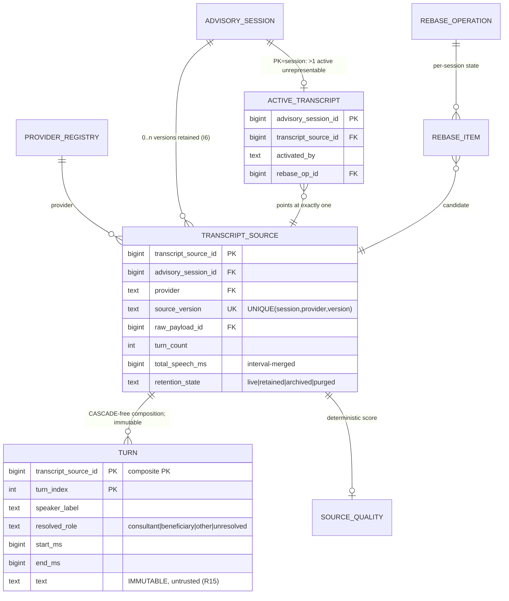

Key constraints already fixed by doc 06 and confirmed here: composite PK `(transcript_source_id, turn_index)`; `CHECK (end_ms >= start_ms)`; `resolved_role` CHECK with honest `'unresolved'` (5.7% of legacy turns lack a role — never defaulted [FACT CORE-BRIEF §11]); workers get INSERT+SELECT only on `turn` (I6 pin). `ON DELETE` for `turn → transcript_source` is **RESTRICT** even though it is a composition: turns are removed only by the governed archival procedure (`retention_state='archived'` first exports checksummed bundles to MinIO, then deletes turns in the same transaction that flips state to `'purged'` — OD-08 window, default 90d after rebase supersession).

| Table | Purpose | PK | Natural/unique key | FKs (on delete) | Partition | Rows @bootstrap → +36mo |
|---|---|---|---|---|---|---|
| `provider_registry` | known providers + adapter status | `provider` | — | — | no | 3 → ~5 |
| `transcript_source` | one acquired (session, provider, version) | surrogate | `(advisory_session_id, provider, source_version)` | session/provider/payload/run RESTRICT | no | 16,911 → ~60k live+retained (a full provider swap adds 1/session; old rows archive per OD-08) |
| `turn` | immutable speaker-labelled turns | `(transcript_source_id, turn_index)` | = PK | source RESTRICT | **no** — 399,501 → ~1.4M active; below partition threshold (§16.2); revisit at >10M | 399,501 [FACT CORE-BRIEF §11] |
| `active_transcript` | THE single active pointer | `advisory_session_id` | = PK | source RESTRICT; rebase_op RESTRICT | no | 1:1 with transcribed sessions |
| `source_quality` | deterministic quality composite + tier | `transcript_source_id` | = PK | source RESTRICT | no | 1:1 with sources |
| `rebase_operation` / `rebase_item` | audited rebase state machine (doc 06 §4) | surrogate / `(rebase_op_id, advisory_session_id)` | — | RESTRICT all | no | rare / per-session per op |
| `glossary_term` / `glossary_application_log` | display-layer glossary + render audit | surrogate | `normalized_term` | — | no | 10²–10³ |

---

## 6. Domain `findings` — extraction runs, findings, quotes, validation, clusters

The CORE-BRIEF binding sentence — *"Every finding: (taxonomy_id, category_id, taxonomy_version NOT NULL, extraction_run_id, model_id, prompt_sha, transcript_source, source_version, quote, turn_index, validation_status)"* — is satisfied in **normalized** form: `model_id`/`prompt_sha`/`schema_sha`/`code_version` live once on `extraction_run`; `provider`/`source_version` live once on `transcript_source`; quotes live in `quote_ref` (a finding may carry several). The flattened contract is exposed as view `findings.v_finding_full`, and a structural test asserts the view exposes every column of the binding sentence [DECISION — normalization prevents the write-twice drift that made legacy shadow columns lie; the *contract* is the view].

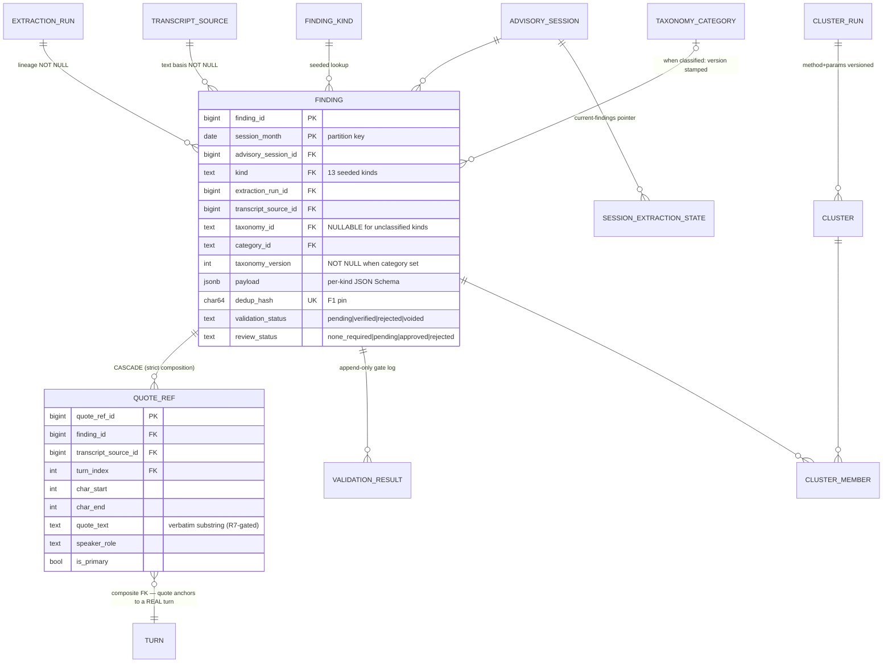

### 6.1 DDL sketches (load-bearing)

```sql
CREATE TABLE findings.extraction_run (
  extraction_run_id bigint GENERATED ALWAYS AS IDENTITY PRIMARY KEY,
  run_kind      text NOT NULL CHECK (run_kind IN
                  ('corpus_extraction','rebase_reextraction','taxonomy_reclassification','backfill')),
  extractor_id  text NOT NULL,                    -- 'session_core_v1' | 'violations_v2' … (registry-governed, I12)
  model_id      text NOT NULL, model_role text NOT NULL,
  FOREIGN KEY (model_id, model_role) REFERENCES ops.model_registry ON DELETE RESTRICT,
  prompt_sha    char(64) NOT NULL REFERENCES ops.prompt_registry ON DELETE RESTRICT,
  schema_sha    char(64) NOT NULL,                -- JSON Schema of the extraction output
  code_version  text NOT NULL,                    -- git SHA baked at build (MASTER_PROMPT §4.3)
  taxonomy_stamp jsonb NOT NULL DEFAULT '{}',     -- {"violations":6,"challenges":3} versions used
  scope         jsonb NOT NULL,                   -- {"months":["2026-04-01"),...} | {"session_uids":[...]}
  corpus_snapshot_id text REFERENCES jobs.corpus_snapshot ON DELETE RESTRICT,
  started_at timestamptz NOT NULL, finished_at timestamptz,
  status text NOT NULL CHECK (status IN ('running','complete','incomplete','failed','superseded')),
  stats jsonb NOT NULL DEFAULT '{}'               -- sessions done/failed, findings kept/dropped, spend
);

CREATE TABLE findings.finding (
  finding_id          bigint GENERATED ALWAYS AS IDENTITY,
  session_month       date NOT NULL,              -- copied from advisory_session by the writer; partition key
  advisory_session_id bigint NOT NULL REFERENCES core.advisory_session ON DELETE RESTRICT,
  kind                text   NOT NULL REFERENCES findings.finding_kind ON DELETE RESTRICT,
  extraction_run_id   bigint NOT NULL REFERENCES findings.extraction_run ON DELETE RESTRICT,
  transcript_source_id bigint NOT NULL REFERENCES transcript.transcript_source ON DELETE RESTRICT,
  taxonomy_id         text REFERENCES tax.taxonomy ON DELETE RESTRICT,
  category_id         text REFERENCES tax.taxonomy_category ON DELETE RESTRICT,
  taxonomy_version    integer,
  CONSTRAINT ck_taxonomy_stamp CHECK (                    -- I13: classified ⇒ fully stamped
    (category_id IS NULL AND taxonomy_id IS NULL AND taxonomy_version IS NULL)
    OR (category_id IS NOT NULL AND taxonomy_id IS NOT NULL AND taxonomy_version IS NOT NULL)),
  payload             jsonb NOT NULL,             -- per-kind schema (e.g. challenge: {symptoms, stated_cause, actual_ask})
  confidence          real CHECK (confidence BETWEEN 0 AND 1),
  dedup_hash          char(64) NOT NULL,          -- sha256(kind|session|canonical payload|category)
  validation_status   text NOT NULL DEFAULT 'pending'
                        CHECK (validation_status IN ('pending','verified','rejected','voided')),
  review_status       text NOT NULL DEFAULT 'none_required'
                        CHECK (review_status IN ('none_required','pending','approved','rejected')),
  created_at          timestamptz NOT NULL DEFAULT now(),
  PRIMARY KEY (finding_id, session_month),
  UNIQUE (extraction_run_id, dedup_hash, session_month)   -- the F1 duplicate-rows pin
) PARTITION BY RANGE (session_month);
-- monthly partitions findings.finding_2025_05 …; default partition findings.finding_default alarms on rows>0
CREATE INDEX ix_finding_serving ON findings.finding (kind, session_month, validation_status)
  INCLUDE (advisory_session_id, category_id, taxonomy_version);
CREATE INDEX ix_finding_category ON findings.finding (category_id, taxonomy_version, session_month)
  WHERE validation_status = 'verified';                   -- partial: live-view recounts touch only verified
CREATE INDEX ix_finding_session ON findings.finding (advisory_session_id);

CREATE TABLE findings.quote_ref (
  quote_ref_id   bigint GENERATED ALWAYS AS IDENTITY PRIMARY KEY,
  finding_id     bigint NOT NULL, session_month date NOT NULL,
  FOREIGN KEY (finding_id, session_month) REFERENCES findings.finding ON DELETE CASCADE,
  transcript_source_id bigint NOT NULL, turn_index integer NOT NULL,
  FOREIGN KEY (transcript_source_id, turn_index) REFERENCES transcript.turn ON DELETE RESTRICT,
  char_start integer NOT NULL CHECK (char_start >= 0),
  char_end   integer NOT NULL, CHECK (char_end > char_start),
  quote_text text NOT NULL,                        -- R7 gate verifies verbatim-substring before validation_status='verified'
  speaker_role text NOT NULL,
  is_primary  boolean NOT NULL DEFAULT false
);
CREATE UNIQUE INDEX uq_quote_primary ON findings.quote_ref (finding_id, session_month) WHERE is_primary;

CREATE TABLE findings.validation_result (          -- append-only gate log (C6)
  finding_id bigint NOT NULL, session_month date NOT NULL,
  FOREIGN KEY (finding_id, session_month) REFERENCES findings.finding ON DELETE RESTRICT,
  gate       text NOT NULL CHECK (gate IN ('schema','quote_substring','enum_membership','llm_validation','human_review')),
  status     text NOT NULL CHECK (status IN ('pass','fail','override')),
  detail     jsonb NOT NULL DEFAULT '{}',
  validator_version text NOT NULL,
  validated_at timestamptz NOT NULL DEFAULT now(),
  PRIMARY KEY (finding_id, session_month, gate, validated_at)
);

CREATE TABLE findings.session_extraction_state (   -- current-findings pointer, mirrors transcript.active_transcript
  advisory_session_id bigint NOT NULL REFERENCES core.advisory_session ON DELETE RESTRICT,
  extractor_id        text NOT NULL,
  extraction_run_id   bigint NOT NULL REFERENCES findings.extraction_run ON DELETE RESTRICT,
  transcript_source_id bigint NOT NULL REFERENCES transcript.transcript_source ON DELETE RESTRICT,
  updated_at          timestamptz NOT NULL DEFAULT now(),
  PRIMARY KEY (advisory_session_id, extractor_id)
);
```

**Serving reads join through `session_extraction_state`** exactly as transcript reads join through `active_transcript`: a re-extraction writes its findings, passes gates, then flips the pointer transactionally — old findings stay queryable for audit but leave every aggregate at the same instant. This kills the legacy mixed-basis corpus (extractions against a moving blend of raw/corrected text, unrecorded — arch/02 §12) *and* gives rebase step 7 (doc 06 §4.2 FLIPPING) its atomic unit.

### 6.2 Finding kinds (seeded lookup `findings.finding_kind`)

13 kinds are the doc 04 vocabulary [FACT doc 04 source tables]; +4 carried from GREENFIELD §8.3's list. Adding a kind = a migration + registry entry (I12); the lookup row carries `payload_schema_ref` (JSON Schema id) and `taxonomy_id` (nullable — which taxonomy classifies this kind, if any).

**This table is the normative payload contract.** The strict JSON Schemas in `schemas/extract_<kind>_v1.json` (doc 23 §9) are generated field-for-field from it — every field listed is `required` (null-union for optionality), every enum here is closed (I2), and no schema may carry a field or enum member absent from this table without a migration bumping `payload_schema_ref`. Common fields on every kind (not repeated per row): `quote` (verbatim, R7-gated), `turn_index`, `speaker_role(consultant/beneficiary/unknown)`, `confidence` (triage-only, never a gate — I18).

| kind | taxonomy | payload fields (normative; enums closed) |
|---|---|---|
| `challenge` | CHAL | `challenge_text:str · severity(low/medium/high) · symptoms[]:str · stated_cause:str|null · actual_ask:str|null` (CAP-C2 fields; empty in legacy for 0/67,082 rows — OD-05) |
| `violation` | VIOL | `violation_class(behavioral/technical) · severity(potential/confirmed) · detection_indicator(unprofessional_tone/misleading_claim/unverified_as_fact/sarcasm/self_promotion/other)` — quote mandatory via CAP-B4 gate |
| `satisfaction_signal` | SAT | `polarity(positive/negative/neutral) · aspect:str|null (سياق مقيِّد) · intensity(strong/moderate/weak) · explicitness(explicit/implicit)` — doc 14 §4.1's worked schema uses exactly these names |
| `pressure_signal` | — (axis in payload) | `pressure_class(urgency/confusion/frustration/distress/other)` [REC doc 04 §5.7] |
| `decision_point` | DEC | `decision_topic:str · maker(consultant/beneficiary/both) · resolved:bool` |
| `impact_pattern` | IMP | `pattern_ref:IMP-id · direction(high/low) · position_zone(opening/body/closing_15pct)` |
| `confusion_marker` | — | `position(final_20pct_or_5turns/elsewhere) · marker_family(incomprehension/what_next/still_unclear/inverted_positive) · negated:bool` (the E.2 negation-pair rule: «صار واضح» inverts) |
| `step_clarity` | — | `clarity(clear/partial/none) · steps[]:{text:str, actor(consultant/beneficiary/joint), ordinal:int|null}` |
| `time_loss_span` | — | `span_start_ms:int · span_end_ms:int · loss_class(repeated_explanation/long_non_speech/admin_digression/tool_fumbling/unresolved_tangent)` — same closed enum as `curated_analysis.args.loss_class` (doc 12 §5.3) |
| `government_mention` | — (→ `tax.entity`) | `entity_id:ENT-id|null · raw_mention:str · is_friction:bool · problem_category_id:CHAL-id|null` |
| `beneficiary_question` | — (→ QST clusters) | `question_text:str · answered:bool · answer_turn_index:int|null` |
| `action_item` | — | `item_text:str · assignee_role(consultant/beneficiary/joint/unassigned) · is_clear:bool` |
| `followup_requirement` | — | `requirement_text:str · due_hint:str|null` |
| `topic` / `recommendation` / `automation_opportunity` / `risk_signal` | — | `label:str · detail:str|null` (+ `target(consultant/beneficiary)` on recommendation; `estimated_impact(low/medium/high)` on automation_opportunity; `severity(low/medium/high)` on risk_signal) — carried from GREENFIELD §8.3; same envelope |

| Table | Purpose | PK | Natural/unique key | FKs (on delete) | Partition | Rows @bootstrap → +36mo |
|---|---|---|---|---|---|---|
| `extraction_run` | batch lineage anchor | surrogate | — | model/prompt/snapshot RESTRICT | no | 10¹ → 10³ |
| `finding` | one extracted signal | `(finding_id, session_month)` | `(extraction_run_id, dedup_hash, session_month)` | all RESTRICT | **RANGE monthly** | first full extraction ~500k [INFER: legacy 409k + new kinds]; ~2.5M after 3y incl. superseded generations |
| `quote_ref` | verbatim anchors | surrogate | partial-unique primary per finding | finding CASCADE; turn RESTRICT | no (FK-local to partitioned parent via composite) | ~1.1× findings |
| `validation_result` | append-only gate log | composite | = PK | finding RESTRICT | no | ~2× findings |
| `finding_kind` | seeded kind registry | `kind` | — | taxonomy RESTRICT | no | 17 |
| `cluster_run` | clustering execution (method, params_sha, embedding model) | surrogate | — | model RESTRICT | no | 10²/y |
| `cluster` | canonical semantic cluster (QST/DEC/CHAL namespaces) | `cluster_id` text | `CHECK (cluster_id ~ '^(QST|DEC|CHAL)-[0-9]{3,5}$')` | cluster_run RESTRICT | no | 10²–10³ |
| `cluster_member` | finding↔cluster with similarity | `(cluster_id, finding_id, session_month)` | — | cluster RESTRICT; finding RESTRICT | no | ~1× question/decision findings |
| `session_extraction_state` | current-findings pointer | `(advisory_session_id, extractor_id)` | = PK | RESTRICT | no | sessions × ~3 extractors |

Cluster canonical labels follow the R-P2 loop: `cluster.canonical_label_ar` is writable only through the review workflow (§12.3), status `proposed → approved`; CAP-B3/C6/C8 read approved labels only [DECISION ADR-0012].

---

## 7. Domain `tax` — taxonomy quartet, entities, proposals

MASTER_PROMPT §4.3 "Storage (normative)" is adopted **verbatim** as the core quartet, schema-qualified into `tax` and with the prefix set widened to the CORE-BRIEF list [DECISION MASTER_PROMPT §4.3; CORE-BRIEF §5]:

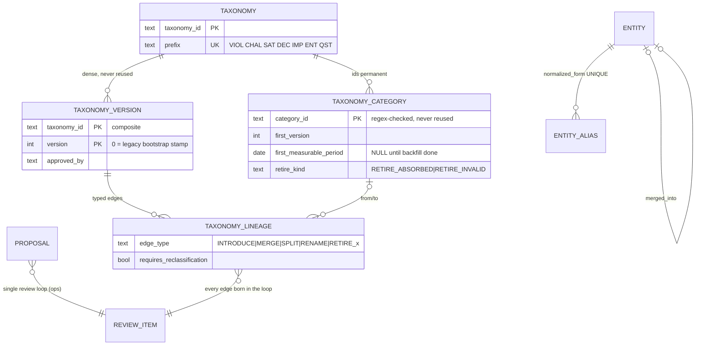

```sql
CREATE TABLE tax.taxonomy (
  taxonomy_id text PRIMARY KEY,                          -- 'violations','challenges','satisfaction','decisions','impact_patterns'
  prefix      text NOT NULL UNIQUE CHECK (prefix IN ('VIOL','CHAL','SAT','DEC','IMP','ENT','QST')),
  display_ar  text NOT NULL
);
CREATE TABLE tax.taxonomy_version (
  taxonomy_id  text NOT NULL REFERENCES tax.taxonomy ON DELETE RESTRICT,
  version      integer NOT NULL CHECK (version >= 0),   -- 0 = pre-taxonomy legacy stamp (bootstrap crosswalk)
  published_at timestamptz NOT NULL,
  approved_by  text NOT NULL,
  note         text,
  PRIMARY KEY (taxonomy_id, version)                    -- dense, never reused
);
CREATE TABLE tax.taxonomy_category (
  category_id  text PRIMARY KEY CHECK (category_id ~ '^[A-Z]{3,5}-[0-9]{3}$'),  -- permanent, never reused
  taxonomy_id  text NOT NULL REFERENCES tax.taxonomy ON DELETE RESTRICT,
  first_version integer NOT NULL,
  first_measurable_period date,                         -- NULL until backfill reclassification completes (§4.3 mechanic 7)
  retired_version integer, retire_kind text CHECK (retire_kind IN ('RETIRE_ABSORBED','RETIRE_INVALID')),
  display_ar   text NOT NULL,                           -- free to change; the id is the identity (mechanic 1)
  definition_ar text NOT NULL
);
CREATE TABLE tax.taxonomy_lineage (
  taxonomy_id text NOT NULL, version integer NOT NULL,
  FOREIGN KEY (taxonomy_id, version) REFERENCES tax.taxonomy_version ON DELETE RESTRICT,
  edge_type   text NOT NULL CHECK (edge_type IN
                ('INTRODUCE','MERGE','SPLIT','RENAME','RETIRE_ABSORBED','RETIRE_INVALID')),
  from_category_id text REFERENCES tax.taxonomy_category ON DELETE RESTRICT,
  to_category_id   text REFERENCES tax.taxonomy_category ON DELETE RESTRICT,
  requires_reclassification boolean NOT NULL,
  decided_by  text NOT NULL, decided_at timestamptz NOT NULL,
  review_item_id bigint NOT NULL REFERENCES ops.review_item ON DELETE RESTRICT   -- §12.3: every edge born in the loop
);
```

`ENT` and `QST` are **id namespaces sharing the prefix registry and the review loop, not findings-classifying taxonomies**: their member tables are `tax.entity` and `findings.cluster` respectively; the five findings-classifying taxonomies ship at version 1 with curated seeds (VIOL-001…008 with the owner's exact Arabic wording [DECISION GREENFIELD §5-B4]).

```sql
CREATE TABLE tax.entity (
  entity_id   text PRIMARY KEY CHECK (entity_id ~ '^ENT-[0-9]{3,4}$'),
  kind        text NOT NULL DEFAULT 'government_entity' CHECK (kind IN ('government_entity')),
  display_ar  text NOT NULL, official_name_ar text,
  status      text NOT NULL DEFAULT 'active' CHECK (status IN ('active','merged','retired')),
  merged_into text REFERENCES tax.entity ON DELETE RESTRICT,
  CONSTRAINT ck_merge CHECK ((status = 'merged') = (merged_into IS NOT NULL))
);
CREATE TABLE tax.entity_alias (
  alias_id    bigint GENERATED ALWAYS AS IDENTITY PRIMARY KEY,
  entity_id   text NOT NULL REFERENCES tax.entity ON DELETE RESTRICT,
  alias_text  text NOT NULL,
  normalized_form text NOT NULL UNIQUE,          -- one normalized surface form points to ONE entity
  source      text NOT NULL CHECK (source IN ('seed','discovered','approved')),
  approved_review_item_id bigint REFERENCES ops.review_item ON DELETE RESTRICT
);
CREATE TABLE tax.proposal (                       -- discovery queue rows for R-P1 (categories, entities, aliases, labels)
  proposal_id  bigint GENERATED ALWAYS AS IDENTITY PRIMARY KEY,
  target_kind  text NOT NULL CHECK (target_kind IN ('category','lineage_edge','entity','entity_alias','cluster_label')),
  payload      jsonb NOT NULL,                    -- candidate definition + supporting finding ids + counts
  proposed_by  text NOT NULL,                     -- 'discovery:<run>' | 'user:<id>'
  status       text NOT NULL DEFAULT 'open' CHECK (status IN ('open','approved','rejected','withdrawn')),
  review_item_id bigint REFERENCES ops.review_item ON DELETE RESTRICT,
  created_at   timestamptz NOT NULL DEFAULT now()
);
```

Baseline for entity resolution: 4,372 distinct raw government-entity strings across 21,561 mentions [FACT CORE-BRIEF §11] — the alias table is how that collapses to ~10² canonical entities with every collapse decision audited.

| Table | PK | Volume | Notes |
|---|---|---|---|
| `taxonomy` | `taxonomy_id` | 7 rows | five classifying + ENT + QST namespace rows |
| `taxonomy_version` | composite | 10¹–10² | dense per taxonomy |
| `taxonomy_category` | `category_id` | 10²–10³ | ids permanent; VIOL-001…008 seeded |
| `taxonomy_lineage` | rowid + composite FK | 10²–10³ | every edge cites its review item |
| `entity` / `entity_alias` | text / surrogate | ~10² / ~5k | alias uniqueness on normalized form |
| `proposal` | surrogate | ~10³/yr | partial index `WHERE status='open'` |

---

## 8. Domain `serve` — conversations, tool calls, answers, verifier results, exports

The serving plane's own write space (I1). Everything here is *about* an answer, never a source of one; every number in an answer artifact echoes a tool envelope (I3, R6).

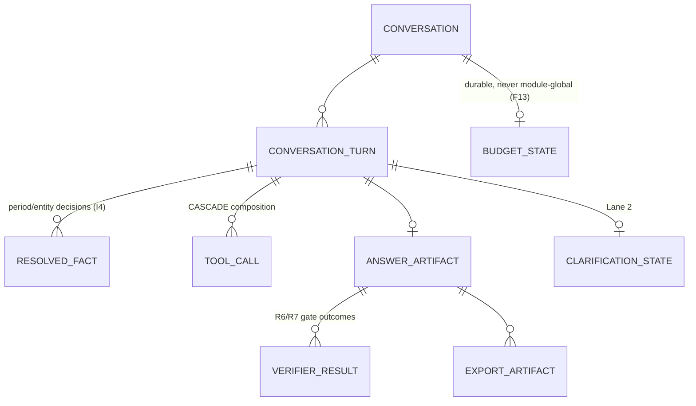

| Table | Purpose | PK | Key fields / constraints | FKs (on delete) | Partition | Volume [INFER 100–300 turns/day] |
|---|---|---|---|---|---|---|
| `conversation` | one user thread | surrogate | `user_sub` (OIDC subject), `channel`, `started_at` | — | no | ~100k/3y |
| `conversation_turn` | one Q→A exchange | surrogate | `(conversation_id, seq)` UNIQUE; `lane CHECK (lane IN ('0','1','2','3'))`; `capability_id` text (registry-validated in app layer, mirrored check vs `ops.registry_snapshot`); `reason_code` CHECK against the 16-code closed enum (CORE-BRIEF §4) | conversation RESTRICT | no | ~250k/3y |
| `resolved_fact` | deterministic pre-model resolutions | `(turn_id, fact_kind)` | `fact_kind CHECK IN ('period','entity','view','followup_ref')`; payload jsonb carries `PeriodResolution{status,period,matched_span}` — the I4 explicit period decision, stored | turn CASCADE | no | ~2×turns |
| `tool_call` | every toolbelt invocation | surrogate | `(turn_id, step_no)` UNIQUE; `spec` jsonb + `spec_sha`; `envelope` jsonb (the §5.2 result envelope verbatim, incl. `provenance.sql_fingerprint`, `coverage`, `period`, `taxonomy`); `status CHECK IN ('ok','failed','rejected')` | turn CASCADE | **RANGE monthly on `called_at`** (largest serve table) | ~1M/3y |
| `answer_artifact` | the structured answer (I11) | surrogate | `envelope` jsonb NOT NULL (typed HandlerResult; renderers downstream); `narrative_ar` text; `composer_model_id` nullable FK; `taxonomy_stamp` jsonb; `coverage` jsonb NOT NULL | turn RESTRICT | no | 1:1 answered turns |
| `verifier_result` | deterministic gate outcomes (I18) | `(answer_artifact_id, gate)` | `gate CHECK IN ('R6_numeric','R7_quote','schema','period_match','coverage_present')`; `status CHECK IN ('pass','fail')`; fail ⇒ answer blocked, honest failure recorded | artifact RESTRICT | no | ~5×artifacts |
| `export_artifact` | rendered exports | surrogate | exactly-one-source `CHECK ((answer_artifact_id IS NOT NULL)::int + (pack_id IS NOT NULL)::int = 1)`; `format CHECK IN ('json','xlsx','pdf','html')`; `object_uri`, `sha256`; renders derive from envelopes, never DOM (F6 pin) | artifact/pack RESTRICT | no | ~10k/3y |
| `clarification_state` | Lane-2 pending options | `turn_id` | `options` jsonb (2–4 capability ids), `expires_at` | turn CASCADE | no | transient |
| `budget_state` | per-conversation budgets | `(conversation_id, window_start)` | model_calls, tool_steps, tokens — durable in Postgres (F13 pin) | conversation CASCADE | no | small |
| `capability_registry` | loaded projection of the YAML capability registry (I12) | `capability_id` | full registry row per doc 04 §1.3 (owner doc for DDL); refreshed atomically on deploy from `registry/` data; app validates against it at boot | — | no | 26+ rows |
| `capability_paraphrase` | signed paraphrase set per capability (Lane-0 τ/δ calibration) | surrogate | `(capability_id, text_normalized)` UNIQUE; `kind CHECK IN ('paraphrase','near_miss')`; `routes_to` nullable capability id for near-misses — DDL in doc 04 §1.3 | capability_registry CASCADE | no | ~600+ rows |

Conversation/turn retention: OD-08 (assume ≥18 months for audit alignment; `tool_call` partitions make purge = `DROP PARTITION`).

---

## 9. Domain `jobs` — Lane-3 factory, corpus snapshots, promotion

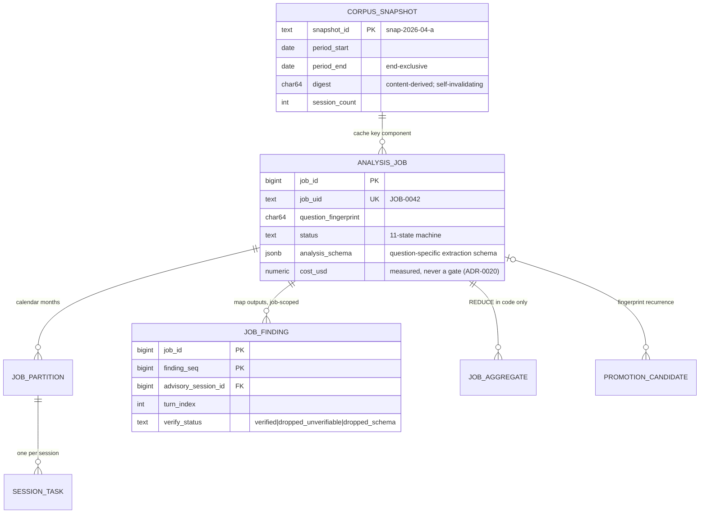

### 9.1 `jobs.corpus_snapshot` (DDL — the digest definition is normative)

```sql
CREATE TABLE jobs.corpus_snapshot (
  snapshot_id   text PRIMARY KEY,                -- 'snap-2026-04-a'
  period_start  date NOT NULL, period_end date NOT NULL CHECK (period_end > period_start),
  created_at    timestamptz NOT NULL DEFAULT now(),
  digest        char(64) NOT NULL,
  session_count integer NOT NULL,
  manifest_uri  text NOT NULL                    -- MinIO: full per-session tuple list for verification
);
```

**Digest (normative, mapped to NIP columns)** [DECISION MASTER_PROMPT §4.3]: SHA-256 over the ordered tuple stream — for every `advisory_session` whose `session_date` falls in `[period_start, period_end)`, ordered by `session_uid`: `(session_uid, active provider, active source_version, turn_count, max(turn_index), current extraction_run_id per the session_extraction_state pointer)`. Consequences carried forward verbatim: per-period (ingesting September never invalidates April); content-derived (re-ingest/re-extract/rebase changes the digest → Lane-3 cache miss automatically); reproducibility is *verifiable, not reconstructable* — recompute-and-compare; unequal ⇒ pack faces `NOT_REPRODUCIBLE (corpus moved: old → new)`.

### 9.2 Job tables (DDL sketch — load-bearing)

```sql
CREATE TABLE jobs.analysis_job (
  job_id       bigint GENERATED ALWAYS AS IDENTITY PRIMARY KEY,
  job_uid      text NOT NULL UNIQUE,
  question_text        text NOT NULL,
  question_fingerprint char(64) NOT NULL,        -- normalized-question hash; promotion + cache key component
  requested_by text NOT NULL, accepted_at timestamptz,
  period_start date NOT NULL, period_end date NOT NULL CHECK (period_end > period_start),
  scope        jsonb NOT NULL,                   -- filters beyond period (validated spec, no free SQL)
  analysis_schema jsonb NOT NULL, schema_sha char(64) NOT NULL,
  model_id text NOT NULL, model_role text NOT NULL DEFAULT 'lane3_map',
  FOREIGN KEY (model_id, model_role) REFERENCES ops.model_registry ON DELETE RESTRICT,
  prompt_sha   char(64) NOT NULL REFERENCES ops.prompt_registry ON DELETE RESTRICT,
  taxonomy_stamp jsonb NOT NULL DEFAULT '{}',
  corpus_snapshot_id text REFERENCES jobs.corpus_snapshot ON DELETE RESTRICT,
  cache_key    char(64),                         -- sha256(fingerprint|schema_sha|snapshot digest|prompt|model) — hit = instant result
  status       text NOT NULL DEFAULT 'offered' CHECK (status IN
    ('offered','accepted','planning','mapping','verifying','reducing','complete',
     'incomplete','failed','cancelled','stalled','superseded')),
  progress     jsonb NOT NULL DEFAULT '{}',      -- live: partitions done, sessions done, ETA, spend so far
  cost_usd numeric(12,4), tokens_in bigint, tokens_out bigint,
  created_at timestamptz NOT NULL DEFAULT now(), finished_at timestamptz
);
CREATE INDEX ix_job_cache ON jobs.analysis_job (cache_key) WHERE status = 'complete';
CREATE INDEX ix_job_fingerprint ON jobs.analysis_job (question_fingerprint, created_at DESC);

CREATE TABLE jobs.job_partition (
  job_id          bigint NOT NULL REFERENCES jobs.analysis_job ON DELETE RESTRICT,
  partition_month date  NOT NULL,                -- calendar month; THE unit of work (Lane-3 doctrine)
  session_count   integer NOT NULL,
  state text NOT NULL DEFAULT 'pending' CHECK (state IN ('pending','running','complete','incomplete','failed')),
  sessions_done integer NOT NULL DEFAULT 0,
  findings_kept integer NOT NULL DEFAULT 0,
  dropped_unverifiable integer NOT NULL DEFAULT 0,   -- surfaced in the coverage block, never silent
  started_at timestamptz, finished_at timestamptz,
  PRIMARY KEY (job_id, partition_month)
);

CREATE TABLE jobs.session_task (                  -- resumability lives HERE, not in a JSON file on a laptop
  job_id bigint NOT NULL, partition_month date NOT NULL,
  FOREIGN KEY (job_id, partition_month) REFERENCES jobs.job_partition ON DELETE RESTRICT,
  advisory_session_id bigint NOT NULL REFERENCES core.advisory_session ON DELETE RESTRICT,
  state text NOT NULL DEFAULT 'pending' CHECK (state IN ('pending','running','done','failed','skipped_no_transcript')),
  attempt smallint NOT NULL DEFAULT 0,
  error_class text, finished_at timestamptz,
  PRIMARY KEY (job_id, advisory_session_id)
);
CREATE INDEX ix_task_resume ON jobs.session_task (job_id, state) WHERE state IN ('pending','failed');

CREATE TABLE jobs.job_finding (                   -- job-scoped MAP outputs; verified subset feeds REDUCE
  job_id      bigint NOT NULL REFERENCES jobs.analysis_job ON DELETE RESTRICT,
  finding_seq bigint NOT NULL,
  advisory_session_id bigint NOT NULL REFERENCES core.advisory_session ON DELETE RESTRICT,
  transcript_source_id bigint NOT NULL,           -- text basis at map time
  turn_index  integer NOT NULL,
  label_raw   text NOT NULL,
  cluster_id  text REFERENCES findings.cluster ON DELETE RESTRICT,  -- R-P2 canonicalization; new labels → tax.proposal
  quote_text  text NOT NULL, speaker_role text NOT NULL,
  confidence  real,
  verify_status text NOT NULL CHECK (verify_status IN ('verified','dropped_unverifiable','dropped_schema')),
  PRIMARY KEY (job_id, finding_seq)
);

CREATE TABLE jobs.job_aggregate (                 -- REDUCE outputs: computed in code, never by the model (I3)
  aggregate_id bigint GENERATED ALWAYS AS IDENTITY PRIMARY KEY,
  job_id bigint NOT NULL REFERENCES jobs.analysis_job ON DELETE RESTRICT,
  level  text NOT NULL CHECK (level IN ('partition','total')),
  partition_month date,
  CONSTRAINT ck_level CHECK ((level = 'partition') = (partition_month IS NOT NULL)),
  payload jsonb NOT NULL,                         -- counts, ranks, shares, Wilson CIs; reducer_version stamped
  reducer_version text NOT NULL,
  computed_at timestamptz NOT NULL DEFAULT now()
);
-- natural key via expression index (PK cannot hold expressions):
CREATE UNIQUE INDEX uq_job_aggregate ON jobs.job_aggregate
  (job_id, level, COALESCE(partition_month, DATE '0001-01-01'));

CREATE TABLE jobs.promotion_candidate (
  candidate_id bigint GENERATED ALWAYS AS IDENTITY PRIMARY KEY,
  question_fingerprint char(64) NOT NULL UNIQUE,
  occurrences integer NOT NULL DEFAULT 1,
  first_seen timestamptz NOT NULL, last_seen timestamptz NOT NULL,
  status text NOT NULL DEFAULT 'watching' CHECK (status IN ('watching','proposed','promoted','declined')),
  promoted_capability_id text                     -- set when it becomes a registered capability (CAP-D8 evidence)
);
```

Volumes: a whole-corpus job = 16,911 session tasks and ~20k–90k `job_finding` rows [INFER 1–5 findings/session]; `job_finding` is retained while the job artifact is referenced and archived to MinIO with the job on expiry (`DEEP_JOB_CACHE_TTL_DAYS`, OD-08). No cost columns gate anything — spend is measured and reported only [DECISION ADR-0020].

---

## 10. Domain `packs` — frozen packs, publications, retractions

The frozen-vs-live doctrine (MASTER_PROMPT §4.3) lands in four tables. **A pack row is immutable; regeneration mints a new row; publication is an append-only pointer; a reissue names its computed cause** [DECISION ADR-0011].

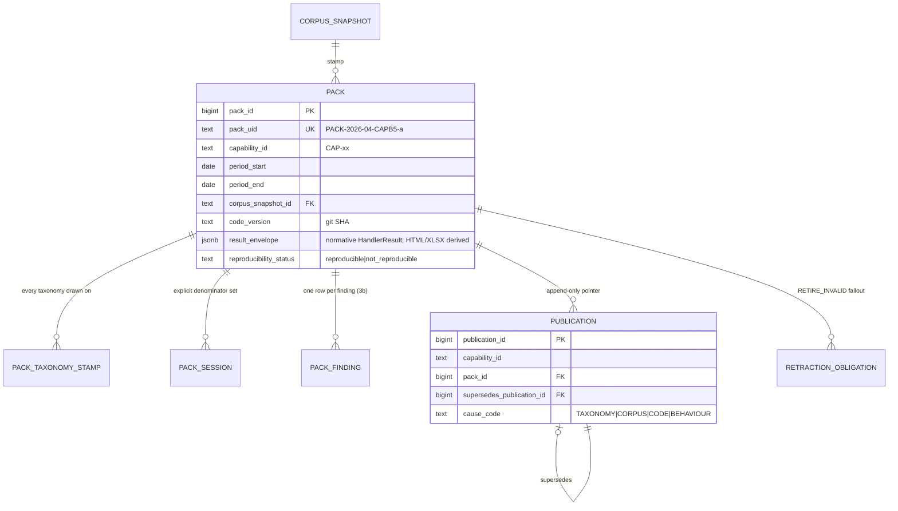

```sql
CREATE TABLE packs.pack (
  pack_id      bigint GENERATED ALWAYS AS IDENTITY PRIMARY KEY,
  pack_uid     text NOT NULL UNIQUE,
  capability_id text NOT NULL,                    -- CAP-D10 constituents reference their own CAP ids
  period_start date NOT NULL, period_end date NOT NULL CHECK (period_end > period_start),
  period_label_ar text NOT NULL,
  corpus_snapshot_id text NOT NULL REFERENCES jobs.corpus_snapshot ON DELETE RESTRICT,
  code_version text NOT NULL,
  computed_by_job_id bigint REFERENCES jobs.analysis_job ON DELETE RESTRICT,  -- packs are scheduled Lane-3 jobs (R-P3)
  result_envelope jsonb NOT NULL,                 -- IMMUTABLE (C7); renders re-derivable from this alone
  constituents jsonb NOT NULL DEFAULT '[]',       -- sub-period pack_uids + versions + reconciliation text (freeze-at-close rule)
  reproducibility_status text NOT NULL DEFAULT 'reproducible'
    CHECK (reproducibility_status IN ('reproducible','not_reproducible')),
  computed_at timestamptz NOT NULL DEFAULT now()
);
-- identity of a pack = (capability, period, taxonomy stamp, snapshot, code); enforced as a natural key:
CREATE UNIQUE INDEX uq_pack_identity ON packs.pack
  (capability_id, period_start, period_end, corpus_snapshot_id, code_version, (result_envelope->>'taxonomy_stamp_sha'));

CREATE TABLE packs.pack_taxonomy_stamp (
  pack_id bigint NOT NULL REFERENCES packs.pack ON DELETE RESTRICT,
  taxonomy_id text NOT NULL, version integer NOT NULL,
  FOREIGN KEY (taxonomy_id, version) REFERENCES tax.taxonomy_version ON DELETE RESTRICT,
  PRIMARY KEY (pack_id, taxonomy_id)
);

CREATE TABLE packs.pack_session (                 -- the explicit denominator (E.0 rules need it after any merge)
  pack_id bigint NOT NULL REFERENCES packs.pack ON DELETE RESTRICT,
  session_uid char(26) NOT NULL,                  -- frozen copy; survives anything
  PRIMARY KEY (pack_id, session_uid)
);

CREATE TABLE packs.pack_finding (                 -- MASTER_PROMPT §4.3 mechanic 3b: a pack persists FINDINGS, not counts
  pack_id bigint NOT NULL REFERENCES packs.pack ON DELETE RESTRICT,
  seq integer NOT NULL,
  session_uid char(26) NOT NULL, turn_index integer NOT NULL,
  taxonomy_id text NOT NULL, category_id text NOT NULL, taxonomy_version integer NOT NULL,
  quote_text text NOT NULL, speaker_role text NOT NULL,     -- frozen copies (survive re-extraction)
  finding_id bigint, finding_session_month date,            -- soft back-reference, NO cascade — freeze survives source churn
  extraction_run_id bigint NOT NULL,
  PRIMARY KEY (pack_id, seq)
);

CREATE TABLE packs.publication (                  -- APPEND-ONLY (C6); "Changes: Never" protects THIS pointer
  publication_id bigint GENERATED ALWAYS AS IDENTITY PRIMARY KEY,
  capability_id text NOT NULL,
  period_start date NOT NULL, period_end date NOT NULL,
  pack_id bigint NOT NULL REFERENCES packs.pack ON DELETE RESTRICT,
  published_at timestamptz NOT NULL DEFAULT now(),
  published_by text NOT NULL,                     -- publication authority per OD-10
  supersedes_publication_id bigint REFERENCES packs.publication ON DELETE RESTRICT,
  cause_code text CHECK (cause_code IN ('TAXONOMY','CORPUS','CODE','BEHAVIOUR')),
  CONSTRAINT ck_reissue CHECK ((supersedes_publication_id IS NULL) = (cause_code IS NULL)),
  reason_ar text
);
CREATE INDEX ix_publication_current ON packs.publication (capability_id, period_start, period_end, published_at DESC);
-- "current publication" = the row no later row supersedes; view packs.v_current_publication implements it.

CREATE TABLE packs.retraction_obligation (        -- RETIRE_INVALID: the accusation was withdrawn — say so
  retraction_id bigint GENERATED ALWAYS AS IDENTITY PRIMARY KEY,
  pack_id bigint NOT NULL REFERENCES packs.pack ON DELETE RESTRICT,
  category_id text NOT NULL REFERENCES tax.taxonomy_category ON DELETE RESTRICT,
  retired_at timestamptz NOT NULL,
  affected_session_uids text[] NOT NULL, affected_consultant_uids text[] NOT NULL,
  originally_published_at timestamptz NOT NULL, recipients text[] NOT NULL,
  status text NOT NULL DEFAULT 'open' CHECK (status IN ('open','acknowledged')),
  acknowledged_by text, acknowledged_at timestamptz,
  CONSTRAINT ck_ack CHECK ((status = 'acknowledged') = (acknowledged_by IS NOT NULL))
);
CREATE INDEX ix_retraction_open ON packs.retraction_obligation (pack_id) WHERE status = 'open';
```

**Cause-code computation is mechanical**: compare superseded pack's stamps to the new pack's — `TAXONOMY` if any `pack_taxonomy_stamp` differs, `CORPUS` if `corpus_snapshot_id`/digest moved, `CODE` if `code_version` moved; `BEHAVIOUR` is legal only when all three are identical (MASTER_PROMPT §4.3 mechanic 5). The publisher UI (doc 18) shows the computed code; a reissue that cannot name a cause is a stamping bug, not a permitted output.

**Worked Arabic example (reissue row):** publication #2 for `CAP-B5 / 2026-04`: `supersedes_publication_id=#1, cause_code='TAXONOMY', reason_ar='قُسِّم VIOL-017 إلى VIOL-017a/b؛ أعادت إعادة التصنيف المجدولة عدّ نيسان على الإصدار ن6'` — pack #1 stays fetchable at its own `pack_uid` forever.

Volumes: ~19 packs/month (15 monthly capabilities + quarterly overlays) → ~700 packs + ~10⁵–10⁶ `pack_finding` rows over 3y — small; no partitioning.

---

## 11. Domain `evidence` — turn-aware evidence units, embeddings, index versions

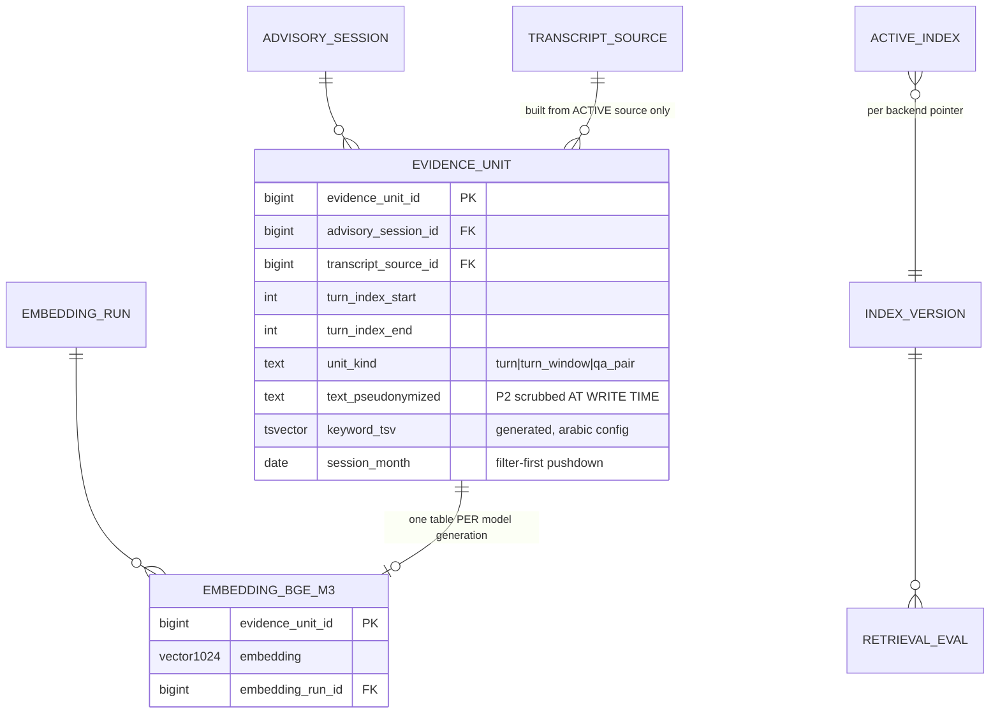

```sql
CREATE TABLE evidence.evidence_unit (
  evidence_unit_id bigint GENERATED ALWAYS AS IDENTITY PRIMARY KEY,
  advisory_session_id  bigint NOT NULL REFERENCES core.advisory_session ON DELETE RESTRICT,
  transcript_source_id bigint NOT NULL REFERENCES transcript.transcript_source ON DELETE RESTRICT,
  turn_index_start integer NOT NULL, turn_index_end integer NOT NULL CHECK (turn_index_end >= turn_index_start),
  unit_kind text NOT NULL CHECK (unit_kind IN ('turn','turn_window','qa_pair')),
  speaker_roles text[] NOT NULL,
  text_pseudonymized text NOT NULL,          -- names → placeholders BEFORE storage (legacy scrubbed at read time — reversed)
  keyword_tsv tsvector GENERATED ALWAYS AS (to_tsvector('arabic', text_pseudonymized)) STORED,
  session_month date NOT NULL,               -- denormalized for filter-first (MASTER_PROMPT §7.1)
  build_run_id bigint NOT NULL,              -- evidence build lineage
  UNIQUE (transcript_source_id, turn_index_start, turn_index_end, unit_kind)
);
CREATE INDEX ix_evidence_filterfirst ON evidence.evidence_unit (session_month, advisory_session_id);
CREATE INDEX ix_evidence_keyword ON evidence.evidence_unit USING gin (keyword_tsv);

-- ONE PHYSICAL TABLE PER REGISTERED MODEL GENERATION (dimension is part of the table identity)
CREATE TABLE evidence.embedding_bge_m3_v1 (
  evidence_unit_id bigint PRIMARY KEY REFERENCES evidence.evidence_unit ON DELETE RESTRICT,
  embedding vector(1024) NOT NULL,
  embedding_run_id bigint NOT NULL REFERENCES evidence.embedding_run ON DELETE RESTRICT
);
CREATE INDEX ix_emb_bge_m3_hnsw ON evidence.embedding_bge_m3_v1 USING hnsw (embedding vector_cosine_ops);

CREATE TABLE evidence.embedding_run (
  embedding_run_id bigint GENERATED ALWAYS AS IDENTITY PRIMARY KEY,
  model_id text NOT NULL, model_role text NOT NULL DEFAULT 'embedding',
  FOREIGN KEY (model_id, model_role) REFERENCES ops.model_registry ON DELETE RESTRICT,
  dim integer NOT NULL, params_sha char(64) NOT NULL,
  scope jsonb NOT NULL, started_at timestamptz NOT NULL, finished_at timestamptz,
  status text NOT NULL CHECK (status IN ('running','complete','incomplete','failed'))
);

CREATE TABLE evidence.index_version (
  index_version_id bigint GENERATED ALWAYS AS IDENTITY PRIMARY KEY,
  backend text NOT NULL CHECK (backend IN ('keyword','vector','hybrid')),
  model_id text, dim integer, table_name text,     -- e.g. 'embedding_bge_m3_v1' for vector backends
  built_by_run bigint REFERENCES evidence.embedding_run ON DELETE RESTRICT,
  ready boolean NOT NULL DEFAULT false, created_at timestamptz NOT NULL DEFAULT now()
);
CREATE TABLE evidence.active_index (               -- pointer per backend; retrieval reads through this
  backend text PRIMARY KEY,
  index_version_id bigint NOT NULL REFERENCES evidence.index_version ON DELETE RESTRICT,
  activated_at timestamptz NOT NULL DEFAULT now(), activated_by text NOT NULL
);
CREATE TABLE evidence.retrieval_eval (
  eval_id bigint GENERATED ALWAYS AS IDENTITY PRIMARY KEY,
  index_version_id bigint NOT NULL REFERENCES evidence.index_version ON DELETE RESTRICT,
  eval_set_version text NOT NULL,                  -- doc 15 evidence set (~100 items)
  recall_at_5 real, recall_at_10 real, mrr real, ndcg_at_10 real,
  run_at timestamptz NOT NULL DEFAULT now()
);

-- Question-scoped custom collections (Lane-3 / custom RAG — doc 13 §9.0 owns the full DDL
-- incl. lifecycle CHECKs; absorbed into this census per doc 23 §0.2; migration 0010)
-- evidence.custom_collection       (collection manifest: question_fingerprint, scope, index_version_id,
--                                   status building|eval_pending|ready|stale|expired|promoted|deleted,
--                                   eval_recall_at_10, access_role [ASSUME OD-23], expires_at)
-- evidence.custom_collection_unit  (membership: collection_id FK, evidence_unit_id FK, added_by_run)
```

[REC] **Table-per-model-generation** for vectors: dimension and model become part of the physical identity, so the legacy hazard — dim hardcoded at the column while the model is switchable at config, producing incomparable vectors nobody can attribute [FACT arch/02 §11] — is structurally impossible. A model change = new table + `embedding_run` + `index_version` + pointer flip after `retrieval_eval` passes (EXP-04 decides the launch model: `BAAI/bge-m3` 1024-dim vs `multilingual-e5-large` [REC CORE-BRIEF §7]). Alternative (single table, un-typmod `vector` column + model_id column): rejected — cannot build a typed HNSW index across mixed dims, and silently mixes models in one ANN space. Revisit trigger: pgvector gains per-row-dim indexed types.

Rebase interplay: evidence units FK the transcript source they were built from; rebase step 8 invalidates by rebuilding units for flipped sessions and re-embedding — old units are deleted with their superseded source's archival (governed purge), never left silently stale.

Volumes: ~1 unit per 2–3 turns ⇒ ~150k @bootstrap → ~500k; embeddings 1:1 per active model table; well within single-table pgvector comfort. Filter-first exact scan under a scope cap, ANN above it [DECISION MASTER_PROMPT §7.1].

---

## 12. Domain `ops` — audit, model/prompt registries, review loop, DQ observations

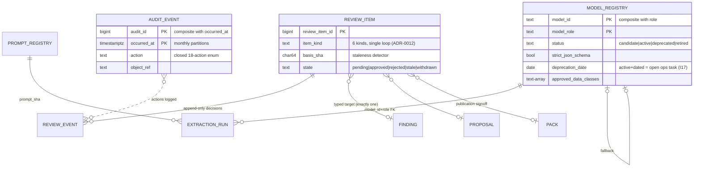

### 12.1 `ops.audit_event` (DDL — load-bearing, partitioned, append-only)

```sql
CREATE TABLE ops.audit_event (
  audit_id    bigint GENERATED ALWAYS AS IDENTITY,
  occurred_at timestamptz NOT NULL DEFAULT now(),
  actor       text NOT NULL,                 -- OIDC sub | 'worker:extraction' | 'scheduler:packs'
  action      text NOT NULL CHECK (action IN (
    'source_ingested','transcript_source_activated','extraction_completed','review_decided',
    'taxonomy_changed','answer_generated','export_created','pack_published','pack_reissued',
    'retraction_acknowledged','evidence_accessed','breakglass_pii_access','model_activated',
    'model_deprecated','job_started','job_finished','credential_rotated','role_granted')),
  object_kind text NOT NULL, object_ref text NOT NULL,      -- ('pack','PACK-2026-04-CAPB5-a')
  request_id  text,                          -- end-to-end trace join (R13)
  details     jsonb NOT NULL DEFAULT '{}',
  PRIMARY KEY (audit_id, occurred_at)
) PARTITION BY RANGE (occurred_at);          -- monthly partitions; REVOKE UPDATE, DELETE FROM ALL (C6)
CREATE INDEX ix_audit_object ON ops.audit_event (object_kind, object_ref, occurred_at DESC);
CREATE INDEX ix_audit_actor  ON ops.audit_event (actor, occurred_at DESC);
```

The action list is exactly GREENFIELD §15.4's required events plus operational additions; retention ≥18 months [ASSUME OD-08].

### 12.2 `ops.model_registry` + `ops.prompt_registry` (DDL — load-bearing)

```sql
CREATE TABLE ops.model_registry (              -- GREENFIELD §10.7 field list, verbatim coverage
  model_id   text NOT NULL,                    -- 'openai/gpt-oss-120b'
  model_role text NOT NULL CHECK (model_role IN
    ('lane1_planner','extraction','lane3_map','composer','safety','routing','embedding','stt','eval_judge')),
  provider   text NOT NULL DEFAULT 'groq',
  account_tier text NOT NULL DEFAULT 'unverified',            -- OD-03
  status     text NOT NULL CHECK (status IN ('candidate','active','deprecated','retired')),
  strict_json_schema boolean NOT NULL,         -- only gpt-oss-120b/20b true [FACT groq-docs 2026-08-02]
  context_window integer NOT NULL,
  prompt_schema_compat text[] NOT NULL DEFAULT '{}',
  benchmark_ref text, benchmark_scores jsonb,
  activated_at date, deprecation_date date, retirement_date date,
  fallback_model_id text, fallback_model_role text,
  approved_data_classes text[] NOT NULL DEFAULT '{P0,P1}',    -- P2 pseudonymized requires OD-04 approval
  rate_limit jsonb NOT NULL DEFAULT '{}',
  provider_version_evidence text,
  PRIMARY KEY (model_id, model_role),
  FOREIGN KEY (fallback_model_id, fallback_model_role) REFERENCES ops.model_registry ON DELETE RESTRICT
);
-- a deprecation date on an active model MUST have an open ops task (I17): asserted by the
-- observability rule ix_model_deprecation + a scheduled check, not by hope:
CREATE INDEX ix_model_deprecation ON ops.model_registry (deprecation_date)
  WHERE status = 'active' AND deprecation_date IS NOT NULL;

CREATE TABLE ops.prompt_registry (
  prompt_sha char(64) PRIMARY KEY,             -- sha256 of the rendered template skeleton
  prompt_role text NOT NULL, version text NOT NULL,
  template_uri text NOT NULL,                  -- git-tracked file; DB stores the reference + hash
  output_schema_sha char(64),
  status text NOT NULL CHECK (status IN ('active','retired')),
  created_at timestamptz NOT NULL DEFAULT now(),
  UNIQUE (prompt_role, version)
);
```

### 12.3 Single review loop (ADR-0012) — typed, not polymorphic-untyped

```sql
CREATE TABLE ops.review_item (
  review_item_id bigint GENERATED ALWAYS AS IDENTITY PRIMARY KEY,
  item_kind text NOT NULL CHECK (item_kind IN
    ('finding_review','taxonomy_proposal','cluster_label','entity_alias','answer_key_item','publication_signoff')),
  -- exactly one typed target (the v2_validation_log untyped-pointer lesson, arch/02 §3):
  finding_id bigint, finding_session_month date,
  proposal_id bigint REFERENCES tax.proposal ON DELETE RESTRICT,
  cluster_id text REFERENCES findings.cluster ON DELETE RESTRICT,
  alias_id bigint REFERENCES tax.entity_alias ON DELETE RESTRICT,
  answer_key_ref text,                          -- doc 15 fixture id (repo-resident artifact)
  pack_id bigint REFERENCES packs.pack ON DELETE RESTRICT,
  CONSTRAINT ck_one_target CHECK (
    (finding_id IS NOT NULL)::int + (proposal_id IS NOT NULL)::int + (cluster_id IS NOT NULL)::int
    + (alias_id IS NOT NULL)::int + (answer_key_ref IS NOT NULL)::int + (pack_id IS NOT NULL)::int = 1),
  basis_sha char(64) NOT NULL,                  -- hash of WHAT was reviewed (content + transcript_source)
  state text NOT NULL DEFAULT 'pending' CHECK (state IN ('pending','approved','rejected','stale','withdrawn')),
  opened_at timestamptz NOT NULL DEFAULT now()
);
CREATE TABLE ops.review_event (                 -- append-only decision history (OD-11: no overwrites, ever)
  review_item_id bigint NOT NULL REFERENCES ops.review_item ON DELETE RESTRICT,
  seq integer NOT NULL,
  decision text NOT NULL CHECK (decision IN ('approve','reject','request_changes','mark_stale','withdraw')),
  decided_by text NOT NULL, decided_at timestamptz NOT NULL DEFAULT now(),
  note_ar text,
  PRIMARY KEY (review_item_id, seq)
);
```

`basis_sha` is the structural fix for the legacy stale-review hazard: a re-extraction or rebase changes the content hash; a comparison job marks affected items `stale` and the portal resurfaces them — a previously-rejected session with brand-new violations can no longer stay hidden forever [FACT arch/02 §7.1].

### 12.4 `ops` reference

| Table | Purpose | PK | Partition | Volume |
|---|---|---|---|---|
| `audit_event` | immutable audit (§12.1) | `(audit_id, occurred_at)` | **RANGE monthly** | ~50k/mo [INFER] |
| `model_registry` / `prompt_registry` | I17 registries | composite / sha | no | 10¹ / 10² |
| `review_item` / `review_event` | single review loop | surrogate / composite | no | ~10³–10⁴/y |
| `data_quality_observation` | typed DQ feed → CAP-D9 (doc 05 §10.3 DDL adopted final) | surrogate | no | ~10⁴/y |
| `registry_snapshot` | read-only mirror of the code-owned capability/metric registries (I12), refreshed at deploy; serving joins/validates against it, **the repo remains the source of truth** | `(registry_kind, entry_id, code_version)` | no | 10²/deploy |

Amendment additions to `ops` (2026-08-03, DDL + reference rows in §19): `pipeline_run` + `pipeline_step_run` (§19.2), `data_quality_issue` + `reconciliation_case` (§19.3), `label_dataset` + `label_dataset_item` + `detector_candidate` + `detector_release` + `shadow_result` (§19.5), `notification_subscription` + `notification_delivery` (§19.8).

---

## 13. Domain `legacy_snapshot` — one-time bootstrap, read-only

`pg_restore` of the checksummed snapshot artifact into this schema; tables keep their legacy names verbatim (`legacy_snapshot.v2_meetings`, `v2_transcript_turns`, `v2_services_report`, …) [DECISION ADR-0016; transport per doc 05 §9].

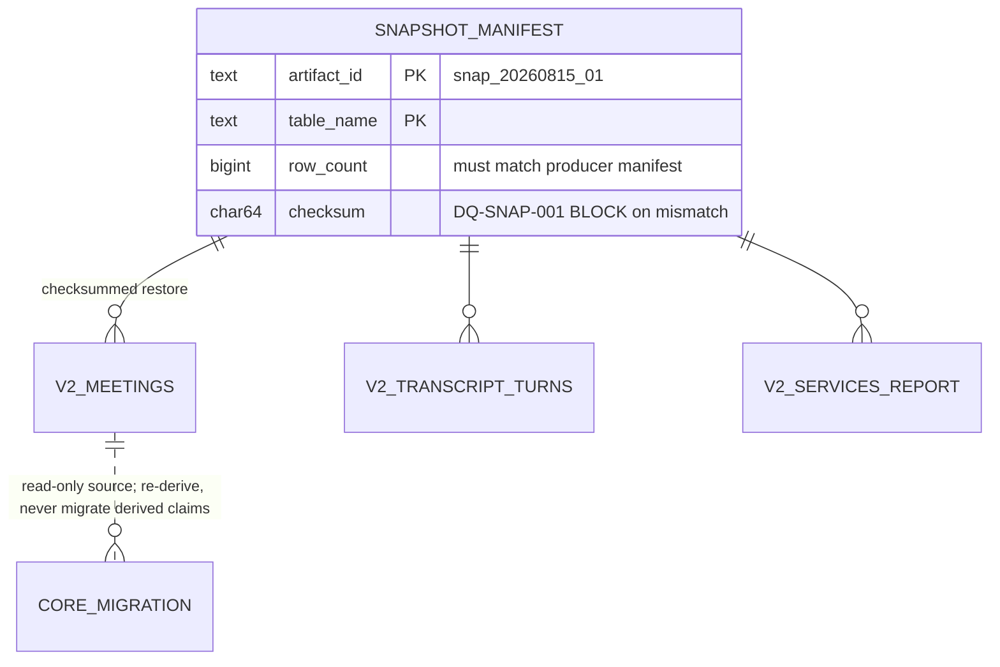

Additions here:

```sql
CREATE TABLE legacy_snapshot.snapshot_manifest (
  artifact_id text NOT NULL,                   -- 'snap_20260815_01'
  table_name  text NOT NULL,
  row_count   bigint NOT NULL,
  checksum    char(64) NOT NULL,               -- must equal producer manifest (DQ-SNAP-001/002 BLOCK)
  restored_at timestamptz NOT NULL,
  PRIMARY KEY (artifact_id, table_name)
);
REVOKE INSERT, UPDATE, DELETE ON ALL TABLES IN SCHEMA legacy_snapshot FROM nip_worker, nip_web;
```

Rules: read-only after restore (role-enforced); only migration jobs read it; `nip_web` has **no grants at all** here; derived legacy claims (the ~409k knowledge rows) are **never** migrated into `findings` — they are re-derived under the new pipeline; migrated-into-`tax` classifications stamp `taxonomy_version = 0` through the committed crosswalk and are excluded from the live view until reclassified [DECISION MASTER_PROMPT §4.3 "Legacy findings"]. The PII backup table `v2_services_report_bak_20260610` is **excluded from the snapshot artifact entirely** (compliance action, arch/02 §10); doc 20 owns the reconciliation totals sheet.

---

## 14. Versioning & lineage rules (cross-domain, testable)

| # | Rule | Enforced by |
|---|---|---|
| L1 | Every `findings.finding` that is category-classified carries `taxonomy_id + category_id + taxonomy_version`, all three or none (I13) | `ck_taxonomy_stamp` CHECK |
| L2 | Every derived row names its text basis: `transcript_source_id NOT NULL` on `finding`, `quote_ref`, `evidence_unit`, `jobs.job_finding` | NOT NULL + FK |
| L3 | Every derived row names its producer: `extraction_run_id` / `embedding_run_id` / `cluster_run_id` / `computed_by_job_id` NOT NULL; the run rows carry `model_id+role` (FK to registry), `prompt_sha` (FK), `schema_sha`, `code_version` | NOT NULL + FK; flattened view `findings.v_finding_full` |
| L4 | Every vector carries model+dim provenance | table-per-model-generation (§11) + `embedding_run` FK |
| L5 | Quotes are anchored to real rows: `quote_ref (transcript_source_id, turn_index)` is a composite FK into `transcript.turn`; `char_start/char_end` locate the substring; R7 verifies verbatim-substring before `validation_status='verified'` (I7) | composite FK + gate + `validation_result` row |
| L6 | "Current" is always a pointer, never a flag scan: `transcript.active_transcript`, `findings.session_extraction_state`, `evidence.active_index`, `packs.v_current_publication` | PK-per-subject pointer tables |
| L7 | Packs freeze *findings + session set + stamps*; live view recounts from `findings.finding` under the current version; lineage edges explain deltas but never compute them | §10 tables; renderer rules in doc 11 |
| L8 | Reissues name a computed cause; `BEHAVIOUR` illegal when any stamp moved | `ck_reissue` + publisher logic (§10) |
| L9 | Answers stamp what they used: `serve.answer_artifact.taxonomy_stamp` + tool envelopes' `taxonomy` block; a category count without a taxonomy stamp raises (I16) | envelope schema (doc 11/17) |
| L10 | Left-censoring: a category is comparable only from `first_measurable_period`; earlier cells render «غير مقيس», never 0 | `taxonomy_category.first_measurable_period` + renderer golden (doc 15) |

Golden-suite hooks (doc 15): L1/L5 asserted per-row on fixtures; L6 asserted by flipping a pointer in a fixture DB and diffing aggregates; L10 has the mandated "zero in a pre-introduction cell fails" test.

---

## 15. PII boundary map

Classes P0–P3 are doc 05 §1.4's scheme (binding package-wide); mapping to the assignment vocabulary: P0 = operational, P1 = quasi/pseudonymous, P2 = sensitive content, P3 = direct identifier.

### 15.1 Where each class may live (schema-level policy)

| Schema | Max class | P3 columns permitted? | Notes |
|---|---|---|---|
| `ingest` (+ MinIO raw bucket) | P3 | staging only (era-1 titles, SRC-INT beneficiary columns if delivered — doc 05 recommends negotiating their exclusion at OD-07) | most restrictive bucket grants |
| `core` | P3 | **only** `beneficiary_identity.national_id` and `consultant_source_ref.source_ref WHERE ref_kind='national_id'` — the two restricted crosswalk columns [ASSUME OD-14] | column-level grants; break-glass read audited (`breakglass_pii_access`) [ASSUME OD-09] |
| `transcript` | P2 | no | turn text is P2 + untrusted (R15); enters model contexts only pseudonymized inside `<<<DATA…>>>` |
| `findings` | P2 (quotes) | no | quotes inherit P2; consultant referenced by surrogate id only |
| `evidence` | P2→P1 | no | `text_pseudonymized` is scrubbed **at write time** (legacy scrubbed at read time — reversed) |
| `serve` | P2 (rendered quotes) | no | logs/telemetry never carry P2 (structlog processors strip; doc 19) |
| `jobs` / `packs` | P2 (quotes) | no | pack renders show consultant `consultant_uid`+name only to roles OD-09 permits |
| `tax` / `ops` | P1 | no | audit `details` jsonb is schema-checked to exclude P2/P3 payloads |
| `legacy_snapshot` | P3 | frozen historical | no web grants; dropped after migration acceptance (OD-08) |

### 15.2 Column-level classification (the load-bearing rows)

| Column | Class | Handling |
|---|---|---|
| `core.beneficiary_identity.national_id` | **P3** | NULL at launch (OD-15); if retained: column grant to `nip_steward_breakglass` role only |
| `core.beneficiary_identity.source_ref_hash` | P1 | linkage key; hash, not identifier |
| `core.consultant_source_ref.source_ref` (national-id kind) | **P3** | restricted column [ASSUME OD-14]; every other surface uses `consultant_uid` |
| `core.consultant.full_name_ar` | P2 | visible to roles per OD-09; masked view for `nip_readonly_bi` |
| `core.participant.display_name` | P2 | provider emails **never stored** (dropped at staging [REC doc 05 §2.9]) |
| `core.beneficiary_pseudonym.pseudonym_label` | P1 | the only beneficiary reference findings/serve/evidence/packs ever see (I15) |
| `transcript.turn.text` | P2 + untrusted | R15 delimiters; never in planner context |
| `findings.quote_ref.quote_text`, `packs.pack_finding.quote_text`, `jobs.job_finding.quote_text` | P2 | pseudonymized rendering; full text via `fetch_transcript_window` under transcript-access permission (aggregate-vs-transcript split, ADR-0017) |
| `core.beneficiary_rating.comments`, `core.consultant_evaluation.notes` | P2 | may contain incidental P3 → outbound policy doc 16 |
| `serve.conversation_turn.user_text` | P2 | user questions may name people; retention OD-08 |
| `ops.audit_event.details` | P1 max | schema-checked; references by uid, never content |

### 15.3 Masking views for non-privileged roles

`core_masked.v_consultant` (name → `consultant_uid` + first-name-initial form), `core_masked.v_session` (drops rating comments), `findings_masked.v_finding` (quote windows truncated to the verified span). `nip_readonly_bi` and `executive_viewer` API paths read only these views; reviewer/steward roles read base tables per the RBAC matrix (doc 16 owns the full role→view grant map). Masking is server-side view + grant, never client-side (I14).

---

## 16. Partitioning, indexes, and volume plan

### 16.1 What partitions, and why

| Table | Strategy | Reason |
|---|---|---|
| `findings.finding` | RANGE monthly on `session_month` | period-scoped queries dominate (I4); re-extraction generations multiply rows; Lane-3/pack recounts touch single months; partition pruning + cheap archival of superseded generations |
| `serve.tool_call` | RANGE monthly on `called_at` | highest-churn serve table; OD-08 purge = DROP PARTITION |
| `ops.audit_event` | RANGE monthly on `occurred_at` | append-only, ≥18mo retention, time-scoped reads |
| everything else | unpartitioned | below ~10M rows over 3y; partitioning would cost FK simplicity for nothing. Revisit triggers listed per table (§5 turn: >10M; `evidence.evidence_unit`: >5M or ANN latency SLO breach) |

A `finding_default` partition exists but any row landing in it fires an alert (a session_month outside created partitions = a data bug, not a storage event). Partition creation is an Alembic-managed monthly migration emitted ahead of time by the scheduler (12 months rolling), never `CREATE TABLE IF NOT EXISTS` at runtime (F3 lesson).

### 16.2 Consolidated volume table (bootstrap = measured baseline [FACT CORE-BRIEF §11]; growth [INFER] at ~1,000 sessions/month average, 556–1,512 observed swing)

| Table | @bootstrap | +12mo | +36mo | Driver |
|---|---:|---:|---:|---|
| `core.advisory_session` | 16,911 | ~29k | ~53k | 1 per session |
| `transcript.turn` | 399,501 | ~690k | ~1.4M | ~24 turns/session |
| `transcript.transcript_source` | 16,911 | ~29k (+1/session on provider swap) | ~60k | rebase adds a generation |
| `core.participant` | ~35,320 | ~61k | ~110k | 2.09/session |
| `findings.finding` | ~500k (first full extraction) | ~900k | ~2.5M | ~30/session × generations |
| `findings.quote_ref` | ~550k | ~1M | ~2.8M | 1.1× findings |
| `evidence.evidence_unit` (+1 embedding table) | ~150k | ~260k | ~500k | 1 per 2–3 turns |
| `jobs.job_finding` | 0 | ~200k | ~600k | ~20–90k per corpus-wide job |
| `packs.pack_finding` | 0 | ~150k | ~500k | ~19 packs/mo × findings |
| `serve.tool_call` | 0 | ~350k | ~1M | usage-dependent |
| `ops.audit_event` | ~50k (migration) | ~650k | ~1.9M | all planes |

Total 3-year DB size estimate ~40–80 GB incl. indexes and one vector table [INFER] — single-instance PostgreSQL comfortably; pgBackRest + restore drills per CORE-BRIEF §8.

### 16.3 Index doctrine

Composite b-trees lead with the pruning column (`session_month`, `kind`, `status`); partial indexes carry the working sets (`WHERE resolution_status <> 'resolved'`, `WHERE state IN ('new','retrying')`, `WHERE status='open'`, `WHERE validation_status='verified'`); GIN on `keyword_tsv` and on `title_claims`; HNSW per embedding table (rebuilt per `embedding_run`, activated via `index_version` — never REINDEX-in-place under traffic). Every serving query pattern in doc 11's compiler emits only registered predicates, so the index set is derivable from the metric registry — a CI check compares compiler-emitted predicate columns against the index catalogue and warns on gaps (structural, per I12 spirit).

---

## 17. Deliberately NOT modelled (so the system can say «غير متوفر» honestly — I5)

| Absent object | Why absent | What happens when asked |
|---|---|---|
| `business_sector` dimension | No source exists: «قطاع» in legacy data is `service_category` or `government_entity`, never industry sector [FACT CORE-BRIEF §13.3] | `declare_unanswerable(DIMENSION_NOT_AVAILABLE)` naming the two available «قطاع» meanings; revisit when an external firm-identity source lands (doc 05 §8's SRC-OUT extension point) |
| City/region dimension | No reliable source field in any contract (doc 05) | same reason code; never inferred from transcript text into a filterable dimension |
| Beneficiary demographics (age, gender, firm size) | P3-adjacent, no approved source | DIMENSION_NOT_AVAILABLE |
| Cross-session beneficiary identity | OD-15 default: not linked | "repeat beneficiary" questions honestly unanswerable at launch |
| Audio objects / STT tables | contingency only (GREENFIELD §9.4; OD-12 assume no audio access) | added by ADR if OD-12 flips |
| ASR-correction / transcript-edit tables | correction permanently removed [DECISION ADR-0007] | `transcript.turn` has no `text_corrected` column and never will; a "fix the transcript" request routes to provider rebase |
| Cross-provider turn-index mapping | forbidden by GREENFIELD §9.2 ("do not map old indices — re-extract") | rebase re-extracts |
| Mutable "metric mart" of precomputed KPI rows | numbers are computed by the compiler at answer time or frozen in packs/job aggregates; a mutable mart would be a second, driftable truth (I12) | packs + live recount only |
| Consultant HR attributes (salary, contract) | out of product scope (doc 03) | OUT_OF_SCOPE |
| A `deleted`/`is_active` soft-delete convention | soft-state = views + status enums + partial indexes, never a string predicate copied across handlers (the `val_verdict='wrong'` lesson [FACT arch/02 §3]) | — |

---

## 18. Open decisions touching the data model & revisit triggers

| OD | Data-model consequence | Safe assumption baked in above |
|---|---|---|
| OD-04 outbound pseudonymized text | `model_registry.approved_data_classes` starts `{P0,P1}` + P2-pseudonymized flag flipped only on approval | prompts carry placeholders |
| OD-07 SRC-INT access mechanism | `internal_session_map.internal_ref` format text (uuid-tolerant) until contract fixed | text key |
| OD-08 retention windows | partition-drop purge paths for `serve.tool_call`, archival for superseded `transcript_source` (90d), audit ≥18mo | stated per table |
| OD-09 PII visibility per role | masking views §15.3; break-glass audit action exists | nobody sees P3 by default |
| OD-11 review roles | `ops.review_event` append-only; no delete path exists for decisions | admin-only retire |
| OD-14 consultant national-id retention | restricted `consultant_source_ref` column vs hash-only | retain restricted, hash elsewhere |
| **OD-15 (new, this doc)** beneficiary cross-session linkage | `beneficiary_identity.beneficiary_key` linkage NULL at launch; repeat-beneficiary analytics unavailable | no linkage until owner approves hash-based linking; impact: CAP-D4/D7 cannot segment by repeat visitors |
| OD-10 publication authority | `publication.published_by` free-identity now; role gate in app layer | product owner signs |
| OD-28 nightly run time + SLA (2026-08-03) | `ops.pipeline_run.scheduled_for` default; SLO row doc 09 §6.7 | 02:00 Asia/Riyadh, configurable |
| OD-30 review SLA + assignment (2026-08-03) | `findings.review_case.sla_due_at` computation; `review_assignment` roles | 7d normal / 2d high; assignment by review lead |
| OD-33 detector release cadence (2026-08-03) | `ops.detector_release` creation rhythm; no schema impact | monthly or on gate-pass, whichever is less frequent |
| OD-34 Action Center ownership (2026-08-03) | `serve.service_improvement_action.owner_sub` role gate (app layer) | service owner owns; leadership sees aggregates |
| OD-29 infographic channels (2026-08-03) | `ops.notification_subscription.channel` enum seed | Portal + approved Email; others later |

Structural revisit triggers (any one fires a doc-22 ADR review): second physical database requested (breaks ADR-0003); >10M rows in `transcript.turn` (partitioning); a second embedding model in *simultaneous* production use (active_index becomes per-capability); federation of consultant identity with an external IdM (consultant dimension ownership moves).

---

## 19. Owner Amendment (2026-08-03) — entity mapping and additions (migrations 0014/0015)

The Amendment's §12-08 entity list is integrated here under one rule: **map to an existing table wherever coverage already exists; add only what is genuinely missing** — the Amendment itself says table names are not the requirement, the use cases, versioning, traceability, and no-overwrite are. Census moves **78 → 98 tables** (20 additions). New tables land in **migration 0014** (consolidation-run record + steward queue + violation-review case layer + learning pipeline) and **migration 0015** (actions + notifications + infographic) — doc 23 §6 carries the same numbers; Alembic ledger order is doc 23's, execution timing follows the VS re-sequencing (docs 21/25).

### 19.1 Entity mapping — every Amendment §12-08 entity, dispositioned

| Amendment entity | Disposition | Where |
|---|---|---|
| `pipeline_run` | **Map + add.** Per-source runs already exist as `ingest.ingestion_run` (kept, per-adapter grain). The **cross-source Nightly Consolidation Run record** is genuinely missing → new `ops.pipeline_run`; `ingest.ingestion_run` gains a nullable `pipeline_run_id` FK linking every adapter run to its owning consolidation run (0014 ALTER) | §19.2 |
| `pipeline_step_run` | **Add** — per-step record of the 16 mandatory nightly steps | §19.2 |
| `source_watermark` | **Already explicit — no new table.** `ingest.source_cursor` (doc 05 §1.3) is the named-watermark-per-source store; per-run before/after snapshots live in `ops.pipeline_run.source_watermarks` | §2 |
| `dead_letter_item` | **Exists** — `ingest.dlq_item` (typed error classes, replay states, steward resolution) | §2 |
| `data_quality_issue` | **Map + add.** The raw typed feed exists (`ops.data_quality_observation`, unchanged). The steward-owned *work item* (assignment, SLA, lifecycle) is missing → new `ops.data_quality_issue` | §19.3 |
| `reconciliation_case` | **Map + add.** Queues Q1–Q5 exist as views over resolution state (doc 05 §10.1); their durable case home (disposition, assignee, SLA, append-only history) is missing → new `ops.reconciliation_case` | §19.3 |
| `violation_finding` | **Exists** — `findings.finding` with `kind='violation'` (§6); 0014 adds a nullable `review_case_id` FK column linking each violation finding to its review case | §6, §19.4 |
| `review_case` / `review_event` / `review_assignment` | **Add** — the violation-review **case layer** `findings.review_case` + `findings.review_event` + `findings.review_assignment`, deliberately distinct from the `ops.review_*` governance loop (reconciliation paragraph in §19.4) | §19.4 |
| `missed_violation_report` | **Add** — `findings.missed_violation_report` («إضافة اشتباه لم يرصده النظام», CAP-OPS-06, SCR-17, PB-010) | §19.4 |
| `label_dataset` / `label_dataset_item` / `detector_candidate` / `detector_release` / `shadow_result` | **Add** — the governed detector-learning pipeline (SD-22), all five in `ops` | §19.5 |
| `monthly_infographic` / `infographic_section` | **Add** — `packs.monthly_infographic` as a 1:1 **pack subtype** (argued below) + `packs.infographic_section` | §19.6 |
| `publication_event` | **Exists / reused** — `packs.publication` (append-only pointer, supersession, cause codes) is the publication event log for infographics too; sign-off events reuse `ops.review_item(item_kind='publication_signoff')` (ADR-0012) | §10, §19.6 |
| `service_improvement_action` / `action_event` / `action_metric_baseline` | **Add** — Action Center (CAP-OPS-09, SCR-19, PB-015) in `serve` (the plane whose API creates and updates them; write matrix §1) | §19.7 |
| `notification_subscription` / `notification_delivery` | **Add** — `ops.notification_subscription` + `ops.notification_delivery` (CAP-OPS-10 «صباحيات الخدمة», digests, alerts; PB-016) | §19.8 |

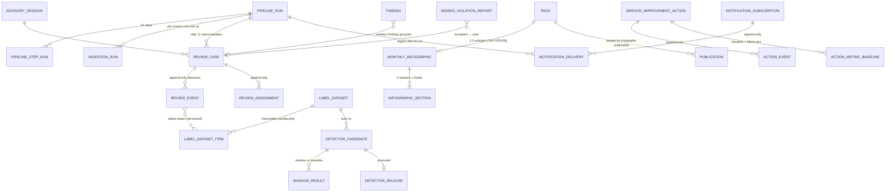

### 19.2 Nightly Consolidation Run record — `ops.pipeline_run` + `ops.pipeline_step_run` (migration 0014)

The run record the Amendment §4.3 requires, wrapping (not replacing) the per-source `ingest.ingestion_run` grain. Workflow semantics in doc 09 §10; SCR-14 reads these rows.

```sql
CREATE TABLE ops.pipeline_run (
  pipeline_run_id  bigint GENERATED ALWAYS AS IDENTITY PRIMARY KEY,
  run_uid          text NOT NULL UNIQUE,            -- 'NCR-2026-08-03-a'; cited in digests, SCR-14, manifests
  run_kind         text NOT NULL DEFAULT 'nightly' CHECK (run_kind IN
                     ('nightly','hourly_incremental','manual','close_month','close_quarter')),
  business_date    date NOT NULL,                   -- the day being closed (Asia/Riyadh)
  scheduled_for    timestamptz NOT NULL,            -- 02:00 Asia/Riyadh, configurable [ASSUME OD-28]
  started_at timestamptz, finished_at timestamptz,
  status           text NOT NULL DEFAULT 'queued' CHECK (status IN
                     ('queued','running','partial','succeeded','failed','cancelled','superseded')),  -- exact Amendment states
  superseded_by    bigint REFERENCES ops.pipeline_run ON DELETE RESTRICT,
  source_watermarks jsonb NOT NULL DEFAULT '{}',    -- per-source {before, after} snapshot of ingest.source_cursor
  counts           jsonb NOT NULL DEFAULT '{}',     -- pulled/new/updated/rejected per source; sessions complete/excluded/late
  versions_stamp   jsonb NOT NULL,                  -- {code, contract_versions, model_ids, prompt_shas, taxonomy_versions, detector_release}
  attempts         int NOT NULL DEFAULT 0,          -- whole-run re-invocations
  error_summary    jsonb NOT NULL DEFAULT '[]',     -- classified errors (cause → count, worst examples)
  manifest_uri     text,                            -- MinIO run manifest (downloadable from SCR-14)
  triggered_by     text NOT NULL                    -- 'scheduler' | 'opsctl:<user>'
);
-- one authoritative (non-superseded) run per kind+day; retries after failure allowed:
CREATE UNIQUE INDEX uq_pipeline_run_active ON ops.pipeline_run (run_kind, business_date)
  WHERE status NOT IN ('superseded','cancelled','failed');
CREATE INDEX ix_pipeline_run_recent ON ops.pipeline_run (run_kind, business_date DESC);

CREATE TABLE ops.pipeline_step_run (
  pipeline_run_id bigint NOT NULL REFERENCES ops.pipeline_run ON DELETE RESTRICT,
  step_no         smallint NOT NULL CHECK (step_no BETWEEN 1 AND 16),   -- the 16 mandatory steps (doc 09 §10.2)
  step_id         text NOT NULL,                    -- 'preflight' … 'close_trigger' (closed list, doc 09 §10.2)
  status          text NOT NULL DEFAULT 'queued' CHECK (status IN
                    ('queued','running','partial','succeeded','failed','skipped','cancelled')),
  started_at timestamptz, finished_at timestamptz,
  counts          jsonb NOT NULL DEFAULT '{}',      -- step-level counters (listed/fetched/kept/dropped…)
  error_class     text, error_detail jsonb,
  attempts        smallint NOT NULL DEFAULT 0,
  dlq_item_ids    bigint[] NOT NULL DEFAULT '{}',   -- ingest.dlq_item rows opened by this step
  PRIMARY KEY (pipeline_run_id, step_no)
);
-- 0014 ALTER: ingest.ingestion_run ADD COLUMN pipeline_run_id bigint REFERENCES ops.pipeline_run ON DELETE RESTRICT;
```

Append-only note: run/step rows are **workflow state** (the orchestrator updates status in place, like `ingest.session_stage_state`); every transition also writes `ops.audit_event` (`job_started`/`job_finished` actions), so history is reconstructable without a mutable-history table. Resumability lives in these rows + task idempotency keys — never JSON files or process memory [DECISION Amendment §4.4-9; doc 09 §0.3].

### 19.3 Steward queue — `ops.data_quality_issue` + `ops.reconciliation_case` (migration 0014)

The Amendment §3.3-4 queue «مشكلات الربط والبيانات», layered **on top of** the existing raw feed (`ops.data_quality_observation`, unchanged) and the Q1–Q5 views (doc 05 §10.1): observations are signals; these two tables are the steward's durable work items with assignment, SLA, and no-overwrite dispositions.

```sql
CREATE TABLE ops.data_quality_issue (
  issue_id      bigint GENERATED ALWAYS AS IDENTITY PRIMARY KEY,
  issue_key     char(64) NOT NULL UNIQUE,          -- sha256(source_id|rule_id|entity_kind|entity_ref) — re-detections attach, not duplicate
  source_id     text NOT NULL, rule_id text NOT NULL,
  entity_kind   text NOT NULL, entity_ref text NOT NULL,
  severity      text NOT NULL CHECK (severity IN ('WARN','BLOCK')),
  state         text NOT NULL DEFAULT 'open' CHECK (state IN
                  ('open','triaged','in_progress','resolved','suppressed','wont_fix')),
  assigned_to   text, sla_due_at timestamptz,       -- steward SLA [REC: 7d WARN / 72h BLOCK; revisit with OD-30 staffing]
  observation_count int NOT NULL DEFAULT 1,
  first_observation_id bigint REFERENCES ops.data_quality_observation ON DELETE RESTRICT,
  last_seen_run bigint REFERENCES ops.pipeline_run ON DELETE RESTRICT,
  resolution_note text, resolved_by text, resolved_at timestamptz,
  CONSTRAINT ck_dqi_resolution CHECK ((state IN ('resolved','suppressed','wont_fix')) = (resolution_note IS NOT NULL)),
  opened_at timestamptz NOT NULL DEFAULT now()
);
CREATE INDEX ix_dqi_open ON ops.data_quality_issue (source_id, sla_due_at) WHERE state IN ('open','triaged','in_progress');

CREATE TABLE ops.reconciliation_case (
  case_id   bigint GENERATED ALWAYS AS IDENTITY PRIMARY KEY,
  queue     text NOT NULL CHECK (queue IN ('Q1_unmatched_provider','Q2_unmatched_internal',
              'Q3_unmatched_reference','Q4_ambiguous','Q5_attribute_conflict')),
  -- exactly one typed target (the §12.3 ck_one_target pattern; no untyped pointers):
  provider_meeting_map_id bigint REFERENCES core.provider_meeting_map ON DELETE RESTRICT,
  internal_session_map_id bigint REFERENCES core.internal_session_map ON DELETE RESTRICT,
  advisory_session_id     bigint REFERENCES core.advisory_session     ON DELETE RESTRICT,
  observation_id          bigint REFERENCES ops.data_quality_observation ON DELETE RESTRICT,
  CONSTRAINT ck_recon_one_target CHECK (
    (provider_meeting_map_id IS NOT NULL)::int + (internal_session_map_id IS NOT NULL)::int
    + (advisory_session_id IS NOT NULL)::int + (observation_id IS NOT NULL)::int = 1),
  evidence  jsonb NOT NULL,                         -- claims + candidates snapshot (steward decides from this, no re-derivation)
  state     text NOT NULL DEFAULT 'open' CHECK (state IN ('open','assigned','disposed')),
  assigned_to text, sla_due_at timestamptz NOT NULL, -- Q1/Q2 7d, Q4 3d [REC doc 05 §10.1]
  disposition text CHECK (disposition IN ('linked','not_an_advisory_session','no_recording_expected',
              'mapping_added','source_bug_reported','duplicate_merged','deferred')),
  disposed_by text, disposed_at timestamptz,
  CONSTRAINT ck_recon_disposed CHECK ((state = 'disposed') = (disposition IS NOT NULL)),
  opened_at timestamptz NOT NULL DEFAULT now(),
  opened_by_run bigint REFERENCES ops.pipeline_run ON DELETE RESTRICT
);
CREATE INDEX ix_recon_open ON ops.reconciliation_case (queue, sla_due_at) WHERE state <> 'disposed';
```

No-overwrite rule: a disposed case is never edited or reopened in place — a recurrence opens a **new** case row (append semantics at case granularity); the identity changes themselves remain in `core.identity_resolution_event`. The Q1–Q5 views stay the real-time population lens; cases are minted from them by nightly step 6 (doc 09 §10.2) so steward work survives view churn.

### 19.4 Violation-review case layer — `findings.review_case` / `review_event` / `review_assignment` / `missed_violation_report` (migration 0014)

Implements SD-20 and Amendment §5.5's separation: `violation_finding` (exists: `findings.finding kind='violation'`) ≠ `review_case` (groups related findings of one session for review) ≠ `review_event` (append-only decision/transition). Decisions are **finding-level** — one session can hold two findings, one accepted and one rejected [DECISION Amendment §5.5].

**Reconciliation of the two review structures.** The package now has exactly two review mechanisms with disjoint jurisdictions, by design. `ops.review_item`/`ops.review_event` (§12.3, ADR-0012) remains the single **governance** loop for artifacts that change what the platform *says the world means* — taxonomy proposals, cluster labels, entity aliases, answer keys, publication sign-offs. `findings.review_case`/`review_event`/`review_assignment` is the **violation-review product surface** («اشتباه مخالفة», SCR-08, CAP-OPS-05): case aggregation per session, reviewer assignment, SLA clocks, the six closed decisions, basis fingerprints, and stale transitions — workflow richness the generic loop deliberately lacks. To prevent double queues, violation findings do **not** mint `ops.review_item(item_kind='finding_review')` rows; `finding_review` remains available for non-violation finding families only, and `findings.finding.review_status` stays the serving gate flag (G-REV-01), now written exclusively by the case layer for `kind='violation'`. Both structures share the doctrine: append-only decisions, identity + timestamp + version stamps, no overwrite, staleness by content hash.

```sql
CREATE TABLE findings.review_case (
  review_case_id bigint GENERATED ALWAYS AS IDENTITY PRIMARY KEY,
  case_uid    text NOT NULL UNIQUE,                 -- 'VRC-2026-00042'; cited on SCR-08
  advisory_session_id bigint NOT NULL REFERENCES core.advisory_session ON DELETE RESTRICT,
  case_state  text NOT NULL DEFAULT 'new' CHECK (case_state IN
    ('new','in_review','second_review','escalated_policy_owner','decided','stale_needs_review','closed')),
  priority    text NOT NULL DEFAULT 'normal' CHECK (priority IN ('normal','high')),
  sla_due_at  timestamptz NOT NULL,                 -- 7d normal / 2d high [ASSUME OD-30]
  basis_fingerprint char(64) NOT NULL,              -- sha256 over (finding ids ⊕ transcript_source_ids ⊕ extraction_run_ids)
  detector_release_id bigint REFERENCES ops.detector_release ON DELETE RESTRICT,  -- detector version at open (Amendment §5.2)
  reopened_from bigint REFERENCES findings.review_case ON DELETE RESTRICT,        -- stale chain: new case, old retained (doc 06 §4.8.1)
  opened_at   timestamptz NOT NULL DEFAULT now(),
  opened_by_run bigint REFERENCES ops.pipeline_run ON DELETE RESTRICT             -- nightly step 11
);
-- idempotency (Amendment §4.6: re-running a period never duplicates cases):
CREATE UNIQUE INDEX uq_review_case_basis ON findings.review_case (advisory_session_id, basis_fingerprint);
CREATE INDEX ix_review_case_queue ON findings.review_case (case_state, priority, sla_due_at)
  WHERE case_state NOT IN ('decided','closed');
-- 0014 ALTER: findings.finding ADD COLUMN review_case_id bigint REFERENCES findings.review_case ON DELETE RESTRICT;
--             (populated for kind='violation' only; groups a session's related violation findings under one case)

CREATE TABLE findings.review_event (                -- append-only (C6): REVOKE UPDATE, DELETE
  review_case_id bigint NOT NULL REFERENCES findings.review_case ON DELETE RESTRICT,
  seq            integer NOT NULL,
  finding_id     bigint, finding_session_month date,          -- NULL for case-level transitions
  FOREIGN KEY (finding_id, finding_session_month) REFERENCES findings.finding ON DELETE RESTRICT,
  event_kind     text NOT NULL CHECK (event_kind IN
    ('case_opened','assigned','decision','state_transition','stale_marked',
     'second_review_requested','policy_referral','comment')),
  decision       text CHECK (decision IN
    ('true_violation',          -- «مخالفة صحيحة»
     'not_a_violation',         -- «ليست مخالفة»
     'reclassify',              -- «إعادة تصنيف»
     'needs_second_review',     -- «تحتاج مراجعة ثانية»
     'insufficient_evidence',   -- «أدلة غير كافية»
     'refer_policy_owner')),    -- «إحالة لمالك السياسة»
  reclassify_to_category_id text REFERENCES tax.taxonomy_category ON DELETE RESTRICT,
  reason_code    text,                              -- closed governed list (doc 10 owns the enum; doc 18 renders it)
  note_ar        text,                              -- optional/mandatory per decision (mandatory on reject/reclassify)
  decided_by     text NOT NULL, decided_at timestamptz NOT NULL DEFAULT now(),
  basis_fingerprint char(64) NOT NULL,              -- what the reviewer actually saw (text + extraction + detector versions)
  detector_release_id bigint REFERENCES ops.detector_release ON DELETE RESTRICT,
  taxonomy_version integer,
  CONSTRAINT ck_rev_decision CHECK ((event_kind = 'decision') = (decision IS NOT NULL)),
  CONSTRAINT ck_rev_decision_reason CHECK (decision IS NULL OR reason_code IS NOT NULL),
  CONSTRAINT ck_rev_decision_target CHECK (decision IS NULL OR finding_id IS NOT NULL),  -- decisions are finding-level
  CONSTRAINT ck_rev_reclass CHECK ((decision = 'reclassify') = (reclassify_to_category_id IS NOT NULL)),
  PRIMARY KEY (review_case_id, seq)
);

CREATE TABLE findings.review_assignment (           -- append-only; release = stamp, never delete
  review_case_id bigint NOT NULL REFERENCES findings.review_case ON DELETE RESTRICT,
  seq        integer NOT NULL,
  assignee   text NOT NULL,                         -- OIDC sub
  role       text NOT NULL CHECK (role IN ('reviewer','second_reviewer','adjudicator','policy_owner')),
  assigned_by text NOT NULL,                        -- review lead [ASSUME OD-30]
  assigned_at timestamptz NOT NULL DEFAULT now(),
  released_at timestamptz,
  PRIMARY KEY (review_case_id, seq)
);

CREATE TABLE findings.missed_violation_report (     -- «إضافة اشتباه لم يرصده النظام» (Amendment §6.3; CAP-OPS-06; SCR-17)
  report_id  bigint GENERATED ALWAYS AS IDENTITY PRIMARY KEY,
  advisory_session_id  bigint NOT NULL REFERENCES core.advisory_session ON DELETE RESTRICT,
  transcript_source_id bigint NOT NULL REFERENCES transcript.transcript_source ON DELETE RESTRICT,  -- text basis pinned
  turn_index_start int NOT NULL, turn_index_end int NOT NULL CHECK (turn_index_end >= turn_index_start),
  quote_text text,                                  -- optional verbatim anchor; R7-verified when present
  claimed_category_id  text REFERENCES tax.taxonomy_category ON DELETE RESTRICT,  -- NULL = «نوع جديد»
  new_type_proposal_id bigint REFERENCES tax.proposal ON DELETE RESTRICT,         -- R-P1 path for new types
  CONSTRAINT ck_mvr_type CHECK ((claimed_category_id IS NULL) = (new_type_proposal_id IS NOT NULL)),
  reason_ar  text NOT NULL,
  reported_by text NOT NULL, reported_at timestamptz NOT NULL DEFAULT now(),
  state text NOT NULL DEFAULT 'submitted' CHECK (state IN
    ('submitted','under_second_review','accepted_as_finding','rejected','withdrawn')),
  resulting_review_case_id bigint REFERENCES findings.review_case ON DELETE RESTRICT,
  label_class text NOT NULL DEFAULT 'missed_false_negative'   -- feeds §19.5 datasets (Amendment §6.2-4)
);
```

Serving rules unchanged in spirit, tightened in wording: a case or finding in any suspected state renders **only** as «اشتباه مخالفة» with the fixed disclaimer; leadership numbers count `true_violation`-decided findings only, with the open-queue size as a separate figure (SD-19/SD-20; G-REV-01).

### 19.5 Governed detector learning — `ops.label_dataset` / `label_dataset_item` / `detector_candidate` / `detector_release` / `shadow_result` (migration 0014)

SD-22 storage: review decisions become **versioned immutable datasets**; candidates are evaluated offline, shadowed, human-adjudicated, promoted with a documented decision, canaried, monitored, and instantly rollback-able. No reviewer click ever changes production behaviour directly — production behaviour changes only through a `detector_release` row. Consultant names/ratings are never detector features (SD-22; the `spec` excludes them structurally and doc 14's prompt contract enforces it).

```sql
CREATE TABLE ops.label_dataset (
  dataset_id   bigint GENERATED ALWAYS AS IDENTITY PRIMARY KEY,
  dataset_uid  text NOT NULL UNIQUE,               -- 'DS-VIOL-2026-09-v3'
  target       text NOT NULL DEFAULT 'violation_detector',
  version      integer NOT NULL,
  UNIQUE (target, version),                        -- dense versions per target
  spec         jsonb NOT NULL,                     -- label-source classes drawn (the 8 of Amendment §6.2), strata, window, sampler version (EXP-11)
  item_count   integer NOT NULL,
  manifest_sha char(64) NOT NULL,                  -- content hash over ordered membership → immutability is checkable
  status       text NOT NULL DEFAULT 'active' CHECK (status IN
                 ('building','active','invalidated_partial','retired')),
  built_by     text NOT NULL, built_at timestamptz NOT NULL DEFAULT now()
);

CREATE TABLE ops.label_dataset_item (               -- IMMUTABLE membership: REVOKE UPDATE beyond the invalidation trio, DELETE never
  dataset_id bigint NOT NULL REFERENCES ops.label_dataset ON DELETE RESTRICT,
  item_seq   integer NOT NULL,
  advisory_session_id bigint NOT NULL REFERENCES core.advisory_session ON DELETE RESTRICT,
  finding_id bigint, finding_session_month date,    -- NULL for unflagged-negative sessions
  FOREIGN KEY (finding_id, finding_session_month) REFERENCES findings.finding ON DELETE RESTRICT,
  transcript_source_id bigint NOT NULL REFERENCES transcript.transcript_source ON DELETE RESTRICT,  -- text basis pinned at build
  label_class text NOT NULL CHECK (label_class IN
    ('positive','hard_negative','reclassified','missed_false_negative',
     'unflagged_random','disagreement','boundary','model_disagreement')),   -- Amendment §6.2's eight sources
  label_category_id text REFERENCES tax.taxonomy_category ON DELETE RESTRICT,
  split text NOT NULL CHECK (split IN ('train','validation','holdout')),    -- holdout flag lives here
  source_event_ref jsonb NOT NULL,                  -- provenance: review_event / missed_violation_report / sampler run
  invalidated boolean NOT NULL DEFAULT false,       -- rebase blast radius: MARKED, never deleted (doc 06 §4.8.2)
  invalidated_reason text, invalidated_at timestamptz,
  CONSTRAINT ck_ldi_invalid CHECK (invalidated = (invalidated_reason IS NOT NULL)),
  PRIMARY KEY (dataset_id, item_seq)
);
-- No-session-leakage constraint (SD-22 / Amendment §6.5): split is assigned per SESSION, not per item —
-- the builder assigns session→split before drawing items, and a structural test asserts
-- COUNT(DISTINCT split) = 1 per (dataset_id, advisory_session_id). Holdout items are excluded
-- from all training/tuning by the eval harness (doc 15) and their sessions never re-enter train in later versions
-- of the same target while the holdout is live.

CREATE TABLE ops.detector_candidate (
  candidate_id  bigint GENERATED ALWAYS AS IDENTITY PRIMARY KEY,
  candidate_uid text NOT NULL UNIQUE,              -- 'DET-VIOL-cand-014'
  target        text NOT NULL DEFAULT 'violation_detector',
  change_kind   text[] NOT NULL,                   -- ⊆ {prompt, model, rules, thresholds, taxonomy} (Amendment §6.5)
  model_id text, model_role text,
  FOREIGN KEY (model_id, model_role) REFERENCES ops.model_registry ON DELETE RESTRICT,
  prompt_sha    char(64) REFERENCES ops.prompt_registry ON DELETE RESTRICT,
  rules_version text, thresholds jsonb,
  taxonomy_stamp jsonb NOT NULL,
  built_on_dataset_id bigint NOT NULL REFERENCES ops.label_dataset ON DELETE RESTRICT,
  offline_eval   jsonb,                            -- PER-CATEGORY precision AND estimated recall + CIs (never one global number)
  regression_eval jsonb,                           -- stable categories must not break
  status text NOT NULL DEFAULT 'draft' CHECK (status IN
    ('draft','offline_eval','shadow','adjudication','approved','rejected','promoted','abandoned')),
  created_by text NOT NULL, created_at timestamptz NOT NULL DEFAULT now()
);

CREATE TABLE ops.detector_release (
  release_id   bigint GENERATED ALWAYS AS IDENTITY PRIMARY KEY,
  release_uid  text NOT NULL UNIQUE,               -- 'DET-VIOL-r7' — THE version stamp on findings/cases
  candidate_id bigint NOT NULL REFERENCES ops.detector_candidate ON DELETE RESTRICT,
  approved_by  text NOT NULL, approved_at timestamptz NOT NULL,   -- documented human promotion (SD-22)
  adjudication_ref jsonb NOT NULL,                 -- diff sample reviewed, disagreement stats, decision note
  stage        text NOT NULL DEFAULT 'canary' CHECK (stage IN ('canary','full','rolled_back','retired')),
  canary_scope jsonb,                              -- one programme or a % of sessions (Amendment §6.5)
  activated_at timestamptz, rolled_back_at timestamptz,
  rollback_to  bigint REFERENCES ops.detector_release ON DELETE RESTRICT,   -- instant rollback, decisions never lost
  monitoring   jsonb NOT NULL DEFAULT '{}'         -- feeds `detector_acceptance_rate`, drift, case volumes (doc 11 registry)
);
-- release cadence: monthly or on gate-pass, whichever is LESS frequent [ASSUME OD-33]

CREATE TABLE ops.shadow_result (                    -- append-only; shadow findings NEVER reach findings.finding or any queue
  shadow_result_id bigint GENERATED ALWAYS AS IDENTITY PRIMARY KEY,
  candidate_id bigint NOT NULL REFERENCES ops.detector_candidate ON DELETE RESTRICT,
  baseline_release_id bigint REFERENCES ops.detector_release ON DELETE RESTRICT,
  pipeline_run_id bigint REFERENCES ops.pipeline_run ON DELETE RESTRICT,    -- shadow rides the nightly run
  advisory_session_id bigint NOT NULL REFERENCES core.advisory_session ON DELETE RESTRICT,
  outcome text NOT NULL CHECK (outcome IN
    ('agree_flag','agree_noflag','candidate_only','baseline_only','category_differs')),
  detail  jsonb NOT NULL,                          -- finding-level diffs: categories, confidences, quote anchors
  created_at timestamptz NOT NULL DEFAULT now()
);
CREATE INDEX ix_shadow_candidate ON ops.shadow_result (candidate_id, outcome);
```

EXP-11 (false-negative estimation design — stratified unflagged sampling; strata per Amendment §6.4) feeds `label_class='unflagged_random'` items; sample size/cadence [ASSUME OD-32 — weekly stratified sample, size set by EXP-11].

### 19.6 Monthly leadership infographic — `packs.monthly_infographic` + `packs.infographic_section` (migration 0015)

**Modelling decision [REC]: pack-artifact subtype, not a standalone product table.** The infographic «نبض خدمة الاستشارات والإرشاد — ملخص الشهر» (SD-19, CAP-OPS-08, PB-014, VS-05) is stored as a 1:1 **subtype extension of `packs.pack`** (its pack row carries `capability_id='CAP-OPS-08'`): it inherits, for free, the immutable `result_envelope` (the byte-identity anchor for web/PDF/PNG), pack identity + corpus-snapshot + taxonomy stamps, the frozen session denominator (`pack_session`), the append-only `packs.publication` pointer with supersession + computed cause codes, and `packs.retraction_obligation`. Alternative — a standalone `monthly_infographic` with its own publication log — rejected: it would duplicate the publication/supersession machinery ADR-0011 already hardened and create a second, weaker freeze doctrine for the single most leadership-visible artifact. Revisit trigger: a future non-pack-shaped edition (e.g., live display mode PB-210) that cannot be expressed as a frozen artifact — none foreseen, since even display mode rotates *approved artifacts*.

```sql
CREATE TABLE packs.monthly_infographic (
  infographic_id  bigint GENERATED ALWAYS AS IDENTITY PRIMARY KEY,
  infographic_uid text NOT NULL UNIQUE,            -- 'INFG-2026-08-a'
  pack_id  bigint NOT NULL UNIQUE REFERENCES packs.pack ON DELETE RESTRICT,   -- 1:1 subtype (capability CAP-OPS-08)
  edition  text NOT NULL DEFAULT 'general_leadership' CHECK (edition IN
             ('general_leadership','ops_team','programme','quarter_compare')),  -- launch = one fixed template [DECISION Amendment §7.6]
  template_version text NOT NULL,
  period_start date NOT NULL, period_end date NOT NULL CHECK (period_end > period_start),
  status   text NOT NULL DEFAULT 'draft' CHECK (status IN
             ('draft','data_review','content_review','approved','published','superseded','retracted')),  -- exact Amendment §7.5 states
  completeness_pct numeric(5,2) NOT NULL,          -- gate ≥ 98 [ASSUME Amendment §13; = G-PACK-01 threshold, doc 09 §5]
  completeness_override_reason text,               -- when set, MUST render on the artifact face (Amendment §4.4-5/§7.3)
  payload_sha256 char(64) NOT NULL,                -- sha256 of pack.result_envelope payload — web/PDF/PNG all derive from THIS
  render_web_uri text, render_pdf_uri text, render_png_uri text,
  render_pdf_sha char(64), render_png_sha char(64),-- byte-identical numeric payload asserted by the doc 15 render-identity test
  created_by_run bigint REFERENCES ops.pipeline_run ON DELETE RESTRICT,   -- nightly step 16 mints drafts
  created_at timestamptz NOT NULL DEFAULT now()
);
CREATE UNIQUE INDEX uq_infographic_active ON packs.monthly_infographic (edition, period_start, period_end)
  WHERE status NOT IN ('superseded','retracted');

CREATE TABLE packs.infographic_section (            -- immutable once its infographic leaves 'draft'
  infographic_id bigint NOT NULL REFERENCES packs.monthly_infographic ON DELETE RESTRICT,
  section_no smallint NOT NULL CHECK (section_no BETWEEN 1 AND 6),
  section_kind text NOT NULL CHECK (section_kind IN
    ('service_pulse',        -- «نبض الخدمة»
     'quality_impact',       -- «جودة وأثر الجلسات»
     'beneficiary_voice',    -- «صوت المستفيد»
     'quality_compliance',   -- «الجودة والالتزام» — APPROVED violations only; suspected-queue size as its own figure
     'decisions_needed',     -- «ما يحتاج قرارًا»
     'footer')),             -- «التذييل الإلزامي»: period, refresh, denominators, exclusions, taxonomy versions, snapshot, drill-down link
  payload  jsonb NOT NULL,                          -- every number = a metric-result reference (R6/I3: no LLM numbers, drawn programmatically)
  drilldown jsonb NOT NULL DEFAULT '[]',            -- KPI → session-set/metric refs (RBAC-scoped at render)
  PRIMARY KEY (infographic_id, section_no)
);
```

Workflow wiring, all reused: `draft → data_review → content_review → approved` transitions are recorded as `ops.review_item(item_kind='publication_signoff', pack_id=…)` + append-only `ops.review_event` rows (Data Owner → Service Owner → Publication Authority per Amendment §7.5; authority = OD-10); `published`/`superseded` are `packs.publication` rows (reused verbatim — supersession chain + computed cause codes); `retracted` follows `packs.retraction_obligation`. A reissue mints a new pack + new infographic row; the published prior edition is never edited (ADR-0011). Consultant names never appear in the general edition [ASSUME OD-31 — masked by default; direct-manager RBAC per OD-09/OD-14 rules]. Publication channels Portal + approved Email [ASSUME OD-29]. Rebase interplay: doc 06 §4.8.3.

### 19.7 Action Center — `serve.service_improvement_action` + `action_event` + `action_metric_baseline` (migration 0015)

CAP-OPS-09 «مركز الإجراءات» (SCR-19, PB-015): finding → recommended action → owner → due date → status → completion evidence → post-action metric comparison (Amendment §2.4). Lives in `serve` — the serving API is the writer (write matrix §1). Ownership: service owner owns actions; leadership sees aggregate status/impact [ASSUME OD-34].

```sql
CREATE TABLE serve.service_improvement_action (
  action_id  bigint GENERATED ALWAYS AS IDENTITY PRIMARY KEY,
  action_uid text NOT NULL UNIQUE,                 -- 'ACT-2026-0031'
  title_ar text NOT NULL, description_ar text,
  source_kind text NOT NULL CHECK (source_kind IN
    ('finding','metric_drift','infographic_recommendation','digest_item','review_outcome','recovery_case','manual')),
  source_ref jsonb NOT NULL,                       -- typed pointer: session_uid / pack_uid / case_uid / metric spec — uids only, no content
  owner_sub  text NOT NULL,                        -- accountable owner [ASSUME OD-34]
  due_at date, priority text CHECK (priority IN ('low','normal','high')),
  status text NOT NULL DEFAULT 'proposed' CHECK (status IN
    ('proposed','accepted','in_progress','blocked','done','verified','cancelled')),
  expected_metric jsonb,                           -- registered metric id + direction (I12 names only; feeds `action_completion_rate`)
  created_by text NOT NULL, created_at timestamptz NOT NULL DEFAULT now()
);
CREATE INDEX ix_action_open ON serve.service_improvement_action (owner_sub, due_at)
  WHERE status NOT IN ('done','verified','cancelled');

CREATE TABLE serve.action_event (                   -- append-only (C6): REVOKE UPDATE, DELETE
  action_id bigint NOT NULL REFERENCES serve.service_improvement_action ON DELETE RESTRICT,
  seq integer NOT NULL,
  event_kind text NOT NULL CHECK (event_kind IN
    ('created','status_changed','owner_changed','due_changed','comment','evidence_attached','closure_evidence','impact_measured')),
  payload jsonb NOT NULL DEFAULT '{}',
  actor text NOT NULL, occurred_at timestamptz NOT NULL DEFAULT now(),
  PRIMARY KEY (action_id, seq)
);

CREATE TABLE serve.action_metric_baseline (         -- before/after measurement anchors; computed by the compiler, never by hand or LLM (I3)
  action_id bigint NOT NULL REFERENCES serve.service_improvement_action ON DELETE RESTRICT,
  measure_point text NOT NULL CHECK (measure_point IN ('baseline','followup_1','followup_2')),
  metric_id text NOT NULL,                          -- registered metric (I12)
  period_start date NOT NULL, period_end date NOT NULL CHECK (period_end > period_start),   -- end-exclusive (C5)
  value jsonb NOT NULL,                             -- metric-result envelope ref + value + CI
  computed_by_run bigint REFERENCES ops.pipeline_run ON DELETE RESTRICT,
  computed_at timestamptz NOT NULL,
  PRIMARY KEY (action_id, measure_point, metric_id)
);
-- Baseline-vs-follow-up comparison is descriptive follow-up ONLY — never an unproven causal claim (Amendment §12-10; doc 10 owns the method rule).
```

### 19.8 Notifications — `ops.notification_subscription` + `ops.notification_delivery` (migration 0015)

Carrier for «صباحيات الخدمة» (CAP-OPS-10, SCR-21, PB-016), nightly-run status, SLA breaches, DQ alerts, infographic publication, and action due-dates.

```sql
CREATE TABLE ops.notification_subscription (
  subscription_id bigint GENERATED ALWAYS AS IDENTITY PRIMARY KEY,
  user_sub text NOT NULL,                           -- OIDC subject
  kind text NOT NULL CHECK (kind IN
    ('morning_digest','nightly_run_status','review_sla_breach','dq_alert',
     'infographic_published','action_due','watchlist')),
  channel text NOT NULL CHECK (channel IN ('portal','email')),   -- Teams/other later [ASSUME OD-29]
  scope jsonb NOT NULL DEFAULT '{}',                -- programme/queue filters, evaluated within the subscriber's RBAC (I14)
  enabled boolean NOT NULL DEFAULT true,
  created_by text NOT NULL, created_at timestamptz NOT NULL DEFAULT now()
);
CREATE UNIQUE INDEX uq_subscription ON ops.notification_subscription (user_sub, kind, channel, md5(scope::text));
-- Grant exception (recorded here + doc 16 grant matrix): nip_web receives INSERT/UPDATE on THIS TABLE ONLY
-- within ops — users manage their own subscriptions through the API; every other ops write stays worker-owned (§1).

CREATE TABLE ops.notification_delivery (            -- append-only delivery ledger (C6)
  delivery_id bigint GENERATED ALWAYS AS IDENTITY PRIMARY KEY,
  subscription_id bigint NOT NULL REFERENCES ops.notification_subscription ON DELETE RESTRICT,
  pipeline_run_id bigint REFERENCES ops.pipeline_run ON DELETE RESTRICT,   -- digest deliveries cite their nightly run
  payload_ref jsonb NOT NULL,                       -- links + uids only; NO P2 content in notification bodies (doc 16 policy)
  status text NOT NULL DEFAULT 'queued' CHECK (status IN ('queued','sent','failed','suppressed')),
  attempts int NOT NULL DEFAULT 0,
  sent_at timestamptz, error_detail text,
  created_at timestamptz NOT NULL DEFAULT now()
);
CREATE INDEX ix_delivery_failed ON ops.notification_delivery (subscription_id, created_at DESC)
  WHERE status = 'failed';                          -- delivery-failure alert feed (doc 19)
```

### 19.9 Reference summary — the 20 amendment tables

| Table | PK | Append-only? | Migration | Volume/y [INFER] |
|---|---|---|---|---|
| `ops.pipeline_run` | surrogate + `run_uid` | workflow state (+ audit events) | 0014 | ~9k (nightly + hourly) |
| `ops.pipeline_step_run` | `(run, step_no)` | workflow state | 0014 | 16× runs |
| `ops.data_quality_issue` | surrogate + `issue_key` | state machine; resolution stamped, never deleted | 0014 | 10³ |
| `ops.reconciliation_case` | surrogate | case rows append; recurrence = new row | 0014 | 10³–10⁴ |
| `findings.review_case` | surrogate + `case_uid` | state machine; history in events | 0014 | 10²–10³ |
| `findings.review_event` | `(case, seq)` | **yes** (C6 REVOKEs) | 0014 | ~5× cases |
| `findings.review_assignment` | `(case, seq)` | **yes** | 0014 | ~2× cases |
| `findings.missed_violation_report` | surrogate | state machine; never deleted | 0014 | 10² |
| `ops.label_dataset` | surrogate + `(target, version)` | immutable after build | 0014 | 10¹–10² |
| `ops.label_dataset_item` | `(dataset, seq)` | **immutable**; invalidation trio only | 0014 | 10³–10⁴ |
| `ops.detector_candidate` | surrogate | state machine | 0014 | 10¹ |
| `ops.detector_release` | surrogate + `release_uid` | append; rollback = new stage stamp | 0014 | ~12 [ASSUME OD-33] |
| `ops.shadow_result` | surrogate | **yes** | 0014 | 10⁴ per shadow month |
| `packs.monthly_infographic` | surrogate + `infographic_uid` | new row per reissue; published never edited | 0015 | ~12–48 (editions) |
| `packs.infographic_section` | `(infographic, section_no)` | immutable post-draft | 0015 | 6× infographics |
| `serve.service_improvement_action` | surrogate + `action_uid` | state machine; history in events | 0015 | 10² |
| `serve.action_event` | `(action, seq)` | **yes** | 0015 | ~8× actions |
| `serve.action_metric_baseline` | `(action, point, metric)` | write-once per point | 0015 | ≤3× actions × metrics |
| `ops.notification_subscription` | surrogate | soft-disable via `enabled` | 0015 | 10² |
| `ops.notification_delivery` | surrogate | **yes** | 0015 | 10⁴–10⁵ |

In-migration ALTERs: 0014 adds `ingest.ingestion_run.pipeline_run_id` and `findings.finding.review_case_id` (both nullable FKs; §19.2/§19.4). Creation order inside 0014 respects FK dependencies: learning tables (`label_dataset` → `detector_candidate` → `detector_release` → `shadow_result`) precede `review_case` (which FKs `detector_release`). C6 append-only REVOKEs extend to `findings.review_event`, `findings.review_assignment`, `ops.shadow_result`, `serve.action_event`, `ops.notification_delivery`, and the `ops.label_dataset_item` no-delete rule; the structural append-only test list (§0.1 C6) is extended accordingly.

---
*End of document 08. Doc 09 consumes the ingest/core/transcript write paths; doc 10 the findings/cluster methodology surfaces; doc 11 the registry-to-index contract; doc 16 the grants and masking DDL; doc 20 the `legacy_snapshot` migration mappings; doc 23 sequences the Alembic migrations that realize this model.*
