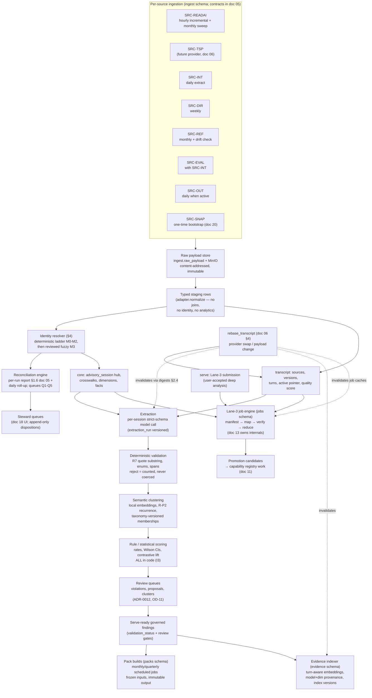
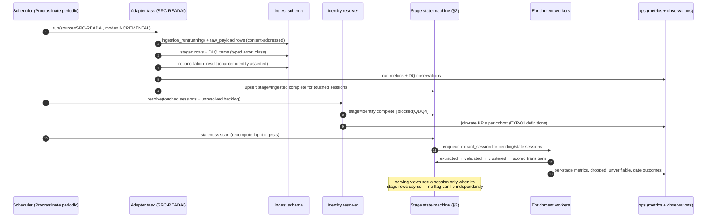
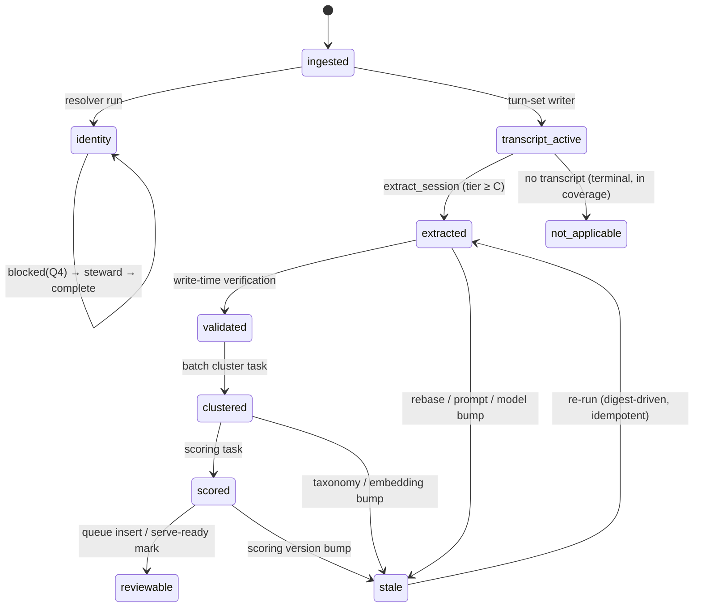

# 09 — Ingestion, Reconciliation, and Pipelines
**Platform:** Nwafeth Intelligence — منصة نوافث لذكاء الجلسات الاستشارية (Monsha'at Advisory Session Intelligence Platform)
**Status:** Draft for owner review · **Date:** 2026-08-02 · **Author:** Planning package (Fable 5)
**Depends on:** 05 (source contracts), 06 (TranscriptSource + rebase), 07 (architecture, TD-06), 08 (data model) · **Feeds:** 10, 11, 13, 19, 20, 21, 23
**Sources used:** GREENFIELD §8.1, §8.3, §11.1, §17, §23-09; MASTER_PROMPT §2.4–2.5, §5.3, Appendix D; arch/06 (full); arch/04 §5–§9

---

## 0. Purpose and doctrine

This document specifies the **offline plane's execution model**: how data moves from source adapters through identity resolution and enrichment to serve-ready findings, packs, and Lane-3 artifacts — as an **orchestrated, code-driven DAG with fail-closed defaults**, replacing the legacy pipeline of four hand-run CLI steps from a Windows shell with no orchestrator, no CI, and a one-command wrapper that contradicted its own runbook [FACT arch/06 §1, §7 hazard 1–2].

Doctrine, stated once and enforced throughout:

1. **No manual-CLI-step pipeline.** Every edge in the DAG is code: a task enqueued by the orchestrator when its preconditions are satisfied. The legacy F10 failure — `refresh_data.py` silently omitting a step and calling extraction without `--require-corrected` — is structurally unreachable because **ordering flags do not exist**: a stage task *refuses to start* until the state machine says its inputs are complete (fail-closed), instead of running with degraded input when a human forgets a flag [FACT arch/06 §7.1; CORE-BRIEF §12 F10]. [DECISION GREENFIELD §23-09 + CORE-BRIEF §12]
2. **Ops CLI = audited enqueue, never direct execution.** An `opsctl` command exists for every playbook in §7, but each command only inserts the same governed queue task with an `ops.audit_event` row (actor, reason). There is no code path where a shell command bypasses the state machine. [REC — alternative: allow direct script invocation for emergencies; rejected: that is exactly how the legacy 66-file scripts heap formed [FACT arch/06 §7.8]; revisit trigger: none foreseen]
3. **State lives in Postgres rows, never flags or files.** No boolean flag-soup on the session row (legacy `groq_processed`/`transcript_corrected`, whose conflict-clause asymmetry orphaned derived knowledge on re-ingest [FACT arch/06 §2, MASTER_PROMPT App. D]); no 592 KB checkpoint JSON on one developer's disk [FACT arch/06 §7.6]. §2 defines the row model.
4. **No ASR-correction stage, ever.** The DAG is ingest → resolve → enrich → serve-ready. There is no transcript-rewriting stage and none may be added; transcript quality is a provider-selection problem behind the `TranscriptSource` boundary (doc 06), with an optional read-time deterministic glossary that never writes [DECISION MASTER_PROMPT §2.4; GREENFIELD §2.6].
5. **A failed model round is INCOMPLETE, never silently empty.** The legacy ASR ensemble swallowed rate-limited rounds to `None`, making throughput loss indistinguishable from clean data [FACT arch/06 §6 "rate-limiting story"; CORE-BRIEF §12 F19]. Every model-call wrapper here returns a typed `Failure(cause)` that cannot be consumed as an empty result (§6.4).
6. **Everything observable (I16).** Every gate, every retry, every dropped finding, every queue depth is a metric and, where material, an `ops.data_quality_observation` row. Doc 19 owns dashboards/alerts; §5 and §8 define what is emitted.

Execution substrate: **Procrastinate on PostgreSQL** (doc 07 TD-06, ADR-0005); DAG logic and stage state live in our own `ingest`/`jobs` tables — the queue executes, the state machine decides [DECISION doc 07 TD-06].

---

## 1. The orchestrated DAG

### 1.1 Full pipeline graph



### 1.2 Edge catalogue — every edge is a coded trigger

| # | Edge | Trigger mechanism | Fail-closed default |
|---|------|-------------------|---------------------|
| E1 | source → raw payload | Scheduled Procrastinate periodic task per adapter (cadence per §3); webhook receipt where the provider offers one enqueues the same task | Adapter errors → DLQ (§3.2); run marked `failed`/`partial`; watermark **not advanced** past unfetched items |
| E2 | raw → staging | Same run, after payload persisted (raw-first rule: bytes stored before parsing) | Parse failure → `DLQ(PARSE)`, item excluded, counted; never a silent skip |
| E3 | staging → resolver | Enqueued at run completion for all sessions touched; nightly full pass over `resolution_status='unresolved'` | Resolver never writes a guess (legacy `meeting_uuid` rewrite lesson [FACT arch/04 §9]); below-threshold match → queue, not commit |
| E4 | staging → transcript | Turn-set writer creates a new `transcript.transcript_version` per distinct payload hash; first version auto-activates, later versions only via rebase | A changed transcript payload **never** mutates in place (I6, ADR-0007); it parks as an inactive version + `DQ-READAI-010` observation |
| E5 | transcript_active → extraction | Staleness scanner (§2.4) + new-session watcher enqueue `extract_session` when preconditions met | Task refuses to run without an active transcript of tier ≥ C (doc 06 §6.2); no-transcript sessions become `not_applicable(no_transcript)` — an explicit terminal state, not the legacy "mark processed and return `{}`" trick [FACT arch/04 §7.6] |
| E6 | extraction → validation | Same worker, same transaction scope per session: findings are validated **at write time** — `findings` never holds an unverified quote visible to serving [DECISION doc 07 §4.2] | Unverifiable finding → rejected + counted (`dropped_unverifiable`); never stored as trusted |
| E7 | validation → clustering | Batch task per (period, finding family) when validated backlog ≥ N or age ≥ 6h | Embedding model mismatch vs registry → stage `blocked(G-CLU-01)`, alert; never silently embeds with wrong model (I13) |
| E8 | clustering → scoring | Enqueued per (period, family) on cluster completion | Scoring reads only validated+clustered rows; missing upstream digest → refuse |
| E9 | scoring → review queues | Review-gated families (violations CAP-B4, proposals, clusters) inserted into review queues; others go straight to serve-ready | Review-gated findings are **not serveable** until approved (ADR-0012); absence of review = absence from answers, with coverage note |
| E10 | serve-ready → pack build | Scheduled monthly/quarterly Procrastinate periodic task (doc 07 TD-06); manual reissue via `opsctl pack reissue` (audited) | Pack build blocks below enrichment-completeness threshold (§5 G-PACK-01) — no silently short pack |
| E11 | serve-ready → evidence index | Incremental embed task per new/changed evidence unit; full index version rebuild via playbook PB-05 | Index rows carry model+dim+version provenance; a query against a mismatched index version hard-fails (I13) |
| E12 | serve → Lane-3 | Transactional enqueue: job row + conversation turn in one commit (doc 07 §3) | Lane-3 reads a **frozen corpus manifest** (`jobs.corpus_snapshot`); a rebase mid-job invalidates via manifest digest, job partition marked, never silently mixed sources (doc 13) |
| E13 | rebase → everything | `rebase_transcript` operation (doc 06 §4) drives invalidation through content digests (§2.4) | The flip is blocked by the R7 re-verification gate (doc 06 §4.3); invalidation is automatic, not remembered |

There is **no edge** a human executes by hand. The two human touchpoints — steward queue dispositions (E3/E9) and pack sign-off (OD-10) — are decisions recorded in the database that *unblock* coded edges, not steps that *perform* them.

### 1.3 The daily incremental cycle (sequence)



---

## 2. Pipeline state machine per session

### 2.1 Why rows, not flags

The legacy system tracked pipeline position with two booleans on the meeting row plus one table's mere existence, and the combination lied constantly: `groq_processed` was excluded from the re-ingest conflict update (stale-true), `transcript_corrected` was reset by re-ingest (destroying work), step 4 had **no flag at all** and its absence emptied analytics silently [FACT arch/06 §1–2; arch/04 §10]. The replacement: **one row per (session, stage)** with explicit state, reason, run reference, and content digests — plus an append-only transition log. A flag cannot drift because there is no flag; there is a row whose digest is recomputed against reality.

### 2.2 Stage and state model (DDL sketch; doc 08 owns final DDL)

```sql
CREATE TYPE ingest.pipeline_stage AS ENUM (
  'ingested',          -- raw payload + staged rows persisted
  'identity',          -- resolution ladder outcome recorded (§4)
  'transcript_active', -- exactly one (source, source_version) active, quality-scored
  'extracted',         -- per-session strict-schema extraction complete under a run
  'validated',         -- deterministic validation of that run's findings complete
  'clustered',         -- cluster memberships assigned under a taxonomy version
  'scored',            -- rule/statistical scoring computed in code
  'reviewable'         -- review-gated findings enqueued; non-gated marked serve-ready
);

CREATE TYPE ingest.stage_state AS ENUM (
  'pending','running','complete','failed','blocked','stale','not_applicable');

CREATE TABLE ingest.session_stage_state (
  advisory_session_id bigint NOT NULL REFERENCES core.advisory_session,
  stage           ingest.pipeline_stage NOT NULL,
  state           ingest.stage_state NOT NULL DEFAULT 'pending',
  state_reason    text,          -- gate id / failure class / staleness cause;
                                 -- CHECK: mandatory unless state IN ('complete','pending')
  run_ref         jsonb,         -- {"extraction_run_id":…} | {"resolver_version":…} | …
  input_digest    char(64),      -- SHA-256 over canonical inputs (§2.4)
  produced_digest char(64),      -- SHA-256 over canonical outputs (cheap downstream check)
  attempts        int NOT NULL DEFAULT 0,
  updated_at      timestamptz NOT NULL DEFAULT now(),
  PRIMARY KEY (advisory_session_id, stage)
);

CREATE TABLE ingest.stage_transition (          -- append-only audit (I16, R13)
  transition_id  bigint GENERATED ALWAYS AS IDENTITY PRIMARY KEY,
  advisory_session_id bigint NOT NULL,
  stage          ingest.pipeline_stage NOT NULL,
  from_state     ingest.stage_state,
  to_state       ingest.stage_state NOT NULL,
  reason         text,
  actor          text NOT NULL,   -- 'task:extract_session' | 'invalidator:rebase_op_17'
                                  -- | 'steward:<user>' | 'scanner:staleness'
  task_id        bigint,          -- Procrastinate task id for reconstruction
  occurred_at    timestamptz NOT NULL DEFAULT now()
);
```

[REC] State lives in `ingest` (with `jobs` holding Lane-3 job state) per doc 07 TD-06's split. Alternative: a single `status` column on `core.advisory_session` — rejected as the flag-soup pattern under a different name; alternative: event-sourcing only (derive state from transitions) — rejected for query cost on the hot serving path; the pair (current-state row + append-only log) gives O(1) reads and full history. Revisit trigger: none foreseen.

### 2.3 States table — entry/exit semantics

| Stage | `complete` means | Depends on | Notable non-complete states |
|---|---|---|---|
| `ingested` | Raw payload(s) content-addressed in MinIO + `ingest.raw_payload`; staged rows written; reconciliation counters closed for the run | — | `failed(PARSE)` → DLQ item linked |
| `identity` | `resolution_status` terminal: `matched_deterministic` \| `matched_fuzzy_reviewed` \| `steward_confirmed` \| `not_advisory` \| `no_provider_expected` | `ingested` (both provider and internal sides for a match) | `pending(awaiting_internal_feed)`; `blocked(Q4_ambiguous)` — steward required. **Does not block extraction** (§5 G-IDR-01): unresolved sessions still enrich; per-consultant analytics exclude them with declared coverage (I8) |
| `transcript_active` | Exactly one `(source, source_version)` active in `transcript.active_transcript` + quality tier computed (doc 06 §6) | `ingested` | `not_applicable(no_transcript)` — terminal, counted in coverage; `blocked(G-TRX-02_tier_D)` for quote-bearing use |
| `extracted` | One `extraction_run_id` covering the session under the current active `(source, source_version)`, prompt_sha, model_id, schema_sha | `transcript_active` complete | `failed(schema)` after 1 bounded repair (GREENFIELD §10.4); `failed(rate_limited)` — cause always recorded (§6.4); `stale(rebase\|prompt_bump)` |
| `validated` | Every finding of that run passed/failed deterministic checks; rejects counted with reasons | `extracted` | `failed(verifier_error)` — verifier crash is a failure, never a pass (I18) |
| `clustered` | Cluster memberships written under `(taxonomy_id, taxonomy_version, embedding_model_id, params_sha)` | `validated` + embedding service + active taxonomy version | `blocked(G-CLU-01_model_mismatch)`; `stale(taxonomy_bump\|embedding_bump)` |
| `scored` | Deterministic scores/features written by scoring code version | `clustered` (+ `core` facts for CAP-D* joins) | `stale(scoring_version_bump)` |
| `reviewable` | Review-gated findings enqueued to review queues; non-gated marked serve-ready in `findings.review_status` | `scored` | `pending(queue_backlog)` is normal; queue age is a doc 19 alert, not a pipeline failure |



### 2.4 Content digests and automatic invalidation

Each stage row stores `input_digest` = SHA-256 over the canonical serialization of exactly the inputs that stage consumed:

| Stage | `input_digest` covers |
|---|---|
| `extracted` | active transcript content digest (per `transcript.transcript_version.content_sha256`) ⊕ `prompt_sha` ⊕ `model_id` ⊕ `schema_sha` ⊕ seed-vocabulary version |
| `validated` | `extraction_run_id` ⊕ verifier code version |
| `clustered` | set-digest of validated finding ids ⊕ `embedding_model_id` ⊕ `taxonomy_id:taxonomy_version` ⊕ clustering `params_sha` |
| `scored` | `clustered.produced_digest` ⊕ scoring code version ⊕ registry version |

A **staleness scanner** (periodic task, cheap: digest comparison only) recomputes the expected digest from current reality; mismatch flips the stage to `stale(cause)` and cascades downstream in one transaction. This is what makes invalidation *automatic*:

| Invalidation trigger | What flips to `stale` automatically | What does NOT change |
|---|---|---|
| Re-ingest, identical bytes | Nothing — content-addressed no-op (`unchanged` counter) | Everything |
| Re-ingest, changed **metadata** payload (participants, provider metrics; transcript hash unchanged) | `identity` re-run enqueued; `core` facts get a new version | Extraction and downstream (transcript digest unchanged) |
| Provider delivers **changed transcript** bytes (`DQ-READAI-010`) | Nothing directly — new inactive `transcript_version` parks; steward-approved **rebase** does the flip | Active analytics until rebase completes (never a silent mid-flight source change) |
| `rebase_transcript` flip (doc 06 §4) | `extracted`→`reviewable` for rebased sessions; `evidence` index entries for those sessions; Lane-3 cached artifacts whose `corpus_snapshot` covers them; live views; review fingerprints (doc 06 §4.4 checklist) | Frozen packs (immutable by ADR-0011 — supersession, not mutation); raw payloads; old transcript versions (retained per OD-08 window) |
| Taxonomy version bump (merge/split/introduce) | `clustered` + `scored` for affected finding families | `extracted`/`validated` — extraction stores quotes and seed labels; classification-to-taxonomy is the clustering stage's job, so re-extraction is NOT needed [REC — this is why classification is separated from extraction; alternative: taxonomy inside the extraction prompt, rejected: every taxonomy change would cost a full 17k-call re-extraction; revisit trigger: EXP-04 shows two-step classification loses precision vs one-step] |
| Extraction prompt/model/schema bump | Nothing until PB-01 promotes the new run — new runs are **shadow** first (§7.1) | Active run keeps serving until cutover |
| Embedding model change | `clustered` + `evidence` index versions (PB-05) | Extraction, validation |
| Scoring code version bump | `scored` only | Everything upstream |

The legacy defect class this kills: re-ingest replacing turns while the meeting stayed marked "extracted", leaving knowledge rows describing a transcript that no longer existed [FACT MASTER_PROMPT App. D]. Here the transcript content digest changes ⇒ the `extracted` digest mismatches ⇒ `stale` ⇒ re-enqueued, automatically, with the transition logged.

### 2.5 Serving visibility rule

Serving views (doc 11) join `ingest.session_stage_state` and expose a session's findings only when the required stages are `complete` (and review gates passed where the capability demands them). A `stale` stage removes the session from *live* views' current-version reads and adds it to the coverage exclusions block (I8) until re-enrichment lands. Frozen packs are unaffected (they pin their input snapshot). This means **an operator can never serve stale findings by forgetting a step** — visibility is derived from the same rows the pipeline writes.

### 2.6 Worked example — one session, end to end

A session held 2026-08-01, provider title `9f3c1a2e-…-b21d44f0-…` (era 2), service «الإقراض والتمويل»:

| T | Event | State rows after |
|---|---|---|
| T+0h | Hourly SRC-READAI incremental fetches the meeting; payload SHA `a41f…` stored; 214 turns staged | `ingested=complete`; `identity=pending(awaiting_internal_feed)`; `transcript_active=complete` (readai, v1, tier B) |
| T+2h | Extraction task runs (`extraction_run 312`, gpt-oss-120b, prompt `c7e9…`): 3 challenges, 1 decision point, 6 satisfaction signals; one satisfaction quote «الحمدلله استفدت وايد من الجلسة» verified as verbatim substring of turn 187; one challenge quote fails substring check → rejected, `dropped_unverifiable=1` | `extracted=complete(run 312)`; `validated=complete` (10 kept / 1 dropped) |
| T+8h | Clustering batch assigns the challenge «تأخر صرف التمويل» to cluster `CHAL-014` under taxonomy v3; scoring computes features | `clustered=complete(tax v3)`; `scored=complete`; `reviewable=complete` (no violation findings → no review gate) |
| T+26h | Daily SRC-INT extract delivers internal session `b21d44f0-…`; resolver rung M1 matches the trailing title claim, unique → `matched_deterministic` | `identity=complete`; session now visible to per-consultant analytics |
| T+30d | Provider re-delivers the meeting with **changed transcript bytes** during a sweep (`payload_sha b902…`) | New inactive `transcript_version v2` parks; `DQ-READAI-010` WARN observation; **no stage flips** — active analytics untouched until a steward-approved rebase (PB-03) |
| Later | `rebase_transcript` onto the clean provider (OD-06) flips the active source | Digest cascade: `extracted..reviewable → stale(rebase)` → resolved to the pre-verified shadow run by pointer; evidence embeddings invalidated; the session's `CHAL-014` membership recomputed under the new text |

Every row transition above exists in `ingest.stage_transition` with actor and task id — the whole lifecycle is reconstructable without reading a single log file (R13).

---

## 3. Per-adapter workflow specs

Doc 05 owns the *contracts* (transport, auth, dictionaries, quality rules). This section owns the *runtime workflow*: schedules, cursors in motion, retry/DLQ policy, backfill, and the metrics each adapter run emits. All adapters share one skeleton; per-adapter deltas follow.

### 3.1 Shared run skeleton (pseudocode)

```python
async def run_adapter(source_id: str, mode: RunMode, window: Window | None):
    run = start_run(source_id, mode)                      # ingest.ingestion_run(running)
    cursor = load_cursor(source_id, cursor_name_for(mode))# backfill cursors are separate rows
    plan = adapter.plan_run(cursor, mode, window)
    for ref in adapter.list_changes(plan):                # guarded pagination (doc 05 §2.4)
        raw = adapter.fetch(ref)
        persist_raw(raw)                                  # content-addressed BEFORE parsing
        verdict = adapter.classify(raw)                   # OK | WARN(rules) | BLOCK(rules)
        if verdict.block:
            dlq(run, ref, 'QUALITY_BLOCK', verdict); continue   # counted, never silent
        try:
            stage_rows = adapter.normalize(raw)           # typed; NO identity, NO joins
            upsert_staging(stage_rows)                    # idempotent on natural key + sha
            mark_stage(session_of(ref), 'ingested', 'complete')
        except ParseError as e:
            dlq(run, ref, 'PARSE', e)                     # item-level isolation
    advance_cursor_if_clean(run, cursor)                  # never past unfetched items
    report = adapter.reconcile(run)                       # doc 05 §1.6 envelope
    assert_counter_identity(report)                       # listed == skipped+fetched+dlq
    finish_run(run, status_from(report))                  # succeeded | partial | failed
    enqueue_resolver(touched_sessions(run))
    emit_metrics_and_observations(run, report)
```

Retry policy is two-layered:
- **Within-run, per item:** transport errors retry 3× (1s/4s/16s + jitter) inside the fetch; then the item goes to `DLQ(TRANSPORT)` and the run continues (item isolation — one bad meeting never aborts a run, unlike the legacy unguarded pagination `IndexError` that killed whole ingests [FACT arch/04 §5.4]).
- **DLQ replay:** per doc 05 §1.5 — `NEW → RETRYING (≤5, 1m/5m/30m/2h/12h jittered) → REPLAYED | DEAD`; `AUTH` pages ops at attempt 1 (rotated-token conflict signature, OD-13); `QUALITY_BLOCK` skips retry straight to steward triage. DLQ depth >50 or age >72h per source = paged alert.

### 3.2 Per-adapter deltas

| Adapter | Schedule (priority §6.5) | Cursor/watermark (runtime behaviour) | Idempotency key | Backfill procedure | Source-quality metrics emitted per run |
|---|---|---|---|---|---|
| **SRC-READAI** | Hourly `INCREMENTAL`; monthly `SWEEP` (trailing 3 months); webhook (if enabled) enqueues an immediate incremental | Head-walk with stop after K=3 all-unchanged pages; 48h overlap re-read; `{last_cursor, high_watermark, stop_reason}` in `ingest.source_cursor` — **never trusts list ordering** [FACT arch/05 §3.4 lesson] | `(SRC-READAI, meeting_ulid, payload_sha256)` | §3.3 generic; chunked by month; era-aware title parsing per chunk | listed/fetched/unchanged/changed; title-era distribution + `unrecognized` count (3rd-era detector); missing `speaker_role` rate (baseline 5.7% [FACT CORE-BRIEF §11]); turns/session distribution; payload-changed-post-analysis count (`DQ-READAI-010`); token-refresh count (rotation health, OD-13) |
| **SRC-TSP** (future) | Provider-native (webhook or poll, T+6h target) | Per doc 06 §2 conformance suite; cursor strategy fixed at adapter certification | `(SRC-TSP, provider_meeting_id, payload_sha256)` | First load runs as the **rebase rehearsal** (doc 06 §4, doc 20) — not a plain backfill | Same family as SRC-READAI + provider quality metadata coverage (per-turn confidence presence) |
| **SRC-INT** | Daily `INCREMENTAL`; weekly full-snapshot `SWEEP` (row counts + per-column checksums) | `max(updated_at)` + 48h lookback re-read | `(SRC-INT, internal_session_id, updated_at, row_sha256)` | Historical windows by month; enum-mapping table must cover the window's status values first (else `DQ-INT-003` blocks the chunk — fail closed on unknown enums) | volume band vs ±40% trailing mean; unknown-enum count; null `service_category` rate (baseline 22.7%); status/attendance distribution; id-vanished count (`DQ-INT-009`) |
| **SRC-DIR** | Weekly | Full-set compare (small table); diff staged as versioned dimension updates | `(SRC-DIR, consultant_ref, row_sha256)` | Full re-pull (cheap) | new/changed/retired consultants; alias churn; orphan consultant refs (Q3 feed) |
| **SRC-REF** | Monthly + on-demand | Full-set compare with drift detection | `(SRC-REF, code_type, code, row_sha256)` | Full re-pull | code drift count; codes referenced-but-missing (Q3) |
| **SRC-EVAL** | With SRC-INT run (logical split, doc 05 §7) | Inherited from SRC-INT | `(SRC-EVAL, internal_session_id, instrument, submitted_at, row_sha256)` | With SRC-INT backfill | rating lag distribution (`submitted_at - actual_at`); out-of-range count; rating→session link rate |
| **SRC-OUT** (gated on OD-07) | Daily when active | `updated_at` + 48h lookback | `(SRC-OUT, outcome_ref, updated_at, row_sha256)` | Activation backfill = PB-05 pattern | outcome→session join rate; followup-booked verification rate |
| **SRC-SNAP** | One-time (doc 20 owns execution) | None — manifest-driven | `(SRC-SNAP, table, row_pk, snapshot_sha256)` | Re-run = restore from same checksummed snapshot; idempotent by manifest | manifest-vs-restored checksum identity; migration balance sheet (in = out + named exclusions, zero unexplained) |

### 3.3 Generic backfill procedure (all adapters)

1. **Request:** steward/engineer files a backfill (source, window, reason) via `opsctl backfill create` → `ops.audit_event` + a `mode=BACKFILL` run plan. No ad-hoc window flags on incremental runs — the legacy `--since` re-run hazard class is retired along with the destruction it caused [FACT arch/06 §2 "--until guard"].
2. **Cursor isolation:** backfill uses its own cursor rows (`cursor_name='backfill:<window>'`); the incremental high-watermark is **never** touched by a backfill.
3. **Chunking:** calendar-month chunks, processed oldest-first at priority 10 (§6.5) under the `backfill` rate budget; per-chunk reconciliation report; a failed chunk isolates (others proceed) and is retried per DLQ policy.
4. **Idempotency:** content-addressing makes overlap free — a re-delivered identical payload is `unchanged`; a changed one becomes a new version routed through the normal invalidation rules (§2.4). Backfills therefore cannot destroy anything (the legacy re-ingest destroyed ASR corrections; there is no equivalent destructible state here — raw is immutable, derived is digest-tracked).
5. **Completion:** requires the chunk reconciliation identity to hold and the resolver pass to complete; the closing report states sessions added/changed, join-rate deltas per cohort, and enrichment tasks enqueued (only for digest-changed sessions).

### 3.4 Reconciliation reports and the daily roll-up

Every run emits the doc 05 §1.6 envelope into `ingest.reconciliation_result`. A daily **pipeline reconciliation roll-up** task aggregates across sources into one operator-facing report (and CAP-D9 input):

```json
{
  "date": "2026-08-02",
  "sessions": {"provider_in": 41, "internal_in": 44,
               "matched": 39, "unmatched_provider": 2,
               "unmatched_internal": 3, "ambiguous": 0},
  "queues": {"Q1": 12, "Q2": 7, "Q3": 1, "Q4": 2, "Q5": 9,
             "oldest_age_days": {"Q1": 4, "Q4": 1}},
  "enrichment": {"pending": 41, "running": 3, "complete": 16870,
                 "failed": 2, "stale": 0, "not_applicable": 37},
  "join_rate_cohort_current": {"provider_match_rate": 0.97,
                               "consultant_link_rate": 0.99},
  "dlq_depth": {"SRC-READAI": 1, "SRC-INT": 0},
  "freshness": {"SRC-READAI_lag_h": 3.2, "SRC-INT_lag_h": 11.0}
}
```

Counts in / matched / unmatched / ambiguous + queue depths are thus first-class, queryable, alertable data — the legacy had no pipeline-status view at all ("is the pipeline healthy?" was answered by grepping logs) [FACT arch/06 §6].

---

## 4. Identity reconciliation

### 4.1 Doctrine

Deterministic joins first, fuzzy matching only under review, and **never store a guess** — the legacy pipeline guessed which title UUID half was the session id, stored the guess even when nothing matched, and later "repaired" it by rewriting `meeting_uuid` in a backfill whose dry-run didn't preview that mutation [FACT arch/04 §9]. Unresolved identity is a nullable FK + `resolution_status` + provenance on `core.provider_meeting_map` / `core.internal_session_map` — never a magic string (CORE-BRIEF §6; ADR-0006).

```sql
-- resolution provenance columns (doc 08 owns full DDL)
resolution_status  text NOT NULL DEFAULT 'unresolved' CHECK (resolution_status IN
  ('unresolved','matched_deterministic','matched_fuzzy_reviewed',
   'steward_confirmed','ambiguous','not_advisory','no_provider_expected')),
matched_by         text,      -- 'M0:provider_ref' | 'M1:uuid' | 'M2:natid_time'
                              -- | 'M3:fuzzy' | 'steward:<user>'
match_score        numeric,   -- NULL for deterministic rungs
resolver_version   text NOT NULL,
resolved_at        timestamptz,
evidence           jsonb      -- claims + candidates at decision time (auditable)
```

### 4.2 The match ladder (run in order; first success wins; EXP-01 calibrates)

| Rung | Method | Auto-commit? | Notes |
|---|---|---|---|
| **M0** | Direct key: internal feed carries the provider meeting id (or vice versa) | Yes — `matched_deterministic` | Only exists if OD-07's feed includes it [ASSUME OD-07]; if granted, M1–M3 become residual paths and the SLO targets move to ≥0.99 (doc 05 §10.2 revisit trigger) |
| **M1** | Title-claim UUID = `internal_session_id`, exact and **unique** | Yes — `matched_deterministic` | Both era-2 UUID halves are tested as claims (doc 05 §2.7); if both halves match **different** internal sessions → `ambiguous` → Q4, auto-match forbidden |
| **M2** | Era-1 composite: national-ID → consultant crosswalk (P3-restricted column, OD-14) AND session time proximity: `|provider_start - internal actual_at| ≤ 30min` AND unique candidate | Yes — `matched_deterministic` | The national ID is used **only** inside the resolver's crosswalk; it is pseudonymized to the consultant surrogate everywhere else (doc 05 §2.7 rule 4) |
| **M3** | Reviewed fuzzy: score over (normalized consultant name similarity, time proximity, duration similarity, programme/service agreement) | **Only above τ_auto with margin** | Everything else → steward queue with the top-3 candidates and their scores |

**M3 scoring [REC — calibrate in EXP-01 on a 500-pair labelled sample before production]:**

```
score = 0.45·name_sim + 0.30·time_sim + 0.15·duration_sim + 0.10·dim_agreement
name_sim: token-set Jaccard over normalized Arabic name tokens
time_sim: max(0, 1 − |Δstart| / 45min)
duration_sim: max(0, 1 − |Δduration| / max(durations))
dim_agreement: 1 if programme/service_category consistent, else 0

auto-accept  : score ≥ 0.92 AND unique candidate AND margin_to_second ≥ 0.15
               → matched_fuzzy_reviewed is still NOT granted automatically:
                 auto-accepts are batch-sampled 10% for steward audit for the
                 first 3 monthly cohorts, then 2% steady-state
review band  : 0.70 ≤ score < 0.92 → Q1/Q2 queue with candidates
below        : score < 0.70 → remains unresolved (retried on each new SRC-INT delivery)
```

Arabic name normalization (shared with SRC-DIR alias handling): strip tashkīl; unify `أ/إ/آ → ا`; unify `ى → ي`; unify `ة → ه` for comparison only; drop connective tokens `بن، ابن، ال، آل، بنت، عبد` as standalone tokens; drop tokens < 3 chars. Worked example: «عبدالله بن محمد العتيبي» and «عبد الله محمد العتيبي» both normalize to the token set `{عبدالله، محمد، عتيبي}` → `name_sim = 1.0`; with `Δstart = 12min` and matching `service_category` «الإقراض والتمويل», score = 0.45 + 0.30·0.73 + 0.15·d + 0.10 ≥ 0.92 → auto-accept candidate subject to uniqueness and margin. The legacy "unique first-token fallback" (matching on «محمد» alone) is **forbidden** — it is exactly how wrong consultants get credited [INFER from arch/04 §9.7 mechanics].

### 4.3 Queues and steward workflow

Queues Q1–Q5 are defined in doc 05 §10.1 (population, dispositions, SLAs). Runtime mechanics owned here:

- The resolver populates/retires queue rows transactionally with resolution writes; a queue row always carries the `evidence` jsonb snapshot the decision needs (no re-derivation in the UI).
- **Automatic retry on new data:** every SRC-INT delivery re-runs M0–M2 over `unresolved` and Q1; every SRC-DIR refresh re-runs Q3. Steward effort is spent only on what determinism cannot close.
- Dispositions are append-only (ADR-0012, OD-11); `not_an_advisory_session` and `no_recording_expected` are terminal `resolution_status` values that remove sessions from denominators *with a named exclusion*, never silently.
- Q4 (`ambiguous`) is steward-only; the resolver **never** auto-breaks a tie, whatever the score [DECISION — precision over recall for identity; a mis-join poisons every per-consultant metric downstream].

### 4.4 Join-rate SLOs and alerting

KPI definitions and targets are doc 05 §10.2 (EXP-01): post-go-live cohorts `provider_match_rate ≥ 0.95`, `consultant_link_rate ≥ 0.98`, `ambiguity_rate ≤ 0.5%`; legacy baselines to beat: ~8% report-row bridge match, 9.6% `PENDING`, ~36% consultant-resolved [FACT CORE-BRIEF §11]. Pipeline-side enforcement [REC]:

| Condition | Action |
|---|---|
| Cohort KPI below target on 2 consecutive daily roll-ups | Steward alert + queue triage escalation |
| `provider_match_rate < 0.85` (floor) for the current cohort | Page ops; pack builds for that period proceed but the coverage block **must** carry the match-rate caveat prominently (I8) — publication is an owner decision, not silently blocked and not silently clean |
| `ambiguity_rate > 2%` | Freeze M3 auto-accepts (fall back to review-everything) until EXP-01 recalibration — a rising ambiguity rate is the classic symptom of an upstream format change (a third title era) |

---

## 5. Data-quality gates

Rule: every gate is **either blocking or mark-and-continue, decided here, per gate** — never a per-operator choice at run time (the legacy made correctness opt-in via flags; F10). Every gate outcome increments `pipeline_gate_total{gate_id, outcome}` and, where material, writes an `ops.data_quality_observation` (I16).

| Gate | Stage | Condition | Policy | Rationale |
|---|---|---|---|---|
| G-ING-01 | ingest | Payload unparseable / schema drift | **BLOCK item** → DLQ(`PARSE`/`SCHEMA_DRIFT`) | Item isolation; run continues |
| G-ING-02 | ingest | Contract BLOCK-severity DQ rule (doc 05 `DQ-*`) | **BLOCK item** → DLQ(`QUALITY_BLOCK`), steward triage | Retrying identical bytes cannot pass |
| G-ING-03 | ingest | Volume outside band (556–1,512/month scaled, ±40% SRC-INT) | Mark — run `partial` until steward acks | A quiet feed is a symptom, not necessarily an error |
| G-IDR-01 | identity | Unresolved/ambiguous identity | **Mark** — enrichment proceeds; per-consultant serving excludes with named coverage exclusion (I8) | Transcript-derived findings don't need identity; blocking would starve enrichment on steward latency |
| G-TRX-01 | transcript | No transcript / zero turns | **Terminal state** `not_applicable(no_transcript)`, counted in coverage | Explicit absence — not the legacy "processed=true with empty result" [FACT arch/04 §7.6] |
| G-TRX-02 | transcript | Quality tier D (doc 06 §6.2) | Mark — extraction runs, findings flagged `quality_qualified`; quote-bearing capabilities (CAP-B4) exclude them; rebase refuses tier-D targets (doc 06) | Salvage what's usable, never accuse from garbage |
| G-EXT-01 | extracted | Strict-schema output invalid after 1 bounded repair | **BLOCK session-task** → `failed(schema)`, retried per policy, then failure visible in backlog | GREENFIELD §10.4; never coerce |
| G-EXT-02 | extracted | Label outside seed vocabulary | **Mark finding** → R-P1 proposal row; finding held out of taxonomy-keyed capabilities until reviewed | Seeds-not-closed-vocabularies (R-P1) without silent coercion — the legacy `_safe_enum → "other"` defaulting destroyed signal [FACT arch/04 §7 table] |
| G-VAL-01 | validated | Quote not verbatim substring of active turn (R7/I7) | **BLOCK finding** → rejected, `dropped_unverifiable` counter | The finding never exists for serving; count is in coverage |
| G-VAL-02 | validated | turn_index / speaker_role / meeting identity mismatch | **BLOCK finding** → rejected with reason | Same |
| G-CLU-01 | clustered | Embedding model/dim ≠ registry entry | **BLOCK stage** `blocked(G-CLU-01)` + alert | I13/I17 — provenance integrity beats freshness |
| G-SCO-01 | scored | Cell support n < 30 | **Not a pipeline gate** — scoring computes and stores; *serving* suppresses with Wilson-CI rules (doc 10) | Pipeline stores truth; presentation applies suppression |
| G-REV-01 | reviewable | Review-gated family (CAP-B4 violations, cluster promotions) lacking approval | **BLOCK serving of those findings** — capability answers with "pending review" coverage note | ADR-0012; accusations require humans (E.0 rule 8) |
| G-PACK-01 | pack build | < 98% of period sessions in terminal enrichment states (`complete` or `not_applicable`) [REC threshold] | **BLOCK pack build** + alert; owner may override via audited `opsctl pack force` which stamps the shortfall into the pack's coverage block | No silently short pack; override exists because month-end waits for no backlog, but it must leave a mark. Revisit trigger: threshold tuned after 3 production months |
| G-L3-01 | Lane-3 | Any failed session-task in a partition | Partition = `INCOMPLETE`, declared in the answer's coverage (reason code `DEEP_JOB_INCOMPLETE`) | F19 — never silently under-report (doc 13 owns mechanics) |

Observability contract per gate (I16): metric with `gate_id`/`outcome` labels, structured log with session/run ids, observation row where steward action may be needed. Doc 19 wires alerts (e.g., G-VAL-01 rate > 2% of findings in an extraction run ⇒ suspect prompt/model drift ⇒ auto-open ops task).

---

## 6. Scheduling and concurrency

### 6.1 Worker pool topology

| Pool | Default size | Work | Bound by |
|---|---|---|---|
| `ingest_io` | 4 tasks | Adapter runs, DLQ replays | Source rate limits (Read.ai token bucket 80 req/60s inherited from contract [FACT arch/05]) |
| `enrich_model` | Groq semaphore (§6.2) | Extraction, Lane-3 map/verify calls, taxonomy classification | Provider rate budget |
| `enrich_cpu` | 2 processes × batch | Embeddings (local — Groq has none [FACT groq-docs 2026-08-02]), clustering, scoring | **CPU-only** (no GPU in the environment [DECISION owner 2026-08-03]) |
| `resolver` | 2 tasks | Identity ladder runs | DB |
| `packs` | 1 task | Monthly/quarterly pack builds | Wall-clock window |
| `maintenance` | 2 tasks | Staleness scanner, retention, TTL cleanup, restore drills | — |

Defaults are configuration, not literals in code (I17-adjacent); each has a doc 19 saturation metric. [REC — sizes derived from corpus scale: ~1.2k sessions/month steady-state means the daily enrichment increment is ~40 sessions ≈ 40 model calls, trivially small; pools are sized for reprocessing bursts, not steady state. Revisit trigger: monthly volume > 3,000 or multi-tenant expansion.]

### 6.2 Bounded model-call semaphores and rate budgets

One **budget manager** governs every Groq call from both planes (serving's Lane-1/composer calls included — they are latency-critical and get a reserved floor):

```sql
CREATE TABLE ops.model_rate_budget (
  model_id     text NOT NULL,            -- registry FK (ADR-0013)
  job_class    text NOT NULL CHECK (job_class IN
    ('serving','lane3_user','enrichment','reprocessing_backfill')),
  share_pct    int NOT NULL,             -- of provider RPM/TPM when contending
  floor_pct    int NOT NULL DEFAULT 0,   -- reserved even under contention
  max_concurrency int NOT NULL,          -- in-flight cap for this class
  PRIMARY KEY (model_id, job_class)
);
```

| job_class | share when contending | floor | Default in-flight cap (gpt-oss-120b) |
|---|---|---|---|
| `serving` (Lane-1 planner, composer) | 20% | **15%** | 8 |
| `lane3_user` (user-accepted deep jobs) | 50% | 10% | 12 |
| `enrichment` (new-session extraction) | 20% | 5% | 8 |
| `reprocessing_backfill` | 10% | 0% — and prefer **Batch API** (50% discount, 24h–7d window fits backfills; never user-facing Lane-3 [FACT groq-docs 2026-08-02; DECISION CORE-BRIEF §7]) | 4 |

Idle capacity is borrowable by any class except into `serving`'s floor. Enforcement is a per-process asyncio semaphore sized from `(share × provider limit) / process count`, with the budget rows as the single source of configuration. [REC — alternative: a central token-bucket service; rejected as an extra moving part at this scale; revisit trigger: >3 worker nodes or observed 429 rate >1% sustained.]

**F19 lessons, codified:**
- No unbounded `asyncio.gather` over model calls anywhere — the legacy fired ~168 concurrent calls from a single meeting and ~500 in flight, converting rate limits into silent under-detection [FACT arch/06 §6].
- Every 429 is recorded with `cause='rate_limited'` on the task attempt — the legacy retry loop lost the cause (`last_exc` never assigned on the 429 branch), so an all-429 exhaustion raised a generic error precisely when operators needed to see rate limiting [FACT arch/06 §6].

### 6.3 Retry ladder for model calls

| Attempt | Delay | Notes |
|---|---|---|
| 1 → 2 | 10s + jitter | 429/5xx/timeout only; 400-class never retried (contract error) |
| 2 → 3 | 60s + jitter | Schema-invalid gets exactly **one bounded repair** prompt (GREENFIELD §10.4), which does not consume a transport retry |
| exhausted | — | Task `failed(cause)` with cause ∈ `rate_limited`/`timeout`/`provider_5xx`/`schema`/`contract`; visible in backlog metrics; DLQ-style replay via staleness scanner re-enqueue at decaying priority |

### 6.4 Typed failure — the "never silently empty" contract (pseudocode)

```python
@dataclass
class MapResult:      # extraction / Lane-3 map call result
    findings: list[Finding]        # may legitimately be empty
@dataclass
class MapFailure:
    cause: Literal['rate_limited','timeout','provider_5xx','schema','contract']
    attempts: int

def consume(r: MapResult | MapFailure):
    match r:
        case MapResult(findings): ...   # empty list = genuinely clean session
        case MapFailure(cause):  ...    # MUST mark task failed / partition INCOMPLETE
# There is no code path where MapFailure coerces to an empty findings list.
# The type checker + a structural CI grep (no `except ... return []` around model
# calls) enforce it — the legacy `_call_json` returned None on exhaustion and the
# caller treated None as "clean transcript" [FACT arch/06 §6].
```

### 6.5 Job priorities

Queue priority (Procrastinate numeric priority; higher first):

| Priority | Class |
|---|---|
| 90 | **User-facing Lane-3 jobs** (a human is waiting; no cost ceiling, bounded concurrency only [DECISION MASTER_PROMPT §5.3]) |
| 80 | Rebase verification batches (they block a pending flip) |
| 70 | Incremental ingest + resolver |
| 60 | Enrichment of new sessions |
| 50 | Scheduled pack builds (month/quarter close) |
| 40 | Evidence index refresh |
| 30 | Taxonomy reclassification |
| 10 | Backfills / full-corpus reprocessing |

Priority governs dequeue order; **budget shares** (§6.2) govern model-call throughput — so a whole-corpus reprocessing job can be queued at priority 10 and still make progress on idle capacity without ever starving a Lane-3 user job. Preemption is by budget reallocation, never by killing a running task (tasks are short: one session per call).

### 6.6 Task idempotency and transaction boundaries

Every enqueued task carries a **task idempotency key**; Procrastinate's queueing lock plus these keys make duplicate enqueues no-ops:

| Task | Idempotency key | Transaction boundary |
|---|---|---|
| `adapter_run` | `(source_id, mode, window_or_cursor_epoch)` | One transaction **per item** (payload + staging + stage row) — a crash loses at most the in-flight item, and the content-addressed re-fetch is free; run bookkeeping commits separately. [REC — the legacy's one-commit-per-meeting was correct; kept. Alternative: one transaction per run — rejected, a late failure would roll back hours of work] |
| `resolve_identity` | `(advisory_session_id, resolver_version, input_digest)` | One transaction per session: resolution write + queue row changes + stage row atomically |
| `extract_session` | `(advisory_session_id, extraction_run_id)` | One transaction per session: findings + validation results + both stage rows (`extracted`, `validated`) — validation is write-time (E6), so no window exists where unvalidated findings are committed |
| `cluster_batch` | `(period, finding_family, taxonomy_version, params_sha)` | Per batch; memberships written with their full provenance tuple |
| `score_batch` | `(period, finding_family, scoring_version)` | Per batch |
| `pack_build` | `(pack_type, period, inputs_digest)` | Pack row + findings + coverage in one transaction; publication is a separate, sign-off-gated transaction (OD-10) |
| `lane3_session_task` | `(job_id, partition, advisory_session_id, prompt_sha, model_id)` | Per session; partition bookkeeping updated transactionally (doc 13) |

A worker restart therefore needs no recovery procedure: incomplete tasks re-run, keys collapse duplicates, and digests prevent re-derivation of anything already true. This is the structural replacement for every legacy checkpoint file and resume flag [FACT arch/06 §1 resumability table, §7.6].

### 6.7 Freshness SLOs (pipeline-level; doc 19 alerts)

| Milestone | Target (p95) | Alert |
|---|---|---|
| Provider meeting → `ingested` | ≤ 24h [ASSUME OD-06 provider SLA] | > 36h |
| `ingested` → `identity` attempted | ≤ 2h | > 6h |
| `transcript_active` → `scored` (new session, steady state) | ≤ 12h | > 24h |
| Session end → serve-ready | ≤ 48h | > 72h |
| Review queue item age (violations) | ≤ 7d | > 10d |

---

## 7. Reprocessing playbooks

All playbooks share one template: **trigger → preconditions → idempotency key → steps (all enqueued tasks) → verification → audit artifacts → rollback**. All are invoked via `opsctl` (audited enqueue, §0.2); none are scripts an operator edits. Idempotency comes from content digests (§2.4): re-running any playbook re-does only what the digests say is stale.

### PB-01 — Re-extraction under a new prompt/model

- **Trigger:** model deprecation ops task (I17, ADR-0013 — e.g., a Groq catalogue change), prompt improvement, or G-VAL-01 rejection-rate alert.
- **Preconditions:** new `(model_id, prompt_sha, schema_sha)` registered in `ops.model_registry`/prompt registry; benchmark evidence attached (EXP-03 harness re-run).
- **Steps:**
  1. Create **shadow** `extraction_run` (new run id; `active=false`). Findings from shadow runs are invisible to serving by construction (serving pins the active run set).
  2. Run stratified sample (200 sessions across months/service categories) → drift report: per-family finding counts, label distributions, G-VAL-01 rates, agreement vs the labelled sets (doc 15).
  3. Owner/steward approval recorded (append-only) → full-corpus shadow run. **Batch API eligible** (backfill class, 50% discount, JSONL ≤50k lines — a 17k-session corpus fits in one batch [FACT groq-docs 2026-08-02]).
  4. Atomic cutover: flip the active-run pointer per finding family; downstream `clustered`/`scored` digests mismatch → auto re-run (§2.4).
  5. Retain the superseded run's findings for the OD-08 audit window (comparisons, disputes), marked `superseded_by`.
- **Verification:** post-cutover golden-suite replay (doc 15); live-view diffs summarized to the owner.
- **Rollback:** flip the pointer back (old findings were never deleted); one transaction.
- **Never:** in-place overwrite of findings (the legacy `_clear_knowledge` DELETE-then-rewrite destroyed comparability between runs [FACT arch/04 §7.7]).

### PB-02 — Taxonomy reclassification

- **Trigger:** taxonomy version bump (introduce/merge/split approved through the review workflow, ADR-0011/0012).
- **Idempotency key:** `(taxonomy_id, from_version, to_version, finding_family)`.
- **Steps:** re-run classification/clustering for affected families under the new version (model-assisted classification runs as `reprocessing_backfill` class; Batch API eligible) → `clustered` and `scored` stages re-run via digest cascade → live views switch to the new version. Extraction is untouched (§2.4 rationale).
- **History rule:** frozen packs are never restated; live views recompute under the new taxonomy — history is deliberately countable both ways via lineage edges (`tax` schema), per the settled dual-view doctrine [DECISION MASTER_PROMPT §4.3; GREENFIELD §6.4].
- **Verification:** membership migration balance sheet (every old-category finding maps to a new category or an explicit `unmapped` review row; zero silent drops).

### PB-03 — `rebase_transcript` integration (pipeline side)

Doc 06 §4 owns the operation's own state machine (VALIDATING → CANDIDATE_MARKED → re-extract → R7 re-verify → atomic flip → invalidate → retain). What doc 09 adds — how it meshes with the session state machine:

1. Candidate turns land as an **inactive** `transcript_version` (E4); session stage rows are untouched — analytics keep serving the old source during preparation.
2. Re-extraction for rebased sessions runs as shadow extraction (PB-01 machinery) against the candidate source at priority 80.
3. The R7 re-verification gate runs over the *shadow* findings; a non-zero unverifiable-residual **blocks the flip** for those sessions (doc 06 §4.3) — they appear as `rebase_item = BLOCKED_VERIFICATION`, never silently excluded.
4. On atomic flip: `transcript_active` gets the new `(source, source_version)`; §2.4's digest cascade marks `extracted..reviewable` stale and immediately re-points them at the already-computed shadow run (no double work — the shadow run's digest matches the new expected digest, so "stale → complete" resolves by pointer, not re-extraction).
5. Invalidation checklist (evidence embeddings, Lane-3 caches via `corpus_snapshot` digest, live views, review fingerprints) executes as one audited task per doc 06 §4.4.
- **Resumability:** every step records progress in `transcript.rebase_operation`/`rebase_item`; a crashed rebase resumes, never restarts completed extractions [DECISION doc 06 §4.1].

### PB-04 — Partial-month repair

- **Trigger:** reconciliation deficit (roll-up shows provider_in ≠ matched + queued for a period), DLQ accumulation, or a failed enrichment batch leaving `failed` stage rows in one month.
- **Steps:**
  1. `opsctl repair plan --period 2026-05` produces a **repair manifest**: DLQ items to replay, sessions with `failed`/`stale` stages, unresolved identities, reconciliation deltas — all read from state rows, no log archaeology.
  2. Replay DLQ items (per §1.5 doc 05 policy); re-list the provider window in `SWEEP` mode (miss detector); re-run resolver for the period cohort.
  3. Re-enqueue enrichment **only** for sessions whose stage rows are non-complete or digest-stale — idempotency guarantees zero duplicate findings for untouched sessions.
  4. Close with a repair report: before/after reconciliation identity, stage-state histogram, join-rate delta.
- **Verification:** the period's daily roll-up (§3.4) reaches the same counter identity as a clean period; G-PACK-01 threshold satisfiable.
- This playbook replaces the legacy's undocumented four-script dance (import → link → backfill → hope) whose ordering lived in no code comment [FACT arch/06 §2 post-step; arch/04 §9].

### PB-05 — Evidence/index rebuild and new-source activation

- **Trigger:** embedding model change (EXP-04 outcome), index-parameter change, or SRC-OUT/SRC-TSP activation.
- **Steps:** build the new index/version alongside the old (`index_version` rows, never in-place); run the retrieval evaluation set (doc 15 recall@k gates); atomic pointer flip; old version retained for the OD-08 window. For source activation: contract sign-off (doc 05) → activation backfill (§3.3) → incremental schedule enabled.
- **Verification:** retrieval eval ≥ agreed thresholds before flip; provenance columns (model, dim, version) populated on 100% of rows (I13 — the legacy could not even say which model produced a stored vector [FACT arch/04 §5 hazards]).

---

## 8. Pipeline observability summary (doc 19 owns the full spec)

Minimum emitted, mapped to GREENFIELD §17's checklist: ingestion lag + errors per source · reconciliation counters + queue depths/ages (Q1–Q5) · transcript source distribution + quality tiers · enrichment backlog by stage/state (the §2 rows make this one GROUP BY) · model calls with tokens/cost/latency/cause-coded failures per job_class · structured-output validation failures (G-EXT-01) · findings kept/dropped with reasons (G-VAL-01/02) · staleness scanner flips per cause · gate outcomes per gate id · DLQ depth/age per source · freshness SLO attainment (§6.6) · Lane-3 per-partition progress (doc 13). Liveness/readiness: worker heartbeats per pool; a "healthy" status requires DB + queue + budget-manager checks (no healthcheck-without-DB — ISS-06 [FACT CORE-BRIEF §12]). Every run and job reconstructable from `ingestion_run` + `stage_transition` + task logs by request-id (R13).

---

## 9. Open decisions touched and revisit triggers

| Item | Dependency | Effect here |
|---|---|---|
| OD-06 (replacement provider) | Adapter certification + first production rebase | SRC-TSP schedule/SLA finalized; §6.7 lag targets re-baselined |
| OD-07 (internal access mechanism + SLA) | M0 rung availability; SRC-INT/EVAL/OUT transport | If provider-meeting id is in the feed, the ladder collapses to M0 and SLOs tighten to ≥0.99 |
| OD-08 (retention windows) | Superseded runs/versions/indexes retention | §7 playbook retention clauses |
| OD-11 (review roles) | Q dispositions, G-REV-01 | Append-only assumed |
| OD-13 (second Read.ai OAuth client) | SRC-READAI credential independence | Token-rotation health metric is the early-warning signal |
| OD-14 (national-ID handling, introduced in doc 05) | M2 rung legality | Safe assumption: restricted crosswalk column |
| Revisit: G-PACK-01 98% threshold | 3 production months | Tune from observed enrichment-lag distribution |
| Revisit: M3 weights/thresholds | EXP-01 labelled 500-pair sample | Calibrate before any auto-accept in production |
| Revisit: budget shares §6.2 | First Lane-3 production month | Re-split from observed contention |

---

*End of document 09. Lane-3 job internals (manifest, map/verify/reduce, caching, promotion): doc 13. Rebase operation internals: doc 06 §4. Contracts and dictionaries per source: doc 05. Canonical DDL: doc 08. Dashboards, alerts, runbooks, DR: doc 19. Snapshot bootstrap execution and parallel run: doc 20.*
