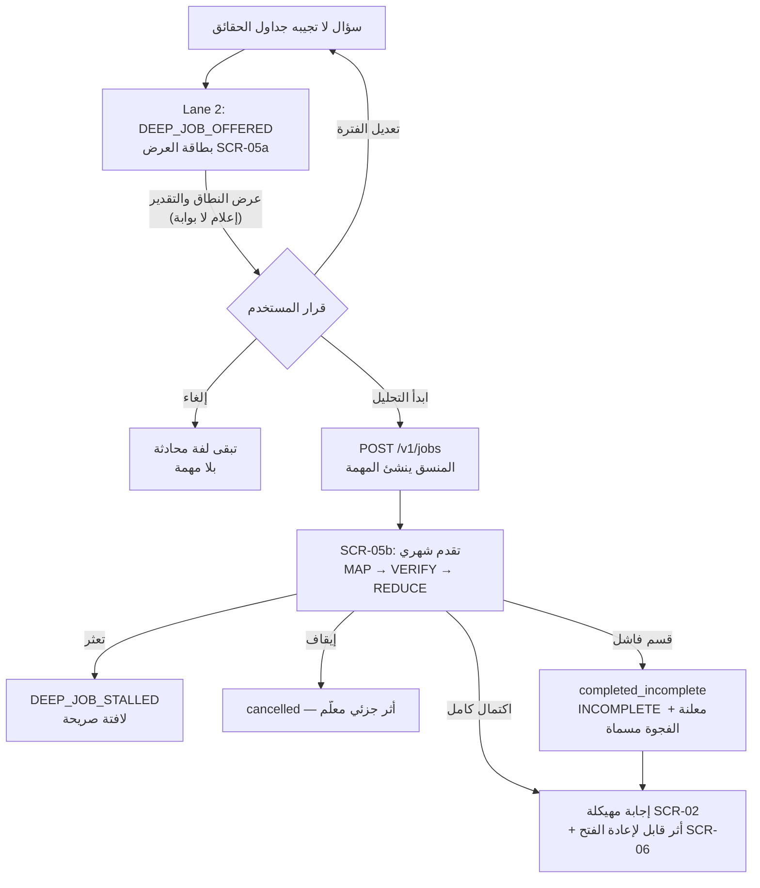
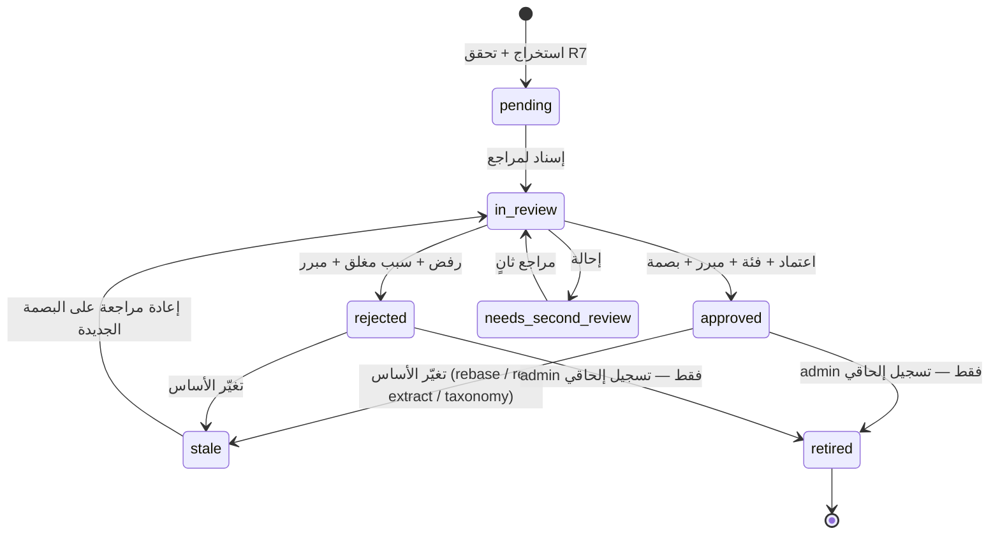
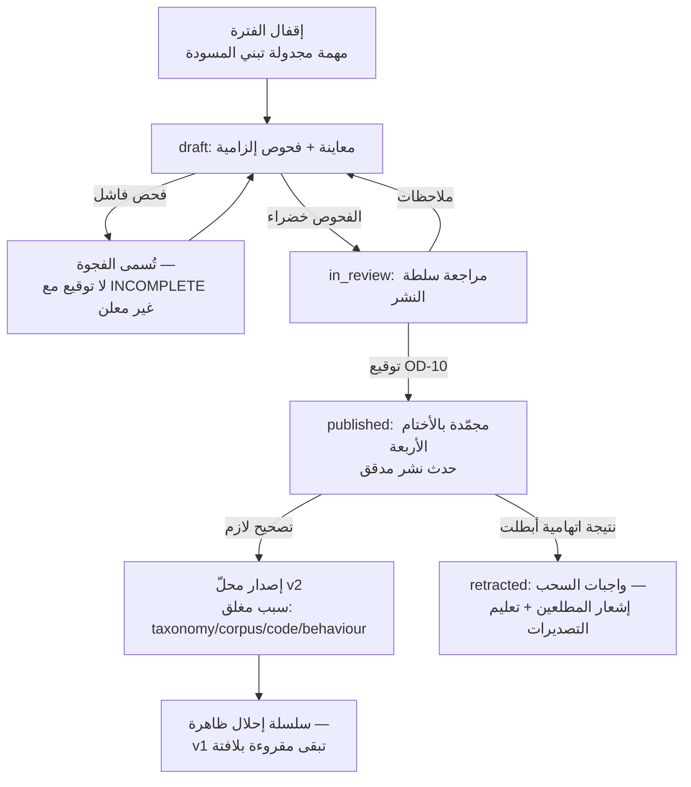

# 18 — واجهات الاستخدام ومسارات الإدارة والمراجعة (مواصفة عربية شاشة-بشاشة)
**Platform:** Nwafeth Intelligence — منصة نوافث لذكاء الجلسات الاستشارية (Monsha'at Advisory Session Intelligence Platform)
**Status:** Draft for owner review · **Date:** 2026-08-02 · **Revised:** 2026-08-03 (دمج تعديل المالك الملزم: ترقية SCR-08، الشاشات SCR-14…SCR-22، ترتيب البناء) · **Author:** Planning package (Fable 5)
**Depends on:** 03 (الشخصيات والأدوار), 04 (كتالوج القدرات), 08 (نموذج البيانات), 11 (الطبقة الدلالية), 12 (خدمة المسارات والنصوص الثابتة), 13 (مصنع التحليل المعمّق والترقية), 15 (مفتاح الإجابات), 16 (الأمن والخصوصية), 17 (عقود API) · **Feeds:** 21 (خطة التسليم), 22 (سجل القرارات), 23 (حزمة التنفيذ), 24 (باك لوق المنتج), 25 (التسليم المرحلي)
**Sources used:** GREENFIELD §4, §5-B4, §6.1–6.5, §8.8, §12.7, §14.1–14.7, §15.1–15.4, §16.2–16.3, §23; MASTER_PROMPT §4.4, §5.0–5.3, Appendix C; CORE-BRIEF §3–§6, §10–§13; doc 12 §12 (النصوص العربية الثابتة لرموز الأسباب); doc 13 §8.4 (عتبات الترقية); Owner Amendment 2026-08-03 §4.5, §5, §6.3, §6.5–6.6, §7, §11.1–11.2, §12-18 (SD-18…SD-22)

---

## 1. الغرض والنطاق ومبادئ التصميم

تحدد هذه الوثيقة مواصفة واجهات الاستخدام العربية للمنصة، شاشةً بشاشة، للمسارات الاثني عشر الإلزامية المذكورة في GREENFIELD §16.2 [FACT GREENFIELD §16.2]، وقد وسّعها تعديل المالك المؤرخ 2026-08-03 بأربع رحلات تشغيلية جديدة (ر13–ر16 في الوثيقة 03 §6) تخدمها: ترقيةُ شاشة «اشتباه مخالفة» القائمة SCR-08 دون تغيير رقمها (§10)، وتسع شاشات تشغيلية جديدة SCR-14…SCR-22 (§15)، وترتيب بناء ملزم يقدّم النواة التشغيلية على المحادثة التحليلية (§17) [DECISION owner 2026-08-03, Amendment §12-18]. الوثيقة قابلة للتنفيذ مباشرة: لكل شاشة غرضها، وعناصرها، وحالاتها (فارغ/جزئي/خطأ)، وقواعد صياغتها العربية، ومتطلبات الوصول واتجاه الكتابة، ومن يراها حسب الدور. عقود JSON التفصيلية للنداءات تملكها الوثيقة 17؛ ما يرد هنا من مسارات `/v1/…` هو إشارة توافقية لا نصاً معيارياً [INFER].

**خمسة مبادئ تحكم كل شاشة** (كلها مشتقة من اللاءات I1–I18):

1. **الواجهة تعرض ولا تحسب** — كل رقم يصل الواجهة من الغلاف المهيكل `serve` جاهزاً ومُحققاً (I3، I11). لا يوجد أي حساب أو تجميع في طبقة العرض، ولا أي «كشط» من HTML (الدرس F6) [DECISION GREENFIELD §I11].
2. **النطاق قبل الإجابة وفيها** — كل إجابة تحليلية تُسبق وتُرافق بكتلة النطاق والتغطية: الفترة المحسومة ومصدر قرارها، الفلاتر، عدد الجلسات، التغطية، مصادر التفريغ (I4، I8).
3. **لا استثناء خام أمام المستخدم أبداً** — كل فشل يُعرض بنص عربي ثابت من قاموس مغلق مع رقم تتبع `request_id`؛ والنتيجة الجزئية تُعلن جزئيةً بشارة `INCOMPLETE` ولا تُعرض كاملةً قط (I16) [DECISION GREENFIELD §I16].
4. **الأمن في الخادم لا في الواجهة** — إخفاء زر في الواجهة ليس ضبط صلاحيات؛ كل شاشة هنا لها تفويض خادمي مقابل (I14)، ومصفوفة الأدوار في §2.6 تُختبر خادمياً ضمن حزمة الاختبار (doc 15/16).
5. **العربية أولاً بسجل حكومي رصين** — لغة الواجهة فصحى مناسبة لجهة حكومية سعودية، بلا مبالغة سببية ولا أحكام مؤسسية (GREENFIELD §16.3)؛ القواعد الملزمة في §2.4.

---

## 2. الأسس المشتركة لجميع الشاشات

### 2.1 اللغة والأرقام والتقويم

| البند | القاعدة | التصنيف |
|---|---|---|
| لغة الواجهة | عربية فصحى حصراً في نصوص المستخدم؛ المعرفات التقنية (CAP-B1، `job_id`، `taxonomy_version`) تبقى لاتينية | [DECISION GREENFIELD §16.3] |
| بنية النصوص | كل النصوص من كتالوج سلاسل عربي مركزي (بنية i18n حتى لو كانت اللغة الوحيدة ar) — لا نص مضمّن في المكوّنات | [REC — البديل: نصوص مضمنة؛ مرفوض لأنه يمنع مراجعة الصياغة مركزياً؛ محفز إعادة النظر: لا يوجد] |
| الأرقام في البيانات | أرقام لاتينية (0–9) في كل الجداول والبطاقات والمحاور والتصديرات، بخط ذي أرقام جدولية (tabular figures) | [REC — البديل: الأرقام الهندية (0–9)؛ رُجحت اللاتينية لاتساقها مع XLSX والمعرفات والفروق الحسابية؛ محفز إعادة النظر: طلب صريح من مالك المنتج للحزم التنفيذية — انظر OD-21] |
| التقويم | ميلادي أساساً بأسماء الأشهر العربية («يونيو 2026»)، والفترات بصيغة نهاية مفتوحة داخلياً وتُعرض للمستخدم بصيغة مغلقة مفهومة («من 1 يونيو إلى 30 يونيو 2026») | [REC؛ عرض هجري ثانوي اختياري على أغلفة الحزم — OD-21] |
| صيغة النسب | «42.1%» مع فاصلة عشرية واحدة افتراضاً؛ ومجالات الثقة بصيغة «(CI 95%: 39.2–45.0)» | [REC — متسق مع doc 10] |
| العلامة الجزئية | كل **نسبة** قائمة على n < 30 تُحجب ويُعرض العدد مع علامة «عينة غير كافية (n={n})» — القاعدة على النسب لا الأعداد | [DECISION CORE-BRIEF §13-4] |

**OD-21 (جديد — يُسجل في الوثيقة 22):** تفضيل مالك المنتج النهائي للأرقام والتقويم في المخرجات التنفيذية (لاتينية/هندية، إظهار الهجري). الافتراض الآمن المعمول به: لاتينية + ميلادي أساسي [ASSUME OD-21].

### 2.2 الاتجاه RTL وإمكانية الوصول

- **الاتجاه:** `dir="rtl"` على الجذر؛ كل التخطيطات بخصائص CSS منطقية (`margin-inline-start` لا `margin-left`) حتى لا تنكسر عند أي معاينة LTR [REC].
- **عزل المعرفات اللاتينية:** كل معرف تقني داخل نص عربي يُغلف بعنصر عزل اتجاهي (`<bdi>` أو `unicode-bidi: isolate`) لمنع تكسر ثنائية الاتجاه في سلاسل مثل «القدرة CAP-B1 (الإصدار v3)» [REC — درس شائع في الواجهات العربية].
- **الخط:** خط عربي مستضاف ذاتياً (يُوصى بـ IBM Plex Sans Arabic، والبديل Noto Sans Arabic) — لا CDN إطلاقاً (درس فشل مكتبات التصدير على الشبكة الحكومية) [FACT arch/07 → CORE-BRIEF §8]. حجم أساس 16px وارتفاع سطر ≥ 1.7 للنص العربي.
- **المعيار:** WCAG 2.2 مستوى AA: تباين ≥ 4.5:1 للنص، لا دلالة بالألوان وحدها (شارات الحالة تحمل نصاً وأيقونة)، تركيز لوحة مفاتيح مرئي، ترتيب التنقل يطابق الترتيب البصري RTL، تسميات ARIA عربية، إعلانات `aria-live="polite"` لتحديث أشرطة التقدم والنتائج المتدفقة [REC].
- **المخططات:** محاور مرآتية RTL (الزمن يتقدم يميناً→يساراً أو بعنونة صريحة)، وكل مخطط له جدول بيانات مكافئ قابل للقراءة الآلية (زر «عرض كجدول») — وهو نفسه مصدر التصدير (I11).
- **قابلية التشغيل بلا JavaScript متقدم:** الطباعة والتصدير لا يعتمدان على تصيير المتصفح — يُنتَجان خادمياً من الغلاف المهيكل (§14).

### 2.3 المكونات المشتركة المعيارية

هذه المكونات تُبنى مرة واحدة وتظهر في كل الشاشات (أسماء المكونات معرفات تقنية تبقى إنجليزية):

1. **`ScopeCoverageBlock` — كتلة النطاق والتغطية** (المكوّن الأهم في المنصة):
   - الفترة: «يونيو 2026 (من 1 يونيو إلى 30 يونيو)» + مصدر القرار: «محددة في سؤالك» / «السياسة الافتراضية: {policy}» / «منقولة من السؤال السابق» (I4).
   - الفلاتر والكيانات المقررة (بالاسم المعياري + طريقة الحسم: مطابقة تامة/اسم بديل معتمد).
   - الجلسات في النطاق: `{scope_count}` جلسة؛ التغطية: «تفريغ نشط لـ {covered} من {scope_count} (93.4%)».
   - المصادر: توزيع مزودي التفريغ («Read.ai v2: 91%، مزود بديل: 9%»).
   - الاستثناءات المعلنة: كل استبعاد مسمى برقمه («استُبعدت 41 جلسة بلا دور متحدث») (GREENFIELD §12.7).
2. **`StampsBar` — شريط الأختام:** `taxonomy_version` لكل تصنيف مستخدم، `model_id`+`prompt_sha`، `corpus_snapshot`، `code_version`، ومعرف الإجابة `answer_id`. يظهر مطوياً افتراضاً ويتوسع عند الطلب؛ يُضمَّن كاملاً في كل تصدير (I13).
3. **`MetricCard` — بطاقة الرقم:** القيمة، الوحدة والمقام صراحة («لكل 100 جلسة»؛ «من {n} جلسة متمايزة»)، مجال الثقة عند توفره، دلتا مقارنة بالفترة السابقة مع اتجاه، وختم إصدار التصنيف الذي حُسبت عليه.
4. **`ViewBadge` — شارة العرض:** «نسخة منشورة مجمّدة — {pack_id}» (أزرق ثابت) مقابل «عرض تحليلي حي — قد تتغير الأرقام مع تطور التصنيفات» (رمادي) (GREENFIELD §6.4). لا شاشة تعرض رقماً تجميعياً بلا إحداها.
5. **`IncompleteBadge` — شارة عدم الاكتمال:** «نتيجة غير مكتملة — {gap_ar}» بلون تحذيري + نص، تظهر أعلى النتيجة لا في هامشها (I16).
6. **`EvidenceChip` — رقاقة الدليل:** اقتباس مختصر + هوية كاملة عند التوسيع (§5)؛ النقر يفتح SCR-03.
7. **`AuditNotice` — إشعار التدقيق:** «هذا الوصول مسجل في سجل التدقيق» يظهر عند فتح أدلة نصية حساسة أو تنفيذ تصدير (GREENFIELD §15.4).

### 2.4 قواعد الصياغة العربية الملزمة (قاموس التحوط)

هذه القواعد **ملزمة للمصيّر الحتمي وللمؤلف اللغوي معاً**؛ يفحصها اختبار قاموسي آلي على نصوص الواجهة (doc 15) [REC]:

| ممنوع | البديل الملزم | السبب |
|---|---|---|
| «بسبب»، «أدى إلى»، «نتج عن» (بين متغيرين مرصودين) | «ترتبط بـ»، «تتزامن مع»، «لوحظ اقترانها بـ» | لا ادعاء سببية من ارتباط (GREENFIELD §12.5) |
| «أسوأ الجهات الحكومية»، «تقصير جهة X» | «الجهات الأكثر وروداً كنقاط احتكاك **في الجلسات**» | CAP-C5 رصد ذِكر لا تقييم أداء مؤسسي [DECISION GREENFIELD §5-C5] |
| «مخالفة مثبتة» (قبل المراجعة) | «مؤشر مخالفة مشتبه به — بانتظار المراجعة البشرية» | الاعتماد البشري هو الحكم (GREENFIELD §6.5) |
| «سبب التحدي هو…» (استنتاج نموذج) | «السبب **كما صرّح به المستفيد**: …» | فصل المصرَّح عن المستنتَج (§12.5) |
| «دائماً/أبداً/كل المستشارين» | «في {x}% من الجلسات المرصودة (n={n})» | لا إطلاق بلا مقام |
| «النظام واثق أن…» | (تُحذف) — الثقة ليست معياراً؛ البوابات حتمية | I18 |
| «انخفض الأداء» عند تغير التركيبة | «انخفض المؤشر؛ يُلاحظ تغير في تركيبة {البرامج/المستشارين} خلال الفترة» | تحفظ تغيّر التركيبة (GREENFIELD §12.2) |
| أي ذكر لاسم مستفيد أو هوية وطنية | العنصر النائب الثابت («المستفيد ف-1042» — نظام الأسماء المستعارة المغلق: م- للمستشار، ف- للمستفيد، ج- للجلسة؛ الوثيقة 16) | I15 |

قاعدة عامة: **صيغة المبني للمعلوم للنظام، والمبني للمجهول للاتهام** — «رصدت المنصة مؤشراً» مقبولة؛ «ارتكب المستشار مخالفة» ممنوعة قبل الاعتماد وبعده تُصاغ: «اعتمد المراجع تصنيف الحالة ضمن {VIOL-xxx}».

### 2.5 حالات الواجهة القياسية — النصوص الثابتة

كل شاشة تعرّف حالاتها الأربع؛ النصوص أدناه هي الافتراض الموحد وتُخصص لكل شاشة في أقسامها:

| الحالة | السلوك القياسي | النص الثابت الافتراضي |
|---|---|---|
| تحميل | هيكل عظمي (skeleton) بلا وميض؛ `aria-busy="true"` | «جارٍ التحميل…» |
| فارغ | رسالة + الإجراء التالي المقترح؛ إن كان الفراغ نتيجة نطاق: رمز السبب بنصه الثابت (doc 12 §12) | «لا توجد بيانات ضمن النطاق المحدد.» |
| جزئي | شارة `INCOMPLETE` + تسمية الفجوة + ما اكتمل | «نتيجة غير مكتملة — {gap_ar}. المعروض يصف الجزء المكتمل فقط.» |
| خطأ | لا استثناء خام؛ لا رمز HTTP يظهر للمستخدم؛ رقم تتبع دائماً | «تعذّر تنفيذ الطلب. لم تُعرض أي نتيجة جزئية. رقم التتبع: {request_id}.» |

النصوص العربية الثابتة لرموز الأسباب الستة عشر (من `DIMENSION_NOT_AVAILABLE` إلى `DEEP_JOB_INCOMPLETE`) معرفة معيارياً في الوثيقة 12 §12 وتُستخدم هنا حرفياً — لا تعاد صياغتها في أي شاشة [DECISION doc 12 §12 + MASTER Appendix C].

### 2.6 مصفوفة الأدوار × الشاشات

الأدوار الستة من GREENFIELD §15.1 (حساب الخدمة `pipeline_service` بلا واجهة). ✓ = وصول كامل، ◐ = وصول مقيد (موضح في قسم الشاشة)، ✗ = محجوب خادمياً:

| الشاشة | executive_viewer | analyst | service_owner | reviewer | steward | admin |
|---|---|---|---|---|---|---|
| SCR-01 المحادثة | ✓ | ✓ | ✓ | ✓ | ✓ | ✓ |
| SCR-02 الإجابة المهيكلة | ✓ | ✓ | ✓ | ✓ | ✓ | ✓ |
| SCR-03 عارض الأدلة | ◐ سياق ±2 لأدلة معتمدة/منشورة فقط | ◐ بأسماء مستعارة | ◐ نطاق خدماته | ✓ | ✓ | ✓ |
| SCR-04 الاستيضاح المغلق | ✓ | ✓ | ✓ | ✓ | ✓ | ✓ |
| SCR-05 التحليل المعمّق (عرض/قبول/تقدم) | ◐ متابعة فقط | ✓ | ✓ | ✓ | ✓ | ✓ |
| SCR-06 أرشيف المهام | ◐ نتائج فقط | ✓ | ◐ نطاقه | ✓ | ✓ | ✓ |
| SCR-07 ترقية الأسئلة المتكررة | ✗ | ◐ اقتراح وتأييد | ◐ طلب قدرة | ✗ | ✓ اعتماد | ✓ |
| SCR-08 اشتباه مخالفة (الاسم الظاهر بعد ترقية تعديل المالك §5) | ✗ | ✗ | ◐ مؤشرات معتمدة مجمعة فقط | ✓ | ◐ قراءة | ✓ |
| SCR-09 مراجعة التصنيفات/الكيانات/العناقيد | ✗ | ◐ اقتراح | ✗ | ◐ اقتراح | ✓ | ✓ |
| SCR-10 النشر وإعادة الإصدار | ◐ قراءة المنشور | ◐ قراءة | ◐ قراءة | ✗ | ◐ تجهيز | ✓ توقيع النشر [ASSUME OD-10] |
| SCR-11 النضارة وجودة المصدر (CAP-D9) | ✗ | ✓ قراءة | ◐ تغطية خدماته | ✗ | ✓ + إجراءات | ✓ |
| SCR-12 التصدير | ◐ حزم PDF فقط | ✓ | ✓ | ✓ ملفات الحالات | ✓ | ✓ |
| SCR-13 اللوحات | ✓ لوحته التنفيذية | ✓ | ◐ لوحة خدماته | ◐ لوحة المراجعة | ✓ + لوحات الجودة | ✓ |
| SCR-14 مركز تشغيل البيانات | ✗ | ✗ | ◐ بطاقتا الاكتمال والتأخر فقط | ✗ | ✓ | ✓ |
| SCR-15 الجلسة 360 | ✗ | ◐ بأسماء مستعارة | ◐ نطاقه؛ النص بصلاحية معلَّلة | ✓ | ✓ | ✓ |
| SCR-16 بحث الجلسات | ✗ | ◐ بأسماء مستعارة | ◐ نطاقه | ✓ | ✓ | ✓ |
| SCR-17 الإبلاغ عن اشتباه فائت | ✗ | ✗ | ✗ | ✓ إنشاء ومتابعة | ◐ قراءة | ✓ |
| SCR-18 لوحة جودة الكاشف والتعلم | ✗ | ✗ | ✗ | ◐ قائد المراجعين: المقاييس دون أزرار الترقية | ✓ قراءة | ✓ |
| SCR-19 مركز الإجراءات | ◐ حالة وأثر تجميعيان | ◐ قراءة | ✓ | ✗ | ◐ قراءة | ✓ |
| SCR-20 الإنفوجرافيك الشهري (مسودة/اعتماد/نشر) | ◐ المنشور فقط | ◐ المنشور فقط | ✓ مراجعة المحتوى (content_review) | ✗ | ✓ مراجعة البيانات (data_review) | ✓ اعتماد ونشر [ASSUME OD-10] |
| SCR-21 صباحيات الخدمة | ✗ | ✗ | ✓ | ◐ بنود المراجعة فقط | ✓ | ✓ |
| SCR-22 قائمة التعافي الخدمي | ✗ | ◐ مجاميع | ✓ | ✗ | ◐ قراءة | ✓ |

الصفوف SCR-14…SCR-22 من تعديل المالك [DECISION owner 2026-08-03, Amendment §12-18]؛ إسقاط الشخصيات التشغيلية الثماني (الوثيقة 03 §3.8) على هذه الأعمدة يمر بأدوارها التقنية (قائد المراجعين = reviewer بصلاحية إسناد وتحكيم؛ مهندس التشغيل ومالك النماذج = وجها admin؛ مدير المستشارين المباشر = service_owner بتوسعة أسماء فريقه [ASSUME OD-31]).

قرار الرفض الخادمي يعيد 403 مع نص عربي ثابت: «هذه الشاشة خارج صلاحيات دورك الحالي ({role_ar}).» — بلا تسريب لوجود بيانات معينة [DECISION I14].

### 2.7 خريطة التنقل ومسارات العناوين (routes)

بنية عناوين مستقرة قابلة للمشاركة والإسناد في سجل التدقيق؛ كل معرف في العنوان يُفوَّض خادمياً عند الفتح (لا «أمن بالغموض») [REC]:

| الشاشة | المسار | ملاحظات |
|---|---|---|
| SCR-01 | `/chat` · `/chat/{conversation_id}` | المحادثة الجديدة/القائمة |
| SCR-02 | `/answers/{answer_id}` | رابط مباشر لإجابة مهيكلة (نفس التصيير داخل المحادثة) |
| SCR-03 | `/evidence/{finding_id}` | يفتح النافذة على اللفة المحددة؛ الوصول مدقق |
| SCR-05b | `/jobs/{job_id}` | تقدم مهمة التحليل المعمّق |
| SCR-06 | `/jobs` | الأرشيف مع الفلاتر في معلمات الاستعلام |
| SCR-07 | `/governance/promotions` | طابور الترقية |
| SCR-08 | `/review/violations` · `/review/violations/{case_id}` | الطابور وبطاقة الحالة |
| SCR-09 | `/governance/taxonomy` (تبويبات: `#proposals` `#clusters` `#entities`) | الحوكمة |
| SCR-10 | `/packs` · `/packs/{pack_id}` | مركز النشر والحزمة |
| SCR-11 | `/data-health` | شاشة CAP-D9 |
| SCR-12 | حوار من الشاشات المصدر + `/exports/{export_id}` | سجل التصديرات وروابط التنزيل الموقعة |
| SCR-13 | `/dashboards` · `/dashboards/{dashboard_id}` | لوحات المؤشرات لكل شخصية (§14ب) |
| SCR-14 | `/ops/runs` · `/ops/runs/{run_id}` | مركز تشغيل البيانات؛ تنزيل Run manifest؛ الخدمة عبر `GET /pipeline-runs` (الوثيقة 17) |
| SCR-15 | `/sessions/{session_id}/360` | الجلسة 360؛ الخدمة عبر `GET /sessions/{id}/360` |
| SCR-16 | `/sessions` | بحث الجلسات؛ الفلاتر في معلمات الاستعلام (حقول محكومة فقط) |
| SCR-17 | حوار من SCR-15/عارض النص + `/review/missed-reports` | الإبلاغ عن اشتباه فائت؛ الخدمة عبر `POST /sessions/{id}/missed-violation` |
| SCR-18 | `/governance/detector` | لوحة جودة الكاشف والتعلم؛ الخدمة عبر `GET /detector-releases` |
| SCR-19 | `/actions` · `/actions/{action_id}` | مركز الإجراءات؛ الخدمة عبر `GET/POST/PATCH /actions` |
| SCR-20 | `/infographics` · `/infographics/{period}` | «نبض خدمة الاستشارات والإرشاد»؛ الخدمة عبر `GET /infographics/monthly/{period}` وأزرار الاعتماد/النشر عبر `POST /infographics/{id}/approve|publish` |
| SCR-21 | `/digests` · `/digests/{date}` | صباحيات الخدمة (أرشيف يومي) |
| SCR-22 | `/service-recovery` | قائمة التعافي الخدمي — مسار مستقل تماماً عن `/review/violations` |

الشريط الجانبي الرئيس يعرض للمستخدم أقسامه المصرح بها فقط (المحادثة، اللوحات، المهام، المراجعة، الحوكمة، النشر، صحة البيانات، **التشغيل، الإجراءات، الإنفوجرافيك** بعد تعديل المالك) — والإخفاء تحسين تجربة لا ضبطاً أمنياً؛ الضبط خادمي دائماً (I14).

### 2.8 ترجمة أخطاء الخادم إلى حالات واجهة (لا رمز HTTP يظهر للمستخدم)

| استجابة الخادم | سلوك الواجهة | النص الثابت |
|---|---|---|
| 400 (مخطط طلب مرفوض) | فقاعة خطأ في السياق؛ يبقى الإدخال | «تعذّر فهم الطلب بصيغته الحالية. رقم التتبع: {request_id}.» |
| 401 (انتهاء الجلسة) | تحويل لتسجيل الدخول مع حفظ المسار | «انتهت صلاحية جلستك. الرجاء تسجيل الدخول مجدداً.» |
| 403 (خارج الدور) | صفحة/فقاعة رفض قياسية §2.6 | «هذه الشاشة خارج صلاحيات دورك الحالي ({role_ar}).» |
| 404 (معرف غير موجود) | صفحة «غير موجود» بلا تلميح لوجود سابق | «العنصر المطلوب غير موجود أو خارج نطاق صلاحياتك.» |
| 409 (تعارض حالة — قرار على بصمة قديمة) | إعادة تحميل الحالة الحديثة وإبراز التغير | «تغيرت الحالة منذ فتحك لهذه الشاشة؛ حُدّث العرض. راجع قبل إعادة المحاولة.» |
| 422 (رمز سبب من الأنواع الستة عشر) | تصيير النص العربي الثابت للرمز (doc 12 §12) | حسب الرمز |
| 5xx / انقطاع | حالة خطأ قياسية + إعادة محاولة يدوية؛ **لا إعادة تلقائية لعمليات كتابة** | «تعذّر تنفيذ الطلب. لم تُعرض أي نتيجة جزئية. رقم التتبع: {request_id}.» |

لا تعرض الواجهة إطلاقاً: نص استثناء، تتبع مكدس، رسالة خام من المزود، أو رمز HTTP (I16) — كلها تُستبدل بالنص الثابت ورقم التتبع الذي يقود المشغل إلى السجل الكامل (R13).

### 2.9 أحداث التدقيق المنشأة من الواجهة

كل شاشة تنشئ أحداثها في `ops.audit_event` عبر الخادم (الواجهة لا تكتب سجلات مباشرة) [DECISION GREENFIELD §15.4]:

| الحدث | الشاشة المنشئة | الحمولة الدنيا |
|---|---|---|
| `EVIDENCE_ACCESS` | SCR-03 (وكل توسيع سياق) | `finding_id`, `advisory_session`, نافذة اللفات, الدور |
| `DEEP_JOB_ACCEPTED` / `DEEP_JOB_CANCELLED` | SCR-05 | `job_id`, النطاق, التقدير المعروض لحظة القبول |
| `REVIEW_DECISION` | SCR-08 | `case_id`, `finding_id`, القرار (أحد الستة §10), رمز السبب المغلق, الفئة, `finding_fingerprint`, المبرر |
| `TAXONOMY_CHANGE_APPLIED` | SCR-09 | نوع العملية, الإصداران قبل/بعد, لوحة الأثر المعروضة |
| `PACK_SIGNED` / `PACK_SUPERSEDED` / `PACK_RETRACTED` | SCR-10 | `pack_id`, الأختام, السبب المغلق, البيان |
| `RECONCILIATION_ACTION` | SCR-11 | الصف, الإجراء, `resolution_status` قبل/بعد |
| `EXPORT_CREATED` | SCR-12 | `export_id`, الصيغة, الأوراق المضمنة, تضمين الأدلة (نعم/لا) |
| `DASHBOARD_VIEWED` | SCR-13 | `dashboard_id`, البلاطات المعروضة, الفترة المحسومة, أختام التصنيفات |
| `PIPELINE_RETRY_REQUESTED` / `SESSION_REPROCESS_REQUESTED` | SCR-14 | `run_id` أو معرّفات الجلسات, الخطوة/العناصر, السبب |
| `SESSION_360_VIEWED` | SCR-15 | `advisory_session`, التبويبات المفتوحة (نص/بيانات/تحليل), الدور |
| `MISSED_VIOLATION_REPORTED` | SCR-17 | `advisory_session`, مدى اللفات, النوع المقترح أو «نوع جديد», معرّف البلاغ |
| `DETECTOR_PROMOTION_DECIDED` / `DETECTOR_ROLLBACK_EXECUTED` | SCR-18 | إصدارا الكاشف قبل/بعد, أختام (dataset/prompt SHA/model/thresholds/taxonomy), القرار وموقّعه |
| `ACTION_CREATED` / `ACTION_STATUS_CHANGED` | SCR-19 | `action_id`, المالك, الحالة قبل/بعد, منشأ الإجراء (رابط النتيجة) |
| `INFOGRAPHIC_APPROVED` / `INFOGRAPHIC_PUBLISHED` / `INFOGRAPHIC_SUPERSEDED` / `INFOGRAPHIC_RETRACTED` | SCR-20 | معرّف الإصدار, الفترة, الأختام, تجاوز الاكتمال إن وجد (يظهر على وجه الإنفوجرافيك), الموقّع |
| `DIGEST_VIEWED` | SCR-21 | تاريخ الصباحية, البنود المعروضة |
| `RECOVERY_CASE_CLOSED` | SCR-22 | معرّف الحالة, قاعدة الإدراج وإصدارها, إجراء الإغلاق الموثق |

حدث القرار في SCR-08 يخزن **ما رآه المراجع** (البصمة والنسخة) لا فقط ما قرره — هذا ما يجعل الإبطال الآلي عند تغير الأساس قابلاً للتنفيذ (§10). الأحداث من SCR-14 حتى SCR-22 أضافها تعديل المالك [DECISION owner 2026-08-03, Amendment §12-18/§12-19].

---

## 3. المسار 1 — طرح سؤال استراتيجي أو تشغيلي (SCR-01: شاشة المحادثة)

**الغرض:** نقطة الدخول الوحيدة للأسئلة الحرة؛ تجعل قرار النطاق مرئياً **قبل** وصول الإجابة، فلا يفاجأ المستخدم بفترة لم يقصدها (الدرس ISS-01/F16: حقن الفترة المهزوم في النظام القديم) [FACT CORE-BRIEF §12].

**نقاط الخدمة:** `POST /api/v1/chat/turns` (إنشاء لفة)، `GET /api/v1/capabilities` (رقاقات الاقتراح) — العقود في الوثيقة 17.

**عناصر الواجهة (ترتيب بصري من الأعلى):**

1. **شريط المحادثات** (جانبي، قابل للطي): محادثات المستخدم نفسه فقط — العزل خادمي (تهديد «وصول عبر المستخدمين» GREENFIELD §15) [DECISION I14].
2. **منطقة اللفات:** أسئلة المستخدم وإجابات المنصة (كل إجابة = SCR-02 مضمنة).
3. **شريط النطاق المحسوب (`ScopeCoverageBlock` بوضع «قيد الحساب»):** يظهر فور إرسال السؤال وقبل أي محتوى إجابة، ويعرض تباعاً وبشكل حتمي (لا نموذج): الفترة المقررة + مصدر القرار، الكيانات المحسومة، عدد الجلسات في النطاق، تغطية التفريغ، المصادر. إن قررت السياسة فترة افتراضية يُعرض ذلك صراحة: «لم تُحدد فترة؛ طُبقت السياسة الافتراضية: آخر شهر مكتمل (يونيو 2026)» [DECISION I4].
4. **حقل الإدخال:** نص عربي متعدد الأسطر، إرسال بـ Enter، حد 2,000 حرف، عداد ظاهر بعد 1,800.
5. **رقاقات الأسئلة المقترحة:** مشتقة حصراً من سجل القدرات (`list_capabilities`) بأسمائها العربية المعتمدة (مثل «نسبة الجلسات المنتهية بخطوات واضحة» CAP-B1) — لا اقتراحات مولدة حرة [DECISION I12].
6. **تلميح المتابعة:** أسفل الحقل بعد أول إجابة: «يمكنك المتابعة بصيغ مثل: «والشهر الذي قبله؟» أو «الصفحة التالية»» — الصيغ من جدول الإحالات المغلق (MASTER §5.0) حصراً.
7. **مؤشر المسار (للأدوار التقنية analyst/steward/admin فقط):** شارة صغيرة `Lane 0/1/2/3` + `lane0_score` عند التوسيع — تُخفى عن executive_viewer [REC].

**الحالات:**
- **فارغ (أول استخدام):** بطاقات كتالوج القدرات مجمعة (سلوكية/شهرية/ربعية/تكاملية) بأسمائها العربية، مع سطر: «تجيب المنصة من بيانات الجلسات الاستشارية المسجلة فقط».
- **قيد المعالجة:** شريط النطاق يظهر أولاً (هدف ≤ 1 ثانية [REC])؛ ثم هيكل عظمي للإجابة. لا «نقاط تفكير» بلا محتوى بعد 5 ثوانٍ — تظهر حالة نصية: «جارٍ تنفيذ الاستعلام الحتمي…».
- **جزئي:** الإجابة تصل بشارة `INCOMPLETE` (انظر SCR-02).
- **خطأ:** فقاعة خطأ قياسية §2.5؛ السؤال يبقى في الحقل قابلاً للتعديل، ولا يُستهلك من أي حصة.

**مثال محادثة متابعة معمول (جدول الإحالات المغلق — MASTER §5.0):**

> **لفة 1:** «أبرز التحديات المتكررة في يونيو 2026» → CAP-C1، شريط النطاق: «يونيو 2026 (محددة في سؤالك)».
> **لفة 2:** «والشهر الذي قبله؟» → تحويل حتمي (فترة −1) بلا نموذج؛ شريط النطاق: «مايو 2026 (منقولة من سؤالك السابق: إزاحة شهر)». القدرة والكيانات محمولتان كما هما.
> **لفة 3:** «الصفحة التالية» → ترقيم على نتيجة اللفة 2 المخزنة؛ الشريط يبين: «الصفحة 2 من نتيجة مايو 2026».
> **لفة 4:** «وماذا عن الجودة؟» (صيغة ضمن الجدول تعذّر حسم مرجعها X) → النص الثابت لـ `AMBIGUOUS_REFERENCE`: «لم أتمكن من ربط هذه الإشارة بسؤال سابق في المحادثة. الرجاء إعادة صياغة السؤال كاملاً.» — لا تخمين أبداً [DECISION MASTER §5.0].

**قواعد الصياغة:** أسماء القدرات في الرقاقات تُطابق حرفياً الأسماء العربية في كتالوج الوثيقة 04؛ لا يعاد إنشاؤها.

**الوصول وRTL:** الحقل `lang="ar" dir="rtl"`؛ اللفات مناطق `role="log"` مع `aria-live="polite"`؛ التنقل بالسهمين بين اللفات.

**من يراها:** جميع الأدوار (§2.6). ما يختلف هو ما تعيده الأدوات خادمياً لا شكل الشاشة.

---

## 4. المسار 2 — عرض الإجابة المهيكلة (SCR-02: غلاف الإجابة)

**الغرض:** التصيير الموحد للغلاف المهيكل (GREENFIELD §8.8) — نفس البنية لكل إجابة من أي مسار (Lane 0/1/3)، بحيث يستحيل عرض رقم بلا مقامه وأختامه ونطاقه.

**عناصر الواجهة (ترتيب إلزامي من الأعلى إلى الأسفل):**

1. **العنوان والملخص:** جملة إلى ثلاث جمل بصياغة المؤلف اللغوي الاختياري أو التصيير الحتمي عند رفضه/تعطيله — التبديل غير مرئي للمستخدم [DECISION GREENFIELD §8.8].
2. **`ScopeCoverageBlock`** (§2.3-1) — نفسها التي ظهرت قبل الإجابة، مثبتة الآن بالقيم النهائية.
3. **بطاقات الأرقام (`MetricCard`):** صف أفقي RTL؛ كل بطاقة تحمل ختم إصدار التصنيف الخاص بها إن كان الرقم تصنيفياً.
4. **الجداول:** رؤوس عربية من سجل المقاييس (الاسم المعتمد للبعد/المقياس)، فرز بالنقر، ترقيم صفحات خادمي؛ الأعمدة الرقمية بمحاذاة موحدة وأرقام جدولية؛ صفوف n<30 تُعرض «—» مع تلميح «بيانات غير كافية (n={n})».
5. **الأدلة (`EvidenceChip`):** حتى 5 اقتباسات ممثلة افتراضاً؛ كل رقاقة: نص الاقتباس (مقتطع 200 حرف)، دور المتحدث، تاريخ الجلسة، زر «فتح في السياق» → SCR-03.
6. **المنهجية (مطوية):** الوحدة والمقام، قاعدة الحد الأدنى، طريقة العد (جلسات متمايزة/نتائج)، ونص المنهجية المعتمد من الوثيقة 10 للقدرة المعنية.
7. **`StampsBar`** (§2.3-2).
8. **أسئلة المتابعة المقترحة:** ≤ 3 رقاقات، من سجل القدرات أو من تحولات جدول الإحالات المغلق فقط («قارن بالشهر السابق»، «قسّم حسب البرنامج») — لا توليد حر [DECISION I12].
9. **شريط الإجراءات:** «تصدير XLSX» / «تصدير PDF» (→ SCR-12)، «نسخ معرف الإجابة»، ولدور analyst فأعلى: «عرض سجل الاستدلال» (R13).

**مخطط توضيحي نصي (RTL — العناصر بترتيبها الإلزامي):**

```
┌──────────────────────────────────────────────────────────────┐
│ نسبة الجلسات المنتهية بخطوات واضحة — يونيو 2026        [عنوان] │
│ ملخص من جملتين… (مؤلف لغوي أو تصيير حتمي)                     │
├──────────────────────────────────────────────────────────────┤
│ ▤ النطاق والتغطية: يونيو 2026 (محددة في سؤالك) · 1,043 جلسة   │
│   تفريغ نشط 974 (93.4%) · المصادر: Read.ai v2 · استثناءات: 1  │
├──────────────────────────────────────────────────────────────┤
│ [بطاقة 41.8%±CI]  [بطاقة الدلتا مقابل مايو]  [بطاقة n]         │
├──────────────────────────────────────────────────────────────┤
│ جدول حسب فئة الخدمة (فرز · ترقيم خادمي · n<30 = «—»)          │
├──────────────────────────────────────────────────────────────┤
│ ❝ أدلة (5) — رقاقات تفتح SCR-03                               │
│ ▸ المنهجية (مطوية)   ▸ شريط الأختام (مطوي)                    │
│ [متابعات مقترحة ≤3]                                           │
│ [تصدير XLSX] [تصدير PDF] [نسخ معرف الإجابة]                   │
└──────────────────────────────────────────────────────────────┘
```

**مثال عربي معمول (أرقام توضيحية):** سؤال: «ما نسبة الجلسات المنتهية بخطوات واضحة في يونيو 2026 حسب فئة الخدمة؟» → CAP-B1 عبر Lane 0.
- كتلة النطاق: «الفترة: يونيو 2026 (محددة في سؤالك) · الجلسات في النطاق: 1,043 · تفريغ نشط: 974 (93.4%) · المصادر: Read.ai v2 · استُبعدت 69 جلسة بلا تفريغ نشط — مسماة في التغطية».
- بطاقة: «نسبة الخطوات الواضحة: **41.8%** (CI 95%: 38.7–44.9) — من 974 جلسة متمايزة · التصنيف: step_clarity v2».
- جدول حسب `service_category` مع إخفاء الفئات ذات n<30.
- متابعة مقترحة: «قارن بمايو 2026» (CAP-C3).

**الحالات:**
- **فارغ:** الغلاف يصل بنتيجة صفرية مشروعة → يُعرض النص الثابت لـ `PERIOD_EMPTY` أو `NO_MATCHING_DATA` (حسب قرار المنفذ الحتمي) مع كتلة النطاق كاملة — الفراغ إجابة صادقة لا خطأ [DECISION MASTER Appendix C].
- **جزئي:** `IncompleteBadge` أعلى البطاقات + بند صريح في كتلة التغطية («قسم 2026-03 غير مكتمل: 12 استدعاء نموذج فاشلاً»).
- **خطأ:** لا يُعرض غلاف ناقص الأختام أو التغطية إطلاقاً — غيابهما يحول الإجابة كلها إلى حالة خطأ قياسية (فشل بوابة، `VERIFIER_REJECTED` على مستوى السجل) [DECISION I8/I18].

**قواعد الصياغة:** قاموس §2.4 بكامله؛ إضافةً: الملخص لا يذكر رقماً غير موجود في البطاقات/الجداول (بوابة R6: القيم الحرفية المسموحة) [DECISION MASTER R6].

**الوصول وRTL:** البطاقات `role="group"` بعنوان؛ الجداول `<caption>` عربية؛ كل مخطط له «عرض كجدول».

**من يراها:** الجميع؛ الأدلة النصية داخلها تخضع لقيود SCR-03.

---

## 5. المسار 3 — فتح الدليل عند اللفة المحددة (SCR-03: عارض الأدلة)

**الغرض:** التحقق البصري من كل اقتباس: النص الحرفي في موضعه من الجلسة، بهوية كاملة، وبتسجيل وصول مدقق — تفعيل I7 أمام المستخدم.

**نقاط الخدمة:** `GET /api/v1/evidence/{finding_id}/window` (نافذة لفات ±N)، يسجل حدث `EVIDENCE_ACCESS` في `ops.audit_event` قبل إرجاع النص [DECISION GREENFIELD §15.4].

**عناصر الواجهة:**

1. **لوحة الهوية (أعلى، دائمة الظهور):** `advisory_session` ULID، معرف الاجتماع لدى المزود، التاريخ والمدة، البرنامج/القناة/فئة الخدمة، المستشار (بالاسم الوظيفي للأدوار المخولة، وبالاسم المستعار الثابت «مستشار م-217» لغيرها [ASSUME OD-09])، مصدر التفريغ وإصداره («Read.ai · source_version 3 · نشط»)، و`extraction_run_id` للنتيجة التي قادت إلى هنا.
2. **عارض النص:** لفات الجلسة بترتيب زمني، كل لفة: `turn_index`، دور المتحدث (مستشار/مستفيد/غير محدد)، الطابع الزمني، النص. **الاقتباس مُبرز بخلفية** والتمرير الأولي يتمركز عليه؛ الإبراز مطابقة سلسلة حرفية للنطاق المخزن — إن فشلت المطابقة (لا يجوز أن تفشل بعد بوابة R7) تُعرض حالة خطأ ولا يُعرض إبراز تقريبي أبداً [DECISION I7].
3. **أزرار التوسيع:** «إظهار 10 لفات سابقة/لاحقة» (النافذة الافتراضية ±5) حتى سقف دور المستخدم (executive_viewer: ±2 بلا توسيع).
4. **شريط السياق التحليلي:** التصنيف الذي عُلّم به المقطع (مثل `VIOL-004 — توجيه لمسار واحد بدون مقارنة` v3)، حالة المراجعة (بانتظار/معتمد/مرفوض)، ورابط بطاقة الحالة في SCR-08 للمراجعين.
5. **`AuditNotice`:** «هذا الوصول مسجل في سجل التدقيق برقم {audit_id}» — دائم الظهور في هذه الشاشة.
6. **إخفاء PII:** أسماء المستفيدين وأرقام التواصل تظهر كعناصر نائبة ثابتة («{اسم-المستفيد}») لكل الأدوار افتراضاً؛ كشفها «كسر زجاج» مدقق للأمناء فقط [ASSUME OD-09].

**الحالات:**
- **فارغ:** لا ينشأ — الشاشة تُفتح من دليل موجود. الوصول المباشر برابط لنتيجة محذوفة/مسحوبة: «هذا الدليل لم يعد متاحاً؛ سُحبت النتيجة المرتبطة به ({retraction_id}).»
- **جزئي — إصدار أقدم:** إن كان الاقتباس مثبتاً على `source_version` لم يعد النشط (بعد rebase): لافتة صفراء: «هذا الاقتباس موثق على إصدار تفريغ سابق (v2). الإصدار النشط الآن v3؛ النتيجة قيد إعادة الاستخراج.» — ولا يُعرض النص القديم على أنه الحالي [DECISION I6/ADR-0007].
- **خطأ صلاحيات:** «عرض النص الكامل يتطلب صلاحية أعلى؛ المتاح لدورك: الاقتباس وسياقه المحدود.» (تجزئة التجميع/النص GREENFIELD §15.1).

**قواعد الصياغة:** دور المتحدث «غير محدد» يُعرض كما هو (5.7% من اللفات في خط الأساس [FACT CORE-BRIEF §11]) — لا تخمين للدور في العرض.

**الوصول وRTL:** اللفات قائمة `role="list"`؛ الإبراز لا يعتمد اللون وحده (خلفية + خط جانبي + `mark`)؛ النص قابل للنسخ مع تذييل تلقائي يحمل الهوية الكاملة عند اللصق (للتوثيق) [REC].

**من يراها:** حسب §2.6 (السطر SCR-03).

---

## 6. المسار 4 — الاستيضاح المغلق (SCR-04: بطاقة الاستيضاح)

**الغرض:** عندما يكون السؤال غامضاً بين خيارات مسجلة، تُعرض ≤ 4 خيارات مغلقة من السجل — لا تخمين ولا حقل نص حر (Lane 2) [DECISION CORE-BRIEF §4].

**عناصر الواجهة:** فقاعة داخل المحادثة: سطر تمهيدي ثابت + 2–4 أزرار خيارات (كل خيار: التسمية العربية المعتمدة + سطر وصف) + زر «إلغاء السؤال». اختيار المستخدم يُسجل لفةً جديدة ويكمل المسار حتمياً. مهلة بقاء الحالة التوضيحية في المخزن الدائم (Postgres لا ذاكرة العملية — الدرس F13) 15 دقيقة، بعدها يُطلب إعادة الصياغة [REC].

**المثال العربي الكامل الملزم — غموض «قطاع»** (القاعدة: «قطاع» وحدها غامضة دائماً — CORE-BRIEF §13-3):

> **المستخدم:** «ما أبرز التحديات حسب القطاع في الربع الأول 2026؟»
>
> **المنصة:** «كلمة «قطاع» تحتمل أكثر من معنى في بيانات المنصة. الرجاء تحديد المقصود:
> 1. **فئة الخدمة الاستشارية** — تصنيف موضوع الجلسة (تمويل، تسويق، …) `OPT-sector-service_category`
> 2. **الجهة الحكومية المذكورة** — الجهات الواردة في نص الجلسات `OPT-sector-government_entity`
> 3. **قطاع نشاط منشأة المستفيد** — التصنيف الاقتصادي للمنشأة `OPT-sector-business_sector`
> 4. **إلغاء السؤال**»
>
> عند اختيار (3): تُعرض الإجابة الحدية الصادقة بالنص الثابت لـ `DIMENSION_NOT_AVAILABLE`: «هذا التقسيم (قطاع نشاط المنشأة) غير متوفر في بيانات المنصة حالياً. التقسيمات المتاحة: فئة الخدمة، الجهة الحكومية المذكورة، البرنامج، القناة.» — الخيار يُعرض رغم عدم توفره لأن إخفاءه يوحي بأن «قطاع الخدمة» هو قطاع المنشأة، وهذا هو الخلط الذي تحرمه المواصفة [DECISION GREENFIELD §5-C4؛ التسمية متسقة مع doc 12 §10].

**الحالات:** فارغ: لا ينطبق. خطأ في حسم الخيار: فقاعة خطأ قياسية والخيارات تبقى قابلة للنقر. تجاهل المستخدم وطرح سؤال جديد: تُغلق البطاقة بحالة «لم يُجب» في السجل.

**قواعد الصياغة:** نص التمهيد ثابت من الكتالوج؛ تسميات الخيارات من السجل حصراً (أسماء الأبعاد المعتمدة) — النموذج لا يؤلف نص خيار [DECISION I12/R-قواعد doc 12].

**الوصول وRTL:** الخيارات `role="radiogroup"` بأسهم لوحة المفاتيح وترقيم ظاهر؛ الأزرار كبيرة (≥ 44px) للمس.

**من يراها:** الجميع.

---

## 7. المسار 5 — قبول ومتابعة مهمة تحليل معمّق (SCR-05a: بطاقة العرض · SCR-05b: شاشة التقدم)

**الغرض:** عندما لا تجيب جداول الحقائق ويكون السؤال قابلاً للإجابة بقراءة النصوص، تُعرض **مهمة** لا إجابة: نطاق وتقدير قبل القبول، وتقدم شهري شفاف بعده، وإعلان صريح لأي نقص (Lane 3، MASTER §5.3). التقدير **إعلام لا بوابة** — لا سقف تكلفة [DECISION MASTER §5.3 + GREENFIELD §2.5].

**نقاط الخدمة:** القبول يستدعي `POST /api/v1/jobs` (الأداة `start_deep_analysis` يتحكم بها المنسق لا النموذج — doc 12)؛ المتابعة `GET /api/v1/jobs/{job_id}`؛ الإيقاف `DELETE /api/v1/jobs/{job_id}`.

### SCR-05a — بطاقة العرض (تصيير `DEEP_JOB_OFFERED`)

**مثال معمول كامل (أرقام توضيحية):** سؤال: «في أي جلسات الربع الأول 2026 نصح المستشارون بالتوجه إلى جهة تمويل محددة دون عرض بدائل؟» — لا مقياس مسجل يجيب، والسؤال دليلي على النصوص → عرض:

> «المؤشرات المسجلة لا تجيب على هذا السؤال، لكن يمكن تشغيل تحليل معمّق يقرأ نصوص الجلسات ضمن الربع الأول 2026 (3,304 جلسات، تقدير المدة: ~50–80 دقيقة). هل تريد بدء التحليل؟»
>
> **نطاق التحليل قبل القبول:** يناير 2026: 1,102 جلسة · فبراير 2026: 987 · مارس 2026: 1,215 · استدعاءات النموذج المقدرة: ~3,304 · الإنفاق التقديري: ~{est} (يُعرض للإحاطة ولا يشترط حداً) · مخطط النتيجة: {التسمية، الاقتباس الحرفي، رقم اللفة، دور المتحدث}
>
> [ابدأ التحليل]  [عدّل الفترة]  [إلغاء]

عناصر البطاقة:

1. النص الثابت للعرض (doc 12 §12) مع الفتحات المملوءة: الفترة، عدد الجلسات، التقدير.
2. **جدول النطاق قبل القبول:** الأقسام الشهرية (مثال: «2026-01: 1,102 جلسة · 2026-02: 987 · 2026-03: 1,215»)، إجمالي استدعاءات النموذج المقدرة، المدة التقديرية («~ 50–80 دقيقة»)، الإنفاق التقديري («~ {est} ريال/دولار حسب تسعيرة النموذج المسجل») — يُعرض ولا يُشترط قبوله بحد [DECISION GREENFIELD §2.5].
3. **مخطط الاستخراج المقترح (مطوي):** حقول مخطط النتيجة (التسمية، الاقتباس، دور المتحدث…) بقراءة عربية مبسطة — للشفافية أمام analyst.
4. أزرار: «ابدأ التحليل» / «عدّل الفترة» (يعيد للمحادثة) / «إلغاء». القبول متاح للأدوار analyst فأعلى؛ executive_viewer يرى العرض وزر «طلب تشغيل من فريق التحليل» [REC — البديل: تمكين التنفيذيين من البدء مباشرة؛ محفز إعادة النظر: طلب المالك].

### SCR-05b — شاشة التقدم

1. **رأس المهمة:** `job_id`، السؤال، الفترة، الحالة (`running / stalled / cancelled / completed / completed_incomplete`)، زمن البدء، ETA محدثة.
2. **شريط تقدم لكل شهر:** صف لكل قسم شهري: «2026-02 ▮▮▮▮▮▯▯ 71% (701/987 جلسة)» + النتائج المحفوظة، والمُسقطة لعدم التحقق (`dropped_unverifiable`) — تحديث كل 5 ثوانٍ عبر استطلاع [REC — البديل SSE؛ محفز: تجاوز المستخدمين المتزامنين 50].
3. **عداد الإنفاق الحي:** الرموز المستهلكة والتكلفة حتى اللحظة — تُعرض ولا توقف شيئاً (§2.5 قياس لا عتبة).
4. **لافتة التعثر:** عند تجاوز `DEEP_JOB_STALL_MINUTES` يُعرض النص الثابت لـ `DEEP_JOB_STALLED` — لا شريط «يعمل» كاذب [DECISION I16].
5. زر «إيقاف المهمة» (مع تأكيد)؛ الإيقاف يحفظ المنجز كأثر جزئي مُعلَّم.
6. عند الاكتمال: إشعار داخل المنصة + الانتقال إلى الإجابة (SCR-02) — وإن وُجد قسم ناقص تتصدرها شارة `INCOMPLETE` بالنص الثابت لـ `DEEP_JOB_INCOMPLETE` («أقسام غير مكتملة: 2026-03») [DECISION MASTER §5.3].

**خريطة التدفق:**



**الحالات:** فارغ: لا ينطبق. جزئي: هو حالة أولى الدرجة أعلاه (لا تُخفى أبداً). خطأ إنشاء المهمة: فقاعة قياسية، والعرض يبقى قابلاً للقبول مجدداً.

**قواعد الصياغة:** «تحليل معمّق» هي التسمية المعتمدة (متسقة مع نصوص doc 12)؛ التقدير يُصاغ بـ«~» وبمدى، لا برقم واحد موهم بالدقة.

**الوصول وRTL:** أشرطة التقدم `role="progressbar"` بقيم رقمية معلنة؛ تحديثات الحالة عبر `aria-live="polite"`؛ الأرقام داخل الأشرطة لاتينية معزولة اتجاهياً.

**من يراها:** §2.6 (SCR-05).

---

## 8. المسار 6 — إعادة فتح نتائج تحليل مكتملة (SCR-06: أرشيف المهام)

**الغرض:** المهمة المكتملة أثر أولي الدرجة (GREENFIELD §14.6): تُفتح فوراً من الأرشيف بتاريخها المرجعي، ويُعرض إعادة تشغيلها عند تقادمها — لا إعادة قراءة صامتة للنصوص.

**عناصر الواجهة:**

1. **جدول الأرشيف:** الأعمدة: السؤال (نصه الأصلي)، العائلة (`question_fingerprint` مختصراً برقاقة)، الفترة، الحالة، تاريخ الإتمام (**as-of**)، الأختام (`corpus_snapshot`، `taxonomy_version`، `model_id`)، مقدم الطلب، عدد مرات إعادة الفتح. فرز افتراضي: الأحدث إتماماً. فلاتر: الفترة، الحالة، «مهامي فقط».
2. **فتح نتيجة:** يعرض SCR-02 كاملة مع لافتة دائمة أعلى الإجابة: «نتيجة محفوظة حُسبت بتاريخ 2026-07-14 على لقطة بيانات 2026-07-13. البيانات الأحدث غير مشمولة.» + زر «إعادة التشغيل على البيانات الحالية».
3. **إعادة التشغيل:** تنشئ مهمة جديدة (SCR-05a بعرض محدث) مرتبطة بسلسلة العائلة؛ النتيجة الجديدة لا تستبدل القديمة — تُعرضان في سجل العائلة بترتيب زمني مع فروق ملخصة («تغير الترتيب: صعد {تصنيف} من #4 إلى #2») [REC — الفروق حتمية من المجاميع المخزنة].
4. **رقاقة الترقية:** إن بلغت العائلة عتبات الترقية (doc 13 §8.4) تظهر رقاقة «مرشحة للترقية إلى قدرة مسجلة» تقود إلى SCR-07 (للأدوار المخولة).

**الحالات:**
- **فارغ:** «لا توجد مهام تحليل معمّق سابقة. تُنشأ المهام من شاشة المحادثة عندما يتعذر على المؤشرات المسجلة الإجابة.»
- **جزئي:** المهام `completed_incomplete` تُميز بشارتها في الجدول ولا تُخلط بالمكتملة.
- **خطأ:** فتح نتيجة على `corpus_snapshot` مؤرشف خارج نافذة الاحتفاظ [ASSUME OD-08]: «تفاصيل الأدلة لهذه النتيجة تجاوزت نافذة الاحتفاظ؛ المجاميع والأختام متاحة، وإعادة التشغيل متاحة.»

**قواعد الصياغة:** «as-of» تُعرّب دائماً: «حُسبت بتاريخ …» — ولا تُعرض نتيجة مخزنة قط بلا هذه الجملة [DECISION MASTER §5.3 (الأثر الأولي)].

**الوصول وRTL:** الجدول قابل للتنقل بلوحة المفاتيح؛ الرقاقات لها نص كامل عند التوسيع لا اختصار فقط.

**من يراها:** §2.6 (SCR-06)؛ executive_viewer يرى النتائج التي شُوركت معه فقط (مشاركة صريحة من analyst) [REC].

---

## 9. المسار 7 — ترقية سؤال متكرر إلى قدرة مسجلة (SCR-07: طابور الترقية)

**الغرض:** إغلاق حلقة الاكتشاف: العائلات المتكررة في Lane 3 تتحول عبر مسار اعتماد محكوم إلى قدرات Lane 0 — «التكرار وحده لا ينشر قدرة» [DECISION GREENFIELD §14.6].

**عناصر الواجهة:**

1. **قائمة المرشحين:** لكل عائلة (`jobs.promotion_candidate`): بصمة العائلة وأمثلة صيغها الفعلية (حتى 3 أسئلة حرفية من المستخدمين)، عدد التشغيلات المكتملة/90 يوماً، عدد الطالبين المتمايزين، وسيط زمن التشغيل، نتيجة عينة المراجعة (دقة {x}% على عينة 30)، الحالة: `watching / proposed / in_review / approved / declined (cool-down)`.
2. **بوابات العتبة (عرض مرئي):** ثلاث علامات لكل مرشح تُظهر تحقق شروط doc 13 §8.4: (أ) التكرار ≥ 3 تشغيلات/90 يوماً من ≥ 2 طالبين أو 2 + تأييد محلل؛ (ب) دقة العينة ≥ 90% (و≥ 95% للعائلات الاتهامية)؛ (ج) اختبار القيمة (وسيط ≥ 10 دقائق أو طلب مالك خدمة) [FACT doc 13 §8.4].
3. **معالج الترقية (للأمين steward):** خطوات مرقمة: (1) اختيار الهدف: مقياس مسجل / قدرة مرعية باستخراج دائم / مجموعة أدلة دائمة؛ (2) الاسم العربي المعتمد المقترح + المعرف؛ (3) جمع ≥ 20 صيغة عربية للمعايرة (يعرض الصيغ الفعلية من الأرشيف كنواة)؛ (4) تشغيل معايرة τ/δ وعرض نتيجتها؛ (5) إحالة لتوقيع بند مفتاح الإجابات (doc 15) — **لا تُخدَّم القدرة للمستخدمين قبل التوقيع** [DECISION MASTER §4.4].
4. **سجل القرار:** كل قبول/رفض بمبرر مكتوب؛ الرفض يعيد العائلة إلى `watching` مع تهدئة 180 يوماً ظاهرة بعدّاد [FACT doc 13 §8.4].

**الحالات:** فارغ: «لا توجد عائلات أسئلة بلغت عتبات الترشيح بعد. تُجمع الإحصاءات آلياً من أرشيف المهام.» · جزئي: مرشح بمعايرة فاشلة (τ/δ دون هدف الدقة 0.99) يُعرض بحالة «معايرة غير مجتازة — أضف صيغاً أو ضيّق التعريف» ولا يتقدم. · خطأ: قياسية.

**قواعد الصياغة:** يُحظر في أسماء القدرات المقترحة أي صيغة حكمية («المستشارون المقصرون») — يفحصها الأمين مقابل قاموس §2.4 قبل الاعتماد.

**من يراها:** steward/admin كاملة؛ analyst يرى قائمة للقراءة وزر «تأييد» على عائلاته؛ service_owner يرى زر «طلب قدرة بغض النظر عن العتبات» (يفعّل الشرط ج) [FACT doc 13 §8.4].

---

## 10. المسار 8 / ر14 — «اشتباه مخالفة» (SCR-08a: القائمة · SCR-08b: الحالة التفصيلية) — رُقّيت بتعديل المالك §5

**الاسم الظاهر للمستخدم** أعلى القائمة وفي الشريط الجانبي وعنوان المتصفح: **«اشتباه مخالفة»** [DECISION owner 2026-08-03, Amendment §5.1]. (التسمية التخطيطية السابقة «مراجعة المخالفات المشتبهة» **حلّ محلّها** هذا الاسم في كل النصوص الظاهرة؛ رقم الشاشة SCR-08 ومسارها `/review/violations` ثابتان — لا شاشة جديدة.) الشاشة خلف علم الميزة `violation_review_enabled`، وأول نوع يُفعَّل به المسار رأسياً: VIOL-008 «تواصل خارج الإطار الرسمي» ثم الأنواع واحداً واحداً [ASSUME OD-35؛ DECISION owner 2026-08-03, Amendment §5.6].

**التنويه الثابت (حرفياً، دائم الظهور أعلى القائمة والحالة التفصيلية معاً، غير قابل للإخفاء أو الطي):**

> «الحالات في هذه الصفحة مؤشرات آلية تحتاج مراجعة بشرية، ولا تعد مخالفة مثبتة قبل اعتمادها.»

[DECISION owner 2026-08-03, Amendment §5.1]

**الغرض:** الحلقة الواحدة «يقترح الآلي ويفصل البشري» على أخطر مخرجات المنصة: مؤشرات المخالفات (CAP-B4/B5، القدرة التشغيلية CAP-OPS-05). التاريخ **إلحاقي فقط لا يُحذف** (append-only)، والقرارات تُبطل آلياً عند تغير الأساس الذي بُنيت عليه [DECISION GREENFIELD §4.3 + §6.5؛ ADR-0012]. هذه القائمة مفصولة تماماً — بيانات وصلاحيات وتصميماً — عن «قائمة التعافي الخدمي» (SCR-22) التي ليست قائمة مخالفات [DECISION owner 2026-08-03, Amendment §11.2].

**النموذج الحاكم للشاشة — الفصل الثلاثي** [DECISION owner 2026-08-03, Amendment §5.5]:

| الكيان | معناه في الواجهة |
|---|---|
| `violation_finding` | مؤشر واحد محدد: فئة مقترحة + اقتباس واحد أو أكثر بموقعه ومتحدثه + ثقة الكاشف + إصدار الكاشف والتصنيف |
| `review_case` | حالة المراجعة التي تجمع المؤشرات المرتبطة (جلسة واحدة قد تنتج حالة بمؤشرين أو أكثر) |
| `review_event` | قرار أو انتقال حالة — إلحاقي فقط، لا تعديل ولا حذف |

**القرار يُتخذ على مستوى المؤشر داخل الحالة**: يجوز قبول مؤشر ورفض آخر في الجلسة نفسها؛ وتُغلق الحالة عند حسم كل مؤشراتها — لا قرار واحد يُعمَّم على الجلسة كلها [DECISION owner 2026-08-03, Amendment §5.5].

### SCR-08a — القائمة

تسميات الفئات في كل عناصر هذا المسار هي صياغة المالك الحرفية الثمانية [DECISION GREENFIELD §5-B4]:

| المعرف | الاسم العربي الحرفي |
|---|---|
| VIOL-001 | أسلوب تحذيري يقلل من شعور الدعم لدى المستفيد |
| VIOL-002 | استخدام عبارات مطلقة |
| VIOL-003 | غياب التبرير الكافي |
| VIOL-004 | توجيه لمسار واحد بدون مقارنة |
| VIOL-005 | طرح رأي شخصي كحقيقة |
| VIOL-006 | توجيه حاد عالي التأثير |
| VIOL-007 | إنهاء غير احتوائي للحوار |
| VIOL-008 | تواصل خارج الإطار الرسمي |

مفردات الكشف الخمس (أسلوب غير مهني، تضليل، معلومات غير مؤكدة بصيغة جازمة، تهكم، تسويق شخصي) تُعرض في فلتر مستقل «مفردات الكشف» موصولة بجدول المطابقة في الوثيقة 04، مع تعليم فجوتي التغطية (تهكم، تسويق شخصي) بشارة «لا كاشف نشط» [FACT CORE-BRIEF §13-2].

**أعمدة القائمة** (كل صف = `review_case` بمؤشراتها) [DECISION owner 2026-08-03, Amendment §5.2]:

1. نوع الاشتباه (`VIOL-001…008` بأسمائها الحرفية أعلاه؛ الحالة متعددة المؤشرات تعرض أنواعها كلها).
2. درجة الأولوية (عادية/عالية — تحدد SLA المطبق [ASSUME OD-30]).
3. مستوى ثقة الكاشف — ناتج آلي للفرز والترتيب، يُعرض بتسمية «ثقة الكاشف (آلية)» ولا يُقدَّم قط كدليل صحة؛ البوابات حتمية (I18).
4. البرنامج/النافذة.
5. المستشار — وفق صلاحية المستخدم: اسم مستعار ثابت («المستشار م-217») لغير المخولين [ASSUME OD-31 + OD-09].
6. تاريخ الجلسة.
7. اقتباس قصير مطابق حرفياً (مقتطع ≤120 حرفاً من اقتباس اجتاز بوابة R7 — لا اقتباس تقريبي أبداً؛ I7).
8. عمر الحالة، بتلوين SLA: تجاوز 7 أيام للعادية أو يومين لعالية الأولوية = متأخرة [ASSUME OD-30].
9. حالة المراجعة (آلة الحالات أدناه).
10. هل تحتاج مراجعة ثانية (نعم/لا + سببها).
11. إصدار الكاشف والتصنيف اللذين أنتجا المؤشر.

**الفلاتر** [DECISION owner 2026-08-03, Amendment §5.2]: الحالة؛ نوع الاشتباه؛ شدة/أولوية الحالة؛ البرنامج؛ المستشار (ضمن الصلاحية)؛ الفترة؛ مستوى الثقة؛ **الحالات المتأخرة عن SLA**؛ **الحالات التي أعاد النظام فتحها بسبب تغير النص أو الكاشف** (stale/معاد فتحها)؛ «حالاتي المسندة»؛ «بلاغات بشرية» (القادمة من SCR-17). ويظهر فلتر مستقل «مفردات الكشف» الموصوف أعلاه.

**الترتيب الافتراضي:** الأقدم أولاً (مكافحة تراكم SLA) [REC]. **الإسناد:** قائد المراجعين يوزع الحالات؛ عدّاد `review_backlog_age` ظاهر أعلى القائمة [ASSUME OD-30].

### SCR-08b — الحالة التفصيلية

**مخطط توضيحي نصي (RTL؛ التنويه الثابت §5.1 يعلو البطاقة دائماً):**

```
┌──────────────────────────────────────────────────────────────┐
│ الحالة C-2026-04417 · الفئة المقترحة: VIOL-005 (v3)           │
│ الحالة: in_review · مسندة إلى: {reviewer} · العمر: 4 أيام      │
├───────────────────────────────┬──────────────────────────────┤
│ عارض السياق (±5 لفات)          │ لوحة الهوية والمنشأ           │
│ … لفة 141 (مستفيد): …          │ الجلسة: 01J9… · 2026-03-12    │
│ … لفة 142 (مستشار): …          │ المصدر: Read.ai v3 (نشط)      │
│ ▌لفة 143 (مستشار): «…اقتباس    │ extraction_run: ER-1189       │
│   مُبرز حرفياً…»▐               │ model: gpt-oss-120b           │
│ … لفة 144 (مستفيد): …          │ prompt_sha: a41f… · tax: v3   │
├───────────────────────────────┴──────────────────────────────┤
│ القرارات الست: [مخالفة صحيحة] [ليست مخالفة] [إعادة تصنيف]     │
│ [تحتاج مراجعة ثانية] [أدلة غير كافية] [إحالة لمالك السياسة]   │
│ الفئة: [VIOL-005 ▾] · رمز السبب: [قائمة مغلقة ▾]              │
│ المبرر: [____________ ≥15 حرفاً حيث يكون إلزامياً]              │
├──────────────────────────────────────────────────────────────┤
│ سجل القرارات (إلحاقي — للقراءة فقط):                          │
│ 2026-06-20 اعتماد (بصمة v2) · 2026-07-02 stale: rebase v3     │
└──────────────────────────────────────────────────────────────┘
```

**عناصر الحالة التفصيلية العشرة** [DECISION owner 2026-08-03, Amendment §5.3]:

1. **نوع المؤشر وتعريفه الرسمي:** نص تعريف الفئة من إصدار التصنيف المعتمد يُعرض للمراجع **قبل** القرار — التعريف لا أمثلة سابقة كثيرة، منعاً للترسيخ (Anchoring) [DECISION owner 2026-08-03, Amendment §6.7-4].
2. **الاقتباس الحرفي مُبرزاً** داخل نافذة سياق **±5 لفات على الأقل** قابلة للتوسيع (عارض SCR-03 مضمّن) — لا قرار بلا نص كامل أمام العين.
3. **المتحدث ودوره وتوقيت اللفة** لكل اقتباس (دور «غير محدد» يُعرض كما هو — لا تخمين).
4. **الجلسة كاملة بانتقال مباشر:** زر يفتح «الجلسة 360» (SCR-15) أو عارض النص الكامل متمركزاً على موضع الاقتباس.
5. **بيانات الجلسة من DataHub المسموح عرضها لدور المراجع:** البرنامج/النافذة، حالة الجلسة، تقييم المستفيد وملاحظاته، تقييم المستشار وملاحظاته — تُعرض بوصفها **سياقاً لا دليلاً**: لا يُستنتج مؤشر من التقييم وحده [DECISION owner 2026-08-03, Amendment §5.3 + §6.7-6].
6. **سبب الاكتشاف:** القاعدة/النموذج/البرومبت/العتبة التي أطلقت المؤشر + إصدار الكاشف والتصنيف — شفافية كاملة أمام المراجع.
7. **حالات مشابهة معتمدة:** لوحة مطوية افتراضاً (حتى 3 حالات) تُفتح بطلب صريح فقط — إتاحة الاسترشاد دون ترسيخ غير منضبط لقرار المراجع الحالي [DECISION owner 2026-08-03, Amendment §5.3-7].
8. **سجل القرارات (إلحاقي):** كل `review_event` بترتيب زمني: من، متى، ماذا، رمز السبب، البصمة المختوم عليها — **لا زر حذف ولا تعديل**؛ التراجع قرار جديد يعقب القديم ويعلوه، والقديم يبقى مقروءاً [DECISION GREENFIELD §16.2-8؛ ASSUME OD-11: إنهاء السريان (retire) للمدير حصراً — ويبقى السجل كاملاً مقروءاً، وحتى الإنهاء إلحاقي التسجيل].
9. **بصمة الأساس (`finding_fingerprint`):** نسخة النص والاستخراج والكاشف والتصنيف التي رآها المراجع — كل قرار يُختم بها لحظة اتخاذه، وهي أساس الإبطال الآلي.
10. **تحذير التغيّر بعد القرار (staleness):** إذا تغيرت المستخرجات بعد القرار (rebase للتفريغ، إعادة استخراج بنموذج/موجه جديد، تعديل تصنيف يمس الفئة) تتحول الحالة آلياً إلى `stale` وتعود للقائمة بلافتة: «قرار سابق مؤرخ 2026-06-20 اتُّخذ على بصمة مستخرجات أقدم (v2). أعد المراجعة على الأساس الحالي (v3).» — القرار القديم لا يُحذف ولا يبقى سارياً [DECISION GREENFIELD §4.3].

**القرارات الست** — لكل مؤشر داخل الحالة (حلّت محل مجموعة الأزرار الأربعة في المسودة السابقة «اعتماد/رفض/إحالة/تصعيد») [DECISION owner 2026-08-03, Amendment §5.4]:

| القرار | أثره | رموز السبب المغلقة (بذرة السجل المحكوم) | الملاحظة النصية |
|---|---|---|---|
| **مخالفة صحيحة** | المؤشر `approved` ويدخل الأرقام المعتمدة وحلقة التعلم إيجاباً | `RV-CONFIRM-DEFINITION_MATCH` / `RV-CONFIRM-EXPLICIT_EVIDENCE` / `RV-CONFIRM-REPEATED_PATTERN` | إلزامية (≥15 حرفاً) |
| **ليست مخالفة** | المؤشر `rejected` ويدخل حلقة التعلم سالباً صلباً | `RV-REJECT-ACCEPTABLE_CONTEXT` / `RV-REJECT-DETECTOR_ERROR` / `RV-REJECT-WRONG_QUOTE` / `RV-REJECT-TECHNICAL_ISSUE` | إلزامية |
| **إعادة تصنيف** إلى نوع آخر | تسجيل الفئة الجديدة (`VIOL-xxx` أخرى) وبقاء المؤشر `in_review` تحت النوع الجديد حتى قرار حاسم | `RV-RECLASS-BETTER_FIT` / `RV-RECLASS-SEVERITY_CHANGE` | إلزامية |
| **تحتاج مراجعة ثانية** | إسناد لمراجع ثانٍ مستقل؛ الاختلاف يذهب لمجموعة الخلاف لدى المحكّم | `RV-SECOND-UNCERTAIN` / `RV-SECOND-SENSITIVE` / `RV-SECOND-POLICY_GRAY` | اختيارية |
| **أدلة غير كافية** | إغلاق `insufficient_evidence`؛ قابلة لإعادة الفتح عند دليل جديد | `RV-INSUFF-SHORT_QUOTE` / `RV-INSUFF-CONTEXT_MISSING` / `RV-INSUFF-TRANSCRIPT_QUALITY` | اختيارية |
| **إحالة لمالك السياسة** | تعليق `pending_policy` حتى يعود إيضاح التعريف؛ قد تنتج مقترح تعديل تصنيف (ر9/SCR-09) | `RV-POLICY-DEFINITION_AMBIGUOUS` / `RV-POLICY-NEW_TYPE_NEEDED` | إلزامية |

**كل قرار يسجل وجوباً** [DECISION owner 2026-08-03, Amendment §5.4]: رمز السبب من القائمة المغلقة؛ الملاحظة (إلزامية أو اختيارية كما في الجدول)؛ هوية المراجع ووقته؛ نسخة النص والكاشف والتصنيف (البصمة)؛ **ولا يُحذف أو يُستبدل أي قرار سابق**. رموز الأسباب أعلاه بذرة؛ سجلها المحكوم وتوسعته عبر الحوكمة تملكه الوثيقتان 04 و08 — لا تحرير حراً في الواجهة [REC — البديل: نص حر؛ مرفوض لأنه يمنع القياس والتعلم؛ محفز إعادة النظر: لا يوجد].

**مثال بطاقة (توضيحي):** الفئة المقترحة: `VIOL-005 — طرح رأي شخصي كحقيقة` (v3) · الاقتباس: «أنا متأكد إن هالنشاط ما له مستقبل في السوق، لا تكمل فيه» — دور المتحدث: مستشار، اللفة 143 · القرار: **مخالفة صحيحة**، رمز السبب: `RV-CONFIRM-DEFINITION_MATCH`، المبرر: «تقرير حاسم بلا مصدر أو تحوط، يطابق تعريف الفئة».

**آلة الحالات:**



**الحالات:** فارغ: «طابور المراجعة خالٍ. آخر استخراج: {timestamp}.» · جزئي: حالات على إصدار مستخرجات أقدم تُعزل في تبويب «تحتاج إعادة مراجعة (stale)» بعدّاد بارز. · خطأ: قياسية؛ فشل حفظ القرار لا يفقده — يُحفظ محلياً في الجلسة ويُعاد الإرسال.

**قواعد الصياغة:** قبل الاعتماد: «مؤشر مشتبه به» حصراً؛ بعده: «حالة معتمدة ضمن {VIOL-xxx}»؛ لا تظهر كلمة «إدانة» أو «مخالف» كوصف شخص في أي نص واجهة [DECISION §2.4].

**الوصول وRTL:** أزرار القرار بألوان + نص + أيقونات متمايزة؛ اختصارات لوحة مفاتيح للمراجعة السريعة (A اعتماد، R رفض، مع تأكيد دائماً).

**من يراها:** §2.6 (SCR-08) — أشد الشاشات تقييداً بعد كشف PII.

---

## 11. المسار 9 — مراجعة التصنيفات والكيانات والعناقيد (SCR-09: طابور الحوكمة)

**الغرض:** الواجهة الواحدة لحلقة R-P1 (البذور لا القواميس المغلقة): اقتراحات فئات جديدة، تسمية عناقيد دلالية، دمج/تقسيم بأثر مرئي، وسجل الجهات الحكومية بأسمائها المعيارية وبدائلها [DECISION GREENFIELD §6.1–6.2؛ ADR-0011/0012].

**عناصر الواجهة (ثلاثة تبويبات):**

**أ — اقتراحات الفئات (R-P1):**
1. لكل اقتراح: التصنيف الهدف (`CHAL`/`VIOL`/`SAT`/`DEC`/`IMP`/`QST`)، التسمية المقترحة آلياً (معلّمة «مسودة آلية»)، الدعم (عدد الجلسات المتمايزة + النسبة لكل 100 جلسة)، 5 اقتباسات ممثلة بروابط SCR-03، أقرب فئة قائمة ومسافة التشابه («قريبة من CHAL-014 بدرجة 0.83 — هل هي هي؟»).
2. قرارات: «إنشاء فئة جديدة» (بتسمية عربية معتمدة يحررها الأمين) / «دمج في فئة قائمة» / «رفض (ضجيج)». كل قرار يرفع `taxonomy_version` المعني ويسجل النسب (lineage).

**ب — العناقيد الدلالية (تسمية ودمج/تقسيم):**
1. قائمة عناقيد (أسئلة متكررة QST، قرارات مترددة DEC): التسمية المعتمدة أو «بلا تسمية معتمدة بعد»، الحجم، التماسك، أمثلة أعضاء.
2. **الدمج/التقسيم بأثر النسب:** قبل التنفيذ تُعرض **لوحة الأثر**: الأرقام الحية قبل/بعد («نسبة التحدي CHAL-003 سترتفع من 12.4% إلى 15.1% في العرض الحي لشهور 2026-01…06»)، قائمة بنود مفتاح الإجابات التي ستُعلَّم بـ `UNSIGNED (STALE)` [DECISION MASTER §4.4]، وتأكيد ثابت: «الحزم المنشورة المجمّدة لن تتغير؛ التغيير يمس العرض الحي فقط» + فحص الثبات `sum(children) == parent` معروضاً كعلامة خضراء إلزامية قبل زر التنفيذ [DECISION GREENFIELD §6.4].

**ج — سجل الجهات الحكومية (ENT):**
1. جدول الجهات المعيارية: الاسم المعياري المعتمد (canonical)، البدائل/الأسماء المرصودة المربوطة (aliases)، عدد الذكر، نسبة التغطية («رُبطت 3,911 صيغة من 4,372 صيغة مرصودة — تغطية 89.4%» — خط الأساس 4,372 صيغة متمايزة [FACT CORE-BRIEF §11]).
2. طابور الصيغ غير المربوطة مرتبة بالتكرار؛ إجراءات: «ربط بجهة قائمة» / «إنشاء جهة معيارية جديدة» / «ليست جهة حكومية».
3. تنبيه صياغة دائم أعلى التبويب: «هذا سجل **ذِكر في الجلسات**؛ لا يُستخدم لتقييم أداء الجهات» [DECISION GREENFIELD §5-C5].

**الحالات:** فارغ لكل تبويب برسالة خاصة («لا اقتراحات جديدة منذ آخر تشغيل اكتشاف: {timestamp}») · جزئي: اقتراح على إصدار تصنيف تجاوزه الزمن أثناء بقائه في الطابور يُعلَّم «أعيد توليده على v{n}» · خطأ: قياسية؛ عمليات الدمج/التقسيم معاملات ذرية — لا حالة وسطى مرئية أبداً.

**قواعد الصياغة:** التسميات المعتمدة أسماء وصفية محايدة («تحديات التمويل التشغيلي») لا حكمية؛ تمنع التسمية الدائرية (E.1: لا تسمية عنقود بنتيجته) [FACT CORE-BRIEF §12].

**الوصول وRTL:** لوحة الأثر جداول قابلة للقراءة الآلية؛ أزرار التنفيذ معطلة حتى اكتمال فحوص الثبات (تعطيل مرئي + سبب نصي).

**من يراها:** steward/admin كاملة؛ analyst وreviewer يملكان «اقتراح» فقط (زر اقتراح فئة/ربط بديل يدخل الطابور نفسه).

---

## 12. المسار 10 — نشر الحزم الشهرية/الربعية وإعادة الإصدار (SCR-10: مركز النشر)

**الغرض:** إدارة دورة حياة الحزم (CAP-D10): تجهيز من مهمة مجدولة، مراجعة، توقيع، نشر **غير قابل للتحرير**، إحلال مسبّب، وواجبات سحب — «الرقم المنشور لا يُعدّل صامتاً أبداً» [DECISION GREENFIELD §6.4].

**عناصر الواجهة:**

1. **قائمة الحزم:** لكل حزمة: المعرف (`PACK-2026-06-M` شهري / `PACK-2026-Q2` ربعي)، الفترة، الحالة (`draft / in_review / signed / published / superseded / retracted`)، الأختام الأربعة (لقطة البيانات، إصدارات التصنيفات، النموذج/الموجه، إصدار الكود)، الموقّع وتاريخ التوقيع.
2. **شاشة المسودة:** معاينة الحزمة كاملة (بنية SCR-02 المتسلسلة لكل قدرة مضمنة) + قائمة فحوص إلزامية قبل التوقيع: اكتمال أقسام Lane-3 المجدولة (لا `INCOMPLETE` غير معلن)، التغطية ضمن الحدود، اجتياز بوابات R6/R7، خلو الأدلة المضمنة من حالات مراجعة `pending` — **حزمة تتضمن مؤشر مخالفة غير معتمد لا تُوقَّع** [REC — البديل: التضمين بعلامة «غير معتمد»؛ مرفوض لثقل مقام النشر الحكومي؛ محفز إعادة النظر: قرار مالك مخالف].
3. **التوقيع والنشر:** زر «توقيع ونشر» لسلطة النشر [ASSUME OD-10: مالك المنتج/admin]؛ ينشئ حدث نشر مدققاً ويجمّد الحزمة (صف غير قابل للتحديث في `packs` — الجمود قيد مخطط لا عادة).
4. **التبديل مجمّد/حي:** في أي عرض لحزمة منشورة يظهر `ViewBadge` وزر «عرض هذه الفترة بالعرض الحي (التصنيفات الحالية)» — والفروق بين العرضين تُعرض بجدول «ما تغير ولماذا» (إصدار تصنيف جديد، إعادة استخراج…) [DECISION GREENFIELD §6.4].
5. **إعادة الإصدار (الإحلال):** «إصدار بديل يحلّ محلّ الحزمة» ينشئ حزمة جديدة تشير للقديمة بسلسلة إحلال ظاهرة: «الإصدار 2 (2026-07-10) يحل محل الإصدار 1 (2026-07-01) — سبب الإحلال: {رمز مغلق: taxonomy / corpus / code / behaviour} + بيان». القديمة تبقى مقروءة بلافتة «أُحلّت — انظر الإصدار الأحدث».

   **مثال بيان إحلال معمول (توضيحي):** «حلّ الإصدار 2 من حزمة يونيو 2026 محل الإصدار 1. السبب: `taxonomy` — اعتماد دمج فئتي التحديات CHAL-009 وCHAL-014 بتاريخ 2026-07-08 (v5→v6)، ما غيّر ترتيب التحديات الثلاثة الأولى. الأرقام غير التصنيفية لم تتغير. الإصدار 1 يبقى متاحاً للاطلاع بوصفه ما نُشر فعلياً في حينه.» — البيان يولَّد من قالب ثابت بفتحات، ويحرره الموقّع قبل الاعتماد.
6. **السحب (retraction):** لحالة اكتشاف نتيجة اتهامية مرفوضة بعد النشر: زر «سحب» (admin) يتطلب بياناً، ويُنشئ **قائمة واجبات سحب**: إشعار داخلي لكل من فتح الحزمة أو صدّرها (من سجل التدقيق)، وتعليم كل التصديرات المرتبطة في سجل التصدير «مسحوب المصدر»، وإظهار لافتة حمراء دائمة على الحزمة المسحوبة [DECISION GREENFIELD §11.9 (retraction obligation)].

**خريطة التدفق:**



**الحالات:** فارغ: «لا حزم لهذه الفترة بعد؛ التجهيز الآلي يبدأ بعد إقفال الفترة (عدد الأيام: {n}).» · جزئي: مسودة على بيانات ناقصة تُعرض بفجواتها ولا تتقدم · خطأ: قياسية.

**قواعد الصياغة:** ملخصات الحزم أشد صرامة: كل جملة تنفيذية تحمل رقمها ومقامها، وقاموس §2.4 يفحص آلياً قبل التوقيع (بوابة صياغة لا تحرير حر بعدها).

**الوصول وRTL:** الحزمة المنشورة قابلة للقراءة كصفحة واحدة قابلة للطباعة PDF/A [REC] بترويسة أختام على كل صفحة.

**من يراها:** §2.6 (SCR-10)؛ executive_viewer يرى المنشور والمُستبدَل (superseded) والمسحوب بلافتاتها — لا المسودات.

---

## 13. المسار 11 — فحص النضارة والجلسات غير المطابقة وجودة المصدر (SCR-11: شاشة CAP-D9)

**الغرض:** جودة البيانات وتعارض المصادر **قدرة للمستخدم** لا سجلاً داخلياً (CAP-D9): متى وصلت البيانات، ما لم يتطابق، وما جودة كل مصدر — لأن كتلة التغطية في كل إجابة تستمد صدقها من هذه الشاشة [DECISION GREENFIELD §5-D9].

**عناصر الواجهة (أربع لوحات):**

1. **النضارة:** لكل مصدر (مزود التفريغ، بيانات الجلسات الداخلية، تقارير الخدمات، التقييمات): آخر استيعاب ناجح، التأخر الحالي مقابل SLA النضارة [ASSUME OD-07]، عدّاد أخطاء آخر 24 ساعة، حالة DLQ. تجاوز SLA = شارة حمراء + بند تلقائي في كتل التغطية للإجابات المتأثرة («بيانات {المصدر} حتى 2026-07-29 فقط»).
2. **طوابير عدم التطابق:** بطاقتان متقابلتان: «اجتماعات مزود بلا جلسة داخلية مطابقة: {n}» و«جلسات داخلية بلا اجتماع مزود: {m}»، مع خط أساس صريح أن جسر التقارير طابق ~8% من الصفوف تاريخياً — المشكلة موروثة وحلها تدريجي معلن [FACT CORE-BRIEF §11]. لكل صف: سبب عدم التطابق (`resolution_status` — لا سلاسل سحرية [DECISION ADR-0006])، وإجراءات steward: «ربط يدوي» (بتأكيد مزدوج وتسجيل مدقق)، «إعادة تشغيل المطابق»، «استبعاد مبرر».
3. **فجوات التغطية الزمنية:** مصفوفة حرارية شهر × مصدر: نسبة الجلسات المكتملة الأركان (جلسة + تفريغ نشط + بيانات تشغيلية)؛ الخلايا الناقصة تفتح قائمة الجلسات الناقصة.
4. **جودة المصدر وتوزيع المزودين:** توزيع الجلسات على مزودي التفريغ بالإصدارات (استعداداً لتعدد المزودين — Read.ai مؤقت [DECISION OD-06])، درجات جودة التفريغ (توزيعاً لا متوسطاً وحيداً)، نسبة اللفات بلا دور متحدث (خط الأساس 5.7% [FACT CORE-BRIEF §11])، ونتائج آخر معيار مقارنة للمزودين (doc 06) بروابطها.

**الحالات:** فارغ: لا ينطبق (الشاشة تعرض حالة دائماً) · جزئي: مصدر معطل يُعرض بحالته الصريحة («لم يصل استيعاب منذ 3 أيام — حادثة {incident_id}») لا بإخفاء اللوحة · خطأ: قياسية لكل لوحة على حدة (فشل لوحة لا يسقط الشاشة).

**قواعد الصياغة:** «غير مطابق» لا «مفقود» (البيانات قد تكون موجودة بلا رابط)؛ «جودة المصدر» تُنسب للمزود والإصدار لا للمستشار أو الجلسة.

**الوصول وRTL:** المصفوفة الحرارية بقيم رقمية داخل الخلايا لا لوناً فقط؛ كل لوحة قابلة للتصدير جدولاً.

**من يراها:** §2.6 (SCR-11)؛ نسخة القراءة لـ analyst تخفي أزرار الإجراءات؛ service_owner يرى تغطية نطاق خدماته فقط.

---

## 14. المسار 12 — تصدير XLSX/PDF مهيكل بدون فقدان المنشأ (SCR-12: حوار التصدير)

**الغرض:** كل تصدير يُولَّد خادمياً من الغلاف المهيكل نفسه (I11 — لا كشط DOM، الدرس F6)، ويحمل داخل الملف كتلة التغطية والأختام كاملة، فيبقى الملف حجة قائمة بذاتها [DECISION GREENFIELD §16.2-12].

**عناصر الواجهة:**

1. **حوار التصدير (من شريط إجراءات SCR-02/06/10/11):** اختيار الصيغة (XLSX / PDF)، نطاق المحتوى («الإجابة كاملة» / «الجداول فقط»)، تضمين الأدلة النصية (خيار مقيد بصلاحية فتح الأدلة — الخادم يتحقق لا الواجهة)، وتذكير: «سيسجل هذا التصدير في سجل التدقيق».
2. **بنية ملف XLSX (قالب ثابت):**
   - ورقة «الملخص»: العنوان، السؤال، الملخص، معرف الإجابة `answer_id`.
   - ورقة «البيانات»: الجداول بأعمدة معنونة عربياً + عمود المعرف التقني (لا اعتماد على ترتيب الأعمدة — درس التحليل الموضعي للإكسل [FACT CORE-BRIEF §12]).
   - ورقة «الأدلة» (إن ضُمنت): الاقتباس الحرفي، `advisory_session` ULID، `turn_index`، دور المتحدث، مصدر التفريغ وإصداره، `extraction_run_id` — الهوية الكاملة لكل اقتباس بلا استثناء [DECISION I7].
   - ورقة «النطاق والتغطية والأختام»: كتلة النطاق حرفياً، الاستثناءات المسماة، الأختام الأربعة، تاريخ التوليد، اسم المصدّر، `export_id`.
3. **بنية PDF:** غلاف بالأختام + `ViewBadge` (مجمّد/حي) + ترويسة على كل صفحة تحمل `export_id` والفترة؛ خاتمة «حدود الاستخدام»: «هذا الملف صادر عن منصة نوافث؛ الأرقام مرتبطة بأختام الإصدارات المدونة؛ مؤشرات المخالفات غير المعتمدة ليست وقائع مثبتة».
4. **التسمية القياسية:** `nwafeth_{capability_or_pack}_{period}_{export_id}.xlsx` — قابلة للتتبع عكسياً من الملف إلى السجل.
5. **التوليد غير المتزامن:** التصديرات الكبيرة تتحول مهمةً بشريط تقدم وإشعار جاهزية؛ الرابط موقّع ومؤقت الصلاحية [REC].

**الحالات:**
- **فارغ:** تصدير إجابة صفرية مسموح — الملف يحمل كتلة النطاق ونص «لا بيانات مطابقة» (الفراغ الموثق مخرج مشروع).
- **جزئي:** إجابة `INCOMPLETE` تُصدَّر والعلامة بارزة في ورقة الملخص وكل ترويسة PDF — لا تصدير يمحو شارة النقص [DECISION I16].
- **خطأ:** فشل التوليد: «تعذّر إنشاء الملف. رقم التتبع: {request_id}.» — لا ملف ناقص الأوراق أبداً (التوليد ذري: كل الأوراق أو لا ملف).
- **مصدر مسحوب:** طلب تصدير من حزمة مسحوبة يُمنع بنص: «هذه الحزمة مسحوبة ({retraction_id}) ولا يتاح تصديرها؛ انظر الإصدار الأحدث.»

**قواعد الصياغة:** نصوص الملف من الكتالوج ذاته — الملف امتداد للواجهة لا صياغة جديدة؛ أرقام لاتينية وأعمدة رقمية بتنسيق خلايا رقمي حقيقي (لا نص) لتصح الفرز والمعادلات لدى المستلم.

**الوصول وRTL:** XLSX بأوراق `rightToLeft`؛ PDF بخط عربي مضمّن مستضاف ذاتياً (لا اعتماد على خطوط النظام)؛ PDF موسوم بنية للقراءة الآلية (tagged) [REC].

**من يراها:** §2.6 (SCR-12)؛ كل تصدير حدث تدقيق `EXPORT_CREATED` بهوية المصدّر ومحتوى الأوراق المضمنة [DECISION GREENFIELD §15.4].

---

## 14ب. اللوحات (SCR-13: لوحات المؤشرات لكل شخصية)

**الغرض.** عرض دائم «نظرة واحدة» للمؤشرات المسجلة لكل شخصية، مبني حصراً من سجل المقاييس والقدرات المعتمد (I12) عبر واجهة `POST /api/v1/metric-queries` الموثقة في الوثيقة 17 §8.1 — اللوحة **قارئ للسجل، لا مصدر حقيقة جديد**: لا بلاطة تعرض رقماً لم يمر بمُجمِّع حتمي ومغلف نتيجة كامل [DECISION I3/I12].

**المسار:** `/dashboards` (اللوحة الافتراضية للدور) · `/dashboards/{dashboard_id}` (لوحة محددة). التكوين لكل شخصية [REC] (أوصاف تخطيطية — عناوين البلاطات النهائية تُسحب من الكتالوج حرفياً):

| الدور | اللوحة الافتراضية (بلاطات من قدرات ومقاييس مسجلة فقط) |
|---|---|
| executive_viewer | نسبة الخطوات الواضحة (CAP-B1) · توزيع الأثر (CAP-A1 مجمّع) · أبرز التحديات (CAP-C1) · مؤشر الحزمة الشهرية الأخيرة (CAP-D10) واتجاهها (CAP-C3) |
| analyst | بلاطات حرة من أي مقياس مسجل + آخر مهام Lane-3 (SCR-06) + مرشحات فترة/برنامج/فئة خدمة |
| service_owner | مؤشرات نطاق خدماته: حضور/إلغاء (CAP-D4) · تقييم المستفيد (متوسط وتوزيع) · الأسئلة المتكررة (CAP-B3) · التغطية المعلنة لنطاقه |
| reviewer | عمر طابور المراجعة · معدل الحسم · الحالات المبطلة ببصمة متغيرة (SCR-08) |
| steward | لوحات جودة البيانات (CAP-D9، اختصار إلى SCR-11) · نضارة المصادر · طوابير عدم التطابق · توزيع مزودي التفريغ |
| admin | كل ما سبق + صحة خطوط الأنابيب وكلفة الاستدلال (إنفاق نداءات النماذج) (الوثيقة 19) |

**قواعد التصيير الإلزامية لكل بلاطة** — نفس قواعد الإجابة المهيكلة (SCR-02) بلا استثناء:
1. **كتلة التغطية** مصغّرة على كل بلاطة (`used/matched/total` مع الاستثناءات المسماة عند النقر) — بلاطة بلا تغطية لا تُعرض (I8).
2. **الفترة المحسومة** ظاهرة على رأس اللوحة وعلى كل بلاطة تخالفها؛ لا حالة «كل الفترات» ضمنية أبداً (I4).
3. **مجالات الثقة Wilson وحجب n<30**: الخلية دون العتبة تعرض العدد وتحجب النسبة بعلامة «عينة غير كافية» — لا استثناء للوحات (قواعد المنهجية، الوثيقة 10).
4. **أختام إصدارات التصنيف** على كل بلاطة تعرض عدّاً مصنفاً (I13)، وشارة «عرض حي» تمييزاً عن أرقام الحزم المجمدة (SCR-10).
5. **حدود اللغة:** عناوين البلاطات من الكتالوج؛ لا صياغة سببية («ترتبط» لا «بسبب»)؛ بلاطة الجهات الحكومية تحمل لازمة «جهات مذكورة في الجلسات — ليس تقييماً لأدائها» حرفياً (CAP-C5).

**الحالات:** فارغ (لا بيانات في الفترة: بطاقة `PERIOD_EMPTY` بنصها الثابت — ليست صفراً مضللاً) · جزئي (بلاطة متأخرة عن أختها: شارة «قيد التحديث» مع وقت آخر تجميع) · خطأ (بطاقة الخطأ القياسية §2.8 لكل بلاطة على حدة — انهيار بلاطة لا يسقط اللوحة). لا تحديث تلقائي أسرع من دقيقة [REC — يعاد النظر عند طلب تشغيلي حقيقي].

**من يراها:** §2.6 (SCR-13)؛ كل فتح لوحة حدث `DASHBOARD_VIEWED` (§2.9). التصدير من أي بلاطة يمر بحوار SCR-12 نفسه (لا لقطات DOM — I11).

---

## 15. القرارات المفتوحة والتوصيات ومحفزات إعادة النظر

| البند | التوصية | البديل | محفز إعادة النظر |
|---|---|---|---|
| الأرقام والتقويم (OD-21 جديد) | لاتينية + ميلادي أساسي، هجري ثانوي اختياري على أغلفة الحزم | هندية + هجري أساسي | قرار مالك المنتج عند اعتماد قالب الحزم |
| قبول التنفيذيين لمهام Lane-3 | عرض + «طلب تشغيل» بدل زر بدء مباشر | تمكين البدء المباشر | طلب صريح من المالك أو بطء دورة الطلب |
| تحديث تقدم المهام | استطلاع كل 5 ثوانٍ | SSE/WebSocket | > 50 متابعاً متزامناً أو ملاحظات كمون |
| حزمة تتضمن مؤشراً غير معتمد | منع التوقيع | تضمين بعلامة تحذير | قرار مالك مخالف موثق في doc 22 |
| صلاحيات المراجعة (OD-11) | رفض المراجع نافذ؛ retire للمدير حصراً؛ الكل إلحاقي | الرفض بتوقيعين | قرار المالك عند تفعيل فريق مراجعة > 3 أشخاص |
| كشف PII في عارض الأدلة (OD-09) | عناصر نائبة للجميع؛ كسر زجاج مدقق للأمناء | كشف للمراجعين افتراضاً | سياسة الجهة المالكة للبيانات |

**تسليم إلى الوثيقة 21:** ترتيب البناء الموصى به للشاشات: المكونات المشتركة (§2.3) ثم SCR-01/02/04 (المحادثة والإجابة والتوضيح — الحد الأدنى القابل للعرض)، ثم SCR-03 (الأدلة)، ثم SCR-08/09 (حلقة المراجعة الواحدة — مبكراً لأنها تخدم مفتاح الإجابات أيضاً [DECISION MASTER §4.4-3])، ثم SCR-05/06/07 (Lane 3)، ثم SCR-10/11/12 [REC].
