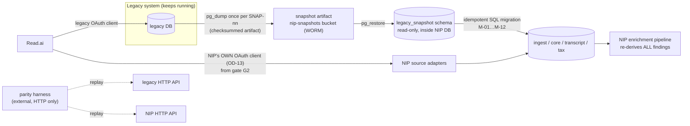
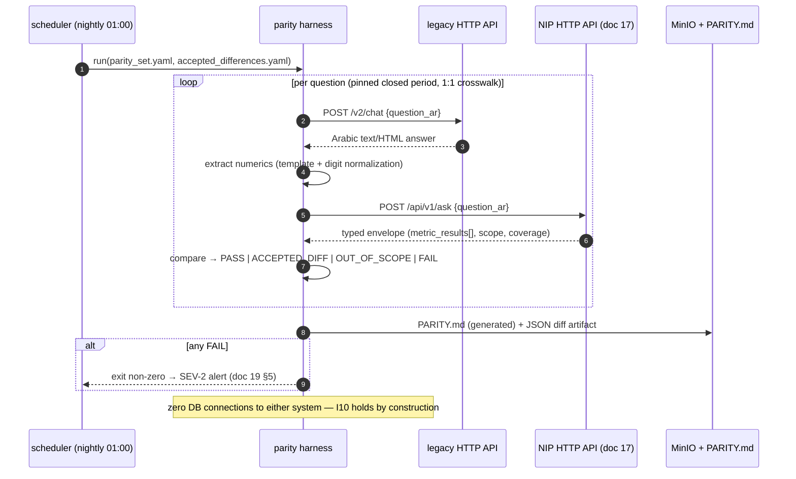
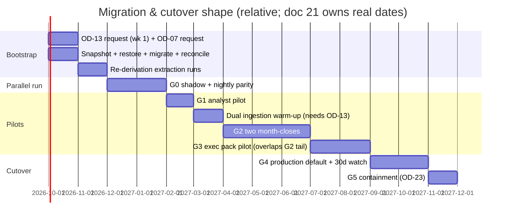

# 20 — Migration, Parallel Run, and Cutover
**Platform:** Nwafeth Intelligence — منصة نوافث لذكاء الجلسات الاستشارية (Monsha'at Advisory Session Intelligence Platform)
**Status:** Draft for owner review · **Date:** 2026-08-02 · **Amended:** 2026-08-03 (Owner Amendment integrated) · **Author:** Planning package (Fable 5)
**Depends on:** 05 (snapshot contract §9, source contracts), 06 (rebase, provider strategy), 08 (`legacy_snapshot` §13, core DDL), 09 (ingestion, reconciliation, resolver), 10 (re-derivation methodology), 15 (golden suite as gate evidence), 16 (PII classes, audit), 17 (API surface the replay harness drives), 19 (dashboards/drills as gate evidence) · **Feeds:** 21 (roadmap phases), 22 (ADR-0016, OD-13/OD-27), 23 (implementation order)
**Sources used:** GREENFIELD §19 (fully), §2.3, §1.3, §9.2; MASTER_PROMPT §13.8 (snapshot mechanics, Read.ai credential constraint, ingestion ownership), §13.9 (parity doctrine); CORE-BRIEF §10 OD-13, §11 baselines, §12 defect pins; arch/06 §5–6 (legacy corpus reality)

---

## 0. Scope and governing principles

This document plans the only sanctioned path from the legacy system to NIP: **one-time checksummed snapshot bootstrap → independent ongoing ingestion → externally-harnessed parallel run → gated pilots → production default → containment of legacy analytical routes.** Six principles govern every section:

1. **[DECISION I10 / ADR-0016 / GREENFIELD §2.3]** The new system never opens a connection to the legacy database, cache, workers, or session store — at bootstrap, during parallel run, or ever. The snapshot is a file; the parity harness is an external HTTP client of both systems.
2. **[DECISION MASTER_PROMPT §13.8]** The snapshot contains the **raw and authoritative layers only**. Derived findings (~409k legacy knowledge rows) are **never migrated** — they were classified under a fixed vocabulary chosen before anyone looked at the data, and the violations table alone carries 3,103 exact duplicate rows inflating counts up to ~1.84× [FACT arch/06 §7.14]. NIP re-derives everything under the new versioned taxonomy and pipeline.
3. **[DECISION MASTER_PROMPT §13.8, verified `token_manager.py:154,163`]** Read.ai rotates the refresh token on every refresh. A shared credential means whichever system refreshes second presents a dead token — both break, intermittently, untraceably. NIP gets **its own OAuth client (OD-13), requested in week 1** because provider lead time blocks the pilot gates.
4. **[DECISION MASTER_PROMPT §13.9]** Parity is compared only on a **pinned common basis**: closed pre-snapshot periods, capabilities with a 1:1 taxonomy crosswalk. Where the legacy answer is known wrong, parity is *expected to fail in a stated direction* — generic parity is never the acceptance bar.
5. **[DECISION GREENFIELD §19.4]** The legacy system keeps running throughout and **is not retired by this plan**. The end state is *containment* of its analytical routes (G5), not decommissioning; decommissioning is its owners' separate decision (OD-27).
6. **[DECISION GREENFIELD §1.3]** Every count in this document is a planning baseline measured 2026-08-02; the snapshot **manifest** produced at snapshot time is the authority for reconciliation, and the committed measurement script re-measures before any number reaches stakeholders. (Live example of why: the services report grew from 83,325 rows on 2026-07-16 [FACT arch/06 §6] to 94,963 on 2026-08-02 [FACT CORE-BRIEF §11] — the legacy corpus moves.)



### 0.1 Cohort staging ladder — the mandated development data strategy (Owner Amendment 2026-08-03)

[DECISION owner 2026-08-03 / Amendment §10.6] All development, migration, and detector work climbs one fixed data ladder. No rung may be skipped, and full-corpus processing before the same path has succeeded on a fixture and then a small sample is prohibited (Amendment §10.4-8):

| Rung | Data | Size | Exposure (doc 25 levels) | Existing artifact it binds to |
|---|---|---|---|---|
| 1 | Synthetic fixture, zero PII, committed to git | dozens of sessions covering the critical cases | L0 developer tests | doc 15 synthetic corpus; the VS-00 seed fixture |
| 2 | Anonymized snapshot slice (restricted store, used only after owner approval) | ~500 sessions | L0 integration/golden runs; L1 demo substrate | §1.9 fixture slice |
| 3 | Staging cohort | **20–100 sessions** (VS-01's «20 جلسة من Read.ai و20 سجلًا من DataHub» lives here) | L1 owner previews | doc 25 VS-01..VS-06 demo cohorts |
| 4 | One closed month | ~600–1,500 sessions (CORE-BRIEF §11 volume range) | L1/L2 rehearsal of month-close, digest, and infographic | G2 rehearsal cohort |
| 5 | Full corpus backfill | ~16.9k sessions | worker-plane only until the §4 gates | §1.9bis re-derivation campaign — runs only after resumability, cost, and DQ behaviour are proven on rungs 3–4 |

The ladder binds every pipeline equally: ingestion, enrichment, violation detection, infographic build, and any detector shadow run (§1.11). Rung promotion is recorded in the slice acceptance record (doc 25); the §1.9bis campaign is the only sanctioned rung-5 entry point.

---

## 1. Historical bootstrap

### 1.1 Snapshot artifact — exact contents

The snapshot series is named `SNAP-YYYYMMDD-nn` (e.g. `SNAP-20261001-01`); each is immutable; a corrected snapshot is a **new** artifact [DECISION doc 05 §9]. Contents finalize doc 05 §9's scope table into the exact table manifest:

**Included — raw and authoritative layers only:**

| Legacy table | Baseline rows (2026-08-02) | Class | Notes |
|---|---|---|---|
| `v2_meeting_raw` | ≈ meetings count (manifest-measured) | **true raw layer** | Raw Read.ai JSON payloads (7 `expand[]` fields); where present, everything else about the meeting re-derives from these |
| `v2_meetings` | 16,911 | authoritative projection | Identity/date columns; ASR flags (`transcript_corrected`) carried but **ignored** downstream |
| `v2_transcript_turns` | 399,501 | authoritative projection | **Raw `text` only — `text_corrected` is dropped in migration** (ASR correction cancelled, GREENFIELD §2.6); `speaker_role` kept where present (94.3% [FACT CORE-BRIEF §11]) |
| `v2_participants` | manifest | raw provider | speaker identities per meeting |
| `v2_metrics` | manifest | raw provider | provider timing/attendance features |
| `v2_beneficiaries`, `v2_business_profiles` | manifest | raw provider | P3-bearing; restricted handling §1.3 |
| `v2_action_items`, `v2_chapter_summaries` | manifest | raw provider (provider-authored) | Read.ai-authored artifacts: kept in `legacy_snapshot` for provenance/CAP-D7 archaeology, **not migrated into `core`** (provider analytics, superseded by NIP's own extraction) [REC — extension of doc 05 §9 scope table, same "raw provider output" class; alternative: exclude entirely — rejected: cheap to carry, and follow-up-completion history (CAP-D7) may need the provider's action items as a historical reference] |
| `v2_services_report` | 94,963 | authoritative internal | incl. rating columns (~24,171 rating-bearing rows) and consultant columns |
| `v2_consultants`, `v2_consultant_scores`, `v2_consultant_directory` | manifest / — / 894 | authoritative internal | collapsed into ONE dimension in migration SQL (`v2_consultant_scores` is derived — carried for reference, not migrated) |

**Excluded — with the named reason (the manifest lists these as zero-migration classes so the balance sheet closes):**

| Excluded | Rows | Reason class |
|---|---|---|
| 11 knowledge tables (violations, challenges, satisfaction/pressure signals, decision points, government mentions, repeated questions, topics, recommendations, automation opportunities, risk signals) + `v2_quality_scores` | ~409k + 16,911 | `derived` — re-derived under new taxonomy; violations additionally corrupted (no PK, 3,103 dup rows) [FACT arch/06 §7.14] |
| `v2_transcript_edits` | 158,949 | `cancelled_experiment` — audit trail of ASR correction (92.4% unreviewed [FACT arch/06 §2]) |
| `v2_meeting_chunks` (embeddings), `v2_meeting_sections` | 109,167 / 192,432 | `derived` — re-embedded/re-projected from raw; sections mix raw and corrected text (only 38.1% carry corrected sections vs 51.5% flagged — the invisible inconsistency lesson [FACT arch/06 §6]) |
| `v2_services_report_bak_20260610` | 76,111 | `compliance_exclusion` — PK-less PII orphan; **never enters the artifact**; its deletion is recommended to legacy owners [FACT arch/02 §9 via doc 05 §9] |
| `v2_conversation_history`, `v2_query_log`, `v2_feedback` | — | `legacy_serving_artifact` |
| portal users/sessions (`app_users`, `app_sessions`) | — | `new_idp` — NIP has its own identity (OD-02) |
| `v2_oauth_state` | — | `credential` — **credentials never migrate** (principle 3) |

### 1.2 Snapshot creation, checksum, and retention

Executed by the **legacy operator** on the legacy host (NIP supplies the script; NIP never connects — I10):

```bash
# make_snapshot.sh  SNAP-20261001-01   (runs on the legacy side)
pg_dump --format=custom --compress=9 --no-owner --no-privileges \
        $(printf -- '--table=%s ' "${INCLUDED_TABLES[@]}") \
        -f SNAP-20261001-01.dump
# per-table logical checksums + row counts → manifest
psql -Atc "SELECT count(*), md5(string_agg(t.*::text, '' ORDER BY <pk>)) FROM v2_meetings t" …
sha256sum SNAP-20261001-01.dump > SNAP-20261001-01.dump.sha256
age -e -R nip_transfer_pubkey.txt SNAP-20261001-01.dump > SNAP-20261001-01.dump.age
```

Manifest (`snapshot_manifest.json`, checked into the artifact and mirrored into `legacy_snapshot.snapshot_manifest` — doc 08 §13):

```json
{
  "snapshot_id": "SNAP-20261001-01",
  "created_at": "2026-10-01T02:00:00+03:00",
  "legacy_db_identity": "nwafeth_db@legacy-host",
  "high_watermark": {"v2_meetings.max_session_end": "2026-09-30T21:14:00+03:00"},
  "artifact_sha256": "…",
  "tables": [
    {"name": "v2_meetings", "rows": 17402, "logical_md5": "…", "pk": "meeting_ulid"},
    {"name": "v2_transcript_turns", "rows": 411208, "logical_md5": "…", "pk": "(meeting_ulid, turn_index)"}
  ],
  "excluded": [{"name": "v2_violations", "rows": 6794, "reason": "derived"}, …]
}
```

Retention [DECISION MASTER_PROMPT §13.8; mechanics in doc 19 §9.3/§10.4]: artifact + manifest live in the `nip-snapshots` WORM bucket **as long as any published number derives from it** — it is the only evidence of what the corpus looked like when a frozen pack was computed. Working assumption: life of platform [ASSUME OD-08].

### 1.3 PII handling during transfer

The artifact is **P3-bearing** (era-1 titles embed consultant national IDs; services-report beneficiary columns; directory IDs — doc 05 §2.7/§9, doc 16 §3):

1. Encrypted at rest from the moment of creation (`age`/GPG to NIP's transfer key; private key in NIP's vault only).
2. Transferred over the approved channel [ASSUME OD-01 network topology]; never via personal devices or e-mail; both ends verify `sha256` before and after transfer; verification events recorded as `ops.audit_event(action='snapshot_transfer')` on the NIP side and a signed receipt on the legacy side.
3. Decrypted only inside the NIP environment at restore time; the plaintext dump is deleted after restore verification (the encrypted WORM copy is the retained artifact).
4. `legacy_snapshot` gets the most restrictive grants in the database: `nip_web` has **zero** grants; `nip_worker` read-only; restore/migration runs under a dedicated `nip_bootstrap` role created for the bootstrap window and dropped after G0 [REC — doc 20-owned role, deliberately absent from the standing role inventory of doc 07 §6.2 / doc 16 §2.4; created and dropped by the bootstrap migration itself].
5. P3 columns with no crosswalk purpose are **never selected** into `core` (they stay behind `legacy_snapshot`'s grants until disposal) [REC doc 05 §9]; the two standing P3 columns in `core` are exactly those documented in doc 16 §3 [ASSUME OD-14].

### 1.4 Restore into `legacy_snapshot`

```text
opsctl bootstrap restore SNAP-20261001-01
  1. verify artifact sha256 vs manifest                          (DQ-SNAP-001: mismatch ⇒ BLOCK)
  2. pg_restore --no-owner into scratch schema, then
     ALTER TABLE … SET SCHEMA legacy_snapshot   (legacy tables live in public)
  3. recompute per-table row counts + logical_md5 vs manifest    (DQ-SNAP-001/002: any drift ⇒ BLOCK)
  4. REVOKE INSERT, UPDATE, DELETE ON ALL TABLES IN SCHEMA legacy_snapshot FROM ALL;
  5. write legacy_snapshot.snapshot_manifest row; audit event
```

Restore is idempotent: re-running against the same artifact yields byte-identical `legacy_snapshot.*` (verified by step 3) [DECISION doc 05 §9]. Restoring a **newer** `SNAP-nn` replaces the schema wholesale (drop + restore) — `legacy_snapshot` always reflects exactly one manifest.

### 1.5 Schema-to-schema migration — mapping and idempotent reruns

Migration is **ordinary SQL over fixed input** [FACT MASTER_PROMPT §13.8 property 2], executed as ordered steps `M-01…M-12` by `opsctl bootstrap migrate`, each recorded in `legacy_snapshot.migration_step_run (step_id, snapshot_id, started_at, finished_at, rows_in, rows_out, excluded_by_class jsonb, checksum_out)`.

| Step | Source (`legacy_snapshot.`) | Target | Transform highlights |
|---|---|---|---|
| M-01 | `v2_meeting_raw` | MinIO `nip-raw-payloads` + `ingest.raw_payload` | content-addressed (sha256 key); provenance `origin='bootstrap:SNAP-nn'` |
| M-02 | `v2_meetings` | `core.advisory_session` + `core.provider_meeting_map` | `session_uid = uuid_v5(NS_NIP_BOOTSTRAP, meeting_ulid)` [REC — deterministic minting so reruns are byte-identical; doc 08 §2 "mint new session_uids" satisfied deterministically]; consultant `'PENDING'` strings become `consultant_id=NULL, resolution_status='unresolved_bootstrap'` — the magic string is unrepresentable [DECISION CORE-BRIEF §6] |
| M-03 | `v2_meetings` + `v2_meeting_raw` | `transcript.source`, `transcript.version`, `transcript.active_transcript` | one source row per session (`provider='readai'`, `source_version=1`); activation `activated_by='bootstrap'` (doc 06 §2) |
| M-04 | `v2_transcript_turns` | `transcript.turn` | raw `text` only; `text_corrected` **not selected**; missing `speaker_role` (5.7%) → NULL + `role_resolution='pending'` |
| M-05 | `v2_participants`, `v2_metrics` | `core.session_participant`, provider feature facts | interval-merge speaking time recomputed downstream (silence_pct overlap bug not inherited [FACT CORE-BRIEF §12]) |
| M-06 | consultant tables ×3 | `core.consultant` + `core.consultant_source_ref` | collapsed to one dimension; national-ID refs land in the restricted `ref_kind='national_id'` crosswalk column [ASSUME OD-14] |
| M-07 | `v2_services_report` | `ingest` staging → doc 09 resolver → `core` facts (ratings, attendance, status) | header-mapped, not positional [FACT CORE-BRIEF §12]; beneficiary P3 pseudonymized per doc 16; unmatched rows stay staged with `resolution_status`, feeding Q1–Q5 queues |
| M-08 | `v2_beneficiaries`, `v2_business_profiles` | `core.beneficiary_identity` (restricted) | `pseudonym_label` minted; no cross-session linkage [ASSUME OD-15] |
| M-09 | legacy category vocabularies (from knowledge-table DDL/enum values — *not* the rows) | `tax.*` | the committed crosswalk (§1.7) is loaded; legacy categories stamped `taxonomy_version=0` |
| M-10 | — | `findings` | **intentionally empty** — findings are re-derived by extraction runs, never migrated (principle 2) |
| M-11 | reconciliation | balance-sheet totals (§1.6) written to `legacy_snapshot.migration_reconciliation` | fails the migration on any unexplained residual |
| M-12 | fixture extraction (§1.8) | fixture artifact | stratified 500-session slice |

**Representative step sketches** (planning-level SQL; doc 23 sequences the real Alembic-managed versions):

```sql
-- M-02: sessions + provider map (deterministic, rerunnable)
INSERT INTO core.advisory_session (session_uid, actual_at, channel, consultant_id,
                                   resolution_status, origin)
SELECT uuid_v5('6b7a…-nip-bootstrap', m.meeting_ulid),
       m.session_end_at,
       m.platform_channel,
       NULL,                                        -- resolver assigns later; NEVER 'PENDING'
       CASE WHEN m.consultant_id = 'PENDING' OR m.consultant_id IS NULL
            THEN 'unresolved_bootstrap' ELSE 'candidate_bootstrap' END,
       'bootstrap:SNAP-20261001-01'
FROM legacy_snapshot.v2_meetings m
ON CONFLICT (session_uid) DO NOTHING;

INSERT INTO core.provider_meeting_map (session_uid, provider, provider_meeting_ref, mapped_by)
SELECT uuid_v5('6b7a…-nip-bootstrap', m.meeting_ulid), 'readai', m.meeting_ulid, 'bootstrap'
FROM legacy_snapshot.v2_meetings m
ON CONFLICT (provider, provider_meeting_ref) DO NOTHING;

-- M-04: turns — raw text only, corrected text structurally unselectable
INSERT INTO transcript.turn (transcript_version_id, turn_index, speaker_role,
                             started_at_ms, ended_at_ms, text)
SELECT tv.transcript_version_id, t.turn_index,
       NULLIF(t.speaker_role, ''),                  -- 5.7% NULL, honestly
       t.start_ms, t.end_ms,
       t.text                                       -- t.text_corrected DOES NOT APPEAR
FROM legacy_snapshot.v2_transcript_turns t
JOIN transcript.version tv USING (provider_meeting_ref_join…)
ON CONFLICT (transcript_version_id, turn_index) DO NOTHING;

-- M-11: balance-sheet assertion (fails the run, never warns)
INSERT INTO legacy_snapshot.migration_reconciliation
       (snapshot_id, data_class, rows_in, rows_migrated, exclusions)
SELECT 'SNAP-20261001-01', 'transcript_turns',
       (SELECT count(*) FROM legacy_snapshot.v2_transcript_turns),
       (SELECT count(*) FROM transcript.turn WHERE origin = 'bootstrap:SNAP-20261001-01'),
       '{}'::jsonb;
-- CHECK constraint on the table: rows_in = rows_migrated + (sum of exclusion counts)
```

Bookkeeping DDL sketch:

```sql
CREATE TABLE legacy_snapshot.migration_step_run (
  step_id        text NOT NULL,              -- 'M-02'
  snapshot_id    text NOT NULL,              -- 'SNAP-20261001-01'
  started_at     timestamptz NOT NULL,
  finished_at    timestamptz,
  rows_in        bigint, rows_out bigint,
  excluded_by_class jsonb NOT NULL DEFAULT '{}',
  checksum_out   text,                       -- logical md5 of target slice; rerun must reproduce
  PRIMARY KEY (step_id, snapshot_id, started_at)
);
CREATE TABLE legacy_snapshot.migration_reconciliation (
  snapshot_id  text NOT NULL, data_class text NOT NULL,
  rows_in bigint NOT NULL, rows_migrated bigint NOT NULL,
  exclusions jsonb NOT NULL DEFAULT '{}',    -- {"derived": 409000, "compliance_exclusion": 76111}
  balanced boolean GENERATED ALWAYS AS
    (rows_in = rows_migrated + (SELECT coalesce(sum(v::bigint),0)
                                FROM jsonb_each_text(exclusions) AS e(k,v))) STORED,
  PRIMARY KEY (snapshot_id, data_class)
);
-- migration exits non-zero if ANY row has balanced = false  (DQ-SNAP-003)
```

**Idempotency and rerun rules:**
- Every step is `INSERT … SELECT` with deterministic keys (`uuid_v5`, natural keys) + `ON CONFLICT DO NOTHING`; a full rerun over the same snapshot produces byte-identical targets (checksummed by `checksum_out`).
- **Full rebuild** (`--rerun`): deletes only rows tagged `origin='bootstrap:SNAP-nn'` and replays M-01…M-12. Safe **only before live ingestion begins**; the command refuses to run if any non-bootstrap rows exist in the target cohorts (guard query on `origin`), because after go-live the resolver owns those tables.
- A **new snapshot** (`SNAP-…-02` during the build, §2.4) reruns migration incrementally: deterministic keys make re-migration of unchanged rows a no-op; changed rows (legacy edits to history) surface in the reconciliation delta and are reported, never silently overwritten.

### 1.6 Reconciliation totals — the balance sheet

Identity per data class: `legacy_snapshot count = migrated + Σ(named exclusion classes)`, zero unexplained [DECISION doc 05 §9 DQ-SNAP-003]. Planning-baseline shape (manifest figures replace these at snapshot time):

| Class | In (snapshot) | Migrated | Named exclusions (class: count) |
|---|---|---|---|
| Meetings | 16,911 | ~16,900 | `zero_turn_meeting`: manifest-measured; `not_advisory` (steward-disposed later, starts 0) |
| Transcript turns | 399,501 | 399,501 | none expected; any delta ⇒ M-11 failure |
| Raw payloads | manifest | = in | none |
| Services-report rows | 94,963 | staged 94,963 → matched per resolver | staged-unmatched is a **resolution state, not an exclusion** — reported as join-rate KPI (doc 05 §10.2), baseline ~8% legacy bridge match to beat |
| Consultants | 894 directory (+2 tables) | deduped dimension count | `duplicate_identity`: collapse documented per merge |
| Ratings | ~24,171 rating-bearing rows | = in (linked or staged) | — |
| Derived rows | ~409k + scores + chunks + sections | **0 by design** | `derived`: full counts, incl. the violations dup note (6,794 raw = 3,691 distinct, 3,103 exact dups — recorded so nobody later "finds" the discrepancy) |

The signed reconciliation sheet is **gate G0 entry evidence** (§4). It is stored as an artifact and mirrored into D5/CAP-D9 so the coverage story of historical months is user-visible (I8).

### 1.7 Legacy classifications: `taxonomy_version=0` crosswalk

[DECISION MASTER_PROMPT §4.3; doc 08 §13] The legacy *rows* stay in `legacy_snapshot`, but their **vocabulary** is mapped once, in a committed file `tax/legacy_crosswalk.csv`:

```csv
legacy_table,legacy_label,new_taxonomy,new_category_id,mapping,note
v2_violations,أسلوب غير مهني,VIOL,VIOL-001,1to1,
v2_violations,تضليل,VIOL,VIOL-003,1to1,
v2_violations,معلومات غير مؤكدة,VIOL,VIOL-004,1to1,
v2_violations,<legacy misc buckets>,VIOL,,none,no legacy detector existed for تهكم/تسويق شخصي — coverage gap (doc 04 §gap table)
v2_challenges,تمويل,CHAL,CHAL-00x,1to1,
v2_challenges,<merged bucket>,CHAL,,merge,out of parity scope by construction
```

Rules: any classification surfaced from legacy material (parity analysis, historical continuity views) is stamped `taxonomy_version=0` through this crosswalk and is **excluded from the live analytical view until the session is reclassified** by the new pipeline (I13; doc 08 §6 `version 0 = pre-taxonomy legacy stamp`). Only `mapping=1to1` rows are eligible for parity comparison (§3.2); `merge`/`split`/`none` rows are out of parity scope **by construction, not as accepted differences** [DECISION MASTER_PROMPT §13.9].

### 1.8 Quote verification against migrated turns

Two distinct obligations [DECISION GREENFIELD §19.1 "quote verification"]:

1. **Turn integrity:** for a stratified sample of 500 sessions, re-parse `v2_meeting_raw` payloads and compare re-derived turn text against migrated `transcript.turn` rows (checksum per turn). Divergence ⇒ the projection tables drifted from raw — prefer raw, flag session, report count. (Where `v2_meeting_raw` is absent for old meetings, the projection is the best available raw layer; the manifest records the coverage split.)
2. **Finding provenance (DQ-SNAP-004):** all findings re-derived during bootstrap extraction runs pass the standard inline R7 gate against the migrated turns (structurally guaranteed), **plus** an independent audit: 1,000 randomly sampled stored quotes re-verified by the doc 15 verifier harness after migration completes. Target: 100% pass; any failure is a migration defect (encoding, normalization), SEV-2, fixed before G0 exit. The legacy failure this prevents: 67% of legacy extractions quote corrected text that no longer exists [FACT doc 06 §1 / MASTER_PROMPT §2.4].

### 1.9 CI fixture slice (~500 sessions)

[DECISION MASTER_PROMPT §13.8 property 3 — one artifact, two uses] Extracted by M-12 from the same snapshot:

- **Selection (fixed seed, committed script):** proportional stratification over the 14 months × title era (era-1/era-2) × services-report-matched (yes/no) × rating-present (yes/no); forced inclusion of edge specimens: sessions with missing `speaker_role`, the longest transcript, a zero/near-zero-turn meeting, an ambiguous-title collision pair (Q4 specimen), ≥5 sessions each from the min-volume month (556) and the max (1,512).
- **Content:** `legacy_snapshot`-shaped slice **and** its migrated `core`/`transcript` projection, so tests cover both the migration SQL and the downstream pipeline.
- **PII:** consultant/beneficiary names replaced from a placeholder dictionary; national IDs and contact columns dropped; transcript text retained verbatim (it is the test substance) — therefore the fixture is **not committed to git**: it lives in the restricted eval store, pulled by CI at runtime; git holds the manifest + checksums only [DECISION doc 15 OD-20].
- **Uses:** the **Tier N/R** fixture-DB CI runs (doc 15 §8 — Tier P per-PR runs use only the committed synthetic corpus; this slice serves nightly/release runs where the restricted store is reachable), migration-rerun byte-identity test, resolver KPI regression, golden-suite substrate.

### 1.9bis Bootstrap re-derivation plan (what runs after migration, in what order)

Migration ends with `findings` empty by design (M-10). The bootstrap **re-derivation campaign** then populates it under the new pipeline — this is the step that replaces the ~409k legacy knowledge rows with provenance-stamped findings:

| Order | Run | Scope | Batch class | Est. duration (doc 19 §8.3 math) |
|---|---|---|---|---|
| 1 | Speaker-role resolution + turn features (deterministic, no LLM) | all 399,501 turns | worker pool | hours |
| 2 | Per-session structured extraction (`extraction_run` kind `bootstrap`, `openai/gpt-oss-120b` strict schema) | all ~16.9k sessions, month-partitioned oldest-first | **Groq Batch API** (backfill class — allowed; 50% discount; never for user-accepted Lane-3 jobs [DECISION CORE-BRIEF §7]) | 1–3 nights |
| 3 | Embedding pass (evidence units, bge-m3 pending EXP-04) | ~400k units | local embedding service | < 1 day |
| 4 | Clustering + taxonomy proposal seeding (R-P2; CHAL/QST/ENT candidates for steward review) | corpus | worker pool | days incl. review lag |
| 5 | Curated capability precomputation + quality scoring under doc 10 methods | corpus | worker pool | hours |

Every run carries `extraction_run_id`, `model_id`, `prompt_sha`, `taxonomy_version` (I13); failures mark units failed and count (F19 pin — never swallowed to None); the campaign closes with a coverage report per month cohort that becomes the historical-coverage baseline every answer's I8 block cites. G0 cannot enter until runs 1–2 complete and run 5 covers the parity-question capabilities.

### 1.10 Re-snapshot cadence during the build

While NIP has no live ingestion (§2), the corpus is refreshed by re-snapshot: **monthly**, or on demand before a gate [REC]. Each re-snapshot is a new `SNAP-nn`; migration reruns incrementally (§1.5); the reconciliation delta between consecutive snapshots is itself evidence (it measures legacy churn on closed months — feeding §3.4's `data snapshot difference` ledger).

### 1.11 Shadow-detector migration — legacy labels never seed production detectors (Owner Amendment 2026-08-03)

[DECISION SD-22 / Amendment §12-20] Legacy-derived labels — the crosswalked `taxonomy_version=0` classifications of §1.7 and the legacy violations table generally (no PK, 3,103 exact duplicate rows [FACT arch/06 §7.14]) — are **candidate material only**. They never configure, seed, or tune a production detector directly, and no bootstrap step may short-circuit this. The only path into production detection is the doc 14 §6.5 lifecycle:

1. Curated legacy exemplars (deduplicated, human-relabelled under the current taxonomy) may enter a **versioned immutable `label_dataset`** with provenance `origin='legacy_snapshot'` and the standard train/validation/holdout split (no session leakage).
2. Offline evaluation per category — precision AND estimated recall with confidence intervals, never a single total (Amendment §6.5).
3. **Shadow run** against the incumbent detector on rung-3/4 cohorts (§0.1), producing `shadow_result` rows; production queues untouched.
4. Human adjudication of the disagreement sample → documented promotion decision → canary → full deployment with version stamp → monitoring (`detector_acceptance_rate`, doc 19 §2.8) → instant rollback that loses no review decisions.

The first production detector (VIOL-008 «التواصل خارج الإطار الرسمي» [ASSUME OD-35 — owner may swap the first type before the VS-02 build]) is built from **new review labels gathered in VS-02**; legacy exemplars may only augment its datasets through the path above. Consultant names/ratings are never detector features, in migration datasets or anywhere else [DECISION SD-22].

---

## 2. Independent ongoing ingestion

### 2.1 Ingestion ownership through time

[FACT MASTER_PROMPT §13.8 table, extended with the pilot phases]

| Phase | Who ingests from Read.ai | NIP data freshness | Why |
|---|---|---|---|
| Build (pre-G0 → G1) | **Legacy only** | monthly re-snapshot (§1.10) | second credential not yet live; lag irrelevant against history; parity questions are closed-period anyway |
| Pilot (G2 entry onward) | **Both — on separate OAuth clients** | live (T+24h SLA, doc 05 §11) | dual running is safe **only** with independent credentials (principle 3); NIP warms its ingestion ≥ 4 weeks before month-close pilot |
| Production default (G4+) | Both (NIP primary; legacy continues for its own users until G5/OD-27) | live | I10 both directions — neither is the other's dependency |

### 2.2 NIP's own Read.ai OAuth client — OD-13, the long-lead item

- **Action in week 1 of delivery (doc 21 critical path):** submit the request for a second OAuth client on the Monsha'at Read.ai workspace. [FACT MASTER_PROMPT §13.8: "Request the second credential early — it has a lead time and it blocks cutover."]
- Token store: NIP vault only; rotate-on-refresh handled by NIP's token manager; the credential never appears in the snapshot, in git, or in the legacy system (principle 3). Loss recovery = fresh OAuth grant (doc 19 §10.3).
- **Never** point both systems at one credential, "not even briefly to get it working" [FACT MASTER_PROMPT §13.8]. CI/structural check: NIP's config schema has no field for a legacy credential path.
- Contingency if OD-13 is refused or delayed past G2: pilot months continue on re-snapshot cadence with declared staleness (I8 coverage block states the corpus date); G2 month-close pilot slips rather than sharing credentials [REC — the alternative, credential sharing, is prohibited by decision, not by preference].

### 2.3 Internal source access — OD-07

Own access to the internal session system (DB replica / API / export per OD-07; safe assumption read-only API or scheduled export — doc 05 SRC-INT contract). The legacy path (manual Excel upload → TRUNCATE reload [FACT arch/06 §1]) is not replicated: NIP ingests versioned deliveries with reconciliation (doc 09). During the build, historical services-report data comes from the snapshot; ongoing deliveries begin when OD-07 lands — also a gate G2 entry dependency.

### 2.4 Watermark handover — no gap, no overlap loss

When NIP live ingestion starts (G2 entry):

```text
backfill_since = SNAP-latest.high_watermark − 7 days      # overlap window
1. NIP adapter ingests [backfill_since, now) on its own client
2. Overlap rows dedupe via natural keys (provider meeting id) — idempotent upserts (doc 09)
3. Reconciliation report proves: no session exists in provider listing that is in
   neither legacy_snapshot-migrated cohort nor the live-ingested cohort
   (counter identity per doc 09 §3; failure ⇒ SEV-1, RB-7)
```

The overlap window absorbs provider-side late arrivals; the identity check makes a silent gap structurally detectable — the legacy `--since`-rerun data-loss hazard [FACT arch/06 §2] has no analogue here because raw payloads are immutable and versioned (I6).

---

## 3. Parallel run — the external replay harness

### 3.1 Harness design

[DECISION MASTER_PROMPT §13.9] A standalone test client, deployed in the ops stack, holding **two base URLs and zero database connections** — to either system. I10 is preserved by construction; giving the harness a DB connection would defeat it "by the back door" and is prohibited.

```text
parity-harness (nightly, scheduled in NIP worker scheduler but network-isolated
                to HTTP; also runnable ad hoc)
  inputs:  parity_set.yaml (question set §3.2, pinned periods, crosswalk refs)
           accepted_differences.yaml (§3.4)
  legacy:  POST /v2/chat …            → Arabic text/HTML answer
           → numeric extraction: regex over normalized digits (Arabic-Indic → Western),
             per-question extraction template committed with the question
             (the harness parses legacy PRESENTATION because legacy has no
              structured envelope — the F6 lesson lives on the legacy side only)
  nip:     POST /api/v1/ask (doc 17)  → typed envelope → numbers read from
           metric_results[].value — no parsing
  compare: per question: value(s), scope echo, n
  classify: PASS | ACCEPTED_DIFF(ad_id) | OUT_OF_SCOPE | FAIL
  outputs: PARITY.md (generated, never hand-edited) + JSON diff artifact → MinIO;
           exit non-zero on any FAIL  [FACT MASTER_PROMPT §13.9]
  auth:    dedicated read-only analyst account on EACH system (separate credentials;
           NIP account has aggregate-only permissions — no transcript access needed)
```

Metrics/alerting (doc 19): `nip_parity_runs_total{outcome}`, `nip_parity_questions_total{class}`; any FAIL → SEV-2 to eng lead; 3 consecutive FAIL nights → gate-freeze (§4 rollback triggers).



### 3.2 Question set — pinned common basis only

[DECISION MASTER_PROMPT §13.9] Every parity question satisfies **all** of:

1. **Closed pre-snapshot period** — at or before the pinned snapshot's high watermark; never an open or current period (corpus-lag divergence excluded by construction).
2. **1:1 crosswalk capability** — only capabilities whose semantics and categories map 1:1 (`legacy_crosswalk.csv mapping=1to1`); anything touched by merge/split/introduce is OUT_OF_SCOPE by construction.
3. **Equivalent meaning and period arithmetic** — the question text is phrased identically for both; period is embedded explicitly (e.g. «من 2026-01-01 إلى 2026-01-31») to neutralize the legacy period-resolution bugs *as a variable* (they are tested separately as expected-fail entries, below).

Initial set [REC — ~60 questions, committed as `parity_set.yaml`]:

| Block | Count | Examples (pinned period 2026-01, closed) |
|---|---|---|
| Volume/count sanity | 12 | «كم عدد الجلسات في يناير 2026؟» per month × channels — doubles as the **data-snapshot-diff canary** (§3.4) |
| Clear-steps rate (CAP-B1 ≈ legacy step_clarity) | 8 | rate + denominator echo |
| Violations (CAP-B5 ≈ legacy canonical types, 1:1 rows only) | 10 | counts per category — **expected-fail direction entries** (§3.3); **suspected and approved series compared separately, never one number** (see rule below) |
| Satisfaction distribution (CAP-A3 ≈ legacy satisfaction signals) | 8 | positive/negative/neutral shares |
| Top challenges (CAP-C1, 1:1 categories only) | 8 | top-5 by month |
| Government mentions (CAP-C5 ≈ legacy government_mentions counts) | 6 | entity counts for high-frequency entities with exact alias match |
| Consultant-scoped counts | 8 | for consultants resolved in **both** systems (excludes the legacy 9.6% `'PENDING'` cohort from parity; that cohort is instead an expected-difference entry) |

The set grows only by committing new entries with their crosswalk proof; it never grows to "compare everything" — a comparison that is usually wrong teaches everyone to ignore it [FACT MASTER_PROMPT §13.9].

**Suspected and approved violation counts are compared separately — never one number** [DECISION SD-19/SD-20 / Amendment §12-20]. Legacy violation counts are unreviewed machine detections, so PAR-V entries compare them against NIP's **suspected** `violation_finding` counts only (AD-001's dedup direction bound applies to that series). NIP's **approved** violation counts — the output of the six-decision human review workflow — have no legacy analogue and are `OUT_OF_SCOPE` for parity **by construction**: the harness reports them beside the parity table as a separate informational series with its own label («معتمدة بعد المراجعة البشرية»), and any parity output, dashboard, or gate record that presents a single combined "violations" figure is itself a class-2 defect. Leadership-facing numbers remain approved-only with queue size shown separately (`suspected_cases_open`), during the parallel run exactly as after it.

**Worked example — one committed parity entry, end to end:**

```yaml
# parity_set.yaml
- id: PAR-V-03
  question_ar: "كم عدد المخالفات من نوع «تضليل» في الجلسات من 2026-01-01 إلى 2026-01-31؟"
  period: {start: 2026-01-01, end: 2026-02-01}        # end-exclusive, closed, pre-snapshot
  crosswalk: {legacy_label: "تضليل", new: "VIOL-003", mapping: 1to1}
  legacy_extract:                                      # harness-side parsing of legacy PRESENTATION
    template: "regex"
    pattern: 'تضليل[^0-90-9]{0,40}([0-90-9,،]+)'
    digit_normalize: true                              # 0-9/۰-۹ → 0-9, strip ،
  nip_read: "$.metric_results[?(@.category_id=='VIOL-003')].value"
  accepted_difference: AD-001                          # dedup: expect nip_lower, ratio ≤ 1.84
```

Nightly evaluation walk-through: legacy answers «…تضليل: 412 حالة…» → extracted 412; NIP envelope returns `{"category_id":"VIOL-003","value":251,"n_sessions":1104,"period":{…}}` → ratio 412/251 = 1.64, direction `nip_lower`, within AD-001's `[1.0, 1.84]` bound ⇒ **ACCEPTED_DIFF(AD-001)**, logged with both values. Had NIP returned 430 (ratio 0.96, wrong direction), the run classifies **FAIL** — the dedup ledger entry cannot absorb an increase [DECISION MASTER_PROMPT §13.9 direction rule] — and PARITY.md carries the full diff with both raw payloads for diagnosis.

### 3.3 Difference classification — six classes, with the direction rule

Every non-PASS lands in exactly one class [DECISION GREENFIELD §19.3 + MASTER_PROMPT §13.9]:

| Class | Definition | Handling | Worked example |
|---|---|---|---|
| **1. Legacy defect corrected** | NIP diverges because a pinned legacy bug is fixed | Accepted-difference ledger entry **with expected direction and magnitude bound**; wrong-direction ⇒ reclassify as class 2 | Violation counts **DROP by up to ~1.84×** post-dedup (6,794 → ≤3,691 distinct) [FACT arch/06 §7.14]. A violation count that *rises* is a NEW bug, not the known one. Per-consultant session counts **RISE** as the 9.6% `'PENDING'` cohort resolves [FACT arch/06 §2]. Period-scoped answers change where legacy ignored the injected period (ISS-01/F16) — per-question expected direction derived from all-time vs scoped values |
| **2. New defect** | NIP wrong; legacy (or the answer key) right | **FAIL** — blocks the active gate; bug ledger; fix + replay | e.g. resolver drops era-1 sessions from a month count |
| **3. Intentional methodology change** | Same construct, different committed method | Ledger entry citing the doc 10 method decision; compared for *stability*, not equality | impact levels: legacy rule-based `impact_level` vs CAP-A1 curated+discovery — distribution shift expected, documented, not "parity" |
| **4. Data snapshot difference** | Corpora differ on the pinned basis | Investigate: legacy edited a closed month (its TRUNCATE-reload habit [FACT arch/06 §1]) or NIP migration gap. Canary: the volume block (§3.2); resolution: re-snapshot + delta report, or class 2 if NIP-side | January count differs by +3 after a legacy services re-upload |
| **5. Taxonomy difference** | Divergence traceable to category mapping | Should not occur inside the 1:1 scope — occurrence means the crosswalk row is wrong: fix crosswalk or move question OUT_OF_SCOPE | a "1:1" challenge category that legacy actually populated from two merged buckets |
| **6. Not comparable** | Construct differs despite similar wording | Remove from set (committed change), record why | legacy «الجلسات عالية الأثر» (rule-based score) vs CAP-A1 contrastive patterns |

**Never require parity where the legacy answer is known wrong** [DECISION GREENFIELD §19.3]: the known-wrong register (violations inflation ~1.84×, period-blind handlers, `'PENDING'`-invisible consultants, silence_pct overlap, impact scores computed over a mixed corrected/raw corpus [FACT arch/06 §6]) is committed alongside the question set; questions touching it carry their class-1 entries from day one.

### 3.4 Accepted-differences ledger

`accepted_differences.yaml` (mirrored into generated PARITY.md; one entry per line of divergence):

```yaml
- id: AD-001
  question_ids: [PAR-V-01..PAR-V-10]
  class: legacy_defect_corrected
  description: violations dedup (legacy no-PK table, 3,103 exact dup rows)
  expected_direction: nip_lower          # REQUIRED — direction rule
  expected_magnitude: "ratio legacy/nip in [1.0, 1.84]"
  evidence: arch/06 §7.14; migration exclusion class 'derived'
  expiry: G5 + 90d                        # ledger entries expire; expired ⇒ FAIL until renewed
- id: AD-002
  question_ids: [PAR-CONS-*]
  class: legacy_defect_corrected
  description: consultant resolution recovers legacy PENDING cohort (9.6%)
  expected_direction: nip_higher_or_equal
  expected_magnitude: "nip/legacy in [1.0, 1.12]"
  ...
```

An accepted difference that moves the **wrong way** or exceeds its magnitude bound is a FAIL — the ledger can never silently absorb a new defect [DECISION MASTER_PROMPT §13.9]. Expiry dates force periodic re-justification; an expired entry fails the run.

### 3.5 Cadence and role in gates

Nightly from G0; PASS-rate and FAIL-streak feed gate criteria (§4). The parity harness is the only mechanism that catches the rewrite silently changing a published number for *unmapped* history — the golden suite covers owner-signed capabilities; parity covers the crosswalked remainder from day one for the cost of one scheduled job [FACT MASTER_PROMPT §13.9].

---

## 4. Pilots and cutover — gates G0…G5

Roles: **gate owner** decides pass/fail with the named evidence; product owner signs G3+ [ASSUME OD-10]. All gate evidence is artifacts (dashboards, reports, signed sheets) — never verbal. The legacy system runs unmodified throughout; no gate asks anything of it beyond staying up for replay.

**Exposure-level boundary — parity NEVER blocks L1 owner previews [DECISION SD-18 / Amendment §9.2; recorded as resolved conflict #1].** Gates G0–G5 and the parity harness govern **L2 (controlled pilot) and L3 (production-default)** exposure only. From the earliest vertical slices, the owner previews each feature at **L1** in staging on synthetic or rung-2/3 cohort data (§0.1) while parity runs in the background — a red parity night, an incomplete crosswalk, or an unfinished gate is never a reason to withhold an L1 demo. The earlier package phrasing "nothing user-visible before EXP-09/EXP-10" is amended accordingly: those experiment gates guard pilot/production exposure, not internal owner previews. The converse also binds: L1 acceptance is never authorization for L2/L3 — those still require the gates in the table below (doc 25 owns the L0–L3 definitions).

### Gate table

| Gate | Name | Users on NIP | Entry criteria (all required) | Exit criteria (all required) | Rollback (cheap by design) |
|---|---|---|---|---|---|
| **G0** | Shadow mode | build team only | bootstrap complete; reconciliation sheet §1.6 signed; quote audit §1.8 pass; golden suite ≥ doc 15 thresholds on fixture; parity harness live; doc 19 restore drill #1 passed | 14 consecutive parity nights zero FAIL; zero SEV-1 over 14d; freshness n/a (snapshot mode); R13 reconstruction test (doc 19 §3.4) passes | stop — nothing user-facing |
| **G1** | Analyst pilot | 3–5 named analysts | G0 exit; analyst accounts + RBAC live (doc 16); Arabic UX review of answer envelope (doc 18) | 4 weeks use; ≥ 50 real questions; answer-quality review: zero unexplained wrong numbers (class-2 count = 0 open); honest-boundary UX validated (Lane-2 responses rated understandable by pilots) | close pilot; analysts return to legacy; findings → backlog |
| **G2** | Operational pilot (month-close) | + service owners | G1 exit; **OD-13 credential live + dual ingestion warmed ≥ 4 weeks**; OD-07 feed live; join-rate KPIs ≥ doc 05 §10.2 targets on the live cohort; freshness SLO ≥ 0.95 (doc 19) | **two consecutive month-closes** where B1–B5 outputs are produced from NIP, reviewed via the doc 18 workflows (incl. B4 violation review in anger), and formally accepted by the service owner alongside legacy outputs; parity FAIL streak = 0 | month-close ownership reverts to legacy outputs; NIP stays in shadow; ingestion keeps running (no data loss on rollback) |
| **G3** | Executive pack pilot | + limited executive group | G2 exit; pack pipeline + sign-off chain live (OD-10); taxonomy VIOL/CHAL/SAT at version ≥ 1 with approved answer keys (unsigned-capability metric = 0, doc 19 §2.5) | one monthly + one quarterly pack published, signed, distributed, **zero retractions**; executive feedback incorporated or ticketed | pack superseded/retracted per packs doctrine (never edited); exec reporting reverts to legacy channel |
| **G4** | Production default | all user groups | G1–G3 exits; EXP-10 adversarial/security tests passed (doc 15/16); DR drill within last 90d; ops calendar §11 (doc 19) running ≥ 1 month; support/runbook handover done; comms plan approved | 30 days as default: API error budget met (doc 19 §5), zero SEV-1, degraded-share < 1%, no open class-2 parity defect | **flip the default back** — legacy is fully operational by design; 72h decision window with D1–D5 dashboards as the tripwire; comms template pre-approved |
| **G5** | Containment of legacy analytical routes | — | G4 exit + 60d stability; OD-27 decision recorded | legacy analytical/chat routes carry a permanent redirect banner («انتقلت التحليلات إلى منصة نوافث») or are network-restricted to break habit; legacy continues operating for its remaining functions; NIP↔legacy runtime independence intact in both directions (I10) | lift containment (restore routes) — a config change on the legacy edge, owned by legacy operators |

### Gate evidence in detail — G0 and G2 (the two gates most often faked in practice)

**G0 entry checklist (each item is an artifact link in the gate record, not a claim):**

| # | Evidence | Produced by |
|---|---|---|
| 1 | Snapshot manifest + restore verification (DQ-SNAP-001/002 green) | §1.4 step 3 output |
| 2 | Migration reconciliation sheet, all rows `balanced=true`, signed by data steward | §1.6 / M-11 |
| 3 | Turn-integrity sample report (500 sessions vs raw payloads) | §1.8(1) |
| 4 | Quote audit: 1,000/1,000 R7 verifications passed | §1.8(2) |
| 5 | Re-derivation campaign coverage report (runs 1–2 complete; run 5 covers parity capabilities) | §1.9bis |
| 6 | Golden suite result ≥ doc 15 thresholds on the fixture DB | doc 15 CI |
| 7 | Restore drill #1 report (doc 19 §9.4) | ops |
| 8 | Parity harness dry-run: OUT_OF_SCOPE/ACCEPTED classifications behave; zero unclassified diffs | §3.1 |

**G2 exit — "two month-closes accepted" means, concretely:** for each of two consecutive calendar months, the service owner receives the B1–B5 outputs produced by NIP (clear-steps rate with denominators and Wilson CIs, time-loss analysis, top repeated questions, violation indicators **through the doc 18 review workflow with at least one real reviewer rejection exercised**, ranked violation taxonomy), compares them against the legacy month-close, disposes every material difference into a §3.3 class in writing, and signs the month record. A month-close where differences were noticed but not classified does **not** count — unclassified divergence is exactly the debt this plan exists to prevent.

### Rollback triggers (any gate, standing)

1. A **published number traced to a NIP defect** (parity class 2 confirmed on a served answer) → immediate gate freeze; if published in a pack, the retraction obligation fires (doc 08 packs).
2. Parity FAIL streak ≥ 3 nights unresolved.
3. Join-rate KPI collapse below legacy baseline on any live cohort (worse than the system being replaced = automatic stop).
4. SEV-1 security finding (doc 16).
5. OD-13/OD-07 revocation (dual ingestion breaks) → G2+ activities pause; earlier gates unaffected (snapshot mode continues).

Rollback is **always data-preserving**: NIP ingestion and enrichment continue during any rollback; only user-facing defaults and ownership of official outputs move back. Nothing in the rollback path writes to the legacy system.

### G4 cutover-day runbook (it is a default flip, not a data move)

```text
T-7d  preconditions checklist frozen (entry criteria evidence links); comms drafted
T-1d  parity green; dashboards D1–D5 reviewed; on-call briefed (OD-26 rota)
T0    config flip: default surface → NIP for all roles; legacy UI banner ON
T0+2h smoke: synthetic golden probes per role; lane distribution normal
T0+72h decision point: error budget + degraded share + user tickets reviewed
        → confirm, or flip back (single config change, comms template B)
T0+30d G4 exit review → schedule G5 per OD-27
```

---

## 5. Risks and mitigations

| # | Risk | Likelihood/Impact | Mitigation |
|---|---|---|---|
| R1 | OD-13 second OAuth client delayed → G2 blocked | M/H | Request week 1 (critical path, doc 21); contingency: pilot on re-snapshot cadence with declared staleness; **never** share the rotating credential [FACT MASTER_PROMPT §13.8] |
| R2 | OD-07 internal feed delayed | M/M | Historical from snapshot; month-close pilot scopes to transcript-side capabilities until feed lands; gate entry, not gate exit, depends on it |
| R3 | Legacy edits closed months during parallel run (TRUNCATE-reload habit) | M/M | Volume-canary questions detect; class-4 procedure: re-snapshot + delta report; parity periods pinned to snapshot manifest |
| R4 | Parity noise erodes trust ("mute the red job") | M/H | Tight scope (1:1 + closed periods only); direction-bound accepted ledger with expiry; FAIL blocks gates so it cannot be ignored institutionally [FACT MASTER_PROMPT §13.9] |
| R5 | Snapshot artifact PII exposure in transit | L/H | Encrypt-at-creation, approved channel, checksum both ends, WORM storage, audit trail (§1.3); `…_bak_20260610` never enters the artifact |
| R6 | Dual-running ambiguity: "which number is official this month?" | M/M | Single-owner rule per gate: official outputs come from exactly one system per month-close, named in the gate record; the other is comparison-only |
| R7 | Bootstrap re-derivation cost/time underestimated | L/M | Doc 19 §8.3: full-corpus pass ≈ one working day online (TPM-bound) or overnight via Batch API (backfill class); scheduled before G0, repeatable |
| R8 | Legacy stays load-bearing forever (G5 never happens) | M/L | G5 has a named owner decision (OD-27) with a default recommendation and date trigger (G4+60d); containment is a banner/network change, deliberately cheap |
| R9 | Fixture leaks transcript PII via CI | L/H | Fixture in restricted store, not git; placeholder names; CI runner credentialed (doc 15 OD-20) |

---

## 6. Timeline shape and dependencies (input to doc 21)



Critical-path items: OD-13 (external lead time), two *calendar* month-closes in G2 (cannot be compressed), taxonomy v1 answer-key sign-off before G3 (doc 15 signing is the long pole [FACT MASTER_PROMPT §13.9]).

---

## 7. Open decisions

| ID | Decision | Owner | Safe working assumption | Blocks |
|---|---|---|---|---|
| OD-13 | Second Read.ai OAuth client for NIP | platform owner ↔ provider | requested week 1; granted before G2; until then snapshot cadence | G2 entry (dual ingestion) |
| OD-07 | Internal session data access mechanism + freshness SLA | platform owner ↔ internal IT | read-only API/export | G2 entry (live internal facts) |
| OD-08 | Snapshot artifact retention window | data steward | life of platform (WORM) | disposal only |
| OD-10 | Publication authority for packs | product owner | product owner signs | G3 |
| **OD-27 (new, §4/G5)** | Containment scope, timing, and authority for legacy analytical routes (banner vs network restriction vs route removal; who owns the legacy-side change; legacy decommission explicitly out of scope) | product owner + legacy system owner | recommendation: banner-redirect at G4+60d, network restriction at G4+120d; legacy keeps running for non-analytical functions indefinitely | G5 |

**Revisit triggers for this document:** OD-13 answer (either way) re-times §2/§4 · first re-snapshot delta shows legacy churn on closed months > 0.5% (tighten R3 handling) · parity set PASS-rate < 90% for reasons other than ledgered classes (re-examine crosswalk before adding questions) · a replacement transcript provider lands mid-migration (OD-06): the provider rebase (doc 06 §4) is sequenced **after** G0 exit and before G3, so packs are never published from a corpus mid-rebase.

*End of document 20. Doc 21 turns the gates into roadmap phases with effort ranges; doc 22 records ADR-0016 with this document as the argument and registers OD-23; doc 23 sequences bootstrap implementation (M-01…M-12) against the Alembic migration order from doc 08.*
