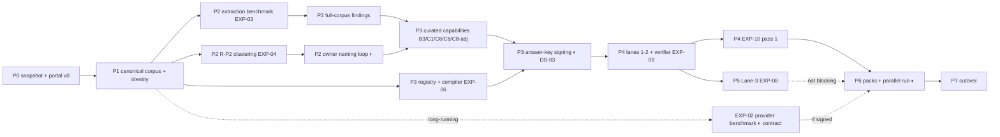

# 21 — Delivery Roadmap and Work Breakdown
**Platform:** Nwafeth Intelligence — منصة نوافث لذكاء الجلسات الاستشارية (Monsha'at Advisory Session Intelligence Platform)
**Status:** Draft for owner review · **Date:** 2026-08-02 · **Amended:** 2026-08-04 (Owner Amendment 2026-08-03 integration — SD-18…SD-22, §0.5 execution overlay) · **Author:** Planning package (Fable 5)
**Depends on:** 04 (capability IDs), 05 (source contracts SRC-*), 06 (provider gate), 07 (architecture), 08 (schemas), 09 (ingestion), 10 (methodology), 11 (semantic layer), 12 (lanes), 13 (Lane-3), 14 (models), 15 (DS-01…DS-12, HG/QT gates), 16 (security controls), 17 (API), 18 (review UX), 25 (VS delivery/acceptance protocol — §0.5 points to it) · **Feeds:** 00 (index), 01 (executive summary), 20 (parallel run detail), 22 (ODs needed-by-phase), 23 (implementation handoff), 24 (release waves), 25 (per-VS acceptance)
**Sources used:** GREENFIELD §20 (workstreams + per-phase field list), §21 (experiments), §18–§19, §2.5; MASTER_PROMPT §4.4, §5.3, E.15; CORE-BRIEF §9–§12; docs 05 §10.2, 06 §5.5–5.6, 15 §2; Owner Amendment 2026-08-03 §§0, 4.6, 6.4, 7.7, 9, 10, 12, 13, 15 (SD-18…SD-22 — doc 02 register)

---

## 0. How to read this roadmap

- **No calendar dates.** GREENFIELD §20 forbids dates that assume unapproved staffing [FACT GREENFIELD §20]. Everything here is relative sequencing, dependency edges, and effort ranges. When staffing is approved, multiply.
- **Effort units.** Epics are sized S / M / L / XL: S ≈ ≤1 engineer-week, M ≈ 1–3 ew, L ≈ 3–6 ew, XL ≈ 6–10 ew (an XL must be split into ≤L child tickets before implementation starts) [REC — alternative: story points; rejected because a greenfield plan with no team velocity has no point baseline; revisit after two phases of actuals]. Under the execution overlay, every epic — of any size — is additionally re-cut into **≤4–8 agent-hour coding tickets** before implementation [DECISION SD-18, Amendment §10.1; §0.5.7].
- **Phases are dependency clusters, not sprints.** A phase exits when its exit criteria are green — never on elapsed time. Later-phase work MAY start early where the dependency table explicitly allows it (marked ⇢ early-start).
- **Experiments EXP-01…EXP-11 are gates, not research.** Each is bound to a phase boundary in §4; a red experiment blocks the marked decision, not the whole programme, and each gate names its fallback. Under the execution overlay each gate additionally binds to the feature slice it protects (§0.5.5) — it blocks that slice's L2/L3 exposure, never the L1 owner preview [DECISION SD-18]. EXP-11 was added by the Owner Amendment [DECISION SD-22, Amendment §6.4].
- **Owner time is the scarcest resource** [INFER from MASTER_PROMPT §4.4 + E.15]. Four items need sustained Monsha'at-side attention and are flagged ◐OWNER wherever they appear: answer-key signing (DS-03), taxonomy naming/approval (R-P2 loop), benchmark labelling supervision (DS-01/04/05), and the provider + Groq contract track (OD-06/OD-13/OD-19/OD-25).

### 0.1 Phase overview

| Phase | Name | One-line objective | Gate(s) at exit |
|---|---|---|---|
| P0 | Foundations, security, data contracts | A deployable, observable, secured skeleton + all external requests in flight | EXP-01 (on snapshot) |
| P1 | Canonical model, ingestion, reconciliation | The corpus lives in `core`/`transcript`/`ingest`, identity-resolved, quality-scored | EXP-01 confirm · EXP-02 launched |
| P2 | Enrichment, taxonomy + review loop, evaluation foundation | Findings pipeline + R-P2 clustering + the single review workflow live end-to-end | EXP-03 · EXP-04 · EXP-02 report |
| P3 | Semantic layer, committed capabilities, rendering/export | All 26 CAP-* Lane-0 answers, verified numbers, rendered + exportable | EXP-05 · EXP-06 |
| P4 | Agentic serving + evidence retrieval | Lane 1/2 over the governed toolbelt; quotes retrievable and verifiable | EXP-07 · EXP-09 · EXP-10 (first pass) |
| P5 | Lane-3 factory + custom RAG | On-demand deep analysis: map→verify→reduce, resumable, promotable | EXP-08 |
| P6 | Packs, parallel run, pilots | Signed monthly/quarterly packs; shadow + pilots vs legacy | EXP-10 (full) · parallel-run report |
| P7 | Cutover + operations hardening | Production default; legacy contained; ops/DR/continuous evaluation proven | Cutover checklist (doc 20) |

> **Execution overlay [DECISION SD-18, Amendment §9]:** these phases remain the gate/dependency framework (*what must be true*), but the execution order is the vertical slices VS-00…VS-12 of **§0.5** (*what gets built, shown, and accepted, in order*). Each slice cuts across phases and ends in a mandatory stop → demo → acceptance → owner approval.

### 0.2 Workstream coverage map (GREENFIELD §20 — all 17)

| WS | Workstream (GREENFIELD §20) | Primary phase | Also touched in |
|---|---|---|---|
| WS-01 | Source discovery and data contracts | P0 | P1 (contract verification against real pulls) |
| WS-02 | Transcript-provider benchmark | P1–P2 (EXP-02) | P6 (rebase execution if provider signed) |
| WS-03 | Security and deployment foundation | P0 | P4 (injection controls), P7 (hardening) |
| WS-04 | Canonical data model and migration tooling | P1 | P0 (Alembic baseline) |
| WS-05 | Independent ingestion and reconciliation | P1 | P7 (ops runbooks) |
| WS-06 | Model and extraction benchmark | P2 (EXP-03) | P0 (harness skeleton ⇢ early-start) |
| WS-07 | Taxonomy/entity review workflow | P2 | P0 (portal + eval registry skeleton — doc 15 §0 build-order) |
| WS-08 | Analytical findings pipeline | P2 | P5 (Lane-3 shares map/verify machinery) |
| WS-09 | Semantic metric layer | P3 | — |
| WS-10 | Committed deterministic capabilities | P3 | P2 (curated engines' extraction inputs) |
| WS-11 | Structured response / render / export | P3 | P4 (answer envelope reuse), P6 (pack render) |
| WS-12 | Bounded agent | P4 | — |
| WS-13 | Evidence retrieval | P4 | P2 (embeddings selected in EXP-04) |
| WS-14 | Deep-analysis jobs and custom RAG | P5 | — |
| WS-15 | Monthly/quarterly packs | P6 | P3 (renderers), P2 (taxonomy freeze semantics) |
| WS-16 | Parallel run and rollout | P6 | P7 (cutover) |
| WS-17 | Operations and continuous evaluation | P7 | P0 (observability skeleton), every phase (eval assets) |

---

## 0.5 Execution overlay — vertical slices VS-00…VS-12 [DECISION SD-18, Amendment §9]

**Integrated 2026-08-04 from the binding Owner Amendment of 2026-08-03.** Doc 25 owns the full delivery-and-acceptance protocol (per-slice demo scripts, acceptance checklists, exposure rules, the agent state-file template); doc 24 owns the product backlog and release waves; doc 23 §0.3 carries the agent-facing execution protocol. This section is the roadmap-side statement of record.

### 0.5.1 How phases and slices coexist (the reconciliation)

The phases P0…P7 and the experiment gates of this document **remain the dependency/gate framework** — *what must be true before what*. The **execution overlay** is the vertical slices VS-00…VS-12 — *what gets built, shown, and accepted, in which order*. Each VS maps to a subset of phase deliverables/epics; a VS may pull forward the **minimal slice** of a later phase's machinery (e.g. VS-05 pulls a minimal pack-render path forward from P6) **provided its L2/L3 exposure still waits for the owning phase's gates**. EPIC-01…36 in doc 23 remain the ticket inventory, but they are re-sequenced and SPLIT into ≤4–8h tickets under the VS order. The first executable order after owner approval of the amended package is **VS-00 only** — stop, accept, then VS-01 [DECISION Amendment §15].

Two corollaries [DECISION SD-18]:

1. **The first testable product does NOT wait for all 26 CAP-* capabilities** [DECISION Amendment §0.7]. VS-07 ships five deterministic capabilities (Amendment §9.3); the remaining catalogue completes in VS-08/VS-11 under the unchanged registry discipline (I12 — nothing unregistered ever ships).
2. **Owner previews (L1) happen from the earliest slices** on synthetic or limited governed staging data. Production gates (EXP-09/EXP-10 etc.) gate **L2/L3 exposure only — never L1 previews**; and passing L1 never authorizes L2/L3 (resolved conflict #1, Amendment §0.9, superseding the former "nothing user-facing" phrasing — see §1.4).

### 0.5.2 Exposure levels (Amendment §9.2 — doc 25 owns the full rules)

| Level | Data | Audience | Gates |
|---|---|---|---|
| **L0** Developer | synthetic | developer / coding agent | unit + component tests |
| **L1** Owner Preview | synthetic or a limited governed Staging sample | owner + project team | feature acceptance; **no operational decisions** |
| **L2** Controlled Pilot | designated real data | named, authorized users | the feature's accuracy + security gates |
| **L3** Production | production data | approved internal audience | full release gates + rollback + ops readiness |

L3 requirements must never be used to block an L1 preview; L1 success is never a licence for L2/L3 [DECISION Amendment §9.2].

### 0.5.3 The slice table

| VS | Goal (product slice) | Maps to (phase deliverables / EPICs / backlog) | Demo (L1) | Acceptance home | Stop gate (beyond the universal §0.5.4 stop) | Flags | Exposure |
|---|---|---|---|---|---|---|---|
| **VS-00** | Walking skeleton: runnable app, login + RBAC, Alembic baseline, CI, logging, Home, health/readiness, seed fixture | P0 subset: EPIC-01 / 02 / 03-subset / 04-subset / 07-subset (P0-E1…E5, E10 slices); external-request bundle (P0-E7) files here | user logs in; sees environment, build version, live DB/queue health — no hardcoded status | 25 §VS-00 | CI green; no default credentials; PII-free fixture; real health page | — (flag infrastructure lands here) | L0→L1 |
| **VS-01** | First unified session from both sources: 20 Read.ai + 20 SRC-DATAHUB records linked; «الجلسة 360» | P1 subset + P0-E8: EPIC-09/10/11/12-subset + Session-360 slice (SCR-15; PB-003/004/005) | open one session: transcript + service data + evaluations + per-field source provenance | 25 §VS-01 | EXP-01 (snapshot) confirmed; zero duplication; crosswalk + unmatched visible; re-ingest idempotent | `session_360_enabled` | L1 |
| **VS-02** | First violation from source to human decision: VIOL-008 end-to-end + «اشتباه مخالفة» (SCR-08 upgrade) | P2 slice + P0-E6: EPIC-16-slice (VIOL-008 only) + EPIC-18-slice + EPIC-08 portal core + review-case APIs (PB-006…PB-010) | fixture session raises a suspicion; reviewer opens the case (verbatim quote ±5 turns), decides; append-only trail | 25 §VS-02 | quote exact (R7); finding/case/event separated; suspected ≠ approved everywhere; VIOL-008-scoped precision check; OD-30/OD-35 assumptions in force | `violation_review_enabled` | L1 |
| **VS-03** | Nightly Consolidation Run + «مركز تشغيل البيانات» on a bounded sample | P1 remainder + ops: EPIC-13/14/15 + pipeline-run entities + nightly orchestrator + SCR-14 (PB-001/002/012; CAP-OPS-01/02) | manual staging trigger; stages, counts, watermarks, DLQ and a partial-source failure shown from real run data | 25 §VS-03 | Amendment §4.6 criteria; run states `queued → running → partial → succeeded → failed → cancelled → superseded`; idempotent re-run; OD-28 assumption | `nightly_consolidation_enabled` | L1 |
| **VS-04** | First learning loop: VS-02 decisions → Dataset v1 → candidate detector → shadow comparison | learning pipeline (migration 0014 learning entities; SCR-18; PB-011; EXP-11 design) — ADR-0022 lifecycle | current vs candidate compared on a declared versioned dataset; promotion needs documented approval; rollback demonstrated | 25 §VS-04 | EXP-11 design approved (OD-32); holdout separation; per-category precision AND estimated recall; no auto-promotion | — (shadow-only; governed by the ADR-0022 release lifecycle, no exposure flag) | L0/L1 |
| **VS-05** | First monthly infographic «نبض خدمة الاستشارات والإرشاد — ملخص الشهر»: one fixed template on a fixture/staging month | infographic slice (migration 0015 part; SCR-20; PB-014; CAP-OPS-08); minimal pack-render path pulled forward from P6-E1/E2 — ADR-0023 | web + PDF + PNG byte-identical payloads; draft → data_review → content_review → approved → published | 25 §VS-05 | Amendment §7.7 criteria; approved-violations-only; no LLM-computed numbers (R6); completeness gate ≥98% or face-printed override; OD-29/OD-31 assumptions | `monthly_infographic_enabled` | L1 |
| **VS-06** | Ops dashboard + Action Center: core KPIs with drill-down; actions with owner/due/status/impact | dashboard + actions (migration 0015 part; SCR-19; PB-013/015/016; CAP-OPS-09/10/12; minimal KPI path over an EPIC-19 subset) | spot a clear-steps drop → open its sessions → create a training action → track its status | 25 §VS-06 | shown numbers ride the metric path (EXP-06 scope); zero hardcoded values; OD-34 assumption | `action_center_enabled` | L1 |
| **VS-07** | First five deterministic capabilities (Amendment §9.3 list) with verified numbers | EPIC-19/20 MVP-five (EXP-05/EXP-06 inside the slice; EXP-03/EXP-04 slices where capability 5 consumes extraction/clusters) | five governed questions / dashboard cards answer with provenance, coverage, period stamps | 25 §VS-07 | EXP-06 100% on the served cross-product; EXP-05 floor on the served set; EXP-03/EXP-04 floors where consumed | per-capability registry flags | L1 |
| **VS-08** | Operational-analysis expansion: «قائمة التعافي الخدمي», bounded Consultant-360, recurring fixed answers, inconsistent answers, weekly pulse | EPIC-20b slices (PB-101/102/105/106/118; SCR-22; CAP-OPS-11) | recovery queue populated by governed rules; weekly pulse issued; consultant view inside RBAC | 25 §VS-08 | per-feature gates (doc 15); SD-21: each item enters only with explicit owner approval (doc 24) | per-feature flags (doc 25) | L1 |
| **VS-09** | Lane 1 + Lane 2 over the proven capabilities — never over an open data table | EPIC-21…27 (P4) | golden-question replay: bounded agent, correct clarification, honest refusal — zero wrong routes, no model numbers | 25 §VS-09 | EXP-05 zero-wrong-route; EXP-07; EXP-09; EXP-10 pass 1 before any L2 | `lane1_agent_enabled` | L1 (L2 only after gates) |
| **VS-10** | Lane 3 for one real question, one month, resumable (map→verify→reduce) | EPIC-28…30 (P5) | job runs with visible progress; killed and resumed with zero loss/duplication; verified artifact | 25 §VS-10 | EXP-08 | `lane3_analysis_enabled` | L1 |
| **VS-11** | Catalogue completion + official packs: quarterly report, frozen/live views, reissue/retraction | EPIC-20b remainder + EPIC-31 (P3 tail + P6 packs; CAP-D10) | quarterly pack generated, published, then deliberately retracted + reissued in staging | 25 §VS-11 | pack immutability (T-11); sign-off flow (OD-10); provider-rebase slot if OD-06 signed | per-capability flags + publication workflow | L1→L2 per feature gates |
| **VS-12** | Pilot, expansion, cutover: parallel run, security/performance/recovery proof, then production | EPIC-32…36 (P6/P7) | pilot-entry evidence pack: EXP-10 full, parallel-run report, DR drill, month-close load rehearsal | 25 §VS-12 | EXP-10 full; parallel-run report; OD-16 sign-off; doc 20 G-gates | rollout flags per doc 20 | L2→L3 |

### 0.5.4 The mandatory stop rule (Amendment §9.4 — binding, every slice)

After every vertical slice, without exception: (1) the coding agent **stops**; (2) presents what was built (demo per doc 25's script); (3) runs the slice's acceptance tests; (4) records the actual gaps (KNOWN_GAPS.md + the acceptance report); (5) obtains the owner's transition approval; (6) **never begins the next slice automatically**. The stop is a gate, not a courtesy — doc 23 §13 items 22–27 make skipping it a MUST-NOT violation.

### 0.5.5 Experiments stay gates — re-bound to the affected feature slice

EXP-01…EXP-11 remain hard gates exactly as §4 defines them; the amendment changes *what a red gate blocks*: the affected feature slice and the L2/L3 exposure of its surfaces — never the whole programme, and never an L1 preview [DECISION SD-18, Amendment §12]. Bindings: **EXP-01→VS-01** (re-confirmed on live runs in VS-03) · EXP-02→the provider decision track, unchanged (rebase executes in VS-11/VS-12) · EXP-03/EXP-04→VS-07/VS-08 capability slices (a VIOL-008-scoped precision check runs inside VS-02) · **EXP-05→VS-07 (floor) and VS-09 (zero-wrong-route)** · EXP-06→VS-06/VS-07 numeric surfaces · EXP-07→VS-09 · **EXP-08→VS-10** · EXP-09→VS-09 (any composed narrative) · EXP-10 pass 1→the first L2 exposure of any slice, full→VS-12 · **EXP-11→VS-04**.

### 0.5.6 Release waves and backlog governance (doc 24 linkage)

The product backlog (doc 24) delivers in **Wave A / Wave B / Wave C** — the amendment's P0/P1/P2 *priorities* renamed so they can never collide with the phase names P0…P7 (doc 24 states the mapping once). Wave A anchors VS-00…VS-07; Wave B rides VS-08+; Wave C rides VS-09+. Committed-by-decision items: **PB-014** (monthly infographic) and the violation-suspicion cluster **PB-006…PB-010** [DECISION SD-21]. **Everything else — all Wave B/C items and any Wave A item not yet bound to an approved slice — requires explicit owner consultation and approval before it enters any implementation slice: the backlog is a standing consultation list, not a work order** [DECISION SD-21].

### 0.5.7 Ticket size under the overlay

Coding tickets are **4–8 agent-hours** each; more than one major migration, or more than one independent UI journey, forces a split [DECISION Amendment §10.1]. Epics (P0-E1…P7-E7 here; EPIC-01…36 in doc 23) stay as planning/estimation containers and the dependency truth — the tickets inside them shrink. The ticket protocol (pre-ticket plan file, ticket DoD, per-cycle evidence, the no-bare-«تم الإنجاز» rule) lives in doc 25 and doc 23 §0.3.

---

## 1. Sequencing principles (why this order and not another)

1. **The review loop is built first because five capabilities die without it.** MASTER_PROMPT E.15 item 2: the R-P2 semantic-clustering artifact + owner-approval loop unlocks CAP-B3, CAP-C1, CAP-C6, CAP-C8 and the QST/CHAL/DEC cluster naming that CAP-C4 consumes — five of sixteen committed questions [FACT MASTER_PROMPT E.15]. Doc 15 §0 makes the same call for the eval registry. So the propose→review→approve portal (ADR-0012) is a **P0 epic**, not a P2 one, even though its first real payload (clusters, violations) arrives in P2. Building it early also starts the owner-habit: review sessions become routine before they become blocking [REC — alternative: spreadsheet labelling until P2; rejected as the throwaway-then-rebuild path MASTER_PROMPT §4.4(3) forbids].
2. **Evaluation is a foundation, not a final phase** [FACT GREENFIELD §18 preamble]. Every phase's exit criteria include labelled data *produced*, not just code shipped. The golden suite grows monotonically from P1.
3. **External lead times start at P0.** OD-13 (second Read.ai OAuth client), OD-07 (internal data access), OD-04 (outbound-data approval), OD-25 (provider candidate procurement), OD-19 (Groq DPA) all have Monsha'at-side or vendor-side lead times the engineering team cannot compress. Every one is a P0 *request* deliverable with a named owner, so waiting overlaps building [REC].
4. ~~Nothing user-facing before EXP-09/EXP-10.~~ **SUPERSEDED 2026-08-04 [DECISION SD-18, Amendment §0.9 — resolved conflict #1].** The corrected rule: no *production* result reaches an L2 Pilot or L3 Production user before its gates — the verifier gates and the adversarial suite still pass before any pilot user sees an answer, deterministically (I18) and proven by injection, not asserted. But internal **L1 owner previews on synthetic/governed-staging data are mandatory after every slice** (§0.5.4) and do not wait for EXP-09/EXP-10: those gates guard L2/L3 exposure only, never L1 — and L1 success never authorizes L2/L3.
5. **Correctness over cost; wall-clock engineered explicitly.** Full-coverage extraction is never sampled down for cost [DECISION GREENFIELD §2.5]; instead the plan uses Batch API for backfills (doc 14) and bounded concurrency for rate limits, and P2 includes an explicit throughput-budget epic.
6. **Additive phases, feature-flagged exposure.** Every phase lands behind server-side flags; rollback is "unflag + revert migration N→N−1", never data surgery. Alembic downgrade paths are written and tested from P0 (ADR-0004).

---

## 2. Cross-phase team model

Roles (relative loading per phase in §3; one person may hold two roles at pilot scale):

| Code | Role | Notes |
|---|---|---|
| TL | Tech lead / architect | Owns ADR compliance, module boundaries, structural CI checks |
| BE1/BE2 | Backend engineers (2) | API, serving lanes, semantic layer, workers |
| DE | Data engineer | Ingestion, reconciliation, snapshot bootstrap, DDL |
| MLE | ML/NLP engineer | Extraction prompts, embeddings, clustering, benchmarks |
| FE | Frontend engineer | RTL Arabic UI, review portal, rendering |
| QE | Quality/eval engineer | Golden suite, DS-* datasets, replay harness, verifier tests |
| SRE | DevOps/SRE (part-time to P4, full at P6+) | Environments, observability, backups, DR |
| SEC | Security engineer (fractional) | Threat-model reviews, EXP-10, pen-test liaison |
| PO | Product owner (Monsha'at) ◐OWNER | Answer-key signing, taxonomy approval, pack sign-off |
| DS | Data steward (Monsha'at) ◐OWNER | Aliases, identity disputes, PII break-glass, retention |
| AN×2 | Arabic annotators | DS-01/04/05/06 labelling [ASSUME OD-24 — internal analysts, ~45 h/month steady state per doc 15 §10] |
| CL | Compliance liaison (Monsha'at, fractional) | OD-04/OD-16 files, PDPL/NCA verification |

Minimum viable team: TL + 2×BE + DE + MLE + FE + QE with SRE/SEC fractional — 7–8 FTE engineering plus the Monsha'at-side roles [REC — alternative: smaller 4-FTE team; rejected: the P2/P3 concurrency (enrichment + semantic layer + review UX) is the schedule, and serializing it pushes every owner-gated item later; revisit if pilot scope is cut to Lane 0 only].

---

## 3. Phase catalogue

### P0 — Foundations, security baseline, data contracts

> **Execution overlay [SD-18]:** execution reordered under VS-00 (scaffold/CI/stack/authn-z/queue slices of P0-E1…E5/E10), VS-01 (P0-E8 snapshot + EXP-01), VS-02 (P0-E6 portal core) and VS-03 (remaining ops spine); the P0-E7 external-request bundle still files at VS-00 time so every long-lead clock starts first — see §0.5.

**Objective.** A deployable skeleton in the approved environment with CI, migrations, observability, authn/z, the review-portal + eval-registry core, and every long-lead external request formally in flight — so that no later phase ever waits on paperwork it could have started now.

**Prerequisites.** Planning package approved to start (00-INDEX gate); repository created; approved environment reachable [ASSUME OD-01 — container platform in the approved Saudi environment].

**Exact deliverables.**
1. Monorepo `nwafeth-intelligence` scaffold: module layout per doc 07, import-linting boundaries in CI (F5/F8 lesson), `pyproject` toolchain (Python 3.12, ruff, mypy, pytest).
2. Alembic baseline migration 0001 + empty-schema creation for all 11 schemas of CORE-BRIEF §6; migration up/down CI job on a fixture DB (ADR-0004).
3. Docker Compose deployment (web + worker + Postgres 17 + MinIO + observability stack) in dev and staging; environment promotion pipeline dev→staging→prod skeleton.
4. OIDC integration or Keycloak broker + RBAC middleware with the 7 roles of doc 16; deny-by-default route policy; scoped CORS (I14) [ASSUME OD-02].
5. Vault-injected secrets; no secrets in repo; CI secret scanning (legacy .env-rewrite lesson).
6. Observability skeleton: structlog JSON + OTel traces + Prometheus/Grafana/Loki; request-id propagation; `/healthz` that actually checks DB + queue (ISS-06 lesson).
7. **Review portal v0 + eval registry** (doc 15 §1, doc 18): `ops.eval_dataset`, `ops.eval_item`, review-queue API + minimal RTL UI able to present a candidate and record approve/correct/reject with append-only history (ADR-0012) — payload-type plugins arrive later.
8. Data-contract dossier: signed-off doc 05 contracts for SRC-READAI, SRC-INT, SRC-DIR, SRC-REF, SRC-EVAL, SRC-OUT, SRC-SNAP; per-source contact + freshness SLA sheet.
9. **External request bundle, filed and tracked**: OD-13 second Read.ai OAuth client; OD-07 internal-data access grant; OD-04 outbound-approval file (with doc 16 §4 data-flow matrix attached); OD-19 Groq DPA/terms request; OD-25 provider candidate shortlist + trial accounts; OD-12 audio legality question ◐OWNER.
10. Legacy snapshot acquired: one-time checksummed dump (SRC-SNAP) restored read-only into `legacy_snapshot` (ADR-0016); checksum + manifest recorded in `ops.audit_event`.
11. Groq client wrapper v0 with the single-egress payload gate stub (doc 16 T05), model registry table `ops.model_registry` seeded with doc 14 roles, token/cost/latency logging per call (I17 plumbing).
12. EXP-03 harness skeleton (prompt-pack runner + strict-schema validation loop) ⇢ early-start for P2.

**Architecture decisions taken.** ADR-0001, ADR-0002, ADR-0003, ADR-0004, ADR-0005 (queue library proof-of-life job), ADR-0012 (portal), ADR-0017 (OIDC/RBAC), ADR-0019 (observability), ADR-0020 acknowledged in CI cost-report job. Confirmed at phase exit by doc 22 sign-off table.

**Implementation epics.**

| # | Epic | Size | Roles |
|---|---|---|---|
| P0-E1 | Repo scaffold, module boundaries, CI (lint/type/test/migration) | M | TL, BE1 |
| P0-E2 | Alembic baseline + 11-schema skeleton + up/down CI | M | DE |
| P0-E3 | Compose deployment + env promotion + backups (pgBackRest v0) | L | SRE |
| P0-E4 | OIDC/RBAC middleware + role model + deny-by-default tests | L | BE2, SEC |
| P0-E5 | Observability skeleton + healthchecks + request-id | M | SRE, BE1 |
| P0-E6 | Review portal v0 + eval registry tables + append-only review API | L | FE, BE2 |
| P0-E7 | Data-contract dossier + external request bundle ◐OWNER | M | TL, PO, CL, DS |
| P0-E8 | Snapshot acquisition, checksum, restore to `legacy_snapshot` | M | DE, DS |
| P0-E9 | Groq client + model registry + cost telemetry | M | MLE, BE1 |
| P0-E10 | Job-queue proof-of-life (Procrastinate): enqueue, retry, dead-letter, kill/resume demo | M | BE1 |

**Data migration.** Snapshot restore only (P0-E8); no transformation yet. Retention: snapshot archive in MinIO WORM bucket, checksum in audit log [ASSUME OD-08].

**Tests + labelled data produced.** CI harness green on empty system; migration up/down test; RBAC deny-matrix test v0 (G-SEC-1 seed); EXP-01 runs on `legacy_snapshot` (see §4). No DS-* labels yet; annotator onboarding pack drafted (doc 15 protocols) ◐OWNER.

**Security controls landed.** TLS everywhere; OIDC on every route; scoped CORS; vault secrets; DB roles `nip_web`/`nip_worker`/`nip_migrator` split (doc 16 §2.4); audit-event table live; egress via approved proxy only.

**Exit criteria (measurable).**
- `docker compose up` → healthy stack in staging; `/healthz` fails when DB stopped (ISS-06 regression test).
- Alembic 0001→head→0001 cycles green in CI.
- 100% routes behind authn in the route-inventory test; CORS wildcard absent.
- Review portal: a seeded dummy candidate can be approved and the decision is append-only (update attempt rejected).
- Snapshot checksum verified twice (acquisition + restore) and logged.
- All six external requests (deliverable 9) filed with named owners and tracked IDs.
- EXP-01 executed on snapshot with report published (gate PASS or documented fallback — §4).

**Rollback.** Trivial — nothing user-facing; rollback = destroy environment, keep dossier + snapshot.

**Risks + mitigations.** (a) Environment/OD-01 undecided → build Compose-first, keep K8s optional (ADR-0002 consequence); (b) OD-13 client delayed → P1 can begin against snapshot data; flag ingestion cutover date-risk in weekly report; (c) IdP integration stalls → Keycloak broker interim [ASSUME OD-02].

**Dependencies / critical path.** P0-E8 (snapshot) and P0-E6 (portal) are on the critical path; P0-E7's external bundle starts every long-lead clock. Everything else parallelizes.

**Team + effort.** TL 100%, BE×2 100%, DE 100%, FE 60%, MLE 40%, QE 40%, SRE 60%, SEC 20%. Phase effort ≈ 18–28 engineer-weeks.

---

### P1 — Canonical model, independent ingestion, reconciliation

> **Execution overlay [SD-18]:** execution reordered under VS-01 (first 20-session crosswalk + Session-360 over EPIC-10/11/12 subsets) and VS-03 (identity ladder P1-E4, bootstrap P1-E5, transcript store P1-E6/E7, dashboards P1-E10, nightly run); the DS-01/EXP-02 clocks (P1-E8/E9) run alongside unchanged — see §0.5.

**Objective.** The entire corpus — historical (snapshot) and ongoing (live pulls) — standing in `ingest`/`core`/`transcript` under the canonical `advisory_session` hub with explicit identity resolution, immutable provider-versioned transcripts, and deterministic quality scores. After P1, no analytical work ever touches legacy shapes again.

**Prerequisites.** P0 exit; OD-13 client issued (or explicitly still pending → live Read.ai pulls deferred, snapshot-only mode flagged); OD-07 access mechanism confirmed or interim export agreed.

**Exact deliverables.**
1. Full `core` + `transcript` + `ingest` DDL per doc 08 (Alembic migrations 0004–0006, doc 23 §6): `advisory_session`, crosswalks (`provider_meeting_map`, `internal_session_map`), dimensions, participants, attendance/status facts, ratings/evaluations, transcript sources/versions/turns/active-pointer.
2. Source adapters per doc 09: SRC-READAI (pull, paginated, idempotent re-fetch, cursored), SRC-INT / SRC-DIR / SRC-REF / SRC-EVAL / SRC-OUT (header-mapped, versioned — never positional; F-lesson), each with run ledger, DLQ, reconciliation counts.
3. Identity resolution service: deterministic rungs M1–M2 then scored M3 (doc 09 §M-rungs), `resolution_status` enum end-to-end — **no magic strings** (ADR-0006); ambiguity queue surfaced in the review portal.
4. Snapshot bootstrap ETL: `legacy_snapshot` → canonical schemas; idempotent, re-runnable, reconciliation totals asserted (row counts, per-month counts vs CORE-BRIEF §11 baselines re-measured by committed script).
5. Transcript immutability enforcement: append-only turns, `TranscriptSource` boundary, `rebase_transcript` operation skeleton + active-pointer switch with audit (ADR-0007).
6. Deterministic transcript quality scorer v1 (doc 06 §6) + tier A–D assignment; interval-merged speaking-time derivation (silence_pct overlap-bug lesson).
7. DS-01 sampling frame drawn (stratified per doc 06 §5) and labelling started ◐OWNER (AN×2).
8. EXP-02 execution launched against OD-25 candidates (trial accounts from P0 bundle).

**Architecture decisions taken.** ADR-0006, ADR-0007, ADR-0016 (bootstrap executed); doc 05 contract versions pinned.

**Implementation epics.**

| # | Epic | Size | Roles |
|---|---|---|---|
| P1-E1 | `core`/`transcript`/`ingest` DDL + constraints-as-pins (PKs, natural keys, FKs; F1 lesson) | L | DE, TL |
| P1-E2 | SRC-READAI adapter (pull, replay ≥90d, webhook optional) | L | BE1 |
| P1-E3 | Internal adapters SRC-INT/DIR/REF/EVAL/OUT + header-mapped Excel/API ingestion | L | DE, BE2 |
| P1-E4 | Identity resolution M1–M3 + ambiguity review queue + crosswalks | XL→split | DE, BE2, DS |
| P1-E5 | Snapshot bootstrap ETL + reconciliation totals + re-run idempotency proof | L | DE |
| P1-E6 | Transcript store: immutability, versions, active pointer, rebase skeleton | L | BE1 |
| P1-E7 | Quality scorer v1 + tier assignment + coverage accounting fields | M | MLE, DE |
| P1-E8 | DS-01 sampling + labelling ops ◐OWNER | M | QE, AN×2, PO |
| P1-E9 | EXP-02 benchmark harness + candidate onboarding | L | QE, MLE |
| P1-E10 | Reconciliation dashboards (run ledger, match rates, DLQ age) | M | SRE, FE |

**Data migration.** The one real migration of the programme: snapshot → canonical (P1-E5). Rules: re-derive nothing analytical (findings wait for P2 re-extraction — ADR-0016); quote verification on migrated transcript turns (checksum per turn batch); PII columns land only in their restricted homes (doc 16 §2.2; era-1 national-ID crosswalk [ASSUME OD-14]).

**Tests + labelled data.** Ingestion contract tests per source (fixture payloads); identity-resolution golden set (500 labelled pairs from EXP-01 output); reconciliation assertion suite (`used ≤ matched ≤ total` accounting seeds); DS-01 labelling in progress (target per doc 15 §2); T-08 rebase fixture skeleton.

**Security controls.** Worker/web DB-role split enforced (web read-only on analytical schemas); P3 columns (national-id crosswalk) column-granted to break-glass role only; raw payloads to MinIO with SSE; per-source credentials scoped + rotated; audit rows on every ingest run.

**Exit criteria.**
- Bootstrap reconciliation report: 16,911 meetings / 399,501 turns (± the committed re-measure) landed; per-month counts match snapshot within declared tolerance; zero unexplained drops.
- Live pull (if OD-13 issued): 7 consecutive daily runs, `provider_match_rate ≥ 0.95`, `consultant_link_rate ≥ 0.98`, `ambiguity_rate ≤ 0.5%` on the post-go-live cohort [FACT doc 05 §10.2/EXP-01 targets] — else snapshot-mode exit with the miss flagged as a P6-blocking risk.
- Rebase demo: synthetic second source attached, active pointer switched, findings untouched, switch audited, old source retained.
- Quality tiers assigned to 100% of transcribed sessions; tier distribution published.
- DS-01 ≥ 60% labelled with inter-annotator CER ≤ 8% (doc 06 §5.5 noise bar).
- Zero magic-string identity states (SQL assertion in CI).

**Rollback.** Bootstrap is idempotent + re-runnable from the immutable snapshot: `TRUNCATE`-free, delete-by-`bootstrap_run_id` then re-run. Adapters are cursored: a bad run is re-pulled; DLQ preserves poison payloads.

**Risks.** (a) Internal source access (OD-07) slips → adapters built against exported fixtures; freshness SLA re-negotiated; flag to owner if >1 phase late; (b) bridge-match reality worse than the 8% legacy baseline suggests → EXP-01 quantifies; capabilities carrying `matched` coverage stamps absorb it honestly (I8); (c) era-boundary schema drift in snapshot → contract tests per era slice (doc 05 §9).

**Dependencies / critical path.** P1-E1→P1-E4→P1-E5 is the phase spine; EXP-02 (P1-E9) runs long and is deliberately started here so its report lands in P2 without blocking P1 exit.

**Team + effort.** DE 100%, BE×2 100%, MLE 60%, QE 60%, FE 40%, SRE 40%, AN×2 ramping. Phase effort ≈ 24–36 engineer-weeks.

---

### P2 — Enrichment pipeline, taxonomy + review loop live, evaluation foundation

> **Execution overlay [SD-18]:** execution reordered under VS-02 (VIOL-008-only detection + review loop + portal plugin), VS-04 (learning pipeline + EXP-11), and VS-07/VS-08 (EXP-03/EXP-04 benchmarks and the full-corpus backfill bind to the capability slices that consume them) — see §0.5.

**Objective.** The offline enrichment plane produces validated, provenance-stamped findings under versioned taxonomies; the R-P2 clustering artifact and the single review workflow run end-to-end with real owner sessions; the extraction-model and clustering choices are settled by benchmark. This is the phase MASTER_PROMPT E.15 calls the critical path for a third of the product.

**Prerequisites.** P1 exit (corpus canonical + quality-tiered); EXP-03 harness from P0 deliverable 12 (built under EPIC-06, doc 23 §5); annotators productive; OD-04 decision status known (pseudonymized outbound assumed approved [ASSUME OD-04] — if still pending, extraction runs on the staging subset the compliance file permits, full-corpus backfill deferred, flagged as cutover risk).

**Exact deliverables.**
1. `findings` + `tax` schemas complete (doc 08): extraction runs, findings with full provenance septet (I13), quote refs, validation results, review status, cluster memberships; taxonomy versions, categories, lineage edges, proposals, entity registry + aliases.
2. Extraction orchestrator: per-session, finding-family-bundled calls (doc 14 §one-call-one-session), strict json_schema on `openai/gpt-oss-120b`, bounded worker pools, failed partition ⇒ `INCOMPLETE` never silent (unbounded-fan-out lesson); Batch API path for backfill.
3. Deterministic validation gates on every finding: quote-substring check (R7), schema/enum checks, span sanity, tier-C/D exclusion rules (doc 06 §6.2).
4. **R-P2 clustering artifact**: embedding service (local), QST/CHAL/DEC/ENT clustering per doc 10 §5, cluster → canonical-label proposal → owner approval in the portal ◐OWNER; incremental assignment for new sessions.
5. Taxonomy governance mechanics: introduce/merge/split with lineage, both-countings (MASTER_PROMPT §4.3), version stamps on findings; VIOL-001…008 seeded with the owner's exact Arabic wording; detection-vocabulary reconciliation per doc 04 with the two named gaps (تهكم، تسويق شخصي) surfaced as proposals ◐OWNER.
6. Government-entity registry + alias resolution pipeline (E.15 item 4); 4,372 distinct strings → registry proposals queue.
7. Review portal v1: payload plugins for violations, cluster labels, taxonomy edges, entity aliases, extraction spot-checks (doc 18 flows); reviewer roles per OD-11 assumption (append-only, admin-only retire).
8. Full-corpus enrichment backfill v1 (Batch API) across all 14 months, with throughput/cost report (ADR-0020 measured-spend duty).
9. DS-04, DS-05, DS-06, DS-07 labelled to doc 15 targets ◐OWNER; DS-02 authoring started (paraphrases don't need the corpus).
10. EXP-02 final report + provider go/no-go recommendation to owner (feeds OD-06 decision; execution of any rebase waits for P6).

**Architecture decisions taken.** ADR-0011 (taxonomy versioning mechanics live), ADR-0013 (model roles pinned by EXP-03 result), ADR-0014 (embedding model pinned by EXP-04).

**Implementation epics.**

| # | Epic | Size | Roles |
|---|---|---|---|
| P2-E1 | `findings`/`tax` DDL + provenance constraints (NOT NULL taxonomy_version etc.) | L | DE |
| P2-E2 | Extraction orchestrator + strict-schema client + bounded pools + Batch path | XL→split | BE1, MLE |
| P2-E3 | Deterministic finding validators (R7 quote gate first) | M | QE, BE2 |
| P2-E4 | EXP-03 execution: model × prompt benchmark per finding family | L | MLE, QE, AN |
| P2-E5 | Embedding service + EXP-04 clustering benchmark | L | MLE |
| P2-E6 | R-P2 loop: proposals, canonical labels, incremental assignment ◐OWNER | XL→split | BE2, FE, PO |
| P2-E7 | Taxonomy version mechanics + lineage + double-counting queries | L | BE2, DE |
| P2-E8 | Entity registry + alias resolver + steward queue ◐OWNER | L | MLE, DS |
| P2-E9 | Review portal v1 payload plugins + reviewer RBAC | L | FE, BE2 |
| P2-E10 | Full-corpus backfill + throughput budget + cost report | M | MLE, SRE |
| P2-E11 | DS-04/05/06/07 labelling ops ◐OWNER | L | QE, AN×2, PO |

**Data migration.** None inbound. Re-derivation replaces legacy knowledge rows (~409k legacy rows are reference-only, never copied — ADR-0016). Legacy findings kept in `legacy_snapshot` for parallel-run comparison later.

**Tests + labelled data.** DS-04 (violations κ ≥ 0.80), DS-05 (satisfaction/clarity/impact), DS-06 (cluster gold), DS-07 (entity aliases) delivered; T-07 quote-provenance suite; T-10 taxonomy introduce/merge/split history test; extraction schema-adherence metric (QT-04 seed); class-imbalance guard: distress-class (544 instances) evaluated with per-class recall, never accuracy [FACT CORE-BRIEF §11].

**Security controls.** Outbound payload gate active: pseudonymization + P3 regex hard-block before any Groq call (doc 16 §4); prompt-injection delimiters `<<<DATA…>>>` in every extraction prompt (R15); reviewer actions audited; annotator access scoped to assigned samples.

**Exit criteria.**
- EXP-03 gate passed: winning model/prompt per family meets doc 15 QT-05/QT-06 floors (violations precision ≥ 0.90 per category before any consultant-named surface; satisfaction macro-F1 ≥ 0.75; clarity/impact weighted-κ ≥ 0.70).
- EXP-04 gate passed: QT-07 (purity ≥ 0.85, fragmentation ≤ 1.5, review workload ≤ 15 min/100 new clusters) with the chosen embedding model recorded in `ops.model_registry`.
- Full-corpus backfill `COMPLETE` for ≥ 95% of tier-A/B sessions; every incomplete partition enumerated with reason (I16).
- ≥ 3 real owner review sessions held; ≥ 50 cluster labels and the 8 VIOL categories approved in the portal ◐OWNER.
- Both-counting taxonomy queries reproduce a hand-computed merge example exactly.
- EXP-02 report delivered with go/no-go per candidate (doc 06 G1–G8).

**Rollback.** Extraction runs are versioned: a bad run is superseded by re-running with `extraction_run_id` bump; findings from a rejected run are marked `superseded`, never deleted. Taxonomy changes roll forward only (lineage), matching ADR-0011.

**Risks.** (a) **Owner review bandwidth** — the long pole [INFER MASTER_PROMPT E.15]: mitigate with weekly fixed review slots, generated-candidate quality bar (reject rate tracked), and incremental sign-off (a lagging family lags alone); (b) EXP-03 shows no model clears the violation-precision bar → tighten prompts/two-pass verification per doc 14 fallback, keep CAP-B4 in review-queue-only mode (never publish below QT-05); (c) OD-04 stuck → staging-subset extraction only; escalate via CL; (d) clustering noise share > 40% → doc 10 §5 fallback (agglomerative + second-pass assignment).

**Dependencies / critical path.** P2-E2 → P2-E4 → (pin models) → P2-E10 backfill; P2-E5 → P2-E6 → owner approvals. Both chains join at exit. DS-02 authoring ⇢ early-start for P3.

**Team + effort.** MLE 100%, BE×2 100%, DE 60%, FE 80%, QE 100%, AN×2 100%, PO ≥ 4h/week sustained ◐OWNER. Phase effort ≈ 30–44 engineer-weeks.

---

### P3 — Semantic metric layer, committed capabilities, rendering/export

> **Execution overlay [SD-18]:** execution reordered under VS-06 (minimal KPI path + dashboard), VS-07 (MVP-five capabilities, EXP-05/EXP-06), and VS-08/VS-11 (remaining tranche); the first testable product does not wait for all 26 capabilities — see §0.5.

**Objective.** Every registered metric compiles deterministically to SQL (never by the model — I2/I3); all 26 committed capabilities (CAP-A1…CAP-D10, per doc 04) answer in Lane 0 with typed envelopes, verified numbers, coverage blocks, and RTL rendering + XLSX/JSON export; the answer-key signing machine is running.

**Prerequisites.** P2 exit (findings + approved taxonomy v1); DS-02 authored; DS-03 protocol agreed ◐OWNER.

**Exact deliverables.**
1. Metric/dimension registry (`serve`-adjacent, doc 11): every metric with unit, denominator, grain, allowed dimensions, suppression rule (n≥30 + Wilson CI), period semantics (end-exclusive; I4); unregistered ⇒ build fails (I12 structural check).
2. Closed-schema metric compiler: spec → SQL via templates + allow-listed fragments; independent reference-query harness for EXP-06.
3. Period resolver: Gregorian grains, quarters, halves, last-N, arbitrary ranges; Hijri markers fail-loud to `PERIOD_UNPARSEABLE` [ASSUME OD-18]; harness-injected period, absent from any model schema (F16/ISS-01 lesson).
4. Lane-0 capability implementations for all 26 CAP-* per doc 04 method sheets, including curated engines (shared B3/C6 engine, contrastive-lift for A1, dispersion thresholds for B3/C6) and the coverage/threshold rules of doc 10.
5. Lane-0 matcher with τ/δ per-capability calibration (starting τ₀ = 0.82, δ₀ = 0.06 [REC doc 04 §routing]) calibrated on DS-02 in EXP-05.
6. Typed answer envelope (I11) + verifier v1: R6 numeric provenance gate with emitted allowed-literals, R7 quote gate, period/coverage stamps (I8) — deterministic code, not a model (I18).
7. RTL rendering components + export renderers (XLSX/JSON) reading the envelope only (no DOM scraping — F6 lesson); Arabic string catalogue.
8. Answer-key signing running in the portal: DS-03 launch target ~46 items ◐OWNER (MASTER_PROMPT §4.4 protocol: stamps, mechanical staleness, UNSIGNED reporting).
9. Golden suite v1 wired into CI: structural assertions for all capabilities + numeric assertions for signed subset; signed-vs-unsigned count on every run.

**Architecture decisions taken.** ADR-0008 (Lane 0 live), ADR-0009 (compiler), ADR-0010 (verifier gates), ADR-0018 (envelope-driven rendering).

**Implementation epics.**

| # | Epic | Size | Roles |
|---|---|---|---|
| P3-E1 | Metric/dimension registry + I12 structural CI check | L | BE2, TL |
| P3-E2 | Metric compiler + reference-query harness (EXP-06) | XL→split | BE2, DE, QE |
| P3-E3 | Period resolver + I4 injection tests | M | BE1 |
| P3-E4 | Spec-capability implementations (B1/B5/C1/C3/C4 + D-family spec parts) | L | BE1, DE |
| P3-E5 | Curated engines: B3/C6 shared, A1 contrastive lift, C8 hesitation, C7 pressure | XL→split | MLE, BE1 |
| P3-E6 | Lane-0 matcher + τ/δ calibration (EXP-05) | L | MLE, QE |
| P3-E7 | Envelope + verifier v1 (R6/R7) + reason-code plumbing | L | BE2, QE |
| P3-E8 | RTL render + XLSX/JSON export from envelope | L | FE |
| P3-E9 | Answer-key signing ops: candidate generation + portal flow ◐OWNER | M | QE, PO |
| P3-E10 | Golden suite v1 in CI + replay harness | M | QE |

**Data migration.** None. Corpus snapshots stamped for answer-key items (DS-03 stamps: taxonomy_version, corpus_snapshot, code_version).

**Tests + labelled data.** DS-02 complete (~560 paraphrases + near-misses + colloquial + follow-up forms per doc 15); DS-03 first ~46 signed items ◐OWNER; T-01 numeric recomputation, T-03 route/abstention, T-04 period correctness (incl. zero-row, missing-dimension), T-05 same-question-repeated determinism; suppression fixtures (n<30 cells suppressed with Wilson CI text).

**Security controls.** Masked views for web role live (doc 16 §2.4); suppression enforced inside the semantic layer, not the renderer; export URLs signed + TTL-limited (doc 17); per-role capability visibility.

**Exit criteria.**
- EXP-06 gate: 100% numeric equality on the compiled cross-product vs reference queries (any mismatch = STOP; fix compiler, never the reference).
- EXP-05 gate: routing precision ≥ 0.95, wrong-capability rate ≤ 1% at calibrated τ/δ; abstentions land in Lane 2 with closed options.
- All 26 capabilities return structurally valid envelopes on the staging corpus; unsupported ones return honest reason codes (never a different answer — I5).
- ≥ 46 DS-03 items signed ◐OWNER; golden suite reports signed/unsigned split; CI red on any numeric drift for signed items.
- Export XLSX opens in Excel with correct RTL + Arabic labels + Latin digits [ASSUME OD-21]; export content byte-derived from envelope (T-render test).

**Rollback.** Capabilities are registry rows + flagged routes: disable per-capability flag reverts to `DATA_NOT_ENRICHED`/`OUT_OF_SCOPE` honesty. Compiler versions pinned; a compiler regression rolls back to prior template pack via registry version.

**Risks.** (a) DS-03 signing slower than build ◐OWNER → capabilities ship structurally green but UNSIGNED-labelled; publication to pilots blocked per capability, not per phase (MASTER_PROMPT §4.4 rule 2); (b) curated-engine thresholds unstable across months (2.7× volume swing) → per-100-session rates + dispersion bands per doc 10; (c) compiler scope creep → closed grammar, new needs go through registry PRs with TL review.

**Dependencies / critical path.** P3-E1→P3-E2→(EXP-06)→P3-E7→signing; matcher (P3-E6) parallel. Rendering/export (P3-E8) can trail into P4 without blocking exit except for the export test.

**Team + effort.** BE×2 100%, MLE 80%, DE 60%, FE 100%, QE 100%, PO ≥ 4h/week ◐OWNER. Phase effort ≈ 28–40 engineer-weeks.

---

### P4 — Agentic serving (Lanes 1–2) + evidence retrieval

> **Execution overlay [SD-18]:** execution reordered under VS-09 — see §0.5.

**Objective.** Long-tail questions answered by the bounded agent over the governed toolbelt with deterministic verification; quotes retrievable through scoped keyword/vector/hybrid search; clarification and honest-boundary behaviour complete; the platform survives its first adversarial pass.

**Prerequisites.** P3 exit (toolbelt has real capabilities + metrics to call); embeddings model pinned (EXP-04); evidence corpus buildable.

**Exact deliverables.**
1. `evidence` schema live: turn-aware evidence units, embeddings with model+dim provenance (table-per-model-generation per doc 08), index versions, retrieval evals.
2. Retrieval service: filter-first deterministic scoping then rank (keyword / vector / hybrid), recall measured per backend (EXP-07); default backend selected by measured recall only [DECISION MASTER_PROMPT §11].
3. Lane-1 planner: ≤6 steps, ≤8 model calls, one tool per step, closed schemas; the 11-tool baseline with the orchestrator-controlled split for `start_deep_analysis`/`get_analysis_job` (doc 12 argues; model proposes via `DEEP_JOB_OFFERED`).
4. Lane-2: clarification with ≤4 closed registry options; full reason-code surface; resolved-facts persistence for follow-ups (DS-12 semantics).
5. Composer + verifier v2: narrative over structured results only; R6 allowed-literals emission, R7 quote gate, banned-phrase lint (doc 10 §4.3); VERIFIER_REJECTED path with safe fallback rendering.
6. Conversation API + serving UX per docs 17/18: `serve` schema (conversations, turns, resolved facts, tool calls, answer artifacts, verifier results).
7. Budget enforcement in Postgres (no module-global state — F13), `BUDGET_EXHAUSTED` honest exit.
8. Full reasoning log: every tool call, model call, verifier verdict reconstructable by request-id (R13; ISS-15/16 lesson).
9. EXP-09 and EXP-10 (first pass) executed.

**Architecture decisions taken.** ADR-0014 (retrieval defaults from EXP-07), ADR-0015 interface stubs (job tools return honest `DEEP_JOB_OFFERED` until P5).

**Implementation epics.**

| # | Epic | Size | Roles |
|---|---|---|---|
| P4-E1 | Evidence units + embedding pipeline + index versioning | L | MLE, DE |
| P4-E2 | Retrieval backends + EXP-07 eval harness | L | MLE, QE |
| P4-E3 | Lane-1 planner loop + toolbelt adapters + budgets-in-Postgres | XL→split | BE1, BE2 |
| P4-E4 | Lane-2 clarification + reason codes + resolved-facts store | M | BE2 |
| P4-E5 | Composer + verifier v2 + fallback rendering | L | BE1, QE |
| P4-E6 | Conversation API + serving UI (ask, answer, evidence viewer) | L | FE, BE2 |
| P4-E7 | Reasoning log + trace UI for admins | M | SRE, FE |
| P4-E8 | EXP-09 provenance-gate injection campaign | M | QE |
| P4-E9 | EXP-10 adversarial pass 1 (injection, markup, PII in fixtures) | L | SEC, QE |
| P4-E10 | DS-08, DS-09, DS-11, DS-12 labelling ◐OWNER | L | QE, AN×2 |

**Data migration.** None. Evidence index built from active transcript sources; rebuild-from-scratch job proven (index is derived data, disposable by design).

**Tests + labelled data.** DS-08 (question→quote), DS-09 (≥30 long-tail agent questions), DS-11 (adversarial), DS-12 (follow-up references); T-02/T-03 extended to Lane 1; T-09 retrieval; T-16/T-17 security suites; optional-RAG numeric parity test (RAG on/off answers numerically identical — I9).

**Security controls.** R15 layered isolation: planner never sees raw transcript text (tool results only); `<<<DATA…>>>` delimiters + prompt-guard screening on evidence snippets; tool allow-list enforced server-side per lane; evidence viewer behind transcript-scope RBAC (aggregate-vs-transcript split); PII placeholders in all model-bound payloads (I15).

**Exit criteria.**
- EXP-07 gate: default backend has measured recall@8 ≥ 0.85 (hybrid) on DS-08 [FACT doc 15 QT-09]; per-backend recall published.
- EXP-09 gate: 100% of injected unsupported numbers and fabricated quotes deterministically rejected with `VERIFIER_REJECTED` + safe fallback (any leak = STOP).
- EXP-10 pass 1: zero authorization bypasses; zero PII in model payloads on the poisoned fixture set; injected instructions never executed (planner isolation demonstrated in traces).
- DS-09 replay: ≥ 90% of long-tail questions end in {correct answer | correct clarification | correct honest boundary}; **zero** different-question answers (I5 is absolute).
- p95 Lane-1 latency within doc 17 budget on staging load; any budget exhaustion visible as `BUDGET_EXHAUSTED`, never a timeout 500.

**Rollback.** Lane 1 behind a flag: disabling it degrades the surface to Lane 0 + Lane 2 (still honest). Retrieval backend switchable per registry row; index rebuild restores any embedding regression.

**Risks.** (a) Arabic colloquial routing worse than DS-02 suggested → widen paraphrase set, recalibrate τ/δ (EXP-05 rerun), accept higher clarification rate initially; (b) prompt-guard models (512 ctx) too small for long turns → chunked screening per doc 16, fall back to heuristic pre-filters + 120b prompt-based screen; (c) latency of verifier double-checking → cache allowed-literals per envelope.

**Dependencies / critical path.** P4-E3 (planner) is the spine; EXP-09/EXP-10 gate exit. P5 design work ⇢ early-start allowed once toolbelt contracts stable.

**Team + effort.** BE×2 100%, MLE 80%, FE 80%, QE 100%, SEC 50%, SRE 40%. Phase effort ≈ 26–38 engineer-weeks.

---

### P5 — Lane-3 deep-analysis factory + custom RAG

> **Execution overlay [SD-18]:** execution reordered under VS-10 (EXP-08) — see §0.5.

**Objective.** Any owner-approved question not answerable from existing findings can be answered from raw transcripts + raw structured data by an async, resumable, verifiable job — with promotion of recurring artifacts into governed capabilities and scoped custom evidence collections.

**Prerequisites.** P4 exit (orchestrator-controlled job tools have a home; verifier mature); extraction machinery from P2 (map stage reuses it).

**Exact deliverables.**
1. `jobs` schema live (doc 08): analysis jobs, corpus snapshots/manifests, month partitions, session tasks, aggregates, promotion candidates.
2. Job engine per doc 13: trigger decision (`DEEP_JOB_OFFERED` flow), analysis-schema generation with owner/analyst approval, map (per-session strict-schema calls), verify (deterministic per-finding gates), reduce (deterministic aggregation — no model aggregates ever), job id + progress + kill/resume/cancel; no cost ceiling, bounded concurrency [DECISION MASTER_PROMPT §5.3].
3. Result artifacts: cacheable by question fingerprint + corpus manifest; `DEEP_JOB_INCOMPLETE`/`DEEP_JOB_STALLED` honesty; resumability across worker restarts (Postgres-owned state).
4. Promotion loop: recurring artifact → capability proposal in the portal → registry entry (feeds doc 11) ◐OWNER.
5. Custom RAG lifecycle (doc 13 §9): scoped collections, build/refresh/retire, access inheritance [ASSUME OD-23 — role-shared aggregates, transcript-permission-gated quotes], eval per collection before default use.
6. EXP-08 executed end-to-end.
7. DS-10 deep-analysis result set labelled.

**Architecture decisions taken.** ADR-0015 in full.

**Implementation epics.**

| # | Epic | Size | Roles |
|---|---|---|---|
| P5-E1 | `jobs` DDL + corpus manifest/snapshot semantics | M | DE |
| P5-E2 | Job orchestration: partitions, tasks, kill/resume/cancel | XL→split | BE1 |
| P5-E3 | Analysis-schema generation + approval flow ◐OWNER | M | MLE, PO |
| P5-E4 | Map stage (reuse P2 extraction runner) + micro-batching rule | M | MLE |
| P5-E5 | Verify + reduce stages (deterministic) + artifact store | L | BE2, QE |
| P5-E6 | Progress/observability UI + job admin | M | FE, SRE |
| P5-E7 | Promotion loop → registry proposal | M | BE2 |
| P5-E8 | Custom collections + scoped retrieval + per-collection eval | L | MLE, BE1 |
| P5-E9 | EXP-08 run + DS-10 labelling | M | QE, AN |

**Data migration.** None. Corpus snapshots are manifests over existing immutable data.

**Tests + labelled data.** DS-10; T-12 incomplete-partition honesty; T-13 kill/resume/cancel; number-from-stored-findings and quote-from-turns verification suites; cache-hit correctness test (same fingerprint + manifest ⇒ identical artifact).

**Security controls.** Job creation authorization (analyst+); job artifacts inherit requester scope [ASSUME OD-23]; per-job audit trail; outbound payload gate applies to map calls identically to P2.

**Exit criteria.**
- EXP-08 gate: one-month job for a question absent from findings completes; killed mid-run and resumed with zero duplicate or lost partitions; every number re-derivable from stored findings, every quote verifiable from turns; incomplete partitions enumerated.
- A second job with identical fingerprint + manifest returns the cached artifact.
- One artifact promoted to a registered capability through the portal ◐OWNER.
- Rate-limit behaviour measured; concurrency knob documented (doc 13 revisit trigger).

**Rollback.** Jobs are additive artifacts; a bad job is retracted (artifact marked withdrawn, audit kept). Engine behind analyst-only flag until EXP-08 green.

**Risks.** (a) Groq TPM quota makes full-month sync jobs slow → bounded concurrency + progress honesty; Batch API explicitly NOT used for user-accepted jobs (SLA mismatch, doc 14); (b) schema-generation quality poor → analyst edits before approval (human in loop is the design, not a workaround); (c) promotion loop bypassed by habit → structural check: served artifacts must carry job id or registry id (I12 extension).

**Dependencies / critical path.** Off the pilot-critical path except CAP-C2's recommended route (Lane-3 pilot first [ASSUME OD-05]) — schedule the CAP-C2 pilot job as EXP-08's subject if OD-05 stands, killing two birds [REC].

**Team + effort.** BE×2 80%, MLE 80%, DE 40%, FE 40%, QE 80%. Phase effort ≈ 18–28 engineer-weeks.

---

### P6 — Packs, parallel run, pilots

> **Execution overlay [SD-18]:** VS-05 pulls the minimal single-template pack-render path forward (L1 preview only; publication workflow and completeness gates intact — ADR-0023); the rest executes under VS-11 (packs/quarterly, conditional rebase) and VS-12 (parallel run, pilots, EXP-10 full) — see §0.5.

**Objective.** Monthly/quarterly executive packs (CAP-D10) published under sign-off with frozen/live duality; the platform runs in shadow against the legacy system on a labelled question set; analyst → operational → executive pilots complete; provider decision executed if OD-06 signed.

**Prerequisites.** P3–P5 exit; EXP-10 pass 1 green; DS-03 signed coverage ≥ the pilot capability set; OD-10 publication authority confirmed ◐OWNER.

**Exact deliverables.**
1. `packs` schema + pack factory: immutable pack snapshots, pack findings, publications, supersessions, retractions (reissue-never-edit — ADR-0011); frozen pack + live view duality per GREENFIELD §6.4.
2. Pack render pipeline (from envelopes; RTL; Arabic-first) + distribution surface per doc 18; publication sign-off flow ◐OWNER [ASSUME OD-10 — product owner signs].
3. Parallel-run harness (doc 20 owns detail): labelled question set replayed against both systems; six-way difference classification (legacy defect corrected / new defect / methodology change / snapshot difference / taxonomy difference / not comparable) [FACT GREENFIELD §19.3].
4. Pilot programme: analyst pilot → operational (service-owner) pilot → executive pack pilot, each with entry/exit criteria (doc 20) and feedback loops into the review portal.
5. EXP-10 full pass (external pen-test if mandated by OD-16 file) + authorization matrix re-run on production config.
6. Provider rebase execution IF owner signs a candidate from EXP-02 (doc 06 runbook): historical corpus rebase, findings re-extraction on new source, comparison report.
7. Ops load rehearsal: month-close pack generation at peak volume (1,512 sessions/month baseline) with cost + wall-clock report.

**Architecture decisions taken.** None new — this phase proves ADR-0011/0012/0017 in anger.

**Implementation epics.**

| # | Epic | Size | Roles |
|---|---|---|---|
| P6-E1 | `packs` DDL + factory + freeze semantics | L | BE2, DE |
| P6-E2 | Pack render + publication flow + retraction path ◐OWNER | L | FE, BE2, PO |
| P6-E3 | Parallel-run harness + difference classifier + report | L | QE, DE |
| P6-E4 | Pilot onboarding: roles, training material (Arabic), feedback capture | M | PO, FE, DS |
| P6-E5 | EXP-10 full adversarial + authz matrix on prod config | L | SEC, QE |
| P6-E6 | Provider rebase execution (conditional on OD-06) | L | DE, MLE |
| P6-E7 | Month-close rehearsal + cost/wall-clock report | M | SRE, MLE |

**Data migration.** Only if P6-E6 fires: rebase = new transcript source rows + active-pointer switch + re-extraction; old sources retained per retention policy [ASSUME OD-08 — 90d pre-rebase archives].

**Tests + labelled data.** T-11 frozen-pack immutability (byte-identical re-render; edit attempt rejected); parallel-run difference log (this IS labelled data — each difference adjudicated ◐OWNER); pilot question log → DS-09 growth; T-08 rebase test on real second source if P6-E6 fires.

**Security controls.** Publication authorization (only OD-10 role publishes); pack access per RBAC; retraction audit; pen-test findings triaged to closure or accepted-risk sign-off.

**Exit criteria.**
- Two consecutive month-close packs published on schedule, signed ◐OWNER, zero post-publication edits (retraction path exercised once deliberately in staging).
- Parallel run: 100% of differences classified into the six categories; **zero unexplained new-defect differences open** at exit; report accepted by owner (parity with known-wrong legacy answers explicitly NOT required [FACT GREENFIELD §19.3]).
- All three pilots exited per doc 20 criteria; pilot NPS/feedback log triaged.
- EXP-10 full: zero critical/high findings open.
- Month-close rehearsal: wall-clock within the month-close window at peak volume; spend reported (ADR-0020).

**Rollback.** Pilots are read-only consumers — rollback = access revocation. A bad pack is retracted + reissued (never edited). Rebase rollback = active-pointer switch back (old source retained by design).

**Risks.** (a) Parallel-run reveals methodology-change deltas that alarm stakeholders → the six-way classification + doc 10's methodology notes are the communication tool; owner briefed before pilots see numbers; (b) pack sign-off becomes bottleneck ◐OWNER → generated pack QA checklist, sign-off SLA agreed in P6-E4; (c) provider contract slips → Read.ai interim continues (the design tolerates it — ADR-0007), risk logged against quote-fidelity ceiling from EXP-02.

**Dependencies / critical path.** P6-E1→E2→two-pack sequence is the calendar-coupled spine (two month-closes minimum); parallel run overlaps. This phase sets the earliest possible cutover date.

**Team + effort.** BE×2 80%, FE 80%, DE 60%, QE 100%, SEC 40%, SRE 60%, PO heavy ◐OWNER. Phase effort ≈ 20–30 engineer-weeks (excludes owner-side pilot time).

---

### P7 — Cutover and operations hardening

> **Execution overlay [SD-18]:** execution reordered under VS-12 — see §0.5.

**Objective.** NIP becomes the production default for advisory-session intelligence; the legacy system is contained (no new analytical routes) and scheduled for retirement; operations, DR, retention, and continuous evaluation run as routine.

**Prerequisites.** P6 exit; cutover checklist (doc 20 §cutover) signed ◐OWNER.

**Exact deliverables.**
1. Production-default switch: all committed questions + packs served by NIP; legacy analytical routes frozen (containment per GREENFIELD §19.4).
2. Ops runbooks: ingestion failure, provider outage, model deprecation drill (I17 — registry deprecation creates ops tasks), verifier-rejection spike, DLQ drain, pack retraction; on-call rotation defined.
3. DR proven: pgBackRest restore drill executed to staging with RTO/RPO measured against doc 19 targets; MinIO bucket replication verified.
4. Retention jobs live per OD-08 assumptions: raw payload archival, conversation-log windows, export TTLs, audit ≥ 18 months.
5. Continuous evaluation: scheduled replay of golden suite + DS-* refresh cadences (doc 15 §refresh); weekly eval review meeting standing ◐OWNER; model-deprecation watch (Groq catalogue poller).
6. Capacity + cost baseline published: steady-state monthly spend, month-close peak, Lane-3 usage.
7. Legacy retirement plan: data classes to archive, checksummed final export, decommission checklist with owner date decision ◐OWNER.

**Implementation epics.**

| # | Epic | Size | Roles |
|---|---|---|---|
| P7-E1 | Production cutover execution + legacy containment | M | TL, SRE, PO |
| P7-E2 | Runbooks + on-call + alert tuning (no raw-exception surfaces — I16) | L | SRE, BE1 |
| P7-E3 | DR drill + backup verification schedule | M | SRE |
| P7-E4 | Retention/archival jobs + break-glass audit review | M | DE, DS, SEC |
| P7-E5 | Continuous-eval scheduler + deprecation watch + monthly model bench rerun | M | QE, MLE |
| P7-E6 | Cost/capacity baseline report + tuning backlog | S | SRE, TL |
| P7-E7 | Legacy retirement plan ◐OWNER | S | TL, PO, DS |

**Data migration.** Final delta sync from any straggling internal-source backfill; `legacy_snapshot` frozen permanently read-only.

**Tests + labelled data.** T-14 worker kill/resume in prod-like chaos drill; T-15 provider/model deprecation switch drill; quarterly DS refresh plan committed; authorization matrix re-run after any role change (standing CI).

**Security controls.** Quarterly access review; break-glass usage report to owner; log-shipping to authority SIEM if mandated (OD-16); incident-response playbook tested once (tabletop).

**Exit criteria.**
- 30 consecutive production days: zero I-invariant violations detected by continuous eval; error budget met; all alerts actionable (no crying-wolf alerts open).
- DR drill: restore within doc 19 RTO/RPO; drill repeat scheduled.
- Deprecation drill: a model marked deprecated in registry produces an ops task + replay evaluation before swap (I17 proven end-to-end).
- Legacy: zero new analytical queries served (containment verified by legacy access log); retirement date decision recorded ◐OWNER.

**Rollback.** Cutover rollback window: legacy containment is reversible for an owner-agreed window (doc 20) — nothing in NIP depends on it (I10), so rollback is purely a consumer-routing decision.

**Risks.** (a) Post-cutover discovery of a silent numeric defect → the answer is the machinery already built: signed keys + replay + retraction; sev-1 process names it, retraction handles published artifacts; (b) team attrition after delivery → runbooks + doc 23 handoff are the mitigation; (c) Groq deprecation surprise → registry watch + benchmarked fallbacks (doc 14 fallback map).

**Team + effort.** SRE 100%, BE1 60%, QE 60%, others fractional. Phase effort ≈ 10–16 engineer-weeks, then steady-state ops (~1.5–2.5 FTE engineering + owner-side roles).

---

## 4. Experiment gates EXP-01…EXP-11

All ten GREENFIELD experiments [FACT GREENFIELD §21], plus **EXP-11 added by the Owner Amendment** [DECISION SD-22, Amendment §6.4], each with the eight mandatory fields. "Owner" = accountable role; artifact lands in the eval registry + a signed report in the planning archive. Placement is the phase boundary the gate protects; under the SD-18 overlay each gate additionally blocks its affected feature slice and that slice's L2/L3 exposure (§0.5.5) — never L1 previews.

### Gate summary

| EXP | Name | Runs in | Gates (decision unlocked) | Dataset |
|---|---|---|---|---|
| EXP-01 | Source linkage + completeness | P0 (snapshot) → confirm P1 (live) | P1 identity design freeze; coverage honesty baselines | 500-pair labelled sample |
| EXP-02 | Transcript provider comparison | P1–P2 | OD-06 provider go/no-go; P6 rebase execution | DS-01 |
| EXP-03 | Extraction model benchmark | P2 | ADR-0013 role pinning; P2 backfill start | DS-04, DS-05 |
| EXP-04 | Semantic clustering | P2 | ADR-0014 embedding choice; R-P2 loop params; CAP-B3/C1/C6/C8 unblocked | DS-06, DS-07 |
| EXP-05 | Committed-question routing | P3 | Lane-0 launch; τ/δ freeze | DS-02 |
| EXP-06 | Metric compiler correctness | P3 | Any numeric answer to any user | DS-03 + reference queries |
| EXP-07 | Evidence retrieval | P4 | Default retrieval backend; evidence viewer launch | DS-08 |
| EXP-08 | Deep-analysis job | P5 | Lane-3 GA; OD-05 CAP-C2 route confirmation | DS-10 |
| EXP-09 | Narrative provenance gates | P4 | Any composed narrative to any user | Injection fixtures |
| EXP-10 | Security/adversarial | P4 (pass 1), P6 (full) | Pilot entry (pass 1); production entry (full) | DS-11 |
| EXP-11 | False-negative estimation design [DECISION SD-22] | VS-04 (then weekly ops cadence) | Recall claims on detector-quality surfaces; ADR-0022 promotion evidence; OD-32 sizing | Weekly stratified unflagged-session sample + light-review labels |

### EXP-01 — Source linkage and data completeness
- **Hypothesis.** Provider meetings join to internal sessions at ≥ 95% via deterministic identifiers on post-go-live cohorts; historical linkage is materially worse and must be declared, not papered over (legacy bridge matched ~8% of report rows [FACT CORE-BRIEF §11]).
- **Sample.** All snapshot months; plus a 500-pair stratified random sample (by month × channel) human-adjudicated for match truth.
- **Method.** Deterministic rungs first (M1 exact IDs, M2 crosswalk+time-window), fuzzy M3 only measured, never auto-accepted (doc 09 §M). Quantify unmatched + ambiguous separately.
- **Metric/threshold.** Post-go-live: match ≥ 0.95, consultant link ≥ 0.98, ambiguity ≤ 0.5% [FACT doc 05 §10.2]. Historical: no threshold — measured and published as the coverage floor per month.
- **Owner.** DE (accountable), DS adjudicates sample ◐OWNER.
- **Artifact.** Linkage report per month + labelled 500-pair set (seeds identity golden suite).
- **Decision unlocked.** Freeze identity design; set I8 coverage denominators; decide whether historical D-family capabilities carry `matched`-scope caveats permanently.
- **Fallback if red.** Ship with declared coverage (the design tolerates honest gaps); escalate OD-07 for better internal identifiers.

### EXP-02 — Transcript provider comparison
- **Hypothesis.** At least one OD-25 candidate beats Read.ai by ≥ 15% relative WER-norm and passes all doc 06 hard gates G1–G8.
- **Sample.** DS-01: stratified sample per doc 06 §5 (dialect tercile × duration × channel), sized per doc 15 §2, double-transcribed gold where OD-12 permits audio, Design B comparative where not.
- **Method.** Doc 06 §5.4–5.5 verbatim: 12 dimensions A–L, hard gates G1–G8, weighted sheet; cost reported outside the score [DECISION GREENFIELD §2.5].
- **Metric/threshold.** G1–G8 thresholds as pinned in doc 06 §5.5 (e.g. G2 WER-norm ≤ 28% overall / ≤ 35% high-dialect tercile / ≥ 15% relative gain; G6 verbatimness ≥ 95%, cleanup-mode disableable or disqualified).
- **Owner.** MLE (accountable), PO signs go/no-go ◐OWNER, CL for G1 contract checklist.
- **Artifact.** Scored sheet per candidate + go/no-go memo → OD-06.
- **Decision unlocked.** Provider selection + P6-E6 rebase execution; STT contingency assessment stays shelved unless all candidates fail AND OD-12 flips.
- **Fallback if red.** Read.ai continues as interim (never permanent — I-doctrine); re-run on next candidate cohort; quote-fidelity ceiling documented on every quote-bearing capability.

### EXP-03 — Per-session extraction model benchmark
- **Hypothesis.** `openai/gpt-oss-120b` with strict json_schema meets the per-family quality floors; `gpt-oss-20b` is acceptable for triage families at material cost/latency gain [REC CORE-BRIEF §7].
- **Sample.** ≥ 300 sessions stratified by quality tier × month × session length; human labels from DS-04/DS-05.
- **Method.** Candidate models × 2–3 prompt variants per finding family; strict-schema decoding; per-family precision/recall/κ vs human labels; schema-adherence and repair-rate measured; cost/latency per session recorded.
- **Metric/threshold.** Violations: precision ≥ 0.90 per category (QT-05); satisfaction macro-F1 ≥ 0.75; clarity/impact weighted-κ ≥ 0.70 (QT-06); schema-valid rate ≥ 0.98 without repair.
- **Owner.** MLE (accountable); PO adjudicates label disputes ◐OWNER.
- **Artifact.** Model×family scorecard; winning prompt pack versioned in `ops.prompt_registry`.
- **Decision unlocked.** ADR-0013 final role table; P2-E10 backfill authorized with the winning configuration.
- **Fallback if red.** Two-pass extract-then-verify prompting; family-specific model split; if a family still fails, its capability ships review-queue-gated (curated+review mode) rather than auto-published.

### EXP-04 — Semantic clustering
- **Hypothesis.** A local multilingual embedding (`BAAI/bge-m3` favoured) + HDBSCAN meets purity ≥ 0.85 with reviewer workload ≤ 15 min per 100 new clusters on QST/CHAL/DEC families; ENT alias resolution reaches ≥ 0.95 recoverable matching.
- **Sample.** DS-06 gold clusters + DS-07 alias gold (4,372 distinct entity strings [FACT CORE-BRIEF §11]).
- **Method.** bge-m3 vs multilingual-e5-large vs legacy L12 baseline; per doc 10 §5 pipelines; measure purity, fragmentation, noise share, incremental-assignment stability, **and CPU-only throughput/latency (ONNX/int8) — the environment has no GPU [DECISION owner 2026-08-03], so corpus-pass wall-clock and single-query encode latency are selection criteria, not footnotes**.
- **Metric/threshold.** QT-07: purity ≥ 0.85, fragmentation ≤ 1.5, review ≤ 15 min/100 clusters; noise share ≤ 40% (else doc 10 fallback path).
- **Owner.** MLE; PO approves canonical label protocol ◐OWNER.
- **Artifact.** Embedding decision memo + calibrated thresholds (NEAR_DUP_COSINE, dispersion bands) in registry.
- **Decision unlocked.** ADR-0014 embedding pin; R-P2 loop production parameters; CAP-B3/C1/C6/C8 build authorization — **the five-capability unlock of MASTER_PROMPT E.15**.
- **Fallback if red.** Agglomerative + tuned threshold + second-pass noise assignment; heavier human review budget (workload metric re-quoted to owner).

### EXP-05 — Committed-question routing
- **Hypothesis.** Lane-0 matcher at calibrated τ/δ achieves ≥ 0.95 routing precision with ≤ 1% wrong-capability rate on Arabic paraphrases incl. colloquial Saudi variants and follow-ups.
- **Sample.** DS-02 test split (held-out 40%; calibrate on 60% only — doc 15 §2 split discipline).
- **Method.** Route each paraphrase; score capability-correct / near-miss-rejected / follow-up-resolved; calibrate per-capability τ/δ with confusable-sibling pairs stressed (B3↔C6, B4↔B5 …).
- **Metric/threshold.** Precision ≥ 0.95; wrong-capability ≤ 1%; near-miss abstention ≥ 0.90 to Lane 2 with sensible closed options.
- **Owner.** QE; PO signs τ/δ freeze ◐OWNER.
- **Artifact.** Calibration table per capability committed to registry; confusion matrix report.
- **Decision unlocked.** Lane-0 public launch; Lane-2 option-quality baseline.
- **Fallback if red.** Raise τ (more clarification, never wrong answers — I5 bias is deliberate); expand DS-02; add steward aliases.

### EXP-06 — Metric compiler correctness
- **Hypothesis.** The closed-schema compiler reproduces independently written reference SQL exactly across the metric × dimension × filter × period cross-product.
- **Sample.** Representative cross-product ≥ 200 combinations incl. quarter/half/year/last-N/arbitrary ranges, zero-row cells, suppressed cells, end-exclusive boundaries.
- **Method.** Two-author protocol: reference queries written by DE who did not build the compiler; byte-compare result sets on the staging corpus snapshot.
- **Metric/threshold.** 100% numeric equality. Not 99% — any mismatch stops the gate (I18 doctrine).
- **Owner.** QE (accountable), DE (reference author).
- **Artifact.** Cross-product harness kept as permanent regression suite (T-01 family).
- **Decision unlocked.** Any number shown to any user; DS-03 signing meaningful (keys signed against a trusted computer).
- **Fallback if red.** Fix compiler; if a construct is genuinely ambiguous, remove it from the closed grammar rather than interpret it (I4/I5 spirit).

### EXP-07 — Evidence retrieval
- **Hypothesis.** Hybrid (keyword + vector, filter-first) beats either alone and clears recall@8 ≥ 0.85 on scoped queries.
- **Sample.** DS-08 question→quote gold set.
- **Method.** Deterministic scope filter first; then keyword / vector / hybrid ranked lists; recall@k, precision@k per backend; latency budget check.
- **Metric/threshold.** Default backend requires measured recall@8 ≥ 0.85 hybrid (0.75 vector-only, 0.65 keyword-only floors) [FACT doc 15 QT-09]; unmeasured backend may not be default [DECISION MASTER_PROMPT §11].
- **Owner.** MLE.
- **Artifact.** Per-backend recall table in `evidence.retrieval_eval`; default-backend registry entry.
- **Decision unlocked.** Evidence viewer + `search_evidence` tool GA; RAG remains optional and non-numeric (I9) regardless of result.
- **Fallback if red.** Ship keyword-only with published recall; index/chunking iteration; reranker candidate (bge-reranker-v2-m3) trialled **offline only — CPU latency excludes interactive reranking [DECISION owner 2026-08-03: CPU-only environment]**.

### EXP-08 — Deep-analysis job end-to-end
- **Hypothesis.** A one-month Lane-3 job for a question absent from findings completes with full verifiability and survives kill/resume with zero loss or duplication.
- **Sample.** One real month (recommend the CAP-C2 pilot question per OD-05 [REC]); DS-10 labels on outputs.
- **Method.** Full doc 13 lifecycle: trigger → schema approval → map → verify → reduce → artifact; kill the worker mid-map twice; resume; audit partition ledger; verify every number from stored findings and every quote from turns [FACT GREENFIELD §21-8].
- **Metric/threshold.** 0 lost / 0 duplicated partitions; 100% numbers re-derivable; 100% quotes substring-verified; incomplete partitions (if any) enumerated with reasons.
- **Owner.** BE1 (engine), PO approves the pilot question ◐OWNER.
- **Artifact.** Job artifact + partition ledger + DS-10 labels; CAP-C2 route recommendation memo → OD-05 close-out.
- **Decision unlocked.** Lane-3 GA; OD-05 resolution (Lane-3 pilot evidence for/against corpus-wide C2 extraction).
- **Fallback if red.** Fix engine before GA; Lane-3 offers remain `DEEP_JOB_OFFERED`-but-declined honesty in the interim.

### EXP-09 — Narrative provenance gates
- **Hypothesis.** The deterministic verifier rejects 100% of injected unsupported numbers and fabricated/mutated quotes in composer output, with safe fallback rendering.
- **Sample.** ≥ 200 injection cases: numbers absent from allowed-literals (incl. reformatted digits, Arabic-Indic numerals, percentages recomputed), quotes with single-character mutations, truncated quotes, cross-turn splices.
- **Method.** Inject at composer output; assert `VERIFIER_REJECTED` + fallback template render + telemetry event; zero leaks to the envelope.
- **Metric/threshold.** 100% rejection. Any leak = gate failure (I18).
- **Owner.** QE.
- **Artifact.** Injection corpus kept as permanent T-16-family regression.
- **Decision unlocked.** Any composed narrative shown to any user (Lanes 0/1 narrative surfaces).
- **Fallback if red.** Verifier hardening (normalization canon: digit forms, tatweel, diacritics per doc 10 §4); no narrative surface ships until green.

### EXP-10 — Security/adversarial test
- **Hypothesis.** Prompt injection, malicious markup, and planted PII in transcripts cannot: execute instructions, escape rendering as text, cross authorization boundaries, or reach disallowed model contexts.
- **Sample.** DS-11: poisoned fixture transcripts (Arabic injection strings, HTML/JS markup, fake identifiers, planted national-ID patterns), plus the doc 16 authorization matrix.
- **Method.** Pass 1 (P4): automated suite against staging — planner isolation traces, render-escaping proofs, authz matrix, payload-gate PII scan. Full (P6): re-run on production config + external pen test if OD-16 mandates.
- **Metric/threshold.** Zero instruction executions; zero markup escapes; zero authz bypasses; zero P2+/P3 tokens in model payloads or logs on the poisoned set.
- **Owner.** SEC; CL for the OD-16 file.
- **Artifact.** DS-11 as permanent T-17 suite; pen-test report + remediation log.
- **Decision unlocked.** Pass 1 → pilot entry; full → production entry (P7).
- **Fallback if red.** Blocking: no pilot/production entry until remediated — this gate has no soft fallback by design.

### EXP-11 — False-negative estimation design [DECISION SD-22, Amendment §6.4; added 2026-08-04]
- **Hypothesis.** A weekly stratified random sample of *unflagged* sessions (no active detector finding), lightly reviewed, yields a stable per-category **estimated recall** with usable confidence intervals at a reviewer load the owner accepts — closing the gap where reviewing only flagged cases measures precision and never true recall [FACT Amendment §1.3-5].
- **Sample.** Unflagged sessions, stratified by programme × consultant × session duration × session month × transcript quality tier × under-represented categories [DECISION Amendment §6.4]; sample size is this experiment's output, not its input [ASSUME OD-32].
- **Method.** Draw the weekly stratum-balanced sample; run the light-review protocol (category definitions shown, no anchoring examples — Amendment §6.7); count discovered misses per category; compute estimated recall with Wilson/Clopper–Pearson CIs; iterate size/cadence until CI width and reviewer minutes meet targets; feed misses into `missed_violation_report` → labelled datasets (ADR-0022).
- **Metric/threshold.** Design accepted when per-category CI width and weekly reviewer load meet the owner-approved targets recorded in OD-32; until then every detector-quality surface labels recall **«تقدير قيد التصميم»** — an estimate pending EXP-11, never a bare number.
- **Owner.** MLE (accountable); review lead runs the light review; QE designs strata; PO approves the load/cadence trade ◐OWNER.
- **Artifact.** Sampling design memo + first month of per-category estimates in the eval registry; OD-32 close-out.
- **Decision unlocked.** Recall claims on SCR-18 (detector quality + learning dashboard); ADR-0022 promotion decisions gain recall evidence (precision alone never promotes); OD-32 resolution.
- **Fallback if red** (load too high / categories too sparse): biweekly cadence with pooled strata and declared pooling; category-pooled estimates carry their pooling on their face; the platform never silently claims recall it has not measured.

---

## 5. Critical path narrative

**What blocks what.**
1. **The spine** is snapshot → canonical corpus → (extraction ∥ clustering) → capabilities + semantic layer → answer keys → verified serving → packs → cutover. Every item on it is engineering-paced except two: the **R-P2 owner naming loop** and **answer-key signing** — both owner-paced ◐.
2. **R-P2 clustering (P2-E5/E6) is the single highest-leverage item** [FACT MASTER_PROMPT E.15: unlocks five capabilities]. It is deliberately scheduled with the portal already live (P0-E6) so zero tooling wait exists when clusters arrive.
3. **The four owner-time items, flagged early** ◐OWNER:
   - **Answer-key signing** (P3→): ~46 items at launch, growing; weekly fixed sessions from P2 onward; UNSIGNED capabilities ship structurally but cannot enter pilots.
   - **Taxonomy naming/approval** (P2→): cluster labels, VIOL wording confirmation, entity aliases; the review portal's generated-candidate quality keeps each decision minutes-not-hours.
   - **Benchmark labelling** (P1–P2): DS-01/04/05/06 need AN×2 sustained plus PO adjudication; labelling capacity, not model quality, sets EXP-02/03/04 dates.
   - **Provider + contract track** (P0→P6): OD-13 OAuth client, OD-25 candidate procurement, OD-06 selection, OD-19 Groq DPA, OD-04 outbound approval — all counterparty-paced; every one starts at P0 by design.
4. **Parallelism map.** P5 (Lane-3) overlaps P4 exit and P6 start; P3 rendering trails into P4; EXP-02 spans P1–P2 without blocking either; packs (P6) need only Lane 0 + renderers + sign-off, so a Lane-1 delay would NOT delay the first pack pilot [INFER — packs consume committed capabilities, not the agent].
5. **Minimum pilot scope if pressure demands descoping** [REC]: P0–P3 + P6-packs-only (Lane 0 + Lane 2, no agent, no Lane-3) is a coherent, honest product; Lanes 1/3 join later. The reverse (agent without verified Lane 0) is forbidden by the dependency structure itself.

---

## 6. RACI sketch

R = responsible, A = accountable, C = consulted, I = informed.

| Decision / artifact | TL | BE/DE/MLE/FE | QE | SEC | SRE | PO (Monsha'at) | DS (steward) | CL |
|---|---|---|---|---|---|---|---|---|
| ADR acceptance (doc 22) | R | C | C | C | C | **A** | C | I |
| Data-source contracts (doc 05) | R | C (DE) | I | C | I | A | **C** | C |
| Provider go/no-go (EXP-02 → OD-06) | C | R (MLE) | C | C | I | **A** | C | C |
| Extraction model roles (EXP-03 → ADR-0013) | A | **R** (MLE) | C | I | I | C | I | I |
| Taxonomy versions + VIOL wording | C | C | I | I | I | **A/R** | C | I |
| Cluster canonical labels (R-P2) | I | R (MLE prep) | C | I | I | **A** | C | I |
| Answer-key items (DS-03) | I | C | R (prep) | I | I | **A** | I | I |
| τ/δ calibration freeze | A | C | **R** | I | I | C | I | I |
| Entity aliases / identity disputes | I | C (DE) | I | I | I | C | **A/R** | I |
| Pack publication | I | I | I | I | I | **A** [ASSUME OD-10] | C | I |
| Retraction / reissue | C | C | C | I | I | **A** | C | I |
| PII policy + break-glass grants | C | I | I | R | I | C | **A** | C |
| Outbound-data approval file (OD-04) | C | I | I | C | I | C | C | **A/R** |
| Security gate sign-off (EXP-10) | C | C | C | **A/R** | C | I | I | C |
| Cutover go/no-go | R | C | C | C | C | **A** | C | C |
| Ops runbooks + DR drills | C | C | I | C | **A/R** | I | I | I |
| Model deprecation swaps (I17) | A | R (MLE) | C | I | C | I | I | I |

Escalation path: any R↔A disagreement escalates TL → PO within one working week; unresolved items become OD entries in doc 22 with a safe assumption, never silent stalls [REC].

---

## 7. Roadmap-level risk register (cross-phase)

| # | Risk | Likelihood | Impact | Mitigation | Trigger to re-plan |
|---|---|---|---|---|---|
| R-1 | Owner review bandwidth < plan ◐ | High | Critical path slip (P2–P3, P6) | Fixed weekly slots; generated candidates; incremental per-capability sign-off; UNSIGNED shipping | 2 consecutive weeks of review backlog growth |
| R-2 | OD-04 outbound approval delayed | Med | P2 backfill blocked to staging subset | CL-owned file from P0; pseudonymization-by-default strengthens the case; staging pilot continues | Approval not granted by P2 midpoint |
| R-3 | No provider passes EXP-02 gates | Med | Quote-fidelity ceiling persists | Read.ai interim explicitly tolerated; re-run per candidate cohort; STT contingency assessed only if OD-12 flips | Two candidate cohorts fail |
| R-4 | Groq deprecation mid-build (cf. llama-3.3-70b history) | Med | Model swap effort | Registry + benchmark + fallback map (doc 14); only catalogue-verified models planned [FACT groq-docs 2026-08-02] | Deprecation notice on any pinned model |
| R-5 | Internal-source freshness SLA unmet (OD-07) | Med | D-family capabilities degraded | Coverage honesty absorbs it (I8); freshness surfaced on answers; escalation via contract sheet | 2 missed delivery cycles |
| R-6 | Annotation quality below κ ≥ 0.80 | Med | Gates unmeasurable | Guideline revision loop (doc 15 §2); label-definition splits; adjudication | Two rounds at κ < 0.75 |
| R-7 | Class imbalance breaks distress/violation metrics | Med | Misleading gate greens | Per-class recall reporting; precision-over-recall for accusations (E.0); stratified sampling | Any per-class recall < 0.5 at benchmark |
| R-8 | Team key-person loss (MLE or DE) | Low | Multi-phase slip | Doc 23 handoff discipline; pairing on XL epics; prompt/model artifacts in registries not heads | Any single-owner XL epic |
| R-9 | Scope creep into unregistered capabilities | Med | I12 erosion, schedule noise | Structural build check (unregistered ⇒ fail); Lane-3 + promotion loop is the sanctioned escape valve | Any served artifact without registry/job id |
| R-10 | Pilot stakeholders read methodology deltas as defects | Med | Trust damage at P6 | Six-way difference classification + owner pre-brief; doc 10 methodology notes in packs | First pilot escalation citing legacy numbers |

---

## 8. Assumptions this roadmap builds on

| Assumption | OD | Phase where wrongness bites |
|---|---|---|
| Container platform available in approved environment | [ASSUME OD-01] | P0 (deployment), P7 (DR) |
| OIDC IdP + vault reachable, Keycloak broker acceptable interim | [ASSUME OD-02] | P0 |
| Pseudonymized transcript text approved for Groq outbound | [ASSUME OD-04] | P2 backfill, P5 map stage |
| CAP-C2 via Lane-3 pilot first, corpus extraction later if justified | [ASSUME OD-05] | P5 (EXP-08 subject), P3 (C2 ships reduced-scope) |
| Read.ai interim continues until a candidate signs | [ASSUME OD-06] | P6 (rebase conditional) |
| Internal data via read-only API/export with negotiated freshness | [ASSUME OD-07] | P1 adapters |
| Retention: 90d pre-rebase archives, ≥18mo audit | [ASSUME OD-08] | P7 retention jobs |
| PII: nobody sees names/national-IDs by default; steward break-glass | [ASSUME OD-09] | P1 columns, P4 evidence viewer |
| Product owner signs packs | [ASSUME OD-10] | P6 publication flow |
| Reviewers append-only; admin-only retire | [ASSUME OD-11] | P2 portal RBAC |
| Audio not lawfully available (STT contingency shelved) | [ASSUME OD-12] | EXP-02 design (Design B comparative) |
| Second OAuth client granted before live pulls | [ASSUME OD-13] | P1 (else snapshot-mode exit) |
| Annotator staffing: 2 internal Arabic-fluent analysts, ~45 h/month | [ASSUME OD-24] | P1–P4 labelling ops |
| Provider candidates procurable for trials | [ASSUME OD-25] | P1 (EXP-02 launch) |

Full register with owners and impact statements: doc 22 §3.

---

*End of document 21.*
