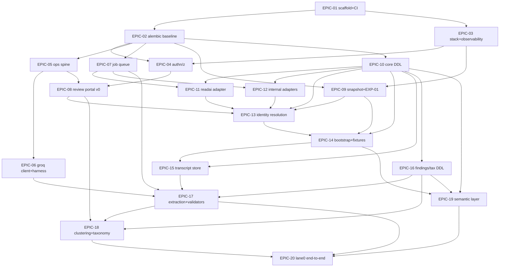

# 23 — Opus 5 Implementation Handoff
**Platform:** Nwafeth Intelligence — منصة نوافث لذكاء الجلسات الاستشارية (Monsha'at Advisory Session Intelligence Platform)
**Status:** Draft for owner review · **Date:** 2026-08-02 · **Author:** Planning package (Fable 5)
**Depends on:** 04 (capability contract), 07 (architecture + module layout), 08 (data model), 09 (pipelines), 10 (methodology), 11 (semantic layer), 12 (serving), 13 (Lane-3), 14 (models), 15 (evaluation), 16 (security), 17 (API), 18 (UX), 20 (migration), 21 (roadmap), 22 (ADR/OD register) · **Feeds:** the implementation itself
**Sources used:** GREENFIELD §23-23 (this document's contract), §7 (I1–I18), §8, §14, §18, §20, §24; MASTER_PROMPT §6 (R1–R16), §12–§13; CORE-BRIEF in full; every sibling document by section as cited inline

This document is the contract between the planning package and the implementing model (Opus 5). It is deliberately repetitive with the rest of the package in one direction only: everything here is *derivable* from docs 04–22, but nothing here may be *contradicted* by an implementation choice. When this document and a sibling document disagree on a **convention** (a name, an ID, an order), this document wins and the sibling gets a fix-up PR; when they disagree on **substance** (a schema shape, a threshold, a method), the sibling wins and this document gets the fix-up — substance owners are named per topic in §14 [REC — mirrors the CORE-BRIEF rule that produced the package].

---

## 0. How to work from this document

### 0.1 Operating loop

1. Confirm the 00-INDEX §6 start gate is satisfied (ADRs + environment signed; external requests filed).
2. Execute epics **in the §5 order**. An epic's "blocked by" list is a hard precondition; its "definition of done" and "tests that must exist" are merge conditions, not aspirations.
3. Every PR carries the §12 evidence block. Every bug fix carries a pin (§9.6). Every model/prompt change carries a replay report (HG-8, doc 15 §6.2).
4. When reality contradicts the plan (a source field missing, a threshold unreachable, an API of a dependency different from documented): do **not** improvise silently. Open a deviation note referencing the doc+section, choose the safest workable interpretation, record it — and if it needs an owner, register OD-26+ in doc 22 (never reuse IDs) [FACT doc 22 §6.1].

### 0.2 Canonized conventions (binding)

The parallel-authoring drift these rows resolve was **normalized across the package in the 2026-08-03 consistency pass** — the "historical variant" column records what was corrected so a reader of an older copy is not confused. The Canon column remains binding for all future edits.

| Topic | Canon | Historical variant (now corrected in-package) |
|---|---|---|
| Alembic DB role | `nip_migrator` | `nip_migrate` (was in doc 08 §1) |
| BI read-only role | `nip_readonly_bi` | `nip_bi_ro` (was in docs 07/22) |
| Lane-0 routing precision | **target ≥ 0.99** held-out (QT-01, doc 15); **gate floor ≥ 0.95** at EXP-05 (doc 21) | doc 04 §2 briefly read "≥ 0.98"; now cites QT-01 target + EXP-05 floor |
| OD IDs | doc 22 §3.1 mapping: BI mandate = OD-22 · Lane-3 artifact visibility = OD-23 · annotation staffing = OD-24 | "OD-14/BI" (was in docs 07/16/17) · "OD-14" (was in doc 13 §9) · "OD-19" (was in doc 15 §10) |
| Transcript window tool arg | `session_uid` (docs 08/12/17) | `meeting_id` in the GREENFIELD §13 baseline text (kept there — it quotes the baseline) |
| Registry data vs loader | YAML data at repo root `registry/`; Python loader package `nwafeth/registry/` | doc 04 §1.1 "registry/capabilities/" = the data dir |
| Doc 08 census | **78 tables** incl. `serve.capability_registry` + `serve.capability_paraphrase` (DDL doc 04 §1.3, migration 0009) and `evidence.custom_collection` + `evidence.custom_collection_unit` (DDL doc 13 §9.0, migration 0010) | doc 08 §1 briefly said "74 tables" before absorbing them |
| EXP-03 harness home | EPIC-06 here (= P0 *deliverable* 12) | doc 21 P2 prerequisite briefly cited a nonexistent epic "P0-E12" |
| Compute posture | **CPU-only environment; all generative inference on Groq; embeddings are the only local models (CPU, ONNX/int8); reranker offline-only** [DECISION owner 2026-08-03; SD-17 doc 02] | earlier drafts carried "GPU optional" and an "on-prem OSS fallback if OD-04 fails" — both removed 2026-08-03 |

---

## 1. Product mission (10 lines)

Build **Nwafeth Intelligence** — a new, independent, Arabic-first platform that turns Monsha'at's advisory sessions into defensible answers. It ingests meeting transcripts from Read.ai today and any replacement provider tomorrow, joins them to the authoritative internal session record (consultants, programmes, ratings, evaluations, attendance), and maintains a governed, versioned analytical model of every session. It answers the 26 committed questions (CAP-A1…CAP-D10) deterministically and identically every time; answers valid long-tail questions through a bounded agent over governed tools; asks a closed clarification or refuses honestly when it cannot; and, when the answer genuinely requires reading transcripts, runs an on-demand deep-analysis job the user knowingly accepts. Every number is computed by deterministic code, never by a model. Every quote is an exact substring of a stored transcript turn with full provenance. Every answer declares its period, scope, and coverage. Monthly and quarterly executive packs publish frozen and are never edited — only reissued. The platform must get **cheaper to extend as questions grow**: question 100 is a registry entry and a method sheet, never another bespoke SQL-and-HTML module [FACT GREENFIELD §3].

---

## 2. The eighteen invariants — enforcement mechanism and home document

Every invariant is enforced by **structure** (schema, import rule, gate, CI check); the two residual human-review checks (I12 registry semantics review, I15 outbound payload review) are themselves structurally counted and ratcheted — the `MANUAL` counter is printed on every suite run and may never increase (doc 15 §6.4). Violating an invariant is a release blocker at any count ≥ 1.

| ID | Invariant (terse) | Enforcement mechanism | Specified in |
|---|---|---|---|
| I1 | Online serving separated from offline enrichment | Two runtimes (web/worker); import-linter contract "serving never imports enrichment"; DB role split `nip_web` (read-only on analytical schemas) vs `nip_worker` | 07 §6, §8.2; 08 §1 |
| I2 | Model never writes SQL or names schema | Repository package is the only SQL author; closed `MetricSpec` grammar; compiler renders reviewed templates; import ban `semantic/repository → inference`; no free-text reaches SQL | 11 §5; 07 §8.3; 12 §5.4 |
| I3 | Model never computes numbers | REDUCE in code; R6 numeric gate with emitted `allowed_literals`; renderer literal scan; composer may copy, never transform | 12 §10; 13 §6; 11 §7 |
| I4 | Explicit period decision on every aggregate | Harness-resolved three-valued period; period fields absent from every model-visible schema; end-exclusive `period_start/period_end` CHECKed in DDL | 12 §2.2; 08 §0.1-C5; 11 §6.1 |
| I5 | Never answer a different question | Closed reason-code enum is the only degradation; lane router abstains rather than guesses; zero-row/missing-dimension paths return codes, never neighbors | 12 §3, §12; 15 T-05/T-06; HG-4 |
| I6 | Raw transcripts immutable + provider-versioned | Append-only `transcript.turn` (REVOKE UPDATE/DELETE); one active pointer per session; rebase never edits | 08 §5, §0.1-C7; 06 §2, §4 |
| I7 | Every quote verifiable | R7 exact-substring gate against the active turn before `validation_status='verified'`; composite FK `(transcript_source_id, turn_index)`; 8-field provenance tuple mandatory | 08 §14-L5; 12 §10; 13 §5 |
| I8 | Every answer declares scope + coverage | Coverage block computed by the compiler/engines, carried in the typed envelope, rendered on the answer face; named-exclusion closed vocabulary | 11 §6.2; 10 §6; 17 §4.2 |
| I9 | RAG optional, never a source of numbers | Retrieval feeds evidence fields only; RAG-on/off numeric-parity test (T-09); filter-first scoping keeps counts SQL-owned | 13 §9; 15 T-09; 12 §5 |
| I10 | New/legacy operationally independent | One-time checksummed snapshot into read-only `legacy_snapshot`; CI grep blocks legacy DSNs outside bootstrap; separate credentials (OD-13) | 20 §1–2; 08 §13; 22 ADR-0001/0016 |
| I11 | Structured results precede presentation | Typed envelope is the only renderer input; import ban `rendering → repository`; exports render server-side from the envelope, never the DOM | 11 §7; 07 §8.3; 17 §12 |
| I12 | One governed capability + metric registry | YAML registries validated in CI; unregistered handler or spec ⇒ build fails; structural boundary check SPEC vs CURATED | 04 §1; 11 §1, §10 |
| I13 | Taxonomy + model provenance mandatory | NOT NULL lineage columns (`taxonomy_version`, `extraction_run_id`, `transcript_source_id`, `model_id`, `prompt_sha`); `ck_taxonomy_stamp` CHECK | 08 §14 L1–L4 |
| I14 | Security enforced server-side | OIDC on every route (G-SEC-1); deny-by-default permission strings; Postgres role/grant mirror of the RBAC matrix diffed in CI (G-SEC-2); scoped CORS | 16 §2; 17 §0 |
| I15 | PII never widens silently | P0–P3 classification per column; pseudonymization at write time in `evidence`; placeholders in all model payloads; outbound payload gate hard-blocks P3 | 16 §3–4; 08 §15 |
| I16 | Failure/degradation observable | RFC 7807 errors, no 200-on-failure; `system_state` on envelope; INCOMPLETE partitions enumerated; honest healthchecks that touch dependencies | 17 §0/§2; 07 §9; 19 §6 |
| I17 | Models replaceable + continuously verified | `ops.model_registry` + `ops.prompt_registry`; single inference entry point; deploy aborts on fingerprint mismatch with last green replay (HG-8); deprecation creates ops tasks | 14 §8–9; 15 §6.2 |
| I18 | Correctness gates deterministic | Verifiers are code (`verification` package may not import `inference` — structurally); eval-judge can flag, never pass; human signatures, recomputation, substring checks | 12 §10; 07 §8.3; 15 §5 |

The R1–R16 implementation-level rules of MASTER_PROMPT §6 are the same doctrine one level down; where a sibling document cites an R-rule (R6 numeric gate, R7 quote gate, R13 reasoning log, R14 fail-closed, R15 injection isolation), treat it as binding detail of the corresponding invariant.

---

## 3. Repository and module structure

### 3.1 The tree (binding boundaries; names refinable by fix-up PR)

Monorepo `nwafeth-intelligence`, Python 3.12 + FastAPI + SQLAlchemy 2 (async) + Alembic + Procrastinate; frontend React + TS + Vite. This refines doc 07 §8.1 (allowed: "doc 23 may refine names, not boundaries").

```
nwafeth-intelligence/
├── pyproject.toml                  # single project; extras: [web], [worker]; tool config (ruff, mypy, importlinter, pytest)
├── alembic/                        # THE schema mechanism (ADR-0004): env.py, versions/0001_*.py …
├── registry/                       # DATA, not code — validated in CI, loaded at deploy
│   ├── capabilities/CAP-*.yaml     # 26 entries, schema doc 04 §1.2
│   ├── metrics/*.yaml              # metric/dimension/filter registries, doc 11 §2–4
│   ├── reason_codes.yaml           # the closed 16-value enum + fixed Arabic strings (doc 12 §12)
│   ├── clarification_options.yaml  # closed Lane-2 option catalogue
│   └── analytical_constants.yaml   # MR-16: every threshold/τ/δ/dispersion constant, one file
├── prompts/                        # DATA — versioned prompt text, registered into ops.prompt_registry at deploy
│   ├── serving/planner_v1.txt      # doc 12 §9.1
│   ├── serving/composer_v1.txt     # doc 12 §9.2
│   ├── extraction/<family>_v1.txt  # per finding-family bundles (doc 14 §2.8 skeleton S1–S5)
│   ├── lane3/map_skeleton_v1.txt   # doc 13 §4.3
│   ├── safety/rubric_v1.txt        # doc 16 policy rubric (doc 14 §2.5)
│   └── eval/judge_v1.txt           # doc 14 §2.7
├── schemas/                        # DATA — strict JSON Schemas (all fields required, additionalProperties:false)
│   ├── extraction/<family>_v1.json # per-family finding schemas (doc 14 §4.1 pattern)
│   ├── tools/*.json                # 11 tool schemas (doc 12 §5.3)
│   ├── lane3_meta_schema_v1.json   # the schema that validates proposed analysis schemas (doc 13 §2.3)
│   └── envelope_v1.json            # typed answer envelope (doc 11 §7 / doc 17 §4.2)
├── apps/
│   ├── web/                        # FastAPI entrypoint, routers (per doc 17 §1), middleware, DI wiring
│   └── worker/                     # Procrastinate app, task registration, schedules (packs, retention, pollers)
├── nwafeth/
│   ├── common/                     # L0: config, typed errors, ids (ULID), clock, arabic/ (normalize_ar),
│   │                               #     period/ (resolve_period, end-exclusive Period), envelope/ (types, coverage)
│   ├── registry/                   # L1: loaders + structural self-checks for registry/ + schemas/ (I12)
│   ├── repository/                 # L2: THE ONLY SQL AUTHOR — per-schema modules + shared builders
│   ├── inference/                  # L2: single Groq client/egress, payload gate, circuit breaker, spend ledger
│   ├── semantic/                   # L3: MetricSpec validation + deterministic spec→SQL compiler
│   ├── evidence/                   # L3: filter-first retrieval, embedding-service client, index versioning
│   ├── capabilities/               # L4: curated CAP-xx implementations + spec bindings; NO inference, NO HTML
│   ├── serving/                    # L5: preprocessing, lane router, planner loop, toolbelt, budgets, conversations
│   ├── verification/               # L5: R6 numeric gate, R7 quote gate, envelope checks — deterministic only
│   ├── rendering/                  # L5: chat-AR, JSON, XLSX, PDF, pack fragments; num()/pct() emit allowed_literals
│   ├── ingest/                     # W1: adapters/ (readai, internal, directory, reference, ratings, snapshot),
│   │                               #     canonicalize/, reconcile/, resolver/ (M1–M3 ladder)
│   ├── enrich/                     # W2: extraction/, validation/, clustering/, scoring/, review/
│   ├── jobs/                       # W3: lane3/ (manifest, partitions, map/verify/reduce), packs/, retention/, drills/
│   └── observability/              # X: structlog config, OTel setup, metric helpers (nip_* names per doc 19)
├── frontend/                       # React+TS+Vite RTL SPA; ar.yaml string catalogue; self-hosted assets ONLY
├── tests/
│   ├── unit/  structural/  golden/  datasets/       # golden numeric payloads + paraphrase sets live in git
│   └── fixtures/                   # synthetic 120-session corpus + seed script (doc 15 §8); NO real transcript text
├── ops/                            # compose files, grafana dashboards, alert rules, runbooks RB-1…9
└── docs/                           # BUGS.md pin ledger (MASTER_PROMPT §13.3 format), STATE.md, deviation notes
```

### 3.2 Dependency rules (import-linter, CI-enforced — copy of doc 07 §8.2, binding)

```
common → registry → {repository, inference} → {semantic, evidence} → capabilities
       → {serving, verification, rendering} → apps/web
common → registry → {repository, inference} → {ingest, enrich, jobs} → apps/worker
```

### 3.3 Forbidden imports (each encodes an invariant — from doc 07 §8.3)

| Source | May never import | Kills |
|---|---|---|
| `serving`, `capabilities`, `semantic`, `verification`, `rendering` | `ingest`, `enrich`, `jobs` internals | I1 (Lane-3 submission = a `repository.jobs` row insert, never an engine import) |
| `capabilities`, `semantic`, `repository`, `rendering`, `verification` | `inference` | I2/I3/I18 (no model call at answer-compute or gate time; composer access lives in `serving` only) |
| `rendering` | `repository` | I11 (renderers cannot "fetch one more number" — F6) |
| `verification` | `inference` | I18 (a model-checked gate is unrepresentable) |
| anything | legacy DSNs / `legacy_*` modules | I10 (CI grep; bootstrap reads `legacy_snapshot` via `repository` like any schema) |
| `ingest`, `enrich`, `jobs` | `serving`, `rendering` (except the declared narrow `rendering.api` for pack renders) | plane separation (F10) |

**Rule:** a new import that crosses a plane is an architecture change requiring an ADR (doc 22), not a code-review nit.

### 3.4 Where things live (single answers)

- **Migrations:** `alembic/versions/` only; no SQL files applied by hand anywhere, ever (ADR-0004; §6).
- **SQL:** `nwafeth/repository/` only. A `text()` fragment or f-string SQL outside it fails the structural CI grep.
- **Prompts:** `prompts/` (data) → registered with sha256 into `ops.prompt_registry` at deploy; runtime loads by sha, never by reading loose files (I17).
- **Registries:** `registry/` (data) + `nwafeth/registry/` (loader). Serving reads the DB projections (`serve.capability_registry` etc.) loaded at deploy.
- **Tests:** `tests/` with tier markers (`tier_p`, `tier_n`, `tier_w`, `tier_r`); golden payloads under `tests/golden/`; real-text eval items only in the restricted store, referenced by pointer+sha (OD-20).
- **Arabic strings:** every user-facing string in the frontend catalogue or `registry/reason_codes.yaml` / renderer format packs — zero hardcoded UI Arabic in Python or TSX (§10.7).

---

## 4. Implementation order — rationale in five sentences

1. **Foundations before data, data before findings, findings before answers, answers before agents, agents before jobs** — each layer's tests are the next layer's substrate (doc 21 §1).
2. **The review portal and eval registry come first among features** (EPIC-08 ≺ everything analytical) because five capabilities die without the R-P2 owner loop, DS-02/DS-03 gate all routing and numbers, and owner-habit formation is the true critical path [FACT MASTER_PROMPT E.15; doc 15 §0].
3. **External clocks start at EPIC-00-adjacent time**: OD-13/OD-07/OD-04/OD-25/OD-19 requests are filed at P0 so counterparty lead time overlaps engineering (doc 21 §1.3).
4. **Verifier gates precede any model-facing serving**: R7 exists before the first extraction backfill (EPIC-17), R6 + EXP-06 before any number reaches any user (EPIC-19/20), EXP-09/EXP-10 before any pilot (post-EPIC-20).
5. **Nothing user-visible ships unverified**: the first 20 epics deliberately end at the doc 21 "minimum coherent product" boundary (Lane 0 + Lane 2 + rendering/export), which is honest and shippable even if Lanes 1/3 slip [FACT doc 21 §5.5].

---

### 4.1 Epic dependency graph



External clocks that intersect this graph (not epics, but gates on them): OD-13 → EPIC-11 live pulls; OD-07 → EPIC-12 live access; OD-04 → EPIC-17 full-corpus backfill; owner review sessions → EPIC-18 approvals; owner signing → EPIC-20 DS-03 items; **DS-02 paraphrase authoring + adjudication (OD-24 annotator clock) → EPIC-20 EXP-05 calibration**. File them all at P0 (00-INDEX §6.2).

## 5. The first 20 implementation epics — strict dependency order

Format: **EPIC-nn (maps to doc 21 epic) — goal.** Exact deliverables · Doc refs · Definition of done (DoD) · Tests that must exist · Blocked by. Sizes inherit doc 21's S/M/L/XL; any XL must be split into ≤L tickets before starting.

---

**EPIC-01 (P0-E1) — Repository scaffold, toolchain, CI skeleton, boundary enforcement.** Size M.
- *Goal:* the §3 tree exists, empty but enforced — every later epic merges into a repo that already refuses boundary violations.
- *Exact deliverables:*
  1. Monorepo per §3.1 with all package directories and `__init__` stubs.
  2. `pyproject.toml`: Python 3.12 pin; ruff (lint+format), mypy `--strict`, pytest with tier markers, **pytest-cov + diff-cover (the §12(5) coverage gate)**, import-linter contracts (§3.2/§3.3) as committed config.
  3. CI pipeline: lint → type → import-contracts → unit → structural, all required to merge.
  4. Validation jobs for `registry/` and `schemas/` (JSON-Schema checks; stubs until first entries land).
  5. `docs/BUGS.md` (MASTER_PROMPT §13.3 entry format) + `docs/STATE.md` skeletons; deviation-note template.
  6. Pre-commit hooks (ruff, secret scan); CI secret-scanning job (legacy `.env`-rewrite lesson).
- *Doc refs:* 07 §8; 15 §6.5 (marker scan), §7 (pin ledger format).
- *DoD:* CI green on the empty tree; an intentionally planted cross-plane import fails the build; a planted `skip` on a file matching `tests/golden/*` fails the marker scan; both planted commits then reverted.
- *Tests that must exist:* import-linter contract tests; SQL-outside-repository grep; marker scan; `except…return []`-around-model-calls grep (doc 09 §6.4); CDN-URL grep on frontend build output (stub until frontend exists).
- *Blocked by:* start gate (00-INDEX §6) only.

**EPIC-02 (P0-E2) — Alembic baseline: 11 schemas, roles, extensions, up/down proof.** Size M.
- *Goal:* the database exists only as migrations from the first commit (F3 made unrepresentable).
- *Exact deliverables:*
  1. Migration 0001 per §6: the 11 schemas; extensions `pgvector`, `pg_trgm`; roles `nip_web` / `nip_worker` / `nip_migrator` / `nip_readonly_bi` / `nip_steward_breakglass`; base schema-level grants.
  2. Fixture-DB CI job proving `0001→head→0001` on every push — downgrade paths authored, never stubbed.
  3. C11 drift check: CI diffs `alembic upgrade --sql` output against ORM `metadata.create_all` DDL and fails on divergence (doc 08 §0.1-C11).
  4. Break-glass DDL policy documented: manual DDL requires a same-day backfill migration + audit entry (ADR-0004).
- *Doc refs:* 08 §0.1, §1; 22 ADR-0003/0004.
- *DoD:* empty Postgres 17 container → `alembic upgrade head` → all schemas/roles exist; `downgrade base` returns to empty; CI runs both on every push.
- *Tests that must exist:* migration cycle test; grant-snapshot baseline committed for the future G-SEC-2 diff; ORM-drift check.
- *Blocked by:* EPIC-01.

**EPIC-03 (P0-E3+E5) — Deployable stack + observability skeleton + honest health.** Size L.
- *Goal:* everything after this epic runs in a real environment whose telemetry cannot lie.
- *Exact deliverables:*
  1. Docker Compose stack (web, worker, Postgres 17, MinIO, Prometheus, Grafana, Loki, OTel collector) for dev + staging [ASSUME OD-01].
  2. Environment-promotion pipeline skeleton dev→staging→prod.
  3. structlog JSON config with the doc 19 §3.1 event schema; request-id generation + propagation including async hops (web → queue → worker).
  4. `/healthz` + `/readyz` executing real dependency checks (DB query, queue probe, MinIO stat) — never static 200s (ISS-06).
  5. pgBackRest v0 with a scripted first restore drill; backup-age metric exported.
  6. First Grafana board: request rate/latency, queue depth, DB pool, backup age.
- *Doc refs:* 07 TD-12/13/14; 19 §1, §6, §9.
- *DoD:* `docker compose up` → healthy staging; stopping Postgres flips `/healthz` red; one trace visibly spans web→worker through a queued task; restore drill completes on the empty DB.
- *Tests that must exist:* healthcheck-lies regression; request-id continuity test; backup/restore smoke.
- *Blocked by:* EPIC-01 (health-DB check additionally needs EPIC-02's 0001).

**EPIC-04 (P0-E4) — AuthN/Z: OIDC, seven roles, deny-by-default, DB mirror.** Size L.
- *Goal:* there is never a moment in this system's history when an unauthenticated surface exists (F2/ISS-04 unrepeatable).
- *Exact deliverables:*
  1. OIDC integration (Keycloak broker interim [ASSUME OD-02]); JWT validation on cached JWKS; access-token TTL ≤ 15 min per doc 16 §2.2 (session continuity via IdP refresh).
  2. Permission-string middleware over the doc 16 §2.5 closed vocabulary; per-route permission declarations (readable by the G-SEC-1 walk).
  3. The seven roles wired end-to-end: `executive_viewer`, `analyst`, `service_owner`, `reviewer`, `steward`, `admin`, `pipeline_service`.
  4. Scoped CORS (explicit origins; wildcard structurally absent).
  5. DB pool-per-role wiring: `nip_web` read-only on analytical schemas, write on `serve` only; `nip_worker` per the doc 08 §1 matrix.
  6. Route-inventory test G-SEC-1: every route authenticated except the two probes.
- *Doc refs:* 16 §2; 17 §0/§3; 22 ADR-0017.
- *DoD:* unauthenticated request to any non-probe route → 401; valid token without permission → 403; ownership hiding → 404 where declared; web pool write outside `serve` refused at the DB.
- *Tests that must exist:* T-15 authorization-matrix seed; G-SEC-1 route walk; role-split write-refusal test; CORS assertion.
- *Blocked by:* EPIC-02, EPIC-03.

**EPIC-05 (P0, migrations 0002–0003) — ops spine: audit, model/prompt registries, eval registry, review-loop tables.** Size M.
- *Goal:* every later component has somewhere trustworthy to record what it did (I13/I16/I17 plumbing).
- *Exact deliverables:*
  1. Migration 0002: `ops.audit_event` (RANGE monthly, append-only REVOKEs), `ops.model_registry`, `ops.prompt_registry`, `ops.data_quality_observation`, review-loop tables per doc 08 §12.3.
  2. Migration 0003: `ops.eval_dataset`, `ops.eval_item`, `ops.answer_key_signature`, `ops.eval_run` per doc 15 §1.2.
  3. Seed rows: the 8 model-registry roles of doc 14 §2.1 with fallback chains, timeouts, approved data classes, deprecation-watch fields.
  4. Audit-event write helper in `common`/`repository` used by every plane (schema-checked `details`, P1-max content).
- *Doc refs:* 08 §12; 14 §8; 15 §1; 16 §8.
- *DoD:* UPDATE on `ops.audit_event` by any non-superuser role fails; all 8 task-role rows present and valid; a demo audit event round-trips through the helper.
- *Tests that must exist:* append-only structural test (C6); model-registry completeness check; audit-details schema check (rejects P2/P3 payloads).
- *Blocked by:* EPIC-02.

**EPIC-06 (P0-E9 + P0 deliverable 12) — Groq client: single egress, payload gate, telemetry, benchmark harness skeleton.** Size M.
- *Goal:* one audited choke point for every byte that leaves for inference, before any real byte does.
- *Exact deliverables:*
  1. `inference.GroqClient` — the only module in the codebase that may open a connection to Groq (single egress, ADR-0013).
  2. Strict-json_schema request builder (all fields `required`, `additionalProperties: false` enforced at build time).
  3. Per-role configuration resolved from `ops.model_registry` (model id, temp, seed policy, timeout, max tokens).
  4. `ops.model_call_log` write on every call — model id, prompt sha, tokens in/out, cost, latency, outcome (doc 19 §3.2 field list; no payload text, sha only).
  5. Circuit breaker per role (doc 07 §9.1 thresholds), distinguishing `rate_limited` from `unavailable`.
  6. Outbound payload-gate v0: P3-regex hard block + audit on refusal (pseudonymizer completes it in EPIC-17).
  7. Retry ladder + 429 handling per doc 14 §7.3; Batch API wrapper (submit, poll, collect JSONL).
  8. EXP-03 harness skeleton: prompt-pack runner + schema-validation loop + scoring-sheet emitter (doc 14 §3.3) — resolves doc 21's "P0-E12" dangling reference (§0.2).
- *Doc refs:* 14 §7–8; 16 §4.3; 12 §9 (CI asserts exactly 2 query-time model call sites against an allowlist file).
- *DoD:* a call with a planted national-ID pattern is refused and audited; every call yields a complete log row; breaker opens/half-opens per thresholds under fault injection; harness runs a toy benchmark end-to-end against a mock.
- *Tests that must exist:* payload-gate block test; call-log completeness; breaker state machine; call-site allowlist scan.
- *Blocked by:* EPIC-05.

**EPIC-07 (P0-E10) — Job queue proof-of-life.** Size M.
- *Goal:* the worker plane's delivery semantics are proven on toy tasks before any real task depends on them.
- *Exact deliverables:*
  1. Procrastinate integrated into `apps/worker`; queue tables visible to plain SQL (ADR-0005).
  2. Demo task set proving: enqueue, retry with backoff, dead-letter, scheduled (cron-like) task, and **kill/resume** — worker SIGKILL mid-task → lease expiry → re-delivery → idempotent completion.
  3. Queue-depth, task-age, and lease-expiry metrics exported (doc 19 §2.6 names).
  4. Task-authoring conventions doc: idempotency via natural keys + `ON CONFLICT`, transaction boundaries per doc 09 §6.6.
- *Doc refs:* 07 TD-06; 22 ADR-0005; 19 §2.6.
- *DoD:* kill/resume demo runs containerized in CI; no task lost or duplicated across 20 chaos iterations.
- *Tests that must exist:* T-13 seed (kill/resume/cancel at queue level); idempotent re-delivery test; scheduled-task catch-up test (missed schedule fires late with alert, never vanishes).
- *Blocked by:* EPIC-02.

**EPIC-08 (P0-E6) — Review portal v0 + eval registry API.** Size L.
- *Goal:* the single propose→review→approve engine exists before its first real payload, because five capabilities and every answer key depend on it (MASTER_PROMPT E.15; doc 21 §1.1).
- *Exact deliverables:*
  1. Review-queue API (doc 17 endpoints 16–17): list queues, read item, append decision event.
  2. Minimal RTL Arabic UI: present a candidate payload, record approve/correct/reject with mandatory reason on reject (ADR-0012).
  3. Append-only decision history at the DB level; admin-only retire [ASSUME OD-11].
  4. Reviewer RBAC wiring (reviewer/steward/admin distinctions from EPIC-04's roles).
  5. UI-originated audit events per doc 18 §2.9.
  6. Payload-plugin interface: typed payload registration per stream — violations, cluster labels, taxonomy edges, aliases, and key items plug in later without engine changes.
- *Doc refs:* 15 §1/§3; 18 SCR-08/SCR-09 foundations; 08 §12.3.
- *DoD:* a seeded dummy candidate is approved in the UI; the decision row is append-only (UPDATE rejected at DB level); decision events appear in the audit log; a second decision on the same item appends, never replaces.
- *Tests that must exist:* append-only decision test; portal API contract tests; RBAC rows for reviewer/steward; plugin-registration structural test.
- *Blocked by:* EPIC-04, EPIC-05.

**EPIC-09 (P0-E8) — Legacy snapshot: acquisition, checksum, restore, EXP-01.** Size M.
- *Goal:* the one and only artifact that ever crosses the legacy boundary is landed, sealed, and measured.
- *Exact deliverables:*
  1. SRC-SNAP acquisition per doc 20 §1.2 (legacy-side `make_snapshot.sh` coordination; per-table logical checksums + row counts → manifest).
  2. Checksum manifest verified twice — at acquisition and after restore — both verifications logged to `ops.audit_event`.
  3. Restore into `legacy_snapshot`, read-only; zero grants to `nip_web`.
  4. Dump archived to a MinIO WORM bucket [ASSUME OD-08 retention].
  5. **EXP-01 executed on the snapshot:** deterministic-first match measurement across all months; the 500-pair stratified sample drawn and handed to steward adjudication; per-month match-rate report published to the eval registry.
- *Doc refs:* 20 §1.1–1.4; 05 §9; 21 §4-EXP-01.
- *DoD:* `legacy_snapshot` queryable by `nip_worker` read-only; checksums match twice; EXP-01 report filed with PASS or documented fallback (historical months carry declared coverage floors, not failures).
- *Tests that must exist:* snapshot checksum test; grant test (web cannot read `legacy_snapshot`); manifest-completeness test (every expected table present with expected row count ± tolerance).
- *Blocked by:* EPIC-02, EPIC-03 (MinIO); owner-side: snapshot window booked (00-INDEX §6.6).

**EPIC-10 (P1-E1, migrations 0004–0006) — Canonical DDL: `ingest`, `core`, `transcript`.** Size L.
- *Goal:* the corpus's permanent home exists with every legacy defect pinned in the schema before a single row lands.
- *Exact deliverables:*
  1. Migration 0004 (`ingest`): source registry (seed 8 SRC rows), run ledger, cursors, content-addressed raw payloads, DLQ, reconciliation results, provider token state — per doc 08 §2.
  2. Migration 0005 (`core`): `advisory_session` hub with surrogate PK + ULID `session_uid`; `provider_meeting_map` + `internal_session_map` crosswalks; `identity_resolution_event`; consultant hub + attribute history + restricted `consultant_source_ref` [ASSUME OD-14]; beneficiary identity boundary (`national_id` NULL at launch [ASSUME OD-15]) + pseudonym table; programme/service/window/channel dims; participants; attendance/status/rating/evaluation/followup/outcome facts — per doc 08 §3.
  3. Migration 0006 (`transcript`): `transcript_source`, append-only `turn`, `active_transcript` pointer, `source_quality` — per doc 08 §5.
  4. **Constraints-as-pins** for the ~18 CORE-BRIEF §12 legacy defects, written before any pipeline runs (F1 PKs + natural keys; C4 CHECK tying FK-nullness to `resolution_status`; C5 end-exclusive periods; C6/C7 REVOKEs; C8 RESTRICT-by-default cascades) [REC doc 15 §7].
- *Doc refs:* 08 §2–5, §14–16; 15 §7 pins-before-features.
- *DoD:* migration cycle green; a `'PENDING'`-style magic string is structurally unrepresentable; every pin test names its legacy defect ID and fails when its constraint is dropped.
- *Tests that must exist:* per-constraint pin tests; "zero magic-string identity states" SQL assertion in CI; C8 cascade-policy test (deleting a parent with human decisions attached is refused).
- *Blocked by:* EPIC-02.

**EPIC-11 (P1-E2) — SRC-READAI adapter.** Size L.
- *Goal:* provider data flows in under NIP's own credential, idempotently, with nothing silently skipped.
- *Exact deliverables:*
  1. Pull-based adapter per doc 05 §2: cursored, paginated, ≥90d replay window.
  2. Idempotency on `(source_id, natural_key, payload_sha256)`; re-fetch of an unchanged payload is a no-op.
  3. Raw payload persisted to MinIO **before** any canonical write (fail-closed ordering, I6 ancestry rule).
  4. Title-era parsing per doc 05 §2.7 — header/pattern-mapped, era-aware, never positional.
  5. Single-writer OAuth token handling in `ingest.provider_token_state` (rotate-on-refresh discipline; OD-13 credential).
  6. DLQ integration + per-run reconciliation report (doc 05 §1.6 envelope).
- *Doc refs:* 05 §2; 09 §3; 20 §2.2/§2.4 (watermark handover, no-gap/no-overlap rule).
- *DoD:* 7 consecutive staging daily runs green against fixture payloads (live runs begin when the OD-13 client is issued); a poison payload lands in DLQ with a typed `error_class`, never a silent skip.
- *Tests that must exist:* per-era contract fixtures; idempotent re-fetch test; cursor resume test; raw-before-canonical ordering test.
- *Blocked by:* EPIC-07, EPIC-10; live pulls additionally on OD-13.

**EPIC-12 (P1-E3) — Internal adapters: SRC-INT / SRC-DIR / SRC-REF / SRC-EVAL / SRC-OUT.** Size L.
- *Goal:* the authoritative internal record lands with its semantics intact — similar names are NOT the same field.
- *Exact deliverables:*
  1. Five adapters (API or scheduled export per the OD-07 assumption), each with run ledger, DLQ, reconciliation counts.
  2. Header-mapped, versioned column mapping — schema drift fails loudly (`SCHEMA_DRIFT` DLQ class), never positional guessing (legacy Excel lesson).
  3. Doc 05 §4.2 semantics rules encoded as ingest-time validation (duration fields, status vocabularies, the two unrelated "ratings" kept apart).
  4. Rating/evaluation facts landed with scale metadata flagged pending OD-17 (gap publication blocked until confirmed).
  5. Per-source freshness-SLO metric emission (daily sessions, weekly directory/reference).
- *Doc refs:* 05 §4–8; 09 §3.2.
- *DoD:* every source ingests its doc 05 starter-dictionary fixture end-to-end; a renamed column in a fixture fails the run with a named drift error.
- *Tests that must exist:* header-drift test per source; per-source contract fixtures; freshness metric test.
- *Blocked by:* EPIC-07, EPIC-10; live access on OD-07.

**EPIC-13 (P1-E4, XL → split) — Identity resolution: M1–M3 ladder, crosswalks, ambiguity queue.** Size XL (split into ladder / queue / KPI tickets).
- *Goal:* every session's identity is either resolved with provenance or visibly queued — no third state exists.
- *Exact deliverables:*
  1. Deterministic rungs M1 (exact identifiers) and M2 (crosswalk + time window), then scored M3 — measured, logged, **never auto-accepted** (ADR-0006).
  2. `resolution_status` enum end-to-end; every transition writes an append-only `identity_resolution_event`.
  3. Ambiguity queue as a review-portal payload plugin (steward decides; decision events append-only).
  4. Join-rate KPI metrics: `provider_match_rate`, `consultant_link_rate`, `ambiguity_rate`, with the doc 05 §10.2 SLO thresholds alerting.
  5. Crosswalk maintenance jobs (re-resolution on new evidence, always through the ladder).
- *Doc refs:* 09 §4; 08 §4; 05 §10; EXP-01 calibration output.
- *DoD:* the EXP-01 golden 500-pair set replays at target rates on post-go-live-shaped fixtures; every unresolved identity visible in the queue with provenance; no code path writes a resolved FK without a status + event.
- *Tests that must exist:* identity golden suite; M3-never-auto-accepts structural test; `used ≤ matched ≤ total` accounting seeds.
- *Blocked by:* EPIC-08 (queue UI), EPIC-10, EPIC-11/12 (data), EPIC-09 (EXP-01 sample).

**EPIC-14 (P1-E5 + doc 20 M-12 + doc 15 §8) — Snapshot bootstrap ETL + reconciliation + both fixture corpora.** Size L.
- *Goal:* the historical corpus stands in canonical form, provably reconciled, and the test substrate for everything after exists.
- *Exact deliverables:*
  1. `legacy_snapshot` → canonical ETL per the doc 20 §1.5 mapping table; sessions mint **new** `session_uid`s, legacy `meeting_ulid` retained in `provider_meeting_map` (doc 08 §0.2).
  2. Idempotency: delete-by-`bootstrap_run_id` then re-run yields byte-identical canonical state.
  3. Reconciliation balance sheet asserted against CORE-BRIEF §11 baselines re-measured by committed script (never the memorized numbers).
  4. Per-turn-batch quote-checksum verification (doc 20 §1.8).
  5. `taxonomy_version=0` crosswalk rows for legacy classifications (comparison-only; never served — ADR-0016).
  6. **The ~500-session fixture slice** (doc 20 §1.9): stratified, edge-forced, PII-scrubbed except transcript text; stored in the restricted eval store; manifest + checksums in git.
  7. **The 120-session synthetic fixture corpus** (doc 15 §8): authored Arabic, planted phenomena for every capability, idempotent checksummed seed script, committed to git. Tier P runs on the synthetic corpus only; the restricted slice serves Tier N/R where the store is reachable (00-INDEX §4.6 canon).
- *Doc refs:* 20 §1; 15 §8; 08 §13.
- *DoD:* reconciliation shows 16,911 / 399,501 (± re-measure) with zero unexplained drops; second run byte-identical; fixture seed drift fails CI.
- *Tests that must exist:* migration-rerun byte-identity; reconciliation totals; fixture-seed checksum; quote-checksum sample; `alembic upgrade head` + seed on empty container = the canonical CI provisioning path.
- *Blocked by:* EPIC-09, EPIC-10, EPIC-13.

**EPIC-15 (P1-E6+E7) — Transcript store behaviors: immutability, rebase skeleton, quality scoring.** Size L.
- *Goal:* transcripts behave as I6 demands before any finding depends on them, and rebase is a drilled routine from birth.
- *Exact deliverables:*
  1. `TranscriptSource` adapter interface implementing the doc 06 §2.2 normalized record contract (the Read.ai adapter conforms; conformance suite per doc 06 §2.4).
  2. Active-pointer switch: atomic, audited, old source retained per policy [ASSUME OD-08].
  3. `rebase_transcript` skeleton implementing the doc 06 §4.2 state machine through the pointer-flip step (re-extraction + quote re-verification integration completes in EPIC-17 / P6).
  4. Deterministic quality scorer v1 + tier A–D assignment (doc 06 §6 components); tier distribution published.
  5. Interval-merged speaking-time derivation (the silence_pct overlap-bug pin — overlapping spans merged before summing).
- *Doc refs:* 06 §2–4, §6; 08 §5; 09 PB-03.
- *DoD:* synthetic second source attached on fixtures → pointer switched atomically → old source retained → switch audited → zero diff on (currently empty) findings; 100% of fixture sessions carry a tier.
- *Tests that must exist:* T-08 skeleton (rebase); immutability test (UPDATE on `turn` fails at DB level); interval-merge unit tests with pathological overlaps; no cross-provider turn-index mapping anywhere (structural: no such column exists).
- *Blocked by:* EPIC-10, EPIC-14.

**EPIC-16 (P2-E1, migrations 0007–0008) — `findings` + `tax` DDL with the provenance septet.** Size L.
- *Goal:* a finding without full provenance is structurally impossible before the first extraction call runs.
- *Exact deliverables:*
  1. Migration 0007 (`findings`): `extraction_run`; monthly-partitioned `finding` with dedup natural key + 12 rolling partition migrations + alerting default partition; `quote_ref` with composite FK into `transcript.turn`; append-only `validation_result`; `finding_kind` seeded with the 17 kinds (doc 08 §6.2) each carrying `payload_schema_ref`; `cluster_run`/`cluster`/`cluster_member`; `session_extraction_state` pointer.
  2. Migration 0008 (`tax`): taxonomy quartet with lineage edges (introduce/merge/split), proposals, `tax.entity` + `tax.entity_alias`; `first_measurable_period` for left-censoring (L10).
  3. `ck_taxonomy_stamp` — all three of `(taxonomy_id, category_id, taxonomy_version)` or none (L1).
  4. VIOL-001…008 seeded with the owner's exact Arabic wording (GREENFIELD §5-B4 order); approval flow arrives with EPIC-18.
- *Doc refs:* 08 §6–7, §14, §16.1; 04 §7.
- *DoD:* L1–L5 lineage rules provably enforced (violating inserts fail); partition tooling emits Alembic migrations 12 months ahead, never runtime DDL.
- *Tests that must exist:* per-lineage-rule structural tests; default-partition alert test; left-censoring fixture («غير مقيس», never 0 — L10 golden).
- *Blocked by:* EPIC-10.

**EPIC-17 (P2-E2+E3, XL → split) — Extraction pipeline: orchestrator, strict-schema runner, deterministic validators.** Size XL (split: orchestrator / validators / pseudonymizer / backfill+EXP-03).
- *Goal:* the enrichment plane produces validated, provenance-stamped findings — and can prove nothing was silently dropped.
- *Exact deliverables:*
  1. Per-session, family-bundled orchestration: one call = one session = one family bundle (doc 14 §2.3), on `gpt-oss-120b` strict json_schema; long-tail sessions windowed with deterministic merge.
  2. Pseudonymizer completing the EPIC-06 payload gate: stable placeholders, re-expansion only after gates, P3 hard-block (doc 16 §4.2–4.3).
  3. `<<<DATA…>>>` isolation in every corpus-bearing prompt (R15); prompt skeletons per §9.
  4. Bounded semaphores + rate budgets from the doc 09 §6.2 table; retry ladder from doc 14 §7.3.
  5. Typed failure: failed unit ⇒ failed unit; partition with failures ⇒ `INCOMPLETE`; structurally no path from model failure to empty-findings success (doc 09 §6.4 contract).
  6. **Deterministic validators running immediately per finding**: R7 quote-substring (with the doc 10 normalization canon), schema/enum membership, span sanity, tier-C/D exclusion; rejection reasons recorded in `validation_result`.
  7. Pipeline state-machine rows per session/stage (doc 09 §2) with content-digest invalidation.
  8. Batch API backfill path; triage pre-pass wiring (20b presence triage, recall-gated ≥0.98 before activation — doc 14 §2.3).
  9. **EXP-03 executed** via the EPIC-06 harness; winning model/prompt per family pinned in `ops.model_registry`/`prompt_registry`.
- *Doc refs:* 09 §2, §6; 14 §2–4; 13 §5 (shared verify machinery); 16 §4.
- *DoD:* EXP-03 green (QT-05 violations precision ≥0.90/category; QT-06 floors; schema-valid ≥0.98); fixture-corpus extraction yields findings with the full provenance septet; a killed worker resumes with zero duplicate findings (dedup natural key); full-corpus backfill runs only after OD-04 closes (staging subset until then).
- *Tests that must exist:* T-07 quote-provenance suite; QT-04 schema-adherence metric wiring; silent-empty structural grep; kill/resume on extraction tasks; injection fixture — instructions inside transcript text alter nothing (EXP-10 seed).
- *Blocked by:* EPIC-06, EPIC-07, EPIC-15, EPIC-16; backfill additionally on OD-04.

**EPIC-18 (P2-E5…E8, XL → split) — Embeddings, R-P2 clustering loop, taxonomy mechanics, entity registry.** Size XL (split: embedding service / clustering+loop / taxonomy mechanics / entity registry / portal plugins).
- *Goal:* semantic recurrence works and is owner-governed — this epic unlocks CAP-B3, C1, C6, C8 and the cluster names CAP-C4 consumes [FACT MASTER_PROMPT E.15].
- *Exact deliverables:*
  1. Local embedding service in the worker plane; **EXP-04** benchmarks `BAAI/bge-m3` vs `multilingual-e5-large` vs the legacy L12 baseline; winner pinned in `ops.model_registry` with dim provenance.
  2. QST/CHAL/DEC clustering per doc 10 §5 (HDBSCAN primary, agglomerative fallback) + incremental assignment for new sessions; calibrated constants into `analytical_constants.yaml`.
  3. R-P2 loop: cluster → canonical-label proposal → owner approval in the portal ◐OWNER; approved labels are the only labels capabilities read.
  4. Taxonomy mechanics: introduce/merge/split with lineage edges; both-countings queries (as-published vs as-current); version stamps flowing into findings.
  5. Entity registry + alias resolver + steward queue over the 4,372 distinct government-entity strings; `CONTEXT_DEPENDENT` forms never auto-resolve.
  6. Review portal v1: payload plugins for violations, cluster labels, taxonomy edges, aliases, extraction spot-checks (doc 18 flows).
- *Doc refs:* 10 §5; 08 §7; 04 §7–8; 15 DS-06/DS-07; 21 P2.
- *DoD:* EXP-04 green (QT-07: purity ≥0.85, fragmentation ≤1.5, review ≤15 min/100 clusters); a hand-computed merge example reproduces exactly under both countings; ≥50 cluster labels + the 8 VIOL categories approvable end-to-end (owner sessions tracked as P2 exit criteria).
- *Tests that must exist:* T-10 taxonomy history; cluster-stability-across-periods; alias never-auto-resolve structural test; approved-labels-only structural test (capabilities cannot read `proposed` labels).
- *Blocked by:* EPIC-08, EPIC-16, EPIC-17 (findings to cluster).

**EPIC-19 (P3-E1…E3, XL → split; migration 0009 partial) — Semantic layer: registries, compiler, period resolver.** Size XL (split: registries / compiler / period resolver / EXP-06 harness).
- *Goal:* the only machine that turns questions into SQL is deterministic, registered, and proven against independent reference queries.
- *Exact deliverables:*
  1. Metric/dimension/filter YAML registries under `registry/metrics/` + loader + I12 structural check (unregistered ⇒ build fails; orphan handler ⇒ build fails).
  2. `MetricSpec` validation against closed JSON Schemas; unknown fields hard-fail (422 at the API, exception in-process).
  3. Deterministic spec→SQL compiler over `repository` builders with per-stage logging (R13); suppression (n≥30 + Wilson CI) and coverage scaffolding emitted by the compiler itself, not callers.
  4. Period resolver: month/quarter/half/year/last-N/arbitrary, end-exclusive; Hijri markers fail loud to `PERIOD_UNPARSEABLE` [ASSUME OD-18]; the period is harness-injected and absent from every model-visible schema (I4).
  5. Migration 0009 (`serve`): conversations/turns/tool_call/answer artifacts DDL + the registry projections `capability_registry` and `capability_paraphrase` (§0.2 census fix).
  6. **EXP-06 executed:** ≥200-combination cross-product vs reference queries written by an author who did not build the compiler; 100% numeric equality.
- *Doc refs:* 11 (all); 12 §2.2; 08 §8; 21 §4-EXP-06.
- *DoD:* EXP-06 green (a mismatch stops the epic — fix the compiler, never the reference); the doc 11 §8 starter registry compiles and answers on the fixture corpus with coverage blocks and suppression behaving.
- *Tests that must exist:* the cross-product harness retained as the permanent T-01 family; I4 injection tests (spec content cannot move the period); T-05 zero-row honesty; T-06 missing-dimension.
- *Blocked by:* EPIC-10, EPIC-14 (data), EPIC-16 (findings-based metrics).

**EPIC-20 (P3-E4…E10, XL → split) — Lane 0 end-to-end: envelope, verifiers, matcher, first capability tranche, golden suite v1.** Size XL (split: envelope+verifier / matcher / spec tranche / curated engines / render+export / signing+suite).
- *Goal:* the minimum coherent product — committed questions answered deterministically, verified, rendered, exportable, and honestly refusing what it cannot answer.
- *Exact deliverables:*
  1. Typed answer envelope (`envelope_v1.json`): metrics/tables, findings, evidence refs, methodology note, period + comparison, coverage + named exclusions, taxonomy/model/data stamps, `allowed_literals`, `system_state`, follow-ups.
  2. Verifier v1 in `verification`: R6 numeric gate (narrative numerals ⊆ allowed-literals incl. formatting variants) + R7 quote gate; `VERIFIER_REJECTED` ⇒ safe deterministic render, bounded retry 1, telemetry.
  3. Reason-code plumbing end-to-end with the fixed Arabic strings from `registry/reason_codes.yaml` (doc 12 §12).
  4. Lane-0 matcher: hybrid similarity over approved paraphrase sets; per-capability τ/δ from `analytical_constants.yaml` (τ₀=0.82, δ₀=0.06; confusable siblings 0.10); **EXP-05** calibration on DS-02 held-out split (floor ≥0.95, target ≥0.99 — §0.2); abstention → Lane 2 with ≤4 closed options.
  5. Spec-capability tranche: B1, B5, C3, C4, D2, D3, D4, D6, D9 via the compiler; blocked entries (C2 → OD-05 boundary + offer; D7 partial → OD-07) return governed reason codes per doc 04 §10.
  6. First curated engines: B3/C6 shared recurrence engine, A1 contrastive lift with MR-07/MR-11 discipline (doc 10 §3).
  7. RTL rendering components + XLSX/JSON export renderers reading the envelope only; Arabic string catalogue live.
  8. Answer-key signing in the portal: DS-03 launch ~46 items ◐OWNER with stamps + mechanical scoped staleness (doc 15 §3).
  9. Golden suite v1 in CI: honesty counters (doc 15 §6.4), `eval-thresholds.yaml` ratchet, signed/unsigned split reported every run.
- *Doc refs:* 11 §7; 12 §4, §10, §12; 04 (entries + §2); 10 §3; 15 §3–6; 18 SCR-02/SCR-12.
- *DoD:* every built capability returns a structurally valid envelope on the fixture corpus; every unbuilt/blocked one returns its registered reason code — never a neighbor answer (I5); EXP-05 green; ≥46 DS-03 items signed; XLSX byte-derived from the envelope (T-render); CI red on numeric drift for signed items.
- *Tests that must exist:* T-01 signed subset; T-02/T-03 route + determinism ×5; T-04 all six grains; T-05/T-06; suppression fixtures; R6/R7 injection micro-suite (EXP-09 precursor); honesty-counter emission test.
- *Blocked by:* EPIC-17, EPIC-18, EPIC-19; **external clock: DS-02 authored + adjudicated (~560 paraphrases, κ≥0.80 — doc 15 §2, the OD-24 annotator clock) before EXP-05 calibration can run.**

**EPIC-20b (P3-E4…E10 continuation, XL → split) — the remaining P3 capability tranche.** Same DoD, tests, and envelope/verifier substrate as EPIC-20; split into ≤L tickets per engine family.
- *Exact deliverables:* the eleven capabilities EPIC-20's first tranche does not build — **A2** (confusion engine: position-scoped markers + negation pairs), **A3** (satisfaction incl. the state-transition implicit signal), **B2** (time-loss modes over interval-merged speaking time), **B4** (violations with quotes — 100% review-gated before display, doc 04 §7), **C1** (challenges top-N over the R-P2 clustering artifact), **C5** (government-friction mentions — requires the `tax.entity` registry seeded by EPIC-18/EXP-04 alias work), **C7** (pressure-language contrastive lift with class-imbalance rules), **C8** (decision-hesitation index — hard dependency on the R-P2 clustering artifact, MASTER_PROMPT E.14), **D1**, **D5** (consultant-360 composition rules incl. review-gated evidence), **D8**. CAP-C2 and CAP-D7 remain governed-blocked (OD-05 / OD-07 reason codes per doc 04 §10); **CAP-D10 lands with the P6 pack epics** (doc 21), not here.
- *DoD:* doc 21 §3-P3 deliverable 4 satisfied — **all 26 capabilities either built (structurally valid envelope on the fixture corpus) or returning their registered blocked reason code**; P3 cannot exit on EPIC-20 alone.
- *Blocked by:* EPIC-20 (envelope/verifier/matcher substrate), EXP-04 (for C1/C8 clustering and C5 aliases).

---

### 5.1 The horizon beyond the first 20 (execute in doc 21 order; IDs reserved here so tickets never renumber)

| ID | Phase | Scope (doc 21 epic) | Gate |
|---|---|---|---|
| EPIC-21 | P4 | `evidence` schema + embedding pipeline + index versioning (P4-E1; migration 0010 incl. `custom_collection` tables) | — |
| EPIC-22 | P4 | Retrieval backends (keyword/vector/hybrid, filter-first) + eval harness (P4-E2) | EXP-07 |
| EPIC-23 | P4 | Lane-1 planner loop + toolbelt adapters + budgets-in-Postgres (P4-E3) | — |
| EPIC-24 | P4 | Lane-2 clarification + reason-code surface + resolved-facts store (P4-E4) | — |
| EPIC-25 | P4 | Composer + verifier v2 + fallback rendering (P4-E5) | EXP-09 |
| EPIC-26 | P4 | Conversation API + serving UI + evidence viewer (P4-E6; endpoint 7) | — |
| EPIC-27 | P4 | Reasoning log + admin trace UI (P4-E7) + adversarial pass 1 (P4-E8/E9) | EXP-10 p1 |
| EPIC-28 | P5 | `jobs` DDL (migration 0011) + job orchestration: partitions, kill/resume/cancel (P5-E1/E2) | — |
| EPIC-29 | P5 | Analysis-schema generation + approval flow + map/verify/reduce stages (P5-E3…E5) | EXP-08 |
| EPIC-30 | P5 | Job progress UI + promotion loop + custom collections (P5-E6…E8) | — |
| EPIC-31 | P6 | `packs` DDL (migration 0012) + factory + freeze semantics + publication flow (P6-E1/E2) | — |
| EPIC-32 | P6 | Parallel-run harness + six-way difference classification (P6-E3) | report |
| EPIC-33 | P6 | Pilots + EXP-10 full + conditional provider rebase (P6-E4…E6) | EXP-10 full |
| EPIC-34 | P7 | Cutover + legacy containment + runbooks + on-call (P7-E1/E2) | doc 20 G4 |
| EPIC-35 | P7 | DR drills + retention jobs + break-glass review (P7-E3/E4) | — |
| EPIC-36 | P7 | Continuous evaluation + deprecation watch + cost baseline + retirement plan (P7-E5…E7) | — |

---

## 6. Schema migration order (Alembic; aligned with doc 08 and the epic order)

| # | Migration | Contents | Needed by epic |
|---|---|---|---|
| 0001 | baseline | 11 schemas; extensions (`pgvector`, `pg_trgm`); roles `nip_web`, `nip_worker`, `nip_migrator`, `nip_readonly_bi`, `nip_steward_breakglass`; base schema grants | EPIC-02 |
| 0002 | ops core | `ops.audit_event` (RANGE monthly, append-only REVOKEs); `ops.model_registry`; `ops.prompt_registry`; `ops.registry_snapshot` (deploy-time registry projection anchor, doc 11 §1); `ops.review_*` loop tables — created here **without** their typed-target FK columns: the columns + constraints to `tax.proposal`/`tax.entity_alias` (0008), `findings.cluster` (0007), and `packs.pack` (0012) are added by those migrations; `ops.data_quality_observation` | EPIC-05 |
| 0003 | ops eval | `ops.eval_dataset`, `ops.eval_item`, `ops.answer_key_signature`, `ops.eval_run` | EPIC-05/08 |
| 0004 | ingest | `source_system` (seed 8 SRC rows), `ingestion_run`, `source_cursor`, `raw_payload`, `dlq_item`, `reconciliation_result`, `provider_token_state` | EPIC-10 |
| 0005 | core | `advisory_session` + crosswalks + `identity_resolution_event`; consultant hub + history + `consultant_source_ref` (restricted column [ASSUME OD-14]); beneficiary identity/pseudonym; dims; participants; attendance/status/rating/evaluation/followup/outcome facts | EPIC-10 |
| 0006 | transcript | `transcript_source`, `turn` (append-only), `active_transcript`, `source_quality` | EPIC-10 |
| 0007 | findings | `extraction_run`, `finding` (RANGE monthly + rolling partitions + alerting default), `quote_ref`, `validation_result`, `finding_kind` (seed 17), `cluster_run`/`cluster`/`cluster_member`, `session_extraction_state` | EPIC-16 |
| 0008 | tax | taxonomy quartet + lineage + proposals; `entity` + `entity_alias`; VIOL v1 seed (owner's exact Arabic wording) | EPIC-16 |
| 0009 | serve | `conversation`, `conversation_turn`, `resolved_fact`, `tool_call` (RANGE monthly), `answer_artifact`, `verifier_result`, `export_artifact`, `clarification_state`, `budget_state`; **`capability_registry` + `capability_paraphrase`** (§0.2 census fix) | EPIC-19/20 |
| 0010 | evidence | `evidence_unit`, `embedding_run`, per-model embedding table (first generation), `index_version`, `active_index`, `retrieval_eval`; **`custom_collection` + `custom_collection_unit`** (§0.2) | P4 epics (skeleton earlier is fine) |
| 0011 | jobs | `analysis_job`, `question_fingerprint`, `corpus_snapshot`, `job_partition`, `session_task`, `job_finding`, `job_aggregate`, `promotion_candidate` | P5 epics |
| 0012 | packs | `pack` (immutability trigger = the T-11 pin), `pack_session_set`, `pack_finding`, `publication` (append-only), supersession/retraction | P6 epics |
| 0013 | grants + masking | full role→grant matrix per doc 16 §2.4; masking views `core_masked.*`, `findings_masked.*`; G-SEC-2 grant-diff baseline committed | EPIC-04 hardening, before pilots |
| rolling | partitions | monthly partition migrations for `finding`, `tool_call`, `audit_event`, emitted 12 months ahead by tooling, committed as migrations — never runtime `CREATE TABLE IF NOT EXISTS` | continuous |

Rules: every migration has a real downgrade; `legacy_snapshot` is restored (EPIC-09), never migrated; grants live in migrations so G-SEC-2 can diff `information_schema` against the matrix in CI; ORM-vs-head drift check (doc 08 C11) runs on every push.

## 7. API build order (doc 17 §1 endpoint numbers)

| Stage | Endpoints | With epic |
|---|---|---|
| 1 | 27 `/healthz`,`/readyz` · 26 `/meta/*` | EPIC-03 |
| 2 | auth plumbing on all routes · 25 audit read | EPIC-04/05 |
| 3 | 16–17 review queues + append-only decisions | EPIC-08 |
| 4 | 22 ingest runs/DLQ/replay · 23 sources admin (activation audited) | EPIC-11/12/15 |
| 5 | 18–20 taxonomy read/propose/publish · 21 data-quality health (basic) · **7 transcript-window, reviewer/steward scope only** — SCR-08b embeds the ±5-turn context viewer («لا قرار بلا نص كامل», doc 18), so the review portal cannot ship without it | EPIC-18 |
| 6 | 5 capabilities catalogue · 6 metric-queries · 1–4 conversations/turns (Lane 0 + Lane 2 only) · 24 exports | EPIC-19/20 |
| 7 | 7 transcript-window **widened to analyst/evidence-viewer scope** (access-audited) — full Lanes 1–2 turn flow | P4 |
| 8 | 8–13 jobs API (submit/status/result/findings/rerun/cancel) | P5 |
| 9 | 14–15 publications + frozen packs | P6 |

Contract discipline from the first endpoint: RFC 7807 errors, no 200-on-failure, servers reject unknown request fields (422), idempotency keys where doc 17 marks them **required**, `X-Request-Id` echo, permission string declared per route (the G-SEC-1 walk reads these declarations).

## 8. Test and fixture build order (doc 15 discipline)

1. **Structural checks before any feature** (EPIC-01/02): import contracts, SQL-location grep, marker scan, migration cycle, append-only REVOKEs, grant baseline.
2. **Pins before features** (EPIC-10): the ~18 CORE-BRIEF §12 legacy defects become DB constraints + structural tests with the defect ID in the test name — the bug ledger opens pre-populated [REC doc 15 §7].
3. **Fixtures before pipelines** (EPIC-14): the committed 120-session synthetic corpus (Tier P substrate, PII-free, checksummed seed) and the ~500-session restricted slice (Tier N/R substrate) exist before extraction runs.
4. **Verifier gates before anything model-facing ships**: R7 validators land inside EPIC-17 (before backfill); R6 + EXP-06 inside EPIC-19/20 (before any user-visible number); the EXP-09 injection campaign and EXP-10 pass 1 gate the first pilot — **verifier gates strictly precede the Lane-1 planner** (P4), so the agent is born inside a checked cage.
5. **Golden suite grows monotonically** from EPIC-20: structural assertions for all built capabilities + numeric assertions for the signed subset; honesty counters on every run; `eval-thresholds.yaml` ratchet (loosening requires an ADR reference); DS-02/DS-03 grow per doc 15 §9 cadences; T-01…T-17 complete their rollout by the phase that owns each (doc 15 §4).
6. **One pytest invocation** with tier markers — Tier P ≤ 10 min, Tier N ≤ 2 h (QT-12); a suite too slow to run is a suite that gets skipped.

## 9. Prompt and model artifacts to create (docs 12/13/14 alignment)

**Model registry seeds (`ops.model_registry`, EPIC-05/06):** the 8 roles of doc 14 §2.1 — `lane1_planner`, `session_extractor`, `lane3_map`, `composer_ar` (all `openai/gpt-oss-120b`, strict json_schema, temp 0, fixed seed 7 for serving / unit-derived for corpus), `safety_classifier` (120b prompt-based production; `gpt-oss-safeguard-20b` shadow), `stt_contingency` (whisper-large-v3, dormant [ASSUME OD-12]), `eval_judge` (120b, seed 13), `triage_classifier` (`gpt-oss-20b`, recall-gated ≥0.98 before activation) — each with fallback chain, timeout, max-tokens, approved data classes, and deprecation-watch fields.

**Prompt registry entries (`prompts/` → `ops.prompt_registry`):**
1. `planner_v1` — doc 12 §9.1 verbatim skeleton (≤ ~1,200 tokens; RESOLVED FACTS injection; no period/date fields in tool args).
2. `composer_v1` — doc 12 §9.2 (narrative over structured results only; allowed-literals contract).
3. `extract_<family>_v1` — one per finding-family bundle covering the 17 `finding_kind`s (challenge incl. CAP-C2 fields, violation, satisfaction_signal, pressure_signal, decision_point, impact_pattern, confusion_marker, step_clarity, time_loss_span, government_mention, beneficiary_question, action_item, followup_requirement, topic/recommendation/automation_opportunity/risk_signal) — all built on the doc 14 §2.8 S1–S5 skeleton with `<<<DATA…>>>` isolation.
4. `lane3_map_skeleton_v1` — doc 13 §4.3 fixed instructions (TASK block templated from the approved analysis schema).
5. `safety_rubric_v1` — doc 16 policy rubric, strict schema `{label, policy_clause, evidence_span}`.
6. `judge_v1` — triage-only judging; output schema labels its verdicts non-gating (I18).
7. `triage_<family>_v1` — presence-triage prompts for the 20b pre-pass.

**Strict JSON Schemas (`schemas/`):** per-family extraction schemas (all fields `required`, `additionalProperties: false` — the Groq strict-mode requirements [FACT groq-docs 2026-08-02]); the 11 tool schemas of doc 12 §5.3 (9 model-callable); **`narrative_envelope_v1`** (the composer's strict output schema — normative definition in doc 12 §9.2); `lane3_meta_schema_v1` (doc 13 §2.3 — validates model-proposed analysis schemas against the closed primitive types); `envelope_v1`; the narrative-envelope schema for the composer.

**Harnesses and calibration scripts:** EXP-03 benchmark runner + scoring-sheet emitter (doc 14 §3.3); τ/δ calibration script over DS-02 held-out splits (doc 04 §2 — refuses test-manifest item IDs); EXP-06 cross-product harness; EXP-07 retrieval eval writing `evidence.retrieval_eval`; the EXP-09 injection corpus generator; the Groq catalogue poller (doc 14 §9.4) feeding deprecation ops tasks.

## 10. Coding conventions (binding)

1. **Typing.** `mypy --strict` on `nwafeth/`; no untyped defs; no `Any` in public signatures; domain enums are `StrEnum` mirrored by DB CHECK/lookup (doc 08 C3) — never free strings.
2. **Async discipline.** One `AsyncSession` per request/task, acquired from the plane's pool, never shared across concurrent tasks and never stored on module/class globals (**no-shared-session-concurrency**; F13 pin). Concurrency via `asyncio.TaskGroup` + bounded `Semaphore` from the rate-budget table (doc 09 §6.2). No fire-and-forget tasks: every spawned task is awaited or supervised by the queue.
3. **SQL locality.** Raw SQL and query builders exist only in `nwafeth/repository/`; everything else calls repository functions with typed parameters. No ORM query construction outside it either — the compiler emits through repository builders (doc 11 §5.3). Structural grep enforces.
4. **State.** Durable state lives in Postgres; no module-global mutable state; caches are explicit, keyed, and invalidation-bearing (content digests per doc 09 §2.4). Budgets/counters in DB rows, not process memory.
5. **Errors.** One typed exception taxonomy in `common.errors` mapping 1:1 to RFC 7807 problem types + the closed reason codes. No bare `except:`; no `except Exception: return []/None` anywhere near a model call (CI grep); failures propagate typed (`MapFailure` etc., doc 09 §6.4). User-facing text comes from the reason-code catalogue, never from `str(exc)`.
6. **Logging.** `structlog` JSON only; every log line carries `request_id`/`job_uid` where applicable; the model-call record (doc 19 §3.2) and R13 reasoning log fields are mandatory; log processors strip P2/P3 (tested by T-16); never log prompt payload text — log the sha and the pseudonymization report.
7. **Arabic.** All user-facing strings in the frontend catalogue / `registry/reason_codes.yaml` / renderer format packs; formal Arabic (فصحى، سجل حكومي); the doc 18 §2.4 hedging dictionary is binding for generated narrative (renderer lints banned causal phrasings per doc 10 §4.3); Latin digits with tabular figures [ASSUME OD-21]; RTL logical CSS properties only.
8. **Time and periods.** `timestamptz` everywhere; `_at`/`_ms`/`_sec` suffixes; periods are end-exclusive `[start, end)` pairs — a `Period` value type in `common.period` is the only representation that crosses function boundaries.
9. **Imports.** import-linter contracts are part of the definition of "compiles"; a contract change is an ADR event (§3.3).
10. **Frontend.** TypeScript strict; envelope types generated from `envelope_v1.json`; no `innerHTML`/`dangerouslySetInnerHTML` (stored-XSS pin, doc 16 T04); no CDN URL anywhere (CI grep on built assets).
11. **Naming.** Tables singular snake_case; metrics `nip_<plane>_*` (doc 19 §1.3); capability IDs immutable; new promoted capabilities take `CAP-E##` (doc 04 §9.2).

## 11. Definition of done per phase (condensed from doc 21 exit criteria — the phase gate is the full doc 21 list)

| Phase | Done means (headline criteria) |
|---|---|
| P0 | Healthy stack in staging; `/healthz` fails when DB stopped; Alembic 0001→head→0001 green; 100% routes authenticated, no CORS wildcard; portal approves a dummy candidate append-only; snapshot checksummed twice and restored; all six external requests filed with owners; EXP-01 report published |
| P1 | Bootstrap reconciliation lands 16,911/399,501 (± re-measure) with zero unexplained drops; live pulls 7 consecutive days at match ≥0.95 / link ≥0.98 / ambiguity ≤0.5% (or declared snapshot-mode exit); rebase demo audited; 100% sessions quality-tiered; DS-01 ≥60% labelled at CER ≤8%; zero magic-string states (CI SQL assertion) |
| P2 | EXP-03 green (QT-05/06 floors); EXP-04 green (QT-07); backfill COMPLETE ≥95% of tier-A/B sessions with every incomplete partition enumerated; ≥3 owner review sessions, ≥50 cluster labels + 8 VIOL categories approved; both-counting queries reproduce the hand example; EXP-02 report delivered |
| P3 | EXP-06 100% equality; EXP-05 ≥0.95 floor at calibrated τ/δ; all 26 capabilities return valid envelopes or honest reason codes; ≥46 DS-03 items signed; XLSX export RTL-correct and byte-derived from envelope |
| P4 | EXP-07 recall@8 ≥0.85 hybrid; EXP-09 100% injected-fabrication rejection; EXP-10 pass 1 zero bypass/leak/execution; DS-09 replay ≥90% correct-answer-or-honest-exit with zero different-question answers; p95 Lane-1 latency in budget, exhaustion visible as `BUDGET_EXHAUSTED` |
| P5 | EXP-08: one-month job completes, kill×2/resume with 0 lost/duplicated partitions, 100% numbers re-derivable and quotes verified; cache hit on identical fingerprint+manifest; one artifact promoted through the portal |
| P6 | Two consecutive month-close packs signed, zero post-publication edits (retraction drill in staging); parallel run 100% differences classified, zero unexplained new-defect diffs; three pilots exited; EXP-10 full green; month-close rehearsal within window with spend reported |
| P7 | 30 production days with zero invariant violations from continuous eval; DR drill within RTO/RPO; deprecation drill produces ops task + replay before swap; legacy containment verified; retirement date recorded |

## 12. Commands and evidence Opus 5 must produce per PR

Every PR body carries, in order:

1. **Scope line** — epic ID + doc refs touched (e.g., `EPIC-17 · docs 09 §6, 14 §4`).
2. **Static gates output** — `ruff check`, `mypy --strict nwafeth/`, `lint-imports` — pasted, not summarized.
3. **Test output** — `pytest -m tier_p` full tail including the honesty-counter block (doc 15 §6.4) once the suite exists; for touched areas, the named test families run explicitly (e.g., `pytest tests/structural -k pin_F1`).
4. **Migration proof** (any PR containing a migration) — fixture-DB output of `alembic upgrade head` → `alembic downgrade -1` → `alembic upgrade head`, plus the constraint/grant diff vs the pin ledger and G-SEC-2 baseline.
5. **Coverage** — `pytest -m tier_p --cov=nwafeth --cov-report=xml` then `diff-cover coverage.xml --compare-branch=origin/main --fail-under=85`: new-code line coverage ≥ 85% and no decrease of the global figure [REC — toolchain: pytest-cov + diff-cover, pinned in EPIC-01; alternative: global-only threshold; rejected because it lets large PRs dilute; revisit if the metric drives test gaming].
6. **Golden-diff declaration** (any diff under `tests/golden/` or `registry/`) — which capability, which value moved from what to what, why the new value is correct, and the re-sign signature ID (CI cross-checks it against `ops.answer_key_signature`).
7. **Replay report** (any change to model IDs, prompts, embeddings, or structured-output modes) — the doc 15 §6.2 replay summary attached; deploy tooling independently enforces the fingerprint match (HG-8).
8. **Deviation notes** — any place the implementation deviates from a planning document, with the §0.1(4) justification; "none" is an acceptable but mandatory statement.
9. **Spend note** (any PR that ran model calls in CI/staging) — tokens + USD from the `ops.model_call_log` ledger for the run (ADR-0020 measurement duty).

### 12.1 Worked example — a passing PR body (EPIC-17 validator ticket)

```markdown
## EPIC-17.3 · deterministic finding validators (R7 first) · docs 09 §6.4, 13 §5, 16 §4

### Static gates
$ ruff check .                     → All checks passed!
$ mypy --strict nwafeth/           → Success: no issues found in 214 source files
$ lint-imports                     → Contracts: 6 kept, 0 broken.

### Tests
$ pytest -m tier_p -q
312 passed, 41 structural-only (UNSIGNED) in 6m41s
=== NWAFETH EVAL COUNTERS (run 01J5…) ==========================
SIGNED capabilities:     0 / 26   (pre-P3: signing not yet open)
MANUAL invariants:       2        [unchanged]
UNPINNED bugs:           1 / 3    (BUG-0003, expires 2026-09-12)
WITNESS_MANUAL:          0
================================================================
$ pytest tests/enrich/test_r7_quote_gate.py -q   → 28 passed

### Migration proof
n/a — no migration in this PR.

### Coverage
new-code lines 91.4% (threshold 85%); global 88.2% → 88.4%.

### Golden diffs / replay
none · no model or prompt change (prompt_sha set unchanged).

### Deviations
none.

### Spend
CI mock only — 0 live tokens.
```

A PR missing any block is returned without review. A PR whose pasted output disagrees with CI is an incident, not a nit.

## 13. The MUST-NOT list

Structural prohibitions. Each cites its authority; several are also mechanically enforced — the list exists so no ambiguity survives even where enforcement lags.

1. **MUST NOT serve any user-visible surface before its gate**: no numeric answer before EXP-06 green; no composed narrative before EXP-09; no pilot exposure before EXP-10 pass 1; no production before EXP-10 full + OD-16 [FACT doc 21 §1.4, §4].
2. **MUST NOT run full-corpus outbound extraction before OD-04 approval** — staging-subset only until the compliance file closes [ASSUME OD-04; doc 16 §4].
3. **MUST NOT let a model author SQL, name schema objects, or compute/transform numbers** — including "just this once" aggregations in reduce stages or renderers (I2/I3; ADR-0009/0015).
4. **MUST NOT implement ASR correction, transcript cleanup, or any transcript-text mutation** — there is no `text_corrected` column and never will be; a "fix the transcript" need routes to provider rebase (I6; ADR-0007; GREENFIELD §2.6).
5. **MUST NOT connect to the legacy database, reuse legacy credentials, or share the Read.ai token** — the only legacy artifact is the one-time snapshot in `legacy_snapshot`; the token rotates on refresh and sharing breaks both systems (I10; OD-13).
6. **MUST NOT fall back silently on periods** — an unparseable period is `PERIOD_UNPARSEABLE`, never all-time; period fields must never appear in a model-visible schema (I4; HG-3).
7. **MUST NOT answer a different question than asked** — no nearby metric, no fallback capability, no "here's what I can tell you instead" without an explicit reason code (I5; HG-4).
8. **MUST NOT create an unregistered capability, metric, dimension, or reason code** — registration precedes code; the build fails on orphans by design, do not "temporarily" bypass the check (I12; HG-5).
9. **MUST NOT weaken the suite** — no deleted/skipped/xfailed pinning or golden tests, no threshold loosening without an ADR-referenced ratchet exception, no shrinking DS-11 (doc 15 §6.5).
10. **MUST NOT load any asset from a CDN** — fonts, charts, scripts all self-hosted; the gov network blocks CDNs and the failure is silent (ADR-0018; legacy export lesson).
11. **MUST NOT put PII in prompts, logs, caches, exports, or new surfaces without a data-classification decision** — placeholders by default; the payload gate hard-blocks P3; log processors strip P2 (I15; doc 16 §3–4).
12. **MUST NOT sample below full coverage for cost reasons** — Batch API, caching, and role-based model selection are the sanctioned cost levers; sampling is not (GREENFIELD §2.5; ADR-0020).
13. **MUST NOT use model self-confidence as a gate, or let `eval_judge` pass anything** — judges flag; deterministic code and human signatures decide (I18).
14. **MUST NOT edit a published pack or any append-only row** — corrections are supersession/reissue; history is append-only everywhere it is declared so (ADR-0011; doc 08 C6).
15. **MUST NOT introduce magic-value states** (`'PENDING'` et al.), TRUNCATE-and-rebuild pipelines, positional file parsing, DOM-scraped exports, or module-global mutable state — each is a named legacy defect with a structural pin (CORE-BRIEF §12).
16. **MUST NOT mint ADR/OD/CAP/DS/EXP IDs outside doc 22 / doc 04 registration** — next free OD is OD-28; promoted capabilities are CAP-E##; never reuse an ID (doc 22 §6).
17. **MUST NOT bypass the review workflow for anything reviewable** — no spreadsheet side-channels for labels, aliases, or keys; ADR-0012 is single-path by design.
18. **MUST NOT expose raw exceptions to users or return 200 on failure** — RFC 7807 + reason codes + `system_state` are the only failure surfaces (I16; doc 17 §0).
19. **MUST NOT depend on parallel tool calls or more than one tool decision per model turn** (doc 14 §5; GREENFIELD §10.5).
20. **MUST NOT begin an epic whose "blocked by" list is unsatisfied**, even when locally convenient — the order encodes gate dependencies, not preference (§5).
21. **MUST NOT introduce a GPU-dependent component or a self-hosted generative model** — the environment is CPU-only and all generative inference goes through the single Groq client; the only local models are CPU embeddings (ONNX/int8), and the reranker runs offline only; **and MUST NOT send transcript text to any external service other than the gated Groq client — embeddings/reranking run only in-environment**, or doc 14 §1.6's data-residency claim (which doc 16's outbound matrix depends on) silently breaks [DECISION owner 2026-08-03; SD-17 doc 02].

## 14. Cross-index — where to look things up

| Topic | Authority (substance owner) | Supporting |
|---|---|---|
| Product scope, personas, journeys | 03 | 01, 18 |
| Capability contract, registry schema, τ/δ, lifecycle, VIOL vocabulary | 04 | 10 (methods), 11 (execution), 15 (gates) |
| Source contracts, field dictionaries, PII per field | 05 | 08 §15, 16 §3 |
| Transcript providers, rebase, quality tiers, EXP-02, STT contingency | 06 | 08 §5, 09 PB-03 |
| Architecture, tech decisions, module layout, failure domains | 07 | 22 (ADRs), 19 (ops) |
| Data model, DDL, keys, lineage rules, PII map, partitioning | 08 | 05/06 (sketches it finalized), 20 (snapshot mapping) |
| Ingestion DAG, state machines, match ladder, retries, playbooks | 09 | 05, 08 |
| Method charter MR-01…16, per-capability methods, clustering, coverage vocabulary | 10 | 04, 15 |
| Metric registry, compiler, envelope, suppression, curated contract | 11 | 08 §8, 17 §4 |
| Lanes, preprocessing, toolbelt, planner/composer prompts, verifiers, injection isolation, reason codes | 12 | 13, 14, 16 §5 |
| Lane-3 factory, analysis schemas, manifests, job model, custom RAG, promotion | 13 | 08 §9/§11, 04 §9.2 |
| Groq catalogue, model roles, benchmarks, structured outputs, Batch, rate limits, registries, deprecation ops | 14 | 22 ADR-0013, 19 §2 |
| Datasets DS-01…12, answer keys, tests T-01…17, gates HG/QT, CI tiers, pinning, fixtures | 15 | 21 §4 (experiment placement) |
| Threats, RBAC, data classes, outbound matrix, audit catalogue, PDPL/NCA, incident response | 16 | 08 §15, 17 §0/§3 |
| Endpoints, error model, idempotency, versioning, export contracts | 17 | 11 §7, 13 §7.6 |
| Screens, Arabic fixed strings, hedging dictionary, review UX, publication UX | 18 | 12 §12, 15 §3 |
| Metrics/logs/traces, dashboards, alerts, runbooks, capacity, backup/DR | 19 | 07 §9 |
| Snapshot, bootstrap ETL, fixture slice, parity harness, cutover gates G0–G5 | 20 | 15 §6.3, 21 P6/P7 |
| Phases, epics, experiment gates, critical path, team, risks | 21 | this doc §5/§11 |
| ADRs, open decisions, assumptions, approval table, ID authority | 22 | 00 §5–6 |
| Reading order, package status, start gate | 00 | — |

---

## 15. Quick answers — "where does X go?"

| Question | Answer |
|---|---|
| A new metric? | YAML under `registry/metrics/` + registry PR reviewed by TL; the compiler picks it up; unregistered use fails the build (I12). |
| A new capability? | Only via the doc 04 §9 lifecycle: registry YAML at `proposed`, owner approval, then code. Promoted Lane-3 questions take `CAP-E##`. |
| A new prompt or prompt edit? | New file version under `prompts/`, registered sha in `ops.prompt_registry`, replay report attached (HG-8). Never edit a prompt file in place. |
| A new taxonomy category? | `tax` proposal through the review portal → owner approval → version bump with lineage. Never an INSERT. |
| A new threshold/constant? | `registry/analytical_constants.yaml` (MR-16) with its calibration source cited. Never a literal in code. |
| A schema change? | Alembic migration with real downgrade + constraint-diff. Never manual DDL, never runtime `CREATE TABLE`. |
| A new SQL query? | A function in `nwafeth/repository/` with typed parameters. Nowhere else. |
| A new user-facing string? | Frontend catalogue / `reason_codes.yaml` / renderer format packs. Never inline. |
| A new external request (data, credential, approval)? | File it immediately with a named owner; register OD-26+ in doc 22 if it needs a decision; record the safe assumption you proceed under. |
| A bug fix? | Pin first (constraint > golden payload > value-asserting unit test), witness recorded, ledger entry in `docs/BUGS.md` (doc 15 §7). |
| A place where the plan is wrong? | Deviation note + doc/section cite + safest workable interpretation + OD if owner-facing (§0.1.4). Never a silent workaround. |
| Real transcript text for a test? | Restricted eval store only, referenced by `(meeting_ulid, turn_index, sha256)` pointer [ASSUME OD-20]. Never in git. |
| A degraded dependency? | Typed `system_state`, declared fallback per the doc 07 §9.6 matrix. Fewer answers, never different ones. |

## 16. Final word to the implementer

The package's single deepest lesson from the legacy system: **discipline that lives in people decays; discipline that lives in structure survives**. Every invariant above has a structural home — a constraint, an import ban, a gate, a ratchet. When you find yourself about to rely on carefulness instead of structure, stop and add the structure first. When a gate is red, the gate is right until proven otherwise — fix the code, never the ruler. And when something genuinely cannot be built as planned, say so loudly in a deviation note with an OD — the one unforgivable failure mode in this codebase is the silent workaround [FACT — the entire arch/08 issues register is a catalogue of silent workarounds].

*End of document 23. Begin with EPIC-01.*
